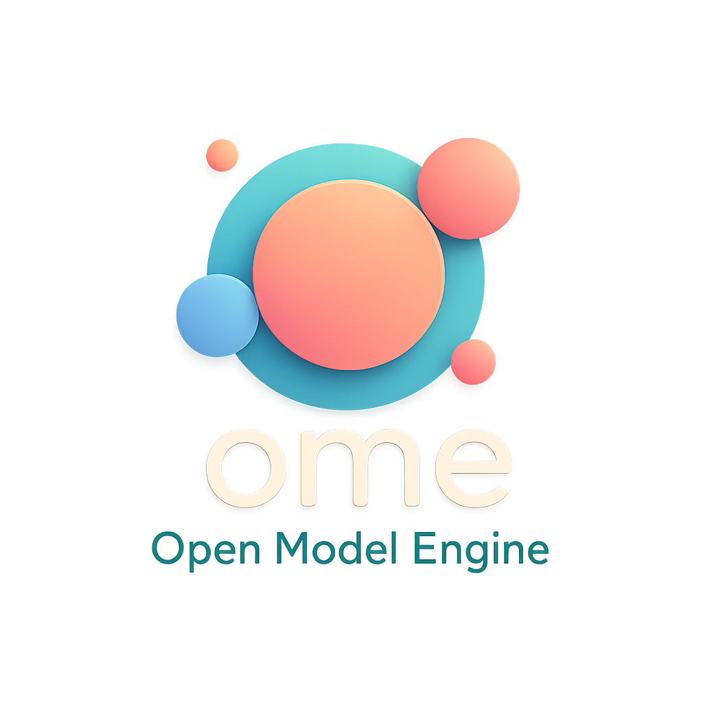

# OME

[](https://goreportcard.com/report/github.com/sgl-project/ome)
[](https://github.com/sgl-project/ome/releases/latest)
[](https://sgl-project.github.io/ome/docs/reference/ome.v1beta1/)
[](LICENSE)

<div align="center">
  <a href="https://github.com/sgl-project/ome">
    
  </a>
</div>

OME is a Kubernetes operator for enterprise-grade management and serving of Large Language Models (LLMs). It optimizes the deployment and operation of LLMs by automating model management, intelligent runtime selection, efficient resource utilization, and sophisticated deployment patterns.

Read the [documentation](https://sgl-project.github.io/ome/docs/) to learn more about OME capabilities and features.

## Features Overview

- **Model Management:** Models are first-class citizen custom resources in OME. Sophisticated model parsing extracts architecture, parameter count, and capabilities directly from model files. Supports distributed storage with automated repair, double encryption, namespace scoping, and multiple formats (SafeTensors, PyTorch, TensorRT, ONNX).

- **Intelligent Runtime Selection:** Automatic matching of models to optimal runtime configurations through weighted scoring based on architecture, format, quantization, parameter size, and framework compatibility.

- **Optimized Deployments:** Supports multiple deployment patterns including prefill-decode disaggregation, multi-node inference, and traditional Kubernetes deployments with advanced scaling controls.

- **Resource Optimization:** Specialized GPU bin-packing scheduling with dynamic re-optimization to maximize cluster efficiency while ensuring high availability.

- **Runtime Integrations:** First-class support for [**SGLang**](https://github.com/sgl-project/sglang) - the most advanced inference engine with cache-aware load balancing, multi-node deployment, prefill-decode disaggregated serving, multi-LoRA adapter serving, and much more. Also supports Triton for general model inference.

- **Kubernetes Ecosystem Integration:** Deep integration with modern Kubernetes components including [Kueue](https://kueue.sigs.k8s.io/) for gang scheduling of multi-pod workloads, [LeaderWorkerSet](https://github.com/kubernetes-sigs/lws) for resilient multi-node deployments, [KEDA](https://keda.sh/) for advanced custom metrics-based autoscaling, [K8s Gateway API](https://gateway-api.sigs.k8s.io/) for sophisticated traffic routing, and [Gateway API Inference Extension](https://gateway-api-inference-extension.sigs.k8s.io/) for standardized inference endpoints.

- **Automated Benchmarking:** Built-in performance evaluation through the BenchmarkJob custom resource, supporting configurable traffic patterns, concurrent load testing, and comprehensive result storage. Enables systematic performance comparison across models and service configurations.

## Production Readiness Status

- ✅ API version: v1beta1
- ✅ Comprehensive [documentation](https://sgl-project.github.io/ome/docs/)
- ✅ Unit and integration test coverage
- ✅ Production deployments with large-scale LLM workloads
- ✅ Monitoring via standard metrics and Kubernetes events
- ✅ Security: RBAC-based access control and model encryption
- ✅ High availability mode with redundant model storage

## Installation

**Requires Kubernetes 1.28 or newer**

### Option 1: OCI Registry (Recommended)

Install OME directly from the OCI registry:

```bash
# Install OME CRDs
helm upgrade --install ome-crd oci://ghcr.io/moirai-internal/charts/ome-crd --namespace ome --create-namespace

# Install OME resources
helm upgrade --install ome oci://ghcr.io/moirai-internal/charts/ome-resources --namespace ome
```

### Option 2: Helm Repository

Install using the traditional Helm repository:

```bash
# Add the OME Helm repository
helm repo add ome https://sgl-project.github.io/ome
helm repo update

# Install OME CRDs first
helm upgrade --install ome-crd ome/ome-crd --namespace ome --create-namespace

# Install OME resources
helm upgrade --install ome ome/ome-resources --namespace ome
```

### Option 3: Install from Source

For development or customization:

```bash
# Clone the repository
git clone https://github.com/sgl-project/ome.git
cd ome

# Install from local charts
helm install ome-crd charts/ome-crd --namespace ome --create-namespace
helm install ome charts/ome-resources --namespace ome
```

Read the [installation guide](https://sgl-project.github.io/ome/docs/installation/) for more options and advanced configurations.

Learn more about:
- OME [concepts](https://sgl-project.github.io/ome/docs/concepts/)
- Common [tasks](https://sgl-project.github.io/ome/docs/tasks/)

## Architecture

OME uses a component-based architecture built on Kubernetes custom resources:

- **BaseModel/ClusterBaseModel:** Define model sources and metadata
- **ServingRuntime/ClusterServingRuntime:** Define how models are served
- **InferenceService:** Connects models to runtimes for deployment
- **BenchmarkJob:** Measures model performance under different workloads

OME's controller automatically:
1. Downloads and parses models to understand their characteristics
2. Selects the optimal runtime configuration for each model
3. Generates Kubernetes resources for efficient deployment
4. Continuously optimizes resource utilization across the cluster

## Roadmap

High-level overview of the main priorities:

- Enhanced model parsing for additional model families and architectures
- Support for model quantization and optimization workflows
- Federation across multiple Kubernetes clusters

## Community and Support

- [GitHub Issues](https://github.com/sgl-project/ome/issues) for bug reports and feature requests
- [Documentation](https://sgl-project.github.io/ome/docs/) for guides and reference

## License

OME is licensed under the [MIT License](LICENSE).