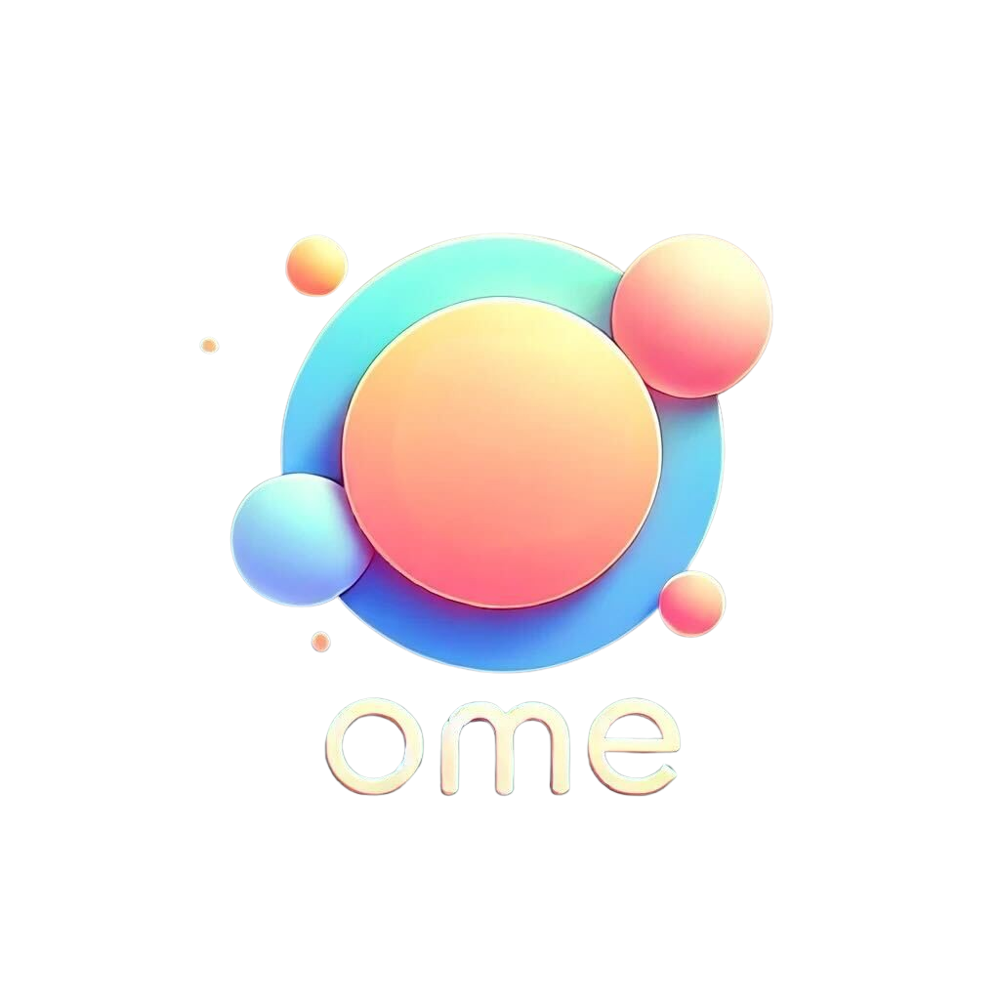

# Welcome to OME

<!-- PROJECT LOGO -->
 

  

<h3 align="center">Oracle Managed ML Engine</h3>

  

This Project Provides AI/ML Workload Management on Oracle Kubernetes Engine (OKE)
     
    <a href="https://PENDING"><strong>Explore the docs »</strong></a>
     
  

OME is a standard operator for managing the lifecycle of LLM models,
serving, training, and dedicated AI clusters in a Kubernetes cluster.
It is designed to be a generic operator
that can be used to manage the lifecycle of any AI/ML workload in a Kubernetes cluster running on OCI.

## Architecture

1. **Compute Layer**: Includes OC Cluster Network, GPU, and compute images that will be used to launch individual nodes forming a larger cluster.
2. **Kubernetes Cluster**: Sits on top of compute nodes to manage workload and scheduling. This is fully managed by OKE.
3. **Network Layer**: Pods, the smallest unit in Kubernetes, have their own networking requirements and use CNI (Container Network Interface) to communicate with each other. RDMA capability requires additional CNI for GPUs to communicate directly.
4. **Application Layer**:
    - **Monitoring Components**: Responsible for surfacing all GPU and network device statuses through Kubernetes APIs.
    - **OME**: An in-house operator that orchestrates model serving and training, with assistance from the monitoring stack to efficiently schedule workloads and auto-recover from failures. Additionally, OME allows users to run HPO and evaluation.
        - **Training**: Supports common training frameworks such as Accelerate, DeepSpeed, PyTorch, TensorFlow, Cohere's TFew, and MPI.
        - **Serving**: Focuses predominantly on LLMs such as vLLM, Cohere, TGI, NIM, but also supports Triton, covering all potential model formats such as ONNX.
        - **Alfred**: A butler across all workloads that allows optimal scheduling, node patching and repairing, and GPU management such as MIG configuration.
    - **Gang Scheduler**: Uses tools like Volcano for resource quota and scheduling training workloads.
    - **Logging Component**: Runs on every node to collect logs and emit them to Lumberjack, typically done via Fluent Bit.

## Features

- 💰 **Autoscaling**: Support modern serverless workload with Autoscaling including Scale to Zero.

- 🔒 **Security**: Supports mTLS and RBAC for secure communication between components and the server *by default*.

- ✅ **Advanced Deployments**: Advanced deployments with canary rollout, blue-green deployment, and A/B testing.

- 📊 **Metrics and Logging**: OME supports standard metrics and logging for efficient monitoring and debugging.

- 🌐 **Multi-Node Model Serving and Training**: Supports multi-node model serving and multi-node model training leveraging Volcano for gang scheduling.

- 🛠️ **Resource Management**: Supports dedicated resource reservation and resource sharing.

## Documentation

- [Contributing Guidelines](CONTRIBUTING.md) - Learn how to contribute to OME
- [Roadmap](Roadmap.md) - Check out our future plans and upcoming features

[Back to top](#readme-top)