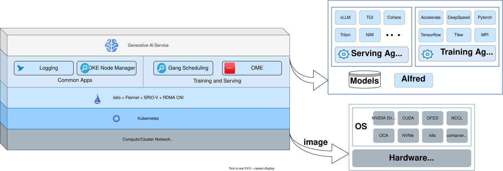

# Welcome to OME

## Introduction

OME is a standard operator for managing the lifecycle of LLM model,
serving, training, and dedicated AI clusters in a Kubernetes cluster.
It is designed to be a generic operator
that can be used to manage the lifecycle of any AI/ML workload in a Kubernetes cluster runs on OCI.

## Features

- 💰 **Autoscaling**: Support modern serverless workload with Autoscaling including Scale to Zero.

- 🔒 **Security**: Supports mTLS and RBAC for secure communication between components and the server *by default*.

- ✅ **Advanced Deployments**: Advanced deployments with canary rollout, blue-green deployment, and A/B testing.

- 📊 **Metrics and Logging**: OME supports standard metrics and logging for efficient monitoring and debugging.

- 🌐 **Multi-Node Model Serving and Training**: Supports multi-node model serving and multi-node model training leveraging Volcano for gang scheduling.

- 🛠️ **Resource Management**: Supports dedicated resource reservation and resource sharing.