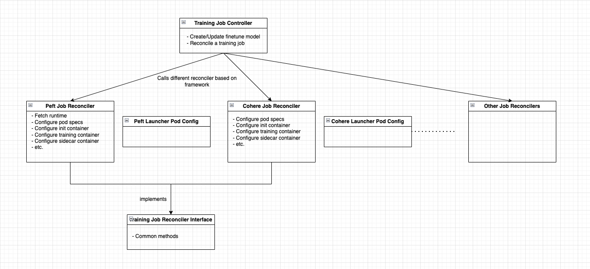

# Training Job CRD to Support Both Single Node and Multiple Node Training
## Overview
The goal of this design is to make it easy to run training, validation, and storing trained models on Kubernetes (K8s). 
We will introduce a TrainingJob Custom Resource Definition (CRD) and a Training Controller to manage the TrainingJob custom resources and their dependencies. 
In the case of saving the Cohere's fine-tuning checkpoint, we will introduce a training sidecar running alongside the Training Container that can transfer objects during the training. 
The training sidecar will be responsible for syncing the trained models, checkpoints, or any other files to the storage, ensuring that the checkpoint is securely stored during the training. 

### Single Pod TrainingJob
In scenarios that require only one pod for training, a CR Reconcile worker will create a Launcher Job. This Launcher Job is a Kubernetes (K8s) Job that initiates a single pod, running the training container until completion. After the TrainingJob finishes, a Model CR is created to store the model's metadata and related storage locations. 
An InferenceService CR, used by the Serving Controller or other TrainingJobs, can reference the Model CR for serving or iterative training.

### TrainingJob Controller
The `training/controller.go` oversees a general training job, creates finetune model, and reconciles the job based on different status, regardless the training framework. And it uses different preset reconciler based on the `trainingFramework` specified in the training job spec. 
Each reconciler only handles the job for the specific training framework. For example, peft_reconciler only handles the Peft training job. Within each framework-based reconciler, it handles the configuration of the pod, init container, training container (main container), and sidecar container. These configurations are populated using different launcher pod configs.
Also, all reconcilers should implement `training_job_reconciler_interface` where it defines the shared methods. 

### Multiple Pods Distributed TrainingJob
Todo