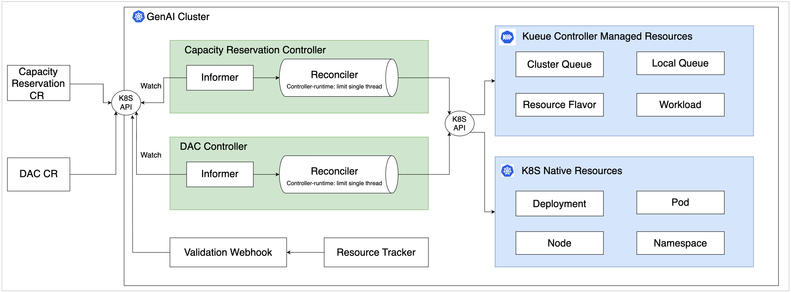
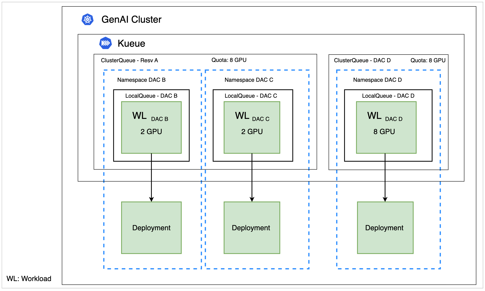
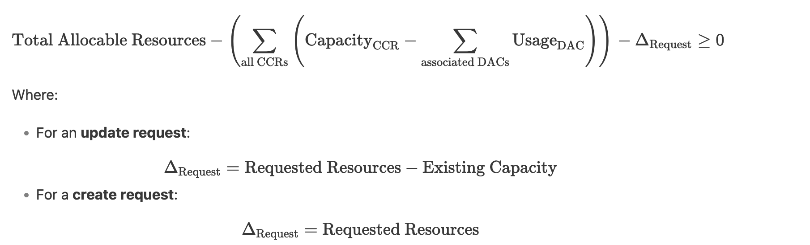
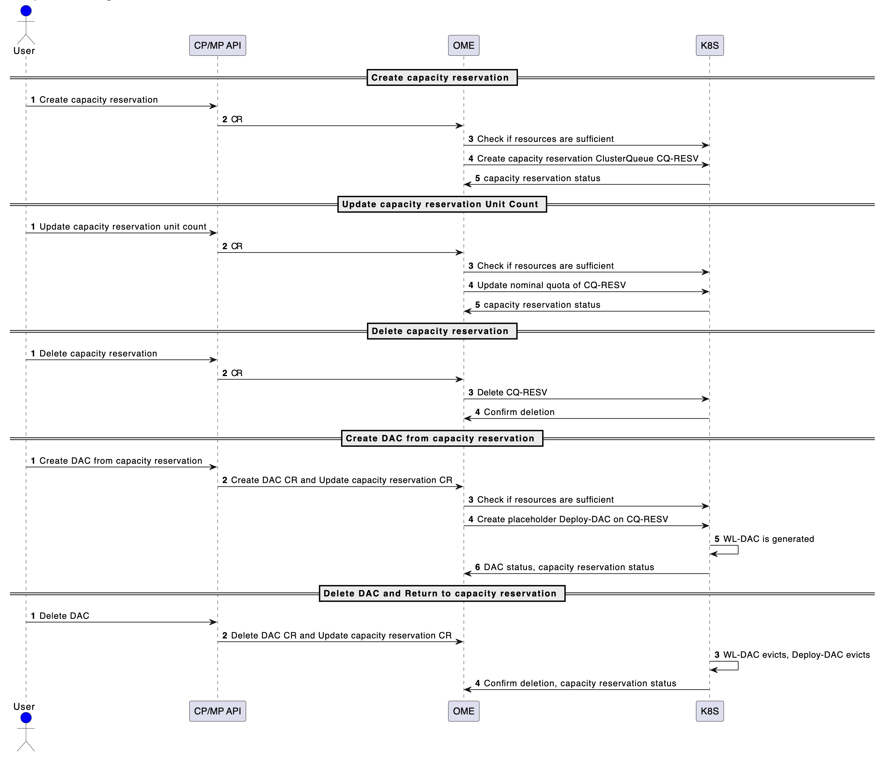

# Capacity Reservation Design

## Executive Summary
This design introduces capacity reservations to improve resource allocation and increase availability for high-priority 
jobs. Each capacity reservation will have a set of resources served as a dedicated pool, and associated DACs can use the
resources. This design leverages [Kueue](https://kueue.sigs.k8s.io/) to reserve resources. Those dedicated pools remain 
isolated, and request validation with resource tracking helps reduce pod backlogs and optimize efficiency.

## Problem Statement
Our customer faces challenges in managing DAC resources. Specifically, transferring capacity between DACs may result in 
capacity loss if other requests are fulfilled first, such as Fusion team capacity reservation scenario, described in 
[Post-GA Target: Capacity Reservation](https://confluence.oci.oraclecorp.com/display/OCAS/Post-GA+Target%3A+Capacity+Reservation). 
Existing scheduling solutions lack fine-grained control for preemption and resource reservation. A solution is needed 
to guarantee capacity and ensure effective resource management.

## Goals

* Reserve resources
  * A capacity reservation reserves resources from global pool and prevent other capacity reservations taking them.
  * A DAC reserves resources from capacity reservation and prevent other DACs taking them.
* Minimize capacity loss during transitions between DACs and capacity reservations
  * Enable resource interaction: A DAC can borrow resources from a designated capacity reservation and return them when no longer needed.
  * Address the challenge of a resource-constrained system with chronic pod backlogs.
* The solution should maintain support for rolling updates as per current behavior.


## Terminology
| Term            | Definition                                                                                                                                                                                                                                                                                                                                                   |
|-----------------|--------------------------------------------------------------------------------------------------------------------------------------------------------------------------------------------------------------------------------------------------------------------------------------------------------------------------------------------------------------|
| Cluster Queue   | A cluster-scoped object that governs a pool of resources such as GPU, CPU and memory.                                                                                                                                                                                                                                                                        |
| Local Queue     | A namespace-scoped resource that groups closely related workloads belonging to a single namespace.                                                                                                                                                                                                                                                           |
| Workload        | A workload is an application that will run to completion. It can be composed by one or multiple Pods that, loosely or tightly coupled, that, as a whole, complete a task. A workload is the unit of admission in Kueue. This design integrates K8S Deployments and RayClusters with Workloads. Workloads are submitted to ClusterQueue through a LocalQueue. |
| Resource Flavor | An object that represents resource variations (e.g. different type of GPUs) and allows you to associate them with cluster nodes through labels, taints and tolerations. Different flavors of a resource can be used to manage quotas separately.                                                                                                             |
| Nominal Quota   | Nominal Quota sets the expected resource allocation for a ClusterQueue. Resources can exceed the nominal quota temporarily if necessary, which can help handle bursts in demand.                                                                                                                                                                             |
| Cohort          | ClusterQueues can be grouped in cohorts. ClusterQueues that belong to the same cohort can borrow unused quota from each other.                                                                                                                                                                                                                               |
| Preemption      | Preemption is the process of evicting one or more admitted Workloads to accommodate another Workload.                                                                                                                                                                                                                                                        |

## High-Level Design
* How to reserve resource for capacity reservation:
  * Use [Kueue ClusterQueue](https://kueue.sigs.k8s.io/docs/concepts/cluster_queue/) to implement a dedicated resource pool.
  * Setup quota for each resource type.
  * No need dummy pods.
* How does DAC borrow resource from capacity reservation:
  * Create placeholder Deployments/Pods on capacity reservation on best-effort basis.
* How to prevent resource being borrowed by unauthorized entities:
  * Disable resource borrowing between ClusterQueues. Resources should be isolated within a ClusterQueue.
  * Provision buffered nodes to prevent cases of insufficient resources.
* How to calculate remaining resources in cluster and reject requests when there are insufficient resources:
  * Reuse [Scheduling Simulator](https://confluence.oci.oraclecorp.com/display/OCAS/GPU+Fragmentation#GPUFragmentation-SchedulingSimulator)
  * Calculation includes real-time resource usage and quota usage on each capacity reservation.





## Design Details
### Resource Reservation and Borrowing
The system operates as follows:
* Capacity reservation
  * Capacity reservation reconciler creates a Kueue ClusterQueue that serves as a dedicated resource pool for each capacity reservation. ClusterQueue is cluster-scoped resource. It specifies quota of all resource types, such as GPU, CPU and memory.
  * Resource borrowing between ClusterQueues is disabled. This will prevent anyone from taking this resource.
* DAC
  * DAC reconciler creates placeholder K8S Deployments to attempt resource locking on a best-effort basis, though not guaranteed, this remains as the existing behavior.
  * DACs created from the capacity reservation will share the same ClusterQueue and resources.
  * Kueue Workloads are automatically created, triggered by each K8S Deployment creation.
  * For a DAC that is not created from capacity reservation, DAC reconciler creates a Kueue ClusterQueue.
* InferenceService
  * When customer create an endpoint on the DAC, inferenceService reconciler creates a new Deployment for serving and DAC reconciler terminates/scales down the placeholder Deployment, this remains as the existing behavior.

#### 1. Resource Reservation for Capacity Reservation
Capacity reservation reconciler creates a ClusterQueue for each capacity reservation to reserve resources from global pool. ClusterQueue is cluster-scoped resource, will not associated with a namespace.

A ClusterQueue can specify NominalQuota of all resource flavors/types, such as GPU, CPU and memory.

Resource borrowing between ClusterQueues is disabled. This will keep the resources within a ClusterQueue isolated and prevent other ClusterQueues from taking the resources.

No placeholder deployments for capacity reservation.

#### 2. Resource Reservation for DAC
DAC reconciler creates a new raw K8S Deployment for each DAC upon creation. Kueue then generates a corresponding Workload for the Deployment to manage the individual pods.

Workloads are admitted to the ClusterQueue one by one in a timely order. A workload can be admitted only after all previous admitted workloads are ready and allocated with sufficient resources.

An alternative way to reserve resource for DAC is to create placeholder workload, which can reserve quota on a ClusterQueue but will not create dummy pods. But this won't work because it has conflicts to gang scheduling, which we enables by default. 

#### 3. Resource Interaction between DAC and Capacity Reservation
To ensure a DAC can use the resources from a designated capacity reservation, the DAC share the same ClusterQueue with the capacity reservation.

DACs that created from the same capacity reservation share the same ClusterQueue.

#### 4. Resource Isolation between Capacity Reservations
In ClusterQueue configuration, this design disables preemption between ClusterQueues. In this way, if the cluster lacks sufficient quota, new requests of ClusterQueue creation will not be admitted.

### Reduce Chronic Pod Backlogs
The current behavior causes pods to remain in a pending state for up to 10 minutes before the DAC creation request is rejected due to insufficient resources. This leads to chronic pod backlogs. Especially during patching or upgrading containers. When many pods are pending and waiting for resources, customers are more likely to experience capacity loss during DAC conversion. In this scenario, Kueue cannot guarantee resource locking or prevent capacity loss. Addressing this issue will significantly reduce capacity loss and improve overall system health.

To mitigate this issue, we will introduce a resource tracker to reject request faster and add more buffer to the system.

#### 1. Resource Tracker
* Real-time monitoring: The native K8S metrics to track real-time allocable resources (CPU/GPU/Memory) are already in place. They read the values from nodes and push the metrics via Prometheus. We can use those metrics to get the real-time value. Alternatively, we can also call K8S native API to access nodes to calculate the value.
* Record ClusterQueue quota usage: Record total nominalQuota and quota usage by workloads on each ClusterQueue.
* Remaining resource calculation: Remaining resource of a resource type = Total in cluster - allocated in cluster - Sum of all ClusterQueue(nominalQuota - sum of all workloads(allocated resource))
#### 2. Validating Webhook
The validating webhook will ensure that the cluster has sufficient resources before allowing capacity reservation creation or update requests.

The resource check will focus only on verifying the availability of a specific type and amount of resource (e.g., GPU, CPU, memory) based on the request. It will not account for resource fragmentation, meaning the check will not evaluate whether the reserved resources are optimally distributed across the cluster to fit the workload placement strategy.

If sufficient resources are available in the cluster, the webhook allows the request to proceed.

If resources are insufficient, the webhook rejects the request and provides a meaningful error message to the user. After the request is rejected, the job will be failed and will never be re-queued. This prevents overallocation and prevents pending pod backlogs.

If webhook admits a workload in a race condition, meaning the webhook oversells a portion of resource, reconciler after the webhook has the logic to validate the request again, in a single thread.

#### 3. Check resources sufficiency in controller
Add logic to check resource sufficiency within the capacity reservation reconciler, in case validation webhook admits the request due to cases such as race condition.

Calculation:



CCR stands for clusterCapacityReservation.

#### 4. Buffer Resources
Add spare GPU nodes to the global pool, to handle unexpected demands, such as on-demand model scaling up, node failures, and maintenance tasks. This prevents pending pod backlogs.

### Support for Rolling Updates
We can maintain the current rolling update behavior since we are using Deployments.

Rolling updates in Kubernetes are used to gradually update Pods within a Deployment, ensuring minimal disruption to service availability. Whether the Deployment contains a single Pod or multiple Pods, the update process should follow the same pattern to ensure smooth transitions.

During a rolling update, NominalQuota of the ClusterQueue will be scaled up first to ensure that the new Pod is running. Once the new Pod is ready, the old Pod will be evicted, and the NominalQuota will be scaled back down. For Deployments with multiple Pods, this process is managed incrementally - Pods are updated one at a time, maintaining enough healthy Pods during the transition, which is controlled by parameters like maxUnavailable and maxSurge.

## Sequence Diagram



## CRD Specification

### CapacityReservationSpec
This section defines the desired state of Capacity Reservation.
```go
type CapacityReservationSpec struct {
	// The resource requirements of the Capacity Reservation.
	// +optional
    Resources corev1.ResourceList `json:"resources,omitempty" protobuf:"bytes,8,opt,name=resources"`

	// The compartment ID to use for the Capacity Reservation.
	// +optional
	CompartmentID string `json:"compartmentID,omitempty"`

	// PriorityClassName is the priority class assigned to workloads associated to the Capacity Reservation.
	// +optional
	PriorityClassName string `json:"priorityClassName,omitempty"`

	// AllowBorrowing defines if this capacity reservation can borrow resources from others.
	// +optional
	AllowBorrowing bool `json:"allowBorrowing,omitempty"`

	// Affinity defines node affinity for scheduling workloads.
	// +optional
	Affinity *corev1.Affinity `json:"affinity,omitempty"`

	// NodeSelector defines the node labels for scheduling workloads.
	// +optional
	NodeSelector map[string]string `json:"nodeSelector,omitempty"`

	// Tolerations for taints to allow workloads scheduling on specific nodes.
	// +optional
	Tolerations []corev1.Toleration `json:"tolerations,omitempty"`
}
```

### CapacityReservationStatus
This section defines the observed status of CapacityReservation.
```go
type CapacityReservationStatus struct {
	// Capacity represents the total resources available in this capacity reservation.
	// +optional
	Capacity corev1.ResourceList `json:"capacity,omitempty" protobuf:"bytes,2,name=capacity"`

	// Allocatable represents the resources that are available for scheduling.
	// +optional
	Allocatable corev1.ResourceList `json:"allocatable,omitempty" protobuf:"bytes,2,name=allocatable"`

	// Usages of associations
	// An association can be a DAC or a Workload
	// +optional
	AssociationUsages []AssociationUsage `json:"associationUsages,omitempty"`

	// Conditions represents health and operational states.
	// +patchMergeKey=type
	// +patchStrategy=merge
	// +listType=map
	// +listMapKey=type
	// +optional
	Conditions []CapacityReservationCondition `json:"conditions,omitempty"`

	// CapacityReservationLifecycleState indicates the current phase of the CapacityReservation (e.g., "active", "creating", "Failed" etc.).
	CapacityReservationLifecycleState CapacityReservationLifecycleState `json:"capacityReservationLifecycleState,omitempty"`

	// A message describing the current state in more detail that can provide actionable information.
	// +optional
	LifecycleDetail string `json:"lifecycleDetail,omitempty"`
}
```
### AssociationUsage
This section defines the usage of the association.
```go
type AssociationUsage struct {
	// Name of the association.
	// +required
	Name string `json:"name"`

	// Usage of the association.
	// +required
	Usage corev1.ResourceList `json:"usage" protobuf:"bytes,2,name=usage"`

	// BorrowedQuota of the association.
	// +required
	BorrowedQuota corev1.ResourceList `json:"borrowedQuota" protobuf:"bytes,2,name=borrowedQuota"`
}
```
### CapacityReservationCondition
This section defines health and operational status of the capacity reservation.
```go
type CapacityReservationCondition struct {
	// Type of condition.
	// +required
	Type CapacityReservationConditionType `json:"type"`

	// Status of the condition.
	// +required
	Status corev1.ConditionStatus `json:"status"`

	// LastTransitionTime is the timestamp when the condition last changed.
	// +optional
	LastTransitionTime metav1.Time `json:"lastTransitionTime,omitempty"`

	// Reason for the condition's last transition.
	// +optional
	Reason string `json:"reason,omitempty"`

	// Message is a human-readable message indicating details about the condition.
	// +optional
	Message string `json:"message,omitempty"`
}
```
### CapacityReservation
This section defines the namespace-scoped capacity reservation Schema for capacityReservations API.
```go
type CapacityReservation struct {
	metav1.TypeMeta   `json:",inline"`
	metav1.ObjectMeta `json:"metadata,omitempty"`

	Spec   CapacityReservationSpec   `json:"spec,omitempty"`
	Status CapacityReservationStatus `json:"status,omitempty"`
}
```
### ClusterCapacityReservation
This section defines the cluster-scoped capacity reservation Schema for capacityReservations API.
```go
// +genclient:nonNamespaced
// +kubebuilder:resource:scope="Cluster"
type ClusterCapacityReservation struct {
    metav1.TypeMeta   `json:",inline"`
    metav1.ObjectMeta `json:"metadata,omitempty"`
    
    Spec   CapacityReservationSpec   `json:"spec,omitempty"`
    Status CapacityReservationStatus `json:"status,omitempty"`
}
```

### Sample YAML
ClusterCapacityReservation sample
```yaml
apiVersion: ome.io/v1beta1
kind: ClusterCapacityReservation
metadata:
  name: "capacityreservationid"
spec:
  compartmentID: comp1234
  resourceGroups:
  - coveredResources: ["cpu", "memory", "nvidia.com/gpu"]
    flavors:
	- name: "bm-gpu-a100-v2-8"
      resources:
      - name: "cpu"
        nominalQuota: 20
      - name: "memory"
        nominalQuota: 240Gi
      - name: "nvidia.com/gpu"
        nominalQuota: 8
    - name: "bm-gpu-h100-8"
      resources:
      - name: "cpu"
        nominalQuota: 128
      - name: "memory"
        nominalQuota: 216Gi
      - name: "nvidia.com/gpu"
        nominalQuota: 8
 ```

## Reference
Please find more details in [full doc](https://confluence.oci.oraclecorp.com/pages/viewpage.action?spaceKey=~cheyao&title=Capacity+Reservation+-+Data+Plane+Design)