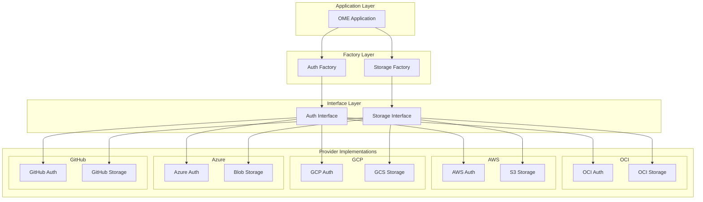
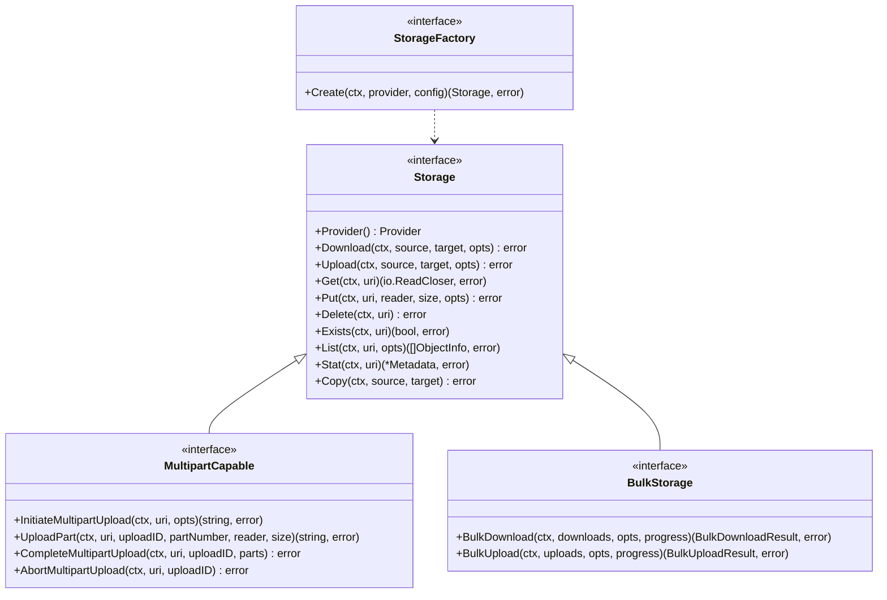

# Multi-Cloud Support Proposal for OME

## Executive Summary

This proposal outlines the comprehensive implementation plan for multi-cloud support in the OME project, covering both authentication and storage capabilities across major cloud providers: Oracle Cloud Infrastructure (OCI), Amazon Web Services (AWS), Google Cloud Platform (GCP), Microsoft Azure, and GitHub.

## Background

The OME project currently has legacy implementations (`pkg/principals` and `pkg/ociobjectstore`) that are tightly coupled to OCI. These implementations lack the flexibility and extensibility required for true multi-cloud support. The new architecture (`pkg/auth` and `pkg/storage`) addresses these limitations with provider-agnostic interfaces and extensible design patterns.

## Goals

1. **Provider Agnostic**: Create unified interfaces that work seamlessly across all cloud providers
2. **Extensibility**: Enable easy addition of new cloud providers without modifying core code
3. **Feature Parity**: Ensure all providers support core functionality while allowing provider-specific optimizations
4. **Backward Compatibility**: Provide migration path from legacy implementations
5. **Developer Experience**: Maintain consistent API across all providers with clear documentation

## Architecture Overview



## Detailed Design

### 1. Authentication Architecture

```mermaid
classDiagram
    class Credentials {
        <<interface>>
        +GetHTTPClient() *http.Client
        +GetRegion() string
        +GetServiceEndpoint(service string) string
        +Refresh() error
    }
    
    class ProviderFactory {
        <<interface>>
        +CreateCredentials(config Config) (Credentials, error)
    }
    
    class DefaultFactory {
        -providers map[Provider]ProviderFactory
        +RegisterProvider(provider Provider, factory ProviderFactory)
        +CreateCredentials(config Config) (Credentials, error)
    }
    
    class Config {
        +Provider Provider
        +AuthType AuthType
        +Settings map[string]interface{}
    }
    
    DefaultFactory ..> ProviderFactory
    ProviderFactory ..> Credentials
    ProviderFactory ..> Config
```

### 2. Storage Architecture



### 3. URI Format Specification

```
<provider>://<namespace>/<bucket>/<object_path>
```

Examples:
- OCI: `oci://namespace/bucket/path/to/object`
- AWS: `s3://bucket/path/to/object`
- GCP: `gs://bucket/path/to/object`
- Azure: `azure://container/path/to/object`
- GitHub: `github://owner/repo/path/to/file`

## Implementation Plan

### Phase 1: Core Infrastructure (Completed)
- [x] Design provider-agnostic interfaces
- [x] Implement factory patterns
- [x] Create URI parsing and validation
- [x] Set up dependency injection framework

### Phase 2: Authentication Providers (Completed)
- [x] OCI Authentication (User Principal, Instance Principal, Resource Principal)
- [x] AWS Authentication (Access Keys, IAM Roles, Instance Profiles)
- [x] GCP Authentication (Service Accounts, Application Default Credentials)
- [x] Azure Authentication (Service Principal, Managed Identity)
- [x] GitHub Authentication (Personal Access Token, GitHub App)

### Phase 3: Storage Implementations (In Progress)
- [x] OCI Object Storage
- [ ] AWS S3
- [ ] GCP Cloud Storage
- [ ] Azure Blob Storage
- [ ] GitHub Releases/Artifacts

### Phase 4: Advanced Features
- [ ] Cross-provider object copy
- [ ] Storage class/tier management
- [ ] Lifecycle policies
- [ ] Versioning support
- [ ] Encryption at rest configuration

### Phase 5: Migration and Deprecation
- [ ] Migration guides from legacy implementations
- [ ] Compatibility layer for smooth transition
- [ ] Deprecation warnings
- [ ] Complete removal of legacy code

## Testing Strategy

1. **Unit Tests**: Provider-specific implementations with mocks
2. **Integration Tests**: Real cloud provider testing with test accounts
3. **E2E Tests**: Multi-provider scenarios and cross-provider operations
4. **Performance Tests**: Benchmarking for large file operations
5. **Compatibility Tests**: Ensure backward compatibility during migration

## Security Considerations

1. **Credential Management**:
   - Never log or expose credentials
   - Support for credential rotation
   - Secure credential storage integration

2. **Transport Security**:
   - TLS 1.2+ for all communications
   - Certificate validation
   - Request signing for authentication

3. **Access Control**:
   - Respect cloud provider IAM policies
   - Support for temporary credentials
   - Principle of least privilege

## Performance Considerations

1. **Concurrent Operations**:
   - Configurable concurrency limits
   - Connection pooling per provider
   - Rate limiting support

2. **Large File Handling**:
   - Automatic multipart uploads/downloads
   - Streaming operations to minimize memory usage
   - Progress tracking for long operations

3. **Caching**:
   - Metadata caching with TTL
   - Connection reuse
   - DNS caching considerations

## Migration Guide

### From `pkg/principals` to `pkg/auth`

```go
// Old
import "github.com/sgl-project/ome/pkg/principals"
provider := principals.GetDefaultConfigProvider()

// New
import "github.com/sgl-project/ome/pkg/auth"
factory := auth.NewDefaultFactory(logger)
creds, _ := factory.CreateCredentials(auth.Config{
    Provider: auth.ProviderOCI,
    AuthType: auth.AuthTypeDefault,
})
```

### From `pkg/ociobjectstore` to `pkg/storage`

```go
// Old
import "github.com/sgl-project/ome/pkg/ociobjectstore"
client := ociobjectstore.NewObjectStorageClient(provider)

// New
import "github.com/sgl-project/ome/pkg/storage"
factory := storage.NewDefaultFactory(logger, authFactory)
store, _ := factory.Create(ctx, storage.ProviderOCI, config)
```

## Success Metrics

1. **Adoption Rate**: 80% of users migrated within 6 months
2. **Provider Coverage**: Support for 5 major cloud providers
3. **Performance**: No regression in operation speed
4. **Reliability**: 99.9% success rate for operations
5. **Developer Satisfaction**: Positive feedback on API design

## Timeline

- **Q1 2024**: Complete core infrastructure and authentication
- **Q2 2024**: Implement storage providers
- **Q3 2024**: Advanced features and optimization
- **Q4 2024**: Migration support and legacy deprecation

## Conclusion

This multi-cloud support implementation provides a robust, extensible foundation for cloud operations across multiple providers. The design prioritizes developer experience, performance, and security while maintaining flexibility for future enhancements.