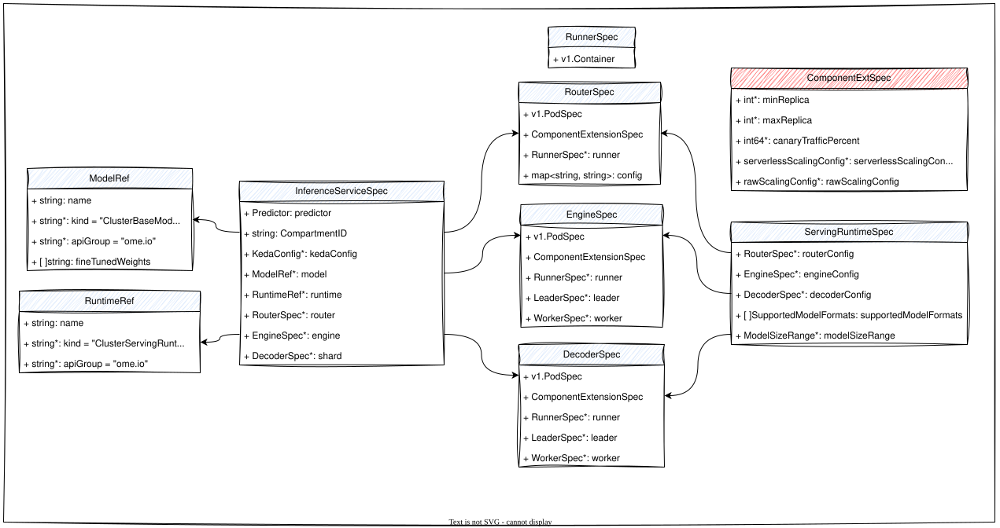
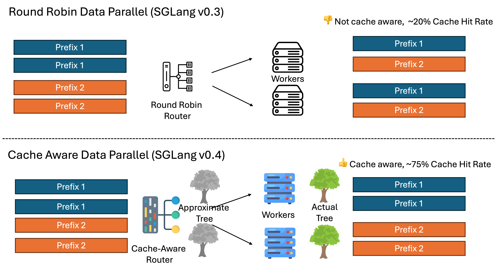
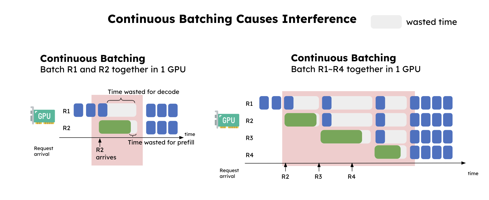
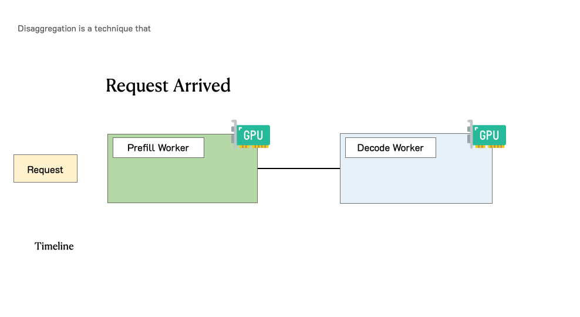

# OEP-0001: Enhanced Inference Service Architecture for LLM Workloads

- [Summary](#summary)
- [Motivation](#motivation)
  - [Goals](#goals)
  - [Non-Goals](#non-goals)
- [Proposal](#proposal)
  - [User Stories](#user-stories)
    - [Story 1: Cache-Aware LLM Routing](#story-1-cache-aware-llm-routing)
    - [Story 2: PD-Disaggregated Deployment](#story-2-pd-disaggregated-deployment)
    - [Story 3: Multi-Node Prefill for Large Models](#story-3-multi-node-prefill-for-large-models)
  - [Notes/Constraints/Caveats](#notesconstraintscaveats)
  - [Risks and Mitigations](#risks-and-mitigations)
- [Design Details](#design-details)
  - [Overview of Changes](#overview-of-changes)
  - [New InferenceService Design](#new-inferenceservice-design)
  - [Backward Compatibility](#backward-compatibility)
  - [Implementation Phases](#implementation-phases)
    - [CRD and Webhook Updates](#phase-1-crd-and-webhook-updates)
    - [Introduce KV-Cache Router](#phase-2-introduce-kv-cache-router)
    - [Implement PD-disaggregated serving](#phase-3-implement-pd-disaggregated-serving)
    - [Documentation and Migration](#phase-4-documentation-and-migration)
  - [Test Plan](#test-plan)
    - [Prerequisite Testing Updates](#prerequisite-testing-updates)
    - [Unit Tests](#unit-tests)
    - [Integration Tests](#integration-tests)
  - [Graduation Criteria](#graduation-criteria)
- [Implementation History](#implementation-history)
- [Drawbacks](#drawbacks)
- [Alternatives](#alternatives)
- [Appendix](#appendix)
  - [A. Cache-Aware Load Balancing](#a-cache-aware-load-balancing)
  - [B. PD-Disaggregated Architecture](#b-pd-disaggregated-architecture)
  - [References](#references)

<a name="summary"></a>

## Summary

This OEP proposes enhancements to the OME InferenceService architecture to better support modern LLM workloads. The key improvements include:

1. Adding a dedicated Router component to support cache-aware load balancing for LLM inference
2. Separating model and runtime specifications from the predictor to allow for more flexible deployment configurations
3. Making deployment modes implicit in the spec rather than explicit from annotations
4. Supporting advanced deployment patterns like PD-disaggregated (Prefill-Decode) inference

These changes will enable more efficient LLM serving, reduce inference latency, and provide better resource utilization for large fleet of LLM serving. The proposal includes a migration plan to maintain backward compatibility while introducing these new capabilities.

<a name="motivation"></a>

## Motivation

The current InferenceService architecture has limitations when serving Large Language Models (LLMs), particularly around efficient load balancing, resource utilization, and deployment flexibility:

1. **LLM-specific Load Balancing**: Traditional load balancers and service mesh solutions are not optimized for LLM workloads as they lack awareness of KV-cache(intermediate states of transformer model) utilization, KV caches often get flushed and recomputed, leading to wasted computation cycles and increased latency, leading to suboptimal routing decisions. Studies have shown that cache-aware load balancing for LLM inference can provide significant performance improvements[1]:

   - SGLang's cache-aware load balancer demonstrates up to **1.9x throughput increase** and **3.8x cache hit rate
     improvement** compared to naive round-robin load balancing, with benefits scaling as worker count increases [2]

2. **PD-Disaggregated Serving**: The current structure constrains advanced deployment patterns like PD-disaggregated inference, which is becoming the state of the art(SOTA) for high-performance large scale LLM serving. Please refer to [How PD Disaggregated Works](#b-pd-disaggregated-architecture) for more details. Recent research demonstrates significant performance improvements with this approach:

   - DistServe achieves up to **4.48x higher goodput** and **10.2x tighter SLO** compared to traditional colocated prefill-decode systems [3]
   - For chatbot applications, PD-disaggregated deployment sustains **2.0x to 3.41x higher goodput** compared to
     standard vLLM deployments [3]
   - For code completion tasks, this architecture delivers **3.2x higher goodput** and **1.5x more stringent SLO
     compliance** [3]
   - Even a simple 2 prefill workers to 1 decode worker (2P1D) configuration can yield **2x goodput per GPU** compared to traditional architectures [4]
   - DeepSeek's benchmarks show that a PD-disaggregated architecture for their V3/R1 models delivers **nearly 2x higher throughput** in high-concurrency scenarios compared to traditional deployments [5]

3. **Deployment Mode Flexibility**: Current deployment modes (Serverless, RawDeployment, MultiNodeRayVLLM, MultiNode) are inferred from annotations rather than being explicit in the spec, limiting visibility and control.

<a name="goals"></a>

### Goals

1. Add support for a cache-aware router component that can optimially distribute LLM inference requests
2. Improve the flexibility of deployment configurations through explicit deployment mode specification
3. Support advanced deployment patterns like PD-disaggregated inference
4. Maintain backward compatibility with existing InferenceService specifications
5. Separate model and runtime specifications from the predictor component for better reusability and clarity

<a name="non-goals"></a>

### Non-Goals

1. Introduce KV-Cache pool custom resource, this will be a follow up proposal.
2. Change the behavior of existing deployment modes
3. Modify the existing Knative integration for serverless deployments
4. Replace or modify the current model loading and initialization process
5. Change the protocol or API surface of existing inference endpoints

<a name="proposal"></a>

## Proposal

We propose extending the InferenceService CRD with new components and fields while maintaining backward compatibility. The enhanced design will support modern LLM serving architectures and deployment patterns, with explicit specification of deployment modes.


<a name="user-stories"></a>

### User Stories

<a name="story-1-cache-aware-llm-routing"></a>

#### Story 1: Cache-Aware LLM Routing

As an ML platform operator, I want to efficiently route LLM inference requests based on KV-cache availability to reduce latency and increase throughput. With the proposed router component, I can deploy multiple LLM replicas and have incoming requests routed to the optimal replica based on current KV-cache state.

```yaml
apiVersion: ome.io/v1beta1
kind: InferenceService
metadata:
  name: llama-chat
spec:
  predictor:
    model:
      baseModel: llama-3-1-70b-instruct
      protocolVersion: openAI
    minReplicas: 3
    maxReplicas: 10
  router:
    kvCacheAwareness: true
    minReplicas: 2
    maxReplicas: 2
```

<a name="story-2-pd-disaggregated-deployment"></a>

#### Story 2: PD-Disaggregated Deployment

As an ML engineer, I want to use PD-disaggregated deployment for my large language model to optimize resource usage and reduce latency. With the new architecture, I can specify different components for prefill and token generation operations.

```yaml
apiVersion: ome.io/v1beta1
kind: InferenceService
metadata:
  name: llama-pd-disaggregated
spec:
  model:
    name: llama-2-70b
    kind: ClusterBaseModel
  runtime: #optional, if not defined, controller will find the most optimal runtime for this model
    name: vllm-pd
    kind: ClusterServingRuntime
  engine:
    minReplicas: 2
    maxReplicas: 4
  decoder: # not required for single node deployment
    minReplicas: 4
    maxReplicas: 8
  router: # optional
    minReplicas: 2
    maxReplicas: 4
```

<a name="story-3-multi-node-prefill-for-large-models"></a>

#### Story 3: Multi-Node Engine for Large Models

As an ML engineer working with large models like DeepSeek v3, I want to deploy an engine component that requires multiple nodes per replica, each with 8 GPUs, to effectively distribute the model. This allows me to handle models that are too large to fit on a single node.

```yaml
apiVersion: ome.io/v1beta1
kind: InferenceService
metadata:
  name: deepseek-v3
spec:
  model:
    name: deepseek-v3
    kind: ClusterBaseModel
  runtime:
    name: vllm-pd
    kind: ClusterServingRuntime
  engine:
    leader:
      containers:
        - name: deepseek-engine
          resources:
            limits:
              nvidia.com/gpu: 8
    worker:
      size: 1
      containers:
        - name: deepseek-engine-worker
          resources:
            limits:
              nvidia.com/gpu: 8
    minReplicas: 1
    maxReplicas: 3
  decoder:
    minReplicas: 2
    maxReplicas: 4
  router:
    minReplicas: 2
    maxReplicas: 2
```

<a name="notesconstraintscaveats"></a>

### Notes / Constraints / Caveats

1. **Migration Complexity**:  
   Existing users will need to update their `InferenceService` definitions if they wish to take advantage of the new features.

2. **Controller Logic**:  
   The controller must support both legacy and updated specification formats during the transition period.
   - If both `engine` and `decoder` are defined, it's default to `PDDisaggregated` mode.
   - If both `leader` and `worker` are defined in `engine`, it's default to `MultiNode` mode with `LeaderWorkerSet` resource reconciliation.
   - `PDDisaggregated` deployments can resemble a PyDx configuration (where y ≤ x or y ≥ x), making reconciliation logic significantly more complex.

3. **Deployment Flexibility**:  
   While the new model supports more flexible deployment patterns, it also introduces greater complexity in debugging, observability, and operational reliability.

4. **Infrastructure Complexity**:  
   The `PDDisaggregated` architecture requires a highly sophisticated infrastructure, particularly due to its dependency on KV-cache.
   - Efficient KV-cache transfer can only be achieved through high-bandwidth interconnects like RDMA or NVLink.
   - The current operator does not include a native solution for managing the KV-cache pool. Solutions such as Mooncake[6], LMCache[7], or NVIDIA Inference Xfer Library[8] are not yet integrated.
   - See [How PD Disaggregated Works](#b-pd-disaggregated-architecture) for further details.

<a name="risks-and-mitigations"></a>

### Risks and Mitigations

| Risk                                      | Impact | Mitigation                                                           |
|-------------------------------------------|--------|----------------------------------------------------------------------|
| Breaking existing client implementations  | High   | Maintain full backward compatibility with current specs              |
| Increased operational complexity          | Medium | Provide clear documentation and examples for new deployment patterns |
| Performance regression during transition  | Medium | Implement thorough testing and performance benchmarking              |
| Security implications of router component | Medium | Ensure router follows same security model as other components        |
| Cluster resource management challenges    | Medium | Provide guidance on resource planning and quota management           |

<a name="design-details"></a>

## Design Details

```go
type InferenceServiceSpec struct {
    // Existing fields maintained for backward compatibility
    Predictor PredictorSpec `json:"predictor,omitempty"`
    CompartmentID string `json:"compartmentID,omitempty"`
    KedaConfig *KedaConfig `json:"kedaConfig,omitempty"`
    
    // Model specification moved out of predictor for flexibility
    Model *ModelRef `json:"model,omitempty"`
    
    // Runtime specification moved out of predictor for flexibility
    Runtime *RuntimeRef `json:"runtime,omitempty"`
    
    // New components
    Router *RouterSpec `json:"router,omitempty"`
    Engine *EngineSpec `json:"engine,omitempty"`
    Decoder *DecoderSpec `json:"decoder,omitempty"`
}

type ModelRef struct {
    // Name of the model being referenced
    Name string `json:"name"`
    
    // Kind of the model being referenced
    // Defaults to ClusterBaseModel
    // +kubebuilder:default="ClusterBaseModel"
    Kind *string `json:"kind,omitempty"`
    
    // APIGroup of the resource being referenced
    // Defaults to `ome.io`
    // +kubebuilder:default="ome.io"
    APIGroup *string `json:"apiGroup,omitempty"`
    
    // Optional FineTunedWeights references
    FineTunedWeights []string `json:"fineTunedWeights,omitempty"`
}

type RuntimeRef struct {
    // Name of the runtime being referenced
    Name string `json:"name"`
    
    // Kind of the runtime being referenced
    // Defaults to ClusterServingRuntime
    // +kubebuilder:default="ClusterServingRuntime"
    Kind *string `json:"kind,omitempty"`
    
    // APIGroup of the resource being referenced
    // Defaults to `ome.io`
    // +kubebuilder:default="ome.io"
    APIGroup *string `json:"apiGroup,omitempty"`
}

// RouterSpec defines the configuration for the Router component, which handles request routing
type RouterSpec struct {
    // PodSpec defines the container configuration for the router
    v1.PodSpec `json:",inline"`
    
    // ComponentExtensionSpec defines deployment configuration like min/max replicas, scaling metrics, etc.
    ComponentExtensionSpec `json:",inline"`
    
    // This is essentially a container spec that can override the default container
    // +optional
    Runner *RunnerSpec `json:"runner,omitempty"`

    // Additional configuration parameters for the runner
    // This can include framework-specific settings
    // +optional
    Config map[string]string `json:"config,omitempty"`
}

// EngineSpec defines the configuration for the Engine component (can be used for both single-node and multi-node deployments)
type EngineSpec struct {
    // This spec provides a full PodSpec for the engine component
    // +optional
    v1.PodSpec `json:",inline"`
    
    // ComponentExtensionSpec defines deployment configuration like min/max replicas, scaling metrics, etc.
    ComponentExtensionSpec `json:",inline"`
    
    // Runner container override for customizing the engine container
    // This is essentially a container spec that can override the default container
    // +optional
    Runner *RunnerSpec `json:"runner,omitempty"`
    
    // Leader node configuration (only used for MultiNode deployment)
    // +optional
    Leader *LeaderSpec `json:"leader,omitempty"`
    
    // Worker nodes configuration (only used for MultiNode deployment)
    // +optional
    Worker *WorkerSpec `json:"worker,omitempty"`
}

// DecoderSpec defines the configuration for the Decoder component (token generation in PD-disaggregated deployment)
type DecoderSpec struct {
    // This spec provides a full PodSpec for the decoder component
    // +optional
    v1.PodSpec `json:",inline"`
    
    // ComponentExtensionSpec defines deployment configuration like min/max replicas, scaling metrics, etc.
    ComponentExtensionSpec `json:",inline"`
    
    // Runner container override for customizing the main container
    // This is essentially a container spec that can override the default container
    // +optional
    Runner *RunnerSpec `json:"runner,omitempty"`
    
    // Leader node configuration (only used for MultiNode deployment)
    // +optional
    Leader *LeaderSpec `json:"leader,omitempty"`
    
    // Worker nodes configuration (only used for MultiNode deployment)
    // +optional
    Worker *WorkerSpec `json:"worker,omitempty"`
}

// LeaderSpec defines the configuration for a leader node in a multi-node component
type LeaderSpec struct {
    // Pod specification for the leader node
    // This overrides the main PodSpec when specified
    // +optional
    v1.PodSpec `json:",inline"`

    // Runner container override for customizing the main container
    // This is essentially a container spec that can override the default container
    // +optional
    Runner *RunnerSpec `json:"runner,omitempty"`
}

// WorkerSpec defines the configuration for worker nodes in a multi-node component
type WorkerSpec struct {
    // Number of worker nodes per engine/shard replica
    // +required
    Size int `json:"size"`
    
    // Pod specification for worker nodes
    // +required
    v1.PodSpec `json:",inline"`

    // Runner container override for customizing the main container
    // This is essentially a container spec that can override the default container
    // +optional
    Runner *RunnerSpec `json:"runner,omitempty"`
}

// RunnerSpec defines container configuration plus additional config settings
type RunnerSpec struct {
    // Container spec for the runner
    // +optional
    v1.Container `json:",inline"`

}

// ServingRuntimeSpec extension for router configuration
type ServingRuntimeSpec struct {
    // Existing fields...
    
    // Router configuration for this runtime
    // +optional
    RouterConfig *RouterSpec `json:"routerConfig,omitempty"`
    // Engine configuration for this runtime
    // +optional
    EngineConfig *EngineSpec `json:"engineConfig,omitempty"`
    // Decoder configuration for this runtime
    // +optional
    DecoderConfig *DecoderSpec `json:"decoderConfig,omitempty"`
}
```

<a name="overview-of-changes"></a>

### Overview of Changes

1. Introduce new top-level components to InferenceServiceSpec:
   - `router`: For cache-aware load balancing
   - `engine`: For the prefill component in PD-disaggregated deployments
   - `decoder`: For the token generation component in PD-disaggregated deployments
   - `model`: For model specification separate from predictor
   - `runtime`: For runtime specification separate from predictor

2. Maintain backward compatibility with existing predictor specification

3. Create new controller reconcilers for the new components and deployment modes

<a name="new-inferenceservice-design"></a>

### New InferenceService Design

The enhanced InferenceService CRD will have the following structure:


Please refer to [sample CRD](sample_spec.md) for Golang implementation and details.

<a name="backward-compatibility"></a>

### Backward Compatibility

To maintain backward compatibility:

1. The existing `predictor` field will be preserved and fully supported.

2. When both the old style (predictor.model) and new style (top-level model) are specified, the old style takes
   precedence.

3. The controller will determine which path to follow based on the InferenceService spec provided:
   - If using traditional predictor-based spec, follow existing reconciliation logic
   - If using new components, follow new reconciliation logic

4. The `deploymentMode` field will have a default value that matches the behavior of the current annotation-based
   approach.

<a name="implementation-phases"></a>

### Implementation Phases

<a name="phase-1-crd-and-webhook-updates"></a>

#### Phase 1: CRD and Webhook Updates

- Add new CRD fields to `InferenceService` with full backward compatibility, including: `router`, `engine`, `decoder`, `model`, and `runtime`.

- Add new CRD fields to both `ServingRuntime` and `ClusterServingRuntime`, including: `router`, `engine`, and `decoder`.

- Automatically add `deploymentMode` as label to `InferenceService`.

- Update the validation and mutation webhooks for `InferenceService`:
  - If both `engine` and `decoder` are specified, the deployment mode is PDDisaggregated
  - If only `engine` is specified:
    - For MultiNode: must have both `leader` and `worker` defined, and `worker.size` must be greater than 0
    - Otherwise, default to RawDeployment
  - `engine` should never be null. However, this validation must wait until migration is finished.

- Update the validation and mutation webhooks for `ServingRuntime`:
  - If both `engineConfig` and `decoderConfig` are specified, the deployment mode is PDDisaggregated
  - If only `engineConfig` is specified:
    - For RawDeployment: must not have either `leader` or `worker` defined
    - For MultiNode: must have both `leader` and `worker` defined, and `worker.size` must be greater than 0

<a name="phase-2-introduce-kv-cache-router"></a>

#### Phase 2: Introduce KV-Cache Router

- Implement the **Router** component leveraging the `Component` interface:
  - Reconcile a standard Kubernetes `Deployment` for router pods, including a router sidecar, and expose it via a Kubernetes `Service` of type `ClusterIP` or `LoadBalancer`.
  - Reconcile a standard Kubernetes `HPA` for the router based on CPU and memory metrics.
  - Reconcile the integration between the `ServingRuntime` and the `Router` defined in the `InferenceService`.
  - Because the router service now is the actual entry point for the models, a k8s service should no longer be created for `predictor` or `engine` deployment. This can be changed later with an annotation such that users can override this reconciliation and use both endpoints for benchmark and evaluation. This will require additional status update along with `Service` name change when `router` is present.

- Implement the **SGLang sidecar** to manage worker status:
  - Watch the collection of pods using the label selector `ome.io/inferenceservice=isvc_name`.
  - Update the router using SGLang's `AddWorker` and `RemoveWorker` APIs based on pod lifecycle events.

- Extend the status reporting to include **component-level status** for `router`

- Update the existing **SGLang serving runtime resources** (both Helm chart and config) to include the new `router` input, using the cache-aware SGLang router.

- Update the existing **vLLM serving runtime resources** (both Helm chart and config) to support the new `router` input using the vLLM router _(low priority)_.

<a name="phase-3-implement-pd-disaggregated-serving"></a>

#### Phase 3: Implement PD-Disaggregated Serving

- Implement reconciliation logic for the **Engine** and **Decoder** components using the shared `Component` interface.

  - Reconcile the integration between the `ServingRuntime` and the `Router` defined in the `InferenceService`.

  - While `engine` and `decoder` are distinct components, their reconciliation behavior is determined by their presence:

    - If both `engine` and `decoder` are specified (PDDisaggregated mode):
      - Deploy a **raw Kubernetes Deployment** for the PD load balancer, including:
        - An `HPA` for autoscaling.
        - A sidecar to monitor both prefill and server statuses.
      - Deploy a **raw Kubernetes Deployment** for the engine servers, including:
        - A `KPA` (KEDA Pod Autoscaler) for autoscaling.
        - If no custom metrics are defined, use **GPU utilization** as the default metric, as engine servers are compute-bound.
      - Deploy a **raw Kubernetes Deployment** for the decoder servers, including:
        - A `KPA` for autoscaling.
        - If no custom metrics are defined, use **KV-cache utilization** as the default metric, as decoder servers are memory-bound.

    - If only `engine` is specified:
      - For RawDeployment mode (when `runner` or `podSpec` is defined):
        - Deploy a standard Kubernetes Deployment with the specified configuration
      - For MultiNode mode (when both `leader` and `worker` are defined):
        - Use a `LeaderWorkerSet` resource to manage the deployment structure
        - Create a deployment for the leader node using the `Leader` PodSpec
        - Create deployments for worker nodes using the `Worker` PodSpec and `Worker.Size`
        - Configure proper communication between leader and worker nodes
        - Ensure leader and worker deployments are treated as a single logical unit for scaling purposes

  - Extend the status reporting to include **component-level status** for both `engine` and `decoder`.
    - For MultiNode deployment mode, mark `InferenceService` ready if `LeaderWorkerSet` resource is in ready state.
    - For PDDisaggregated deployment mode, mark `InferenceService` ready if engine servers, decoder servers, and PD load balancers are ready.
    - For components with MultiNode configuration, consider both leader and worker deployments when determining component readiness.

<a name="phase-4-documentation-and-migration"></a>

#### Phase 4: Documentation and Migration

- Implement a **Mutation Webhook** to automatically migrate existing `InferenceService` resources to the new specification:
  - Migrate `predictor.podSpec` to `engine.podSpec`.
  - Migrate `predictor.replicas` to `engine.replicas`.
  - Migrate `predictor.workerSpec` to `decoder.podSpec`.
  - Migrate `predictor.workerSpec.replicas` to `decoder.replicas`.
  - If any container within `predictor.workerSpec.container` is named `ome-container`, migrate it to `decoder.runner`.
  - Set the default `deploymentMode` to `RawDeployment`, as all existing resources are assumed to follow this pattern.

- Implement a **Mutation Webhook** to migrate existing `ServingRuntime` resources to the new specification:
  - Migrate the top-level `podSpec` to `engine`.
  - If any container within `podSpec` is named `ome-container`, migrate it to `engine.runner`.
  - Migrate `workerSpec` to `decoder.podSpec`.
  - If any container within `workerSpec` is named `ome-container`, migrate it to `decoder.runner`.

- **Document deprecation of predictor and deployment annotation**:
  - Add a section for predictor deprecation in inference service document in `site/content/docs/concepts/inference_service.md`
  - Add a section regarding the reconciliation and relationship between `ServingRuntime` and `InferenceService` in `site/content/docs/concepts/serving_runtime.md`

- **Deprecate annotation-based deployment mode selection**:
  - Continue to support the existing annotation-based configuration during the transition period.
  - Emit warning messages in logs when annotation-based mode is used.
  - Clearly document the deprecation and provide a timeline for its eventual removal.

- **Update the Generative AI Service Management Plane** to consume and operate based on the new specification format.

<a name="test-plan"></a>

### Test Plan

[X] I/we understand that component owners may require updates to existing tests before accepting changes necessary for this enhancement.

<a name="prerequisite-testing-updates"></a>

#### Prerequisite Testing Updates

Before implementing this enhancement, we will:

1. Establish baseline performance metrics for existing deployment modes
2. Document the current behavior of annotation-based deployment mode selection
3. Create comprehensive end-to-end tests for current functionality

<a name="unit-tests"></a>

#### Unit Tests

##### Phase 1: CRD and Webhook Updates

- `pkg/apis/ome/v1beta1`: Add tests for new InferenceService CRD fields
- `pkg/apis/ome/v1beta1`: Add tests for new ServingRuntime CRD fields
- `pkg/webhook/admission/inferenceservice`: Test validation and mutation logic for deployment modes
- `pkg/webhook/admission/runtime`: Test validation for runtime compatibility with deployment modes

##### Phase 2: KV-Cache Router Implementation

- `pkg/controller/v1beta1/inferenceservice/components/router`: Test router component reconciliation
- `pkg/controller/v1beta1/inferenceservice/components/router/sglang`: Test SGLang sidecar behavior
- `pkg/controller/v1beta1/inferenceservice`: Test service reconciliation with router present

##### Phase 3: PD-Disaggregated Serving

- `pkg/controller/v1beta1/inferenceservice/components/engine`: Test engine component reconciliation
- `pkg/controller/v1beta1/inferenceservice/components/decoder`: Test decoder component reconciliation
- `pkg/controller/v1beta1/inferenceservice`: Test PDDisaggregated deployment mode reconciliation
- `pkg/controller/v1beta1/inferenceservice`: Test MultiNode deployment mode with new components

##### Phase 4: Documentation and Migration

- `pkg/webhook/admission/inferenceservice`: Test automatic migration from old to new specification
- `pkg/webhook/admission/runtime`: Test automatic migration for ServingRuntime resources
- `pkg/controller/v1beta1/inferenceservice`: Test backward compatibility with existing specs

<a name="integration-tests"></a>

#### Integration Tests

##### Phase 1: CRD and Webhook Updates

- **Validation Tests**:
  - Apply InferenceService resources with incompatible configurations (e.g., Serverless mode with decoder component)
  - Verify appropriate validation errors are returned with clear error messages
  - Confirm webhooks prevent unsupported configurations from being created

- **Mutation Tests**:
  - Test default value application for omitted deploymentMode field (should default to RawDeployment)
  - Verify kind and apiGroup default values are properly set in model and runtime references

- **Compatibility Tests**:
  - Ensure existing InferenceService resources continue to function after CRD updates
  - Create resources using both old and new spec formats and verify they work identically

##### Phase 2: KV-Cache Router Implementation

- **Deployment Tests**:
  - Verify router deployment with appropriate service exposure (ClusterIP vs LoadBalancer)
  - Confirm router pods have the correct configuration and sidecars
  - Test network connectivity between router and worker pods

- **Scaling Tests**:
  - Verify router HPA correctly scales based on CPU/memory metrics
  - Test scaling behavior with artificial load patterns
  - Ensure graceful scaling behavior without disrupting ongoing requests

- **Worker Management Tests**:
  - Verify SGLang sidecar correctly detects worker pod lifecycle events
  - Test worker registration and deregistration APIs
  - Simulate pod failures and verify proper recovery procedures

- **Performance Tests**:
  - Benchmark request routing with different configurations:
    - Round-robin vs cache-aware routing
    - Single vs multiple router pods
    - Various worker pool sizes
  - Measure cache hit rates with and without cache-aware routing
  - Measure end-to-end latency for initial tokens and subsequent tokens

- **Protocol Compatibility Tests**:
  - Test routing with different inference protocols (OpenAI, vLLM native, TGI)
  - Verify streaming responses work correctly through the router

##### Phase 3: PD-Disaggregated Serving

- **Component Deployment Tests**:
  - Verify engine component deployment with correct configuration
  - Verify decoder component deployment with correct configuration
  - Test PD load balancer deployment and configuration
  - Confirm LeaderWorkerSet resource is correctly created for MultiNode mode

- **KV-Cache Transfer Tests**:
  - Measure KV-cache transfer times between engine and decoder components
  - Test KV-cache transfer with different payload sizes and model dimensions
  - Verify correct handling of KV-cache state during transfer

- **Scaling Tests**:
  - Test autoscaling of engine component based on GPU utilization
  - Test autoscaling of decoder component based on KV-cache utilization
  - Verify scaling behavior with mixed workloads (different prompt lengths, generation lengths)
  - Test scaling with different engine-to-decoder ratios (1:2, 2:1, 1:1, etc.)

- **Performance Benchmarks**:
  - Compare PDDisaggregated mode to traditional deployments for:
    - Throughput (requests/second)
    - Goodput (completed requests within SLO)
    - Latency (TTFT and token generation rate)
    - Resource utilization (GPU, memory, network)
  - Benchmark with different workload scenarios:
    - Chat applications (shorter contexts, longer generations)
    - Content generation (medium contexts, medium generations)
    - RAG applications (long contexts, shorter generations)

- **Failure Handling Tests**:
  - Simulate failures in engine component and verify recovery
  - Simulate failures in decoder component and verify recovery
  - Test behavior during partial outages and network partitions

- **Status Reporting Tests**:
  - Verify status reporting during component scaling events
  - Test readiness conditions for different deployment modes
  - Confirm status updates accurately reflect deployment state

##### Phase 4: Documentation and Migration

- **Migration Tests**:
  - Test automatic migration of existing InferenceService resources
  - Verify continuity of service during migration (no downtime)
  - Test edge cases with complex configurations
  - Verify migration of custom container specifications

- **Runtime Migration Tests**:
  - Test migration of ServingRuntime resources with various configurations
  - Verify correct migration of container specs and environment variables
  - Test migration of resources with custom sidecars and init containers

- **Compatibility Tests**:
  - Verify compatibility with Keda-scaled resources
  - Test compatibility with external monitoring systems
  - Confirm compatibility with existing management plane operations

- **Documentation Validation**:
  - Validate examples in documentation match actual implementation
  - Test upgrade procedures described in documentation
  - Verify migration guides are accurate and complete

<a name="graduation-criteria"></a>

### Graduation Criteria

This enhancement will be implemented directly in the beta version without an alpha phase. The graduation criteria are as follows:

**Beta (v0.X.0):**

- Initial implementation of CRD changes and components
- Fully functional router component with KV-cache awareness which supports every deployment mode except `Serverless` mode
- PD-disaggregated deployment mode support
- Feature enabled by default
- Comprehensive documentation for migration and usage in OME documentation.

<a name="implementation-history"></a>

## Implementation History

- Date 2025-03-23: Initial proposal submission
- Date TBD: Proposal acceptance
- Date TBD: Alpha implementation milestone
- Date TBD: Beta implementation milestone
- Date TBD: GA implementation milestone

<a name="drawbacks"></a>

## Drawbacks

1. **Added Complexity**: The new architecture introduces additional components and deployment modes, increasing
   operational complexity.

2. **Learning Curve**: Users will need to learn new concepts and patterns to fully utilize the enhanced capabilities.

3. **Maintenance Burden**: Supporting both old and new specification formats increases the maintenance burden.

4. **Deployment Overhead**: Some new deployment patterns like PD-disaggregated may require more resources or components than traditional approaches.

<a name="alternatives"></a>

## Alternatives

### Alternative 1: Extend Annotation-Based Approach

Instead of adding explicit components to the spec, we could continue with the annotation-based approach and extend it to support new deployment patterns. This would involve defining new annotations for router configuration, PD-disaggregated settings, etc.

**Drawbacks:**

- Less visibility into deployment configuration
- More difficult to validate and document
- Not self-documenting in the API spec

### Alternative 2: Create Separate CRDs

Instead of enhancing the InferenceService CRD, we could create separate CRDs for different deployment patterns (e.g., PDInferenceService, RouterInferenceService).

**Drawbacks:**

- Fragmentation of the API
- More complex user experience
- Duplication of common fields and validation logic
- Loss of unified management experience

### Alternative 3: Layer-Based Architecture

Instead of component-based extension, define deployment as a series of layers (e.g., routing layer, serving layer, storage layer) that can be composed.

**Drawbacks:**

- More abstract and potentially confusing
- May not map cleanly to Kubernetes resources
- Could lead to overly complex composition patterns

<a name="appendix"></a>

## Appendix

<a name="a-cache-aware-load-balancing"></a>

### A. Cache-Aware Load Balancing

Cache-aware load balancing is an optimization technique specifically designed for LLM inference that significantly
improves throughput and latency by making intelligent routing decisions based on KV-cache state.

#### How It Works

1. **Understanding the Problem**: Traditional load balancers use strategies like round-robin, which randomly distribute
   requests across workers without considering the state of the KV cache. This leads to cache misses, where a worker has to compute the entire prompt from scratch rather than reusing cached computations.

2. **The Solution - Cache-Aware Routing**: As shown in Figure 1, a cache-aware load balancer:
   - Maintains an approximate radix tree of prefixes being processed by each worker
   - Routes requests to workers that are most likely to have the relevant prefixes in their KV cache
   - Balances the load to prevent any single worker from becoming overwhelmed
   - Operates with minimal overhead by lazily updating its cache state information

3. **Benefits**:
   - Increased throughput (up to 1.9x) due to higher cache hit rates
   - Reduced latency, particularly first-token latency (TTFT)
   - Better resource utilization as repeated prompts or prompts with common prefixes are effectively batched
   - Scaling benefits that increase with the number of workers



_Figure 1: SGLang cache-aware load balancing architecture. Top: Round-robin routing leads to suboptimal cache utilization. Bottom: Cache-aware routing sends requests to workers with higher cache hit probability._

<a name="b-pd-disaggregated-architecture"></a>

### B. PD-Disaggregated Architecture

PD-disaggregated architecture is an advanced deployment pattern for LLM inference that physically separates the prefill and decode phases of generation onto different specialized workers.

#### How PD Works

1. **Understanding the Problem**: In traditional LLM serving, both prefill (processing the initial prompt) and decode (generating each new token) phases happen on the same workers. This creates resource contention and prevents optimizing for the very different computational profiles of these two phases. Prefill is compute-bound, meaning even a small batch of prefills or a single long prompt can easily saturate GPU computation. In contrast, decoding requires a much larger batch size to become compute-bound and is more susceptible to the memory bandwidth limitations of the GPU.


2. **The Solution - PD Disaggregation**: As shown in Figure 2, the PD-disaggregated architecture:
   - Routes initial requests to dedicated prefill workers that are optimized for processing large input contexts
   - After prefill completion, transfers the KV cache to specialized decode workers
   - Decode workers then generate tokens sequentially, optimized for low latency token generation
   - A router component coordinates request flow and KV cache transfer between the components

3. **Benefits**:
   - Increase GPU utilization and reduce buble.
   - Increased throughput and improve TTFT (completed requests per second within SLO limits)
   - Ability to independently scale prefill and decode capacity based on workload characteristics
   - Tailored optimizations for each phase (e.g., different parallelism strategies)
   - Flexibility to allocate resources in optimal ratios (e.g., 2 prefill workers to 1 decode worker)



_Figure 2: PD-disaggregated architecture where prefill and decode phases are executed on separate specialized workers, with KV cache transfer between components._

<a name="references"></a>

### References

[1] DeepSeek AI. (2025). "DeepSeek-R1: Incentivizing Reasoning Capability in LLMs via Reinforcement Learning."
[https://arxiv.org/abs/2501.12948](https://arxiv.org/abs/2501.12948)

[2] LMSYS ORG. (2024). "SGLang v0.4: Zero-Overhead Batch Scheduler, Cache-Aware Load Balancer, Faster Structured
Outputs."[https://lmsys.org/blog/2024-12-04-sglang-v0-4/#cache-aware-load-balancer](https://lmsys.org/blog/2024-12-04-sglang-v0-4/#cache-aware-load-balancer)

[3] DeepSeek AI. (2024). DeepSeek-V3/R1 Inference System Overview." DeepSeek Open Infra Index
[https://github.com/deepseek-ai/open-infra-index/blob/main/202502OpenSourceWeek/day_6_one_more_thing_deepseekV3R1_inference_system_overview.md](https://github.com/deepseek-ai/open-infra-index/blob/main/202502OpenSourceWeek/day_6_one_more_thing_deepseekV3R1_inference_system_overview.md)

[4] Zeng, A., et al. (2024). "DistServe: Disaggregating Prefill and Decoding for Goodput-optimized Large Language Model Serving." [https://arxiv.org/abs/2401.09670](https://arxiv.org/abs/2401.09670)

[5] Yinmin Zhong, Junda Chen, Shengyu Liu, Yibo Zhu, Xin Jin, Hao Zhang. (2024). Throughput is Not All You Need:
Maximizing Goodput in LLM Serving using Prefill-Decode Disaggregation [https://hao-ai-lab.github.io/blogs/distserve/](https://hao-ai-lab.github.io/blogs/distserve/)

[6] kvcache.ai (2025). Mooncake Store Preview [https://github.com/kvcache-ai/Mooncake/blob/main/doc/en/mooncake-store-preview.md](https://github.com/kvcache-ai/Mooncake/blob/main/doc/en/mooncake-store-preview.md)

[7] LMCache (2025). LMCache Readme.MD [https://github.com/LMCache/LMCache/blob/dev/README.md](https://github.com/LMCache/LMCache/blob/dev/README.md)

[8] Nvidia, (2025). "NVIDIA Inference Xfer Library (NIXL)" [https://github.com/ai-dynamo/nixl/blob/main/docs/nixl.md](https://github.com/ai-dynamo/nixl/blob/main/docs/nixl.md)
