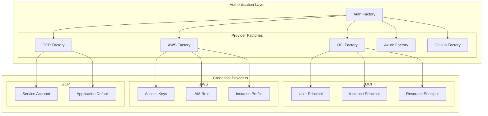
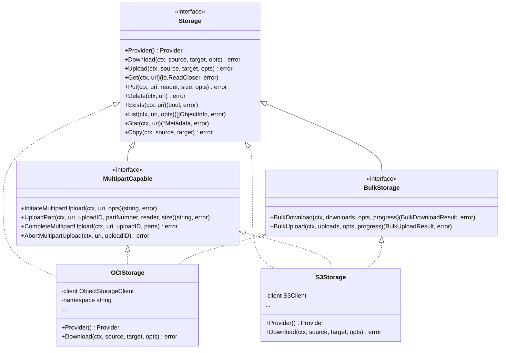

# OEP-0002: Multi-Cloud Storage and Authentication Support

<!-- toc -->
- [Summary](#summary)
- [Motivation](#motivation)
  - [Goals](#goals)
  - [Non-Goals](#non-goals)
- [Proposal](#proposal)
  - [User Stories](#user-stories)
  - [Notes/Constraints/Caveats](#notesconstraintscaveats)
  - [Risks and Mitigations](#risks-and-mitigations)
- [Design Details](#design-details)
  - [Authentication Architecture](#authentication-architecture)
  - [Storage Architecture](#storage-architecture)
  - [URI Specification](#uri-specification)
  - [Provider Implementation](#provider-implementation)
  - [Test Plan](#test-plan)
  - [Graduation Criteria](#graduation-criteria)
    - [Alpha](#alpha)
    - [Beta](#beta)
    - [GA](#ga)
- [Implementation History](#implementation-history)
- [Drawbacks](#drawbacks)
- [Alternatives](#alternatives)
<!-- /toc -->

## Summary

This OEP proposes a comprehensive multi-cloud architecture for OME, providing unified interfaces for authentication and storage operations across major cloud providers including Oracle Cloud Infrastructure (OCI), Amazon Web Services (AWS), Google Cloud Platform (GCP), Microsoft Azure, and GitHub. The design replaces the existing OCI-specific implementations (`pkg/principals` and `pkg/ociobjectstore`) with provider-agnostic interfaces that support extensibility and maintain feature parity across providers.

## Motivation

The current OME implementation is tightly coupled to Oracle Cloud Infrastructure, limiting its adoption in multi-cloud environments. Organizations increasingly use multiple cloud providers for various reasons including cost optimization, regional availability, and vendor-specific features. The existing architecture makes it difficult to:

1. Support multiple cloud providers without code duplication
2. Maintain consistent APIs across different storage backends
3. Add new providers without modifying core logic
4. Test and mock cloud operations effectively
5. Implement provider-specific optimizations while maintaining a unified interface

### Goals

- Create provider-agnostic interfaces for authentication and storage operations
- Support major cloud providers: OCI, AWS S3, GCP Cloud Storage, Azure Blob Storage, and GitHub
- Maintain backward compatibility with existing OCI deployments
- Enable easy addition of new cloud providers through well-defined extension points
- Provide consistent user experience across all providers
- Support advanced features like multipart uploads, bulk operations, and progress tracking
- Implement proper error handling and retry mechanisms
- Ensure high performance through concurrent operations and connection pooling

### Non-Goals

- Support for every possible cloud storage provider initially
- Implementation of provider-specific features that cannot be generalized
- Migration of existing data between cloud providers
- Cost optimization or cloud provider selection logic
- Implementation of cloud-agnostic data replication

## Proposal

We propose implementing a multi-cloud architecture with the following key components:

1. **Unified Authentication Framework** (`pkg/auth`): A factory-based system supporting multiple authentication methods per provider
2. **Provider-Agnostic Storage Interface** (`pkg/storage`): Common interface for all storage operations with optional capability interfaces
3. **URI-Based Resource Identification**: Consistent URI scheme across all providers (e.g., `s3://bucket/object`, `gs://bucket/object`)
4. **Functional Options Pattern**: Clean configuration using options for both upload and download operations
5. **Extensible Factory Pattern**: Easy registration of new providers without modifying core code

### User Stories

**Story 1**: As a DevOps engineer, I want to use OME with my organization's preferred cloud provider without learning provider-specific APIs.

**Story 2**: As a developer, I want to test my application using mock storage implementations without connecting to real cloud services.

**Story 3**: As a system administrator, I want to migrate from one cloud provider to another with minimal code changes.

**Story 4**: As a data engineer, I want to perform bulk operations with progress tracking when transferring large datasets.

**Story 5**: As a platform engineer, I want to add support for a new cloud provider by implementing well-defined interfaces.

### Notes/Constraints/Caveats

1. **Provider Feature Parity**: Not all providers support identical features. Optional interfaces handle provider-specific capabilities.
2. **Authentication Complexity**: Each provider has unique authentication mechanisms requiring provider-specific implementations.
3. **Performance Characteristics**: Different providers have varying performance profiles for operations like multipart uploads.
4. **Rate Limiting**: Each provider has different rate limits requiring provider-specific handling.
5. **Cost Implications**: API calls have different cost structures across providers.

### Risks and Mitigations

**Risk**: Breaking changes for existing OCI users.
**Mitigation**: Maintain backward compatibility through migration layer and comprehensive documentation.

**Risk**: Performance regression when generalizing interfaces.
**Mitigation**: Allow provider-specific optimizations through optional interfaces and careful benchmarking.

**Risk**: Increased complexity in error handling across providers.
**Mitigation**: Implement common error types with provider-specific error wrapping.

**Risk**: Difficulty in maintaining feature parity.
**Mitigation**: Clear documentation of provider capabilities and graceful degradation for unsupported features.

## Design Details

### Authentication Architecture



#### Core Interfaces

```go
// Credentials provides authenticated HTTP client and metadata
type Credentials interface {
    GetHTTPClient() *http.Client
    GetRegion() string
    GetServiceEndpoint(service string) string
    Refresh() error
}

// ProviderFactory creates credentials for a specific provider
type ProviderFactory interface {
    CreateCredentials(config Config) (Credentials, error)
}

// Config defines authentication configuration
type Config struct {
    Provider Provider
    AuthType AuthType
    Settings map[string]interface{}
}
```

### Storage Architecture



### URI Specification

The URI format provides a consistent way to reference objects across all providers:

```
<provider>://<namespace>/<container>/<object_path>
```

Examples:
- OCI: `oci://namespace/bucket/path/to/object.txt`
- AWS S3: `s3://bucket/path/to/object.txt`
- GCP: `gs://bucket/path/to/object.txt`
- Azure: `azure://container/path/to/object.txt`
- GitHub: `github://owner/repo/releases/v1.0/asset.tar.gz`

### Provider Implementation

Each provider implementation follows this structure:

```
pkg/
├── auth/
│   ├── oci/
│   │   ├── factory.go
│   │   ├── user_principal.go
│   │   ├── instance_principal.go
│   │   └── resource_principal.go
│   ├── aws/
│   │   ├── factory.go
│   │   ├── access_keys.go
│   │   ├── iam_role.go
│   │   └── instance_profile.go
│   └── ...
└── storage/
    ├── oci/
    │   ├── client.go
    │   ├── download.go
    │   ├── upload.go
    │   ├── multipart.go
    │   └── bulk.go
    ├── s3/
    │   ├── client.go
    │   ├── download.go
    │   ├── upload.go
    │   ├── multipart.go
    │   └── bulk.go
    └── ...
```

### Test Plan

1. **Unit Tests**
   - Mock implementations for all interfaces
   - Provider-specific unit tests with mocked cloud APIs
   - Edge case testing for error conditions

2. **Integration Tests**
   - Real cloud provider testing with test accounts
   - Cross-provider compatibility tests
   - Performance benchmarks for large file operations

3. **E2E Tests**
   - Multi-provider scenarios
   - Migration path testing
   - Failure recovery scenarios

4. **Compatibility Tests**
   - Ensure backward compatibility with existing code
   - Test migration from deprecated packages

### Graduation Criteria

#### Alpha
- Core interfaces defined and stable
- OCI provider fully implemented with feature parity
- Basic unit test coverage (>80%)
- Documentation for adding new providers

#### Beta
- At least 3 providers implemented (OCI, AWS, GCP)
- Integration tests for all implemented providers
- Performance benchmarks established
- Migration guide from deprecated packages

#### GA
- All 5 planned providers implemented
- Comprehensive test coverage (>90%)
- Production usage validation
- Complete deprecation of legacy packages

## Implementation History

- 2024-01-15: Initial OEP draft
- 2024-01-20: Core interface design completed
- 2024-02-01: OCI provider implementation completed
- 2024-02-15: AWS provider implementation started
- [To be updated as implementation progresses]

## Drawbacks

1. **Increased Complexity**: Supporting multiple providers adds complexity to the codebase
2. **Maintenance Burden**: Each provider requires ongoing maintenance and updates
3. **Testing Requirements**: Comprehensive testing across all providers is resource-intensive
4. **Learning Curve**: Developers need to understand the abstraction layer
5. **Potential Performance Overhead**: Abstraction may introduce minimal overhead

## Alternatives

1. **Provider-Specific Implementations**: Maintain separate codebases for each provider
   - Rejected: High maintenance burden and code duplication

2. **Third-Party Multi-Cloud Libraries**: Use existing solutions like Apache Libcloud
   - Rejected: Limited Go support and lack of control over implementation

3. **Minimal Interface Approach**: Only implement basic operations
   - Rejected: Would not support advanced features users require

4. **Plugin Architecture**: Dynamic loading of provider implementations
   - Rejected: Adds complexity without significant benefits for this use case

5. **Single Provider Focus**: Continue with OCI-only support
   - Rejected: Limits adoption and doesn't meet multi-cloud requirements