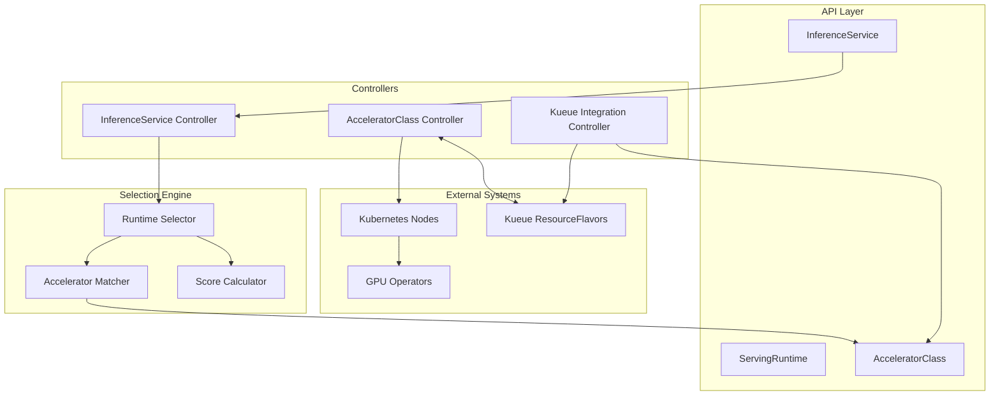

# OEP-0003: Accelerator-Aware Runtime Selection for Heterogeneous GPU Environments

<!--
This OEP proposes a new accelerator abstraction layer for OME to better handle
heterogeneous GPU environments and reduce runtime proliferation while maintaining
compatibility with existing Kubernetes ecosystem tools like Kueue.
-->

<!-- toc -->
- [Summary](#summary)
- [Motivation](#motivation)
  - [Goals](#goals)
  - [Non-Goals](#non-goals)
- [Proposal](#proposal)
  - [User Stories](#user-stories)
    - [Story 1: ML Practitioner Deploying Models](#story-1-ml-practitioner-deploying-models)
    - [Story 2: Platform Engineer Managing Multiple GPU Types](#story-2-platform-engineer-managing-multiple-gpu-types)
    - [Story 3: Heavy Kueue User](#story-3-heavy-kueue-user)
  - [Notes/Constraints/Caveats](#notesconstraintscaveats)
  - [Risks and Mitigations](#risks-and-mitigations)
- [Design Details](#design-details)
  - [API Specifications](#api-specifications)
    - [AcceleratorClass](#acceleratorclass)
    - [InferenceService Extensions](#inferenceservice-extensions)
    - [ServingRuntime Extensions](#servingruntime-extensions)
  - [Kueue Integration](#kueue-integration)
  - [Override Hierarchy](#override-hierarchy)
  - [Implementation Architecture](#implementation-architecture)
  - [Test Plan](#test-plan)
    - [Unit Tests](#unit-tests)
    - [Integration Tests](#integration-tests)
  - [Graduation Criteria](#graduation-criteria)
- [Implementation History](#implementation-history)
- [Drawbacks](#drawbacks)
- [Alternatives](#alternatives)
<!-- /toc -->

## Summary

This OEP introduces an AcceleratorClass abstraction to OME that enables intelligent runtime selection in heterogeneous GPU environments. Currently, supporting multiple GPU types (e.g., H100, A100, B200, H200) requires creating numerous runtime configurations - a combinatorial explosion that becomes unmanageable. The proposed solution provides a vendor-agnostic way to define accelerator capabilities and automatically match them with appropriate runtimes.

The design integrates seamlessly with existing Kubernetes ecosystem tools, particularly Kueue's ResourceFlavor concept, enabling users to leverage existing resource management infrastructure. By introducing capability-based matching rather than hard-coding specific GPU models, the system remains flexible and future-proof as new accelerator types emerge.

## Motivation

OME's current runtime selection mechanism matches runtimes based on model characteristics (format, architecture, size, quantization) but lacks awareness of the underlying hardware accelerators. In clusters with heterogeneous GPU types, this limitation forces operators to create and maintain separate runtime definitions for each GPU model - leading to operational complexity and configuration drift.

Furthermore, the lack of standardization across GPU vendors (NVIDIA, AMD, Intel) in naming conventions and resource exposure makes it challenging to build a unified solution. Each vendor uses different labeling schemes, and Kubernetes device plugins expose resources differently (e.g., nvidia.com/gpu vs amd.com/gpu).

### Goals

1. **Reduce runtime proliferation** - Enable a single runtime definition to work across multiple GPU types
2. **Vendor-agnostic design** - Support NVIDIA, AMD, Intel, and future accelerators without code changes
3. **Kueue integration** - Seamlessly work with existing Kueue ResourceFlavor deployments
4. **Progressive disclosure** - Simple for basic use cases, powerful for advanced scenarios
5. **Automatic optimization** - Select optimal GPU based on model requirements and availability
6. **Clear override hierarchy** - Provide predictable configuration precedence

### Non-Goals

1. **GPU virtualization** - This OEP does not address GPU sharing or MIG configuration
2. **Cost optimization** - While the design enables cost-aware scheduling, implementing cost models is out of scope
3. **Dynamic runtime generation** - Automatically creating new runtime configurations based on discovered GPUs
4. **Replacing existing APIs** - The design extends rather than replaces current runtime selection

## Proposal

Introduce new API resources and extensions to enable accelerator-aware runtime selection:

1. **AcceleratorClass** (Cluster-scoped) - Defines accelerator capabilities and discovery patterns
2. **Runtime/InferenceService extensions** - Add accelerator requirements and selection fields

Note: AcceleratorProfile was considered but deferred to reduce initial complexity. The same functionality can be achieved through InferenceService's acceleratorSelector field.

The system will automatically discover available accelerators, match them with runtime requirements, and select the optimal configuration based on model characteristics and user preferences.

### User Stories

#### Story 1: ML Practitioner Deploying Models

Alice wants to deploy a Llama 7B model for inference. She doesn't know the differences between GPU types and just wants her model to run efficiently.

**Current Experience:**
```yaml
# Alice deploys with auto-selected runtime
kind: InferenceService
metadata:
  name: llama-7b
spec:
  model:
    name: llama-7b
  # Runtime is auto-selected based on model, but GPU type is not considered
  # Result: Might get scheduled on any available GPU (A100, H100, etc.)
  # Problem: No control over GPU selection, potentially inefficient resource use
```

**New Experience:**
```yaml
# Alice specifies only what she needs
kind: InferenceService
metadata:
  name: llama-7b
spec:
  model:
    name: llama-7b
  runtime:
    name: sglang-universal  # Automatically selects appropriate GPU
```

#### Story 2: Platform Engineer Managing Multiple GPU Types

Bob manages a cluster with A100-40GB, A100-80GB, H100-80GB, and H200-96GB GPUs. He needs to support multiple model architectures without creating 16+ runtime configurations.

**Current Experience:**
```yaml
# Bob creates a runtime that works on all GPUs but can't optimize per GPU type
kind: ServingRuntime
metadata:
  name: sglang-all-gpus
spec:
  supportedModelFormats:
    - name: safetensors
  containers:
  - name: sglang
    env:
    # Must use conservative settings that work on smallest GPU
    - name: GPU_MEMORY_UTILIZATION
      value: "0.85"  # Conservative for all GPUs
    - name: MAX_MODEL_LEN  
      value: "16384" # Limited by smallest GPU
    # Can't enable H100-specific optimizations like FP8
```

**New Experience:**
```yaml
# Bob creates one universal runtime
kind: ServingRuntime
metadata:
  name: sglang-universal
spec:
  supportedModelFormats:
    - name: safetensors
      autoSelect: true
  
  acceleratorRequirements:
    requiredCapabilities:
      minComputeCapability: "8.0"
      requiredFeatures: ["tensor-cores"]
    
  # GPU-specific optimizations
  acceleratorConfigurations:
    - selector:
        acceleratorClass: nvidia-a100-40gb
      env:
        - name: TENSOR_PARALLEL_SIZE
          value: "2"
        - name: GPU_MEMORY_UTILIZATION
          value: "0.90"
        - name: MAX_MODEL_LEN
          value: "16384"
      runner:
        args:
          - "--enable-prefix-caching"
          
    - selector:
        acceleratorClass: nvidia-h100-80gb
      env:
        - name: TENSOR_PARALLEL_SIZE
          value: "1"
        - name: ENABLE_FP8
          value: "true"
        - name: GPU_MEMORY_UTILIZATION
          value: "0.95"
        - name: MAX_MODEL_LEN
          value: "32768"
      runner:
        args:
          - "--enable-prefix-caching"
          - "--enable-chunked-prefill"
          - "--speculative-model=llama-68m"  # Enable speculative decoding
```

#### Story 3: Heavy Kueue User

Carol's organization uses Kueue extensively for resource management with ResourceFlavors already defined. She wants OME to leverage existing Kueue configuration.

**New Experience:**
```yaml
# Existing Kueue ResourceFlavor
apiVersion: kueue.x-k8s.io/v1beta1
kind: ResourceFlavor
metadata:
  name: gpu-nvidia-a100
spec:
  nodeLabels:
    nvidia.com/gpu.product: "A100-SXM4-40GB"

---
# OME automatically discovers and creates AcceleratorClass
apiVersion: ome.io/v1beta1
kind: AcceleratorClass
metadata:
  name: gpu-nvidia-a100
  annotations:
    ome.io/kueue-resource-flavor: "gpu-nvidia-a100"
spec:
  # Auto-populated from Kueue ResourceFlavor
  nodeSelector:
    nvidia.com/gpu.product: "A100-SXM4-40GB"
  capabilities:
    memoryGB: 40
    computeCapability: "8.0"
```

#### Story 4: Complex Node Selection Requirements

Dave needs to deploy a model that requires H100 GPUs but must run in a specific availability zone for data locality.

**New Experience:**
```yaml
# AcceleratorClass defines GPU requirements
apiVersion: ome.io/v1beta1
kind: AcceleratorClass
metadata:
  name: nvidia-h100-80gb
spec:
  discovery:
    nodeSelector:
      nvidia.com/gpu.product: "H100-SXM5-80GB"

---
# InferenceService adds additional constraints
apiVersion: ome.io/v1beta1
kind: InferenceService
metadata:
  name: llama-70b
spec:
  model:
    name: llama-70b
  runtime:
    name: sglang-universal
  acceleratorSelector:
    preferredClasses: ["nvidia-h100-80gb"]
  engine:
    # This nodeSelector is merged with AcceleratorClass nodeSelector
    nodeSelector:
      topology.kubernetes.io/zone: "us-west-2a"  # Data locality requirement
      compliance: "pci"  # Compliance requirement
    # Final nodeSelector will be:
    # {
    #   "nvidia.com/gpu.product": "H100-SXM5-80GB",  # From AcceleratorClass
    #   "topology.kubernetes.io/zone": "us-west-2a",  # From InferenceService
    #   "compliance": "pci"                           # From InferenceService
    # }
```

#### Story 5: Cost-Optimized Router Deployment

Emma wants to ensure routers run on cheap CPU nodes while engines run on GPU nodes.

**New Experience:**
```yaml
apiVersion: ome.io/v1beta1
kind: InferenceService
metadata:
  name: llama-7b-with-router
spec:
  model:
    name: llama-7b
  runtime:
    name: sglang-universal
    
  # Router configuration - CPU only
  router:
    nodeSelector:
      node-type: "cpu-only"  # Explicitly schedule on CPU nodes
      instance-type: "spot"  # Use cheap spot instances
    resources:
      requests:
        cpu: "2"
        memory: "4Gi"
      limits:
        cpu: "4"
        memory: "8Gi"
        # No GPU resources specified
  
  # Engine configuration - GPU required
  engine:
    # AcceleratorClass nodeSelector will be merged here
    # But NOT applied to router
    acceleratorConfigurations:
      - selector:
          acceleratorClass: nvidia-a100-40gb
        resources:
          limits:
            nvidia.com/gpu: 1
  
  # Accelerator selection only affects engine/decoder
  acceleratorSelector:
    preferredClasses: ["nvidia-a100-40gb"]
```

#### Story 6: Cost-Optimized Model Serving

Frank wants to optimize costs by using A100s for small requests and H100s only for large requests that need the performance.

**New Experience:**
```yaml
apiVersion: ome.io/v1beta1
kind: ServingRuntime
metadata:
  name: sglang-cost-optimized
spec:
  supportedModelFormats:
    - name: safetensors
      autoSelect: true
  
  # Define cost-aware preferences
  acceleratorRequirements:
    preferenceOrder:
      - class: nvidia-a100-40gb
        score: 100
        conditions:
          - modelSize: "<30B"
          - requestSize: "<2048"  # Small requests prefer cheaper GPUs
      - class: nvidia-h100-80gb
        score: 100
        conditions:
          - modelSize: ">70B"
          - requestSize: ">4096"  # Large requests need H100 performance
  
  # Cost-optimized configurations per GPU
  acceleratorConfigurations:
    - selector:
        acceleratorClass: nvidia-a100-40gb
      env:
        - name: MAX_BATCH_SIZE
          value: "32"  # Conservative batching
        - name: QUANTIZATION
          value: "awq"  # Use quantization to fit more on A100
      
    - selector:
        acceleratorClass: nvidia-h100-80gb
      env:
        - name: MAX_BATCH_SIZE
          value: "256"  # Aggressive batching for throughput
        - name: QUANTIZATION
          value: "fp8"  # Use H100's native FP8 support

---
# InferenceService can specify cost preference
apiVersion: ome.io/v1beta1
kind: InferenceService
metadata:
  name: cost-sensitive-deployment
spec:
  model:
    name: llama-13b
  runtime:
    name: sglang-cost-optimized
  acceleratorSelector:
    strategy: cost  # Prefer cost over performance
    annotations:
      ome.io/cost-threshold: "0.5"  # $/hour threshold
```

#### Story 7: Advanced Performance Optimization

Grace needs to deploy models with speculative decoding and advanced quantization techniques based on GPU capabilities.

**New Experience:**
```yaml
apiVersion: ome.io/v1beta1
kind: ServingRuntime
metadata:
  name: sglang-performance-optimized
spec:
  supportedModelFormats:
    - name: safetensors
      autoSelect: true
  
  acceleratorConfigurations:
    # A100 configuration - no speculative decoding due to memory constraints
    - selector:
        acceleratorClass: nvidia-a100-40gb
      env:
        - name: QUANTIZATION_METHOD
          value: "awq"  # 4-bit quantization for memory efficiency
        - name: ENABLE_LORA
          value: "true"
        - name: KV_CACHE_DTYPE
          value: "fp16"
      runner:
        args:
          - "--enable-prefix-caching"
          - "--enable-cuda-graph"
    
    # H100 configuration - full optimization features
    - selector:
        acceleratorClass: nvidia-h100-80gb
      env:
        - name: QUANTIZATION_METHOD
          value: "fp8"  # Native H100 FP8
        - name: ENABLE_SPECULATIVE_DECODING
          value: "true"
        - name: DRAFT_MODEL
          value: "llama-68m"  # Small draft model for speculation
        - name: SPECULATION_LENGTH
          value: "5"
        - name: KV_CACHE_DTYPE
          value: "fp8"
      runner:
        args:
          - "--enable-prefix-caching"
          - "--enable-cuda-graph"
          - "--enable-chunked-prefill"
          - "--num-speculative-tokens=5"
          - "--spec-decoding-acceptance-method=typical"
    
    # H200 configuration - maximum performance
    - selector:
        acceleratorClass: nvidia-h200-96gb
      env:
        - name: QUANTIZATION_METHOD
          value: "fp8"
        - name: ENABLE_SPECULATIVE_DECODING
          value: "true"
        - name: DRAFT_MODEL
          value: "llama-160m"  # Larger draft model
        - name: TENSOR_PARALLEL_SIZE
          value: "1"  # Single GPU has enough memory
        - name: MAX_MODEL_LEN
          value: "65536"  # Longer context with more memory
      runner:
        args:
          - "--enable-prefix-caching"
          - "--enable-cuda-graph" 
          - "--enable-chunked-prefill"
          - "--num-speculative-tokens=7"
          - "--enable-flashinfer"  # H200 optimized kernels
```

#### Story 8: Custom Command with Accelerator Optimization

Henry has a complex sglang deployment with custom commands but wants GPU-specific optimizations to be applied.

**Scenario 1: User provides full command (accelerator args NOT applied)**
```yaml
apiVersion: ome.io/v1beta1
kind: InferenceService
metadata:
  name: custom-command-deployment
spec:
  engine:
    runner:
      # User has full control with command
      command:
        - sh
        - -c
        - >
          python3 -m sglang.launch_server 
          --host 0.0.0.0 --port 8080 
          --model-path ${MODEL_PATH} 
          --tp-size 16 
          --nccl-init $(LWS_LEADER_ADDRESS):5000 
          --nnodes ${LWS_GROUP_SIZE} 
          --node-rank ${LWS_WORKER_INDEX} 
          --trust-remote-code 
          --enable-torch-compile 
          --torch-compile-max-bs 1 
          --reasoning-parser deepseek-r1 
          --enable-metrics
  # Even with acceleratorSelector, args from acceleratorConfigurations are NOT applied
  # because user specified command
  acceleratorSelector:
    preferredClasses: ["nvidia-h100-80gb"]
```

**Scenario 2: User provides args array (accelerator args are appended)**
```yaml
apiVersion: ome.io/v1beta1
kind: InferenceService
metadata:
  name: args-merge-deployment
spec:
  engine:
    runner:
      # User args
      args:
        - "--host=0.0.0.0"
        - "--port=8080"
        - "--model-path=${MODEL_PATH}"
        - "--tp-size=8"
        - "--trust-remote-code"
  
  runtime:
    name: sglang-performance-optimized
  
  acceleratorSelector:
    preferredClasses: ["nvidia-h100-80gb"]
  
  # Result: Final args will be:
  # ["--host=0.0.0.0", "--port=8080", "--model-path=${MODEL_PATH}", 
  #  "--tp-size=8", "--trust-remote-code",
  #  "--enable-prefix-caching", "--enable-cuda-graph",  # From acceleratorConfig
  #  "--enable-chunked-prefill", "--num-speculative-tokens=5",
  #  "--spec-decoding-acceptance-method=typical"]
```

**Scenario 3: Environment variable merging**
```yaml
apiVersion: ome.io/v1beta1
kind: InferenceService
metadata:
  name: env-merge-deployment
spec:
  engine:
    runner:
      env:
        - name: TENSOR_PARALLEL_SIZE
          value: "4"  # User override
        - name: CUSTOM_SETTING
          value: "user-value"
  
  runtime:
    name: sglang-performance-optimized
  
  acceleratorSelector:
    preferredClasses: ["nvidia-h100-80gb"]
  
  # Result: Final env will include:
  # TENSOR_PARALLEL_SIZE=4 (user value wins)
  # CUSTOM_SETTING=user-value (user defined)
  # ENABLE_FP8=true (from acceleratorConfig, not overridden)
  # GPU_MEMORY_UTILIZATION=0.95 (from acceleratorConfig)
```

### Notes/Constraints/Caveats

1. **Kueue Integration:** When Kueue ResourceFlavors exist, OME can auto-discover and create corresponding AcceleratorClasses. This ensures consistency and reduces duplicate configuration.

2. **Vendor Differences:** Different GPU vendors expose resources differently (nvidia.com/gpu, amd.com/gpu). The AcceleratorClass abstraction handles these differences transparently.

3. **Override Precedence:** Configuration follows a clear hierarchy: ServingRuntime defaults → AcceleratorClass configurations → InferenceService spec → Pod annotations

4. **Backward Compatibility:** Existing InferenceServices continue to work. The new fields are optional and only enhance functionality when used.

5. **Interaction with Existing NodeSelector/Affinity:** Both ServingRuntime and InferenceService already have `nodeSelector` and `affinity` fields. The AcceleratorClass system works as follows:
   - AcceleratorClass defines the node selection criteria for specific GPU types
   - These are merged with existing nodeSelector/affinity settings
   - User-specified nodeSelector/affinity in InferenceService takes precedence

6. **Component Architecture:** OME uses separate Engine, Decoder, and Router components:
   - Engine and Decoder can have different AcceleratorClass selections
   - Router typically runs CPU-only and doesn't apply accelerator configurations
   - Components receive already-merged specs from the controller

7. **Container Args Merging:** Following OME's existing behavior:
   - Runtime args and user args are concatenated, not merged
   - Accelerator args are prepended to runtime args
   - If user specifies `command`, accelerator args are not applied
   - If user specifies `args`, they are appended after accelerator args
   - When an accelerator is selected, its nodeSelector is **merged** with existing nodeSelectors
   - Affinity rules are combined using AND logic
   - Direct nodeSelector/affinity in InferenceService takes precedence over AcceleratorClass
   - This allows users to further constrain placement beyond GPU type

6. **Router Component Handling:** The router component is CPU-only and doesn't require GPUs:
   - AcceleratorClass constraints are **only applied to Engine and Decoder** components
   - Router pods maintain their own independent nodeSelector/affinity settings
   - This prevents routers from being unnecessarily scheduled on expensive GPU nodes
   - Router can be explicitly scheduled on CPU-only nodes for cost optimization

7. **Container Arguments Merging:** When acceleratorConfigurations specify args and the user also provides command/args:
   - If user specifies `command`, accelerator args are **NOT applied** (user has full control)
   - If user specifies `args` as array, accelerator args are **appended**
   - Environment variables are **merged** (user values take precedence)
   - Resources are **merged** (max of user and accelerator values)

### Risks and Mitigations

**Risk 1: Complexity for simple use cases**
- *Mitigation:* All new fields are optional. Users can continue using existing simple configurations.

**Risk 2: Conflict with Kueue ResourceFlavors**
- *Mitigation:* Provide automatic discovery and synchronization with Kueue ResourceFlavors. Allow bi-directional mapping.

**Risk 3: Performance overhead in selection**
- *Mitigation:* Cache accelerator discovery results. Use efficient matching algorithms.

**Risk 4: Vendor lock-in through capability definitions**
- *Mitigation:* Use generic capability names. Allow vendor-specific extensions without requiring them.

## Design Details

### Example AcceleratorClass Definitions

Users or platform administrators would create AcceleratorClass resources for their GPU types. Here are common examples:

```yaml
# NVIDIA A100 40GB
apiVersion: ome.io/v1beta1
kind: AcceleratorClass
metadata:
  name: nvidia-a100-40gb
spec:
  vendor: nvidia
  family: ampere
  model: a100
  
  discovery:
    nodeSelector:
      nvidia.com/gpu.product: "NVIDIA-A100-SXM4-40GB"
    # Alternative discovery patterns
    nodeSelectorTerms:
      - matchExpressions:
        - key: nvidia.com/gpu.product
          operator: In
          values: ["NVIDIA-A100-SXM4-40GB", "NVIDIA-A100-PCIE-40GB"]
    pciVendorID: "10de"
    deviceIDs: ["20b0", "20b2"]  # Different A100 variants
  
  capabilities:
    memoryGB: "40Gi"
    computeCapability: "8.0"
    memoryBandwidthGBps: "1555"
    features:
      - tensor-cores
      - mig-3g.20gb
      - mig-7g.40gb
      - nvlink
    performance:
      fp16TFLOPS: 312
      fp32TFLOPS: 156
      int8TOPS: 624
  
  resources:
    - name: nvidia.com/gpu
      quantity: "1"
    - name: nvidia.com/mig-3g.20gb
      quantity: "2"
      divisible: true
  
  cost:
    perHour: "2.21"  # Current cloud pricing
    spotPerHour: "0.88"
    tier: "medium"

---
# NVIDIA H100 80GB
apiVersion: ome.io/v1beta1
kind: AcceleratorClass
metadata:
  name: nvidia-h100-80gb
spec:
  vendor: nvidia
  family: hopper
  model: h100
  
  discovery:
    nodeSelector:
      nvidia.com/gpu.product: "NVIDIA-H100-80GB-HBM3"
    pciVendorID: "10de"
    deviceIDs: ["2330"]
  
  capabilities:
    memoryGB: "80Gi"
    computeCapability: "9.0"
    memoryBandwidthGBps: "3350"
    features:
      - tensor-cores
      - transformer-engine
      - fp8
      - mig-7g.80gb
      - nvlink-4
    performance:
      fp8TFLOPS: 3958  # With sparsity
      fp16TFLOPS: 1979
      fp32TFLOPS: 989
  
  resources:
    - name: nvidia.com/gpu
      quantity: "1"
  
  cost:
    perHour: "5.12"  # Higher cost for newer GPU
    spotPerHour: "2.05"
    tier: "high"

---
# AMD MI250X
apiVersion: ome.io/v1beta1
kind: AcceleratorClass
metadata:
  name: amd-mi250x
spec:
  vendor: amd
  family: cdna2
  model: mi250x
  
  discovery:
    nodeSelector:
      amd.com/gpu.product: "MI250X"
    # AMD uses different labeling
    nodeSelectorTerms:
      - matchExpressions:
        - key: gpu.amd.com/model
          operator: In
          values: ["mi250x", "MI250X"]
  
  capabilities:
    memoryGB: "128Gi"  # 2x64GB
    rocmVersion: "5.7"
    memoryBandwidthGBps: "3276"
    features:
      - matrix-cores
      - infinity-fabric
    performance:
      fp16TFLOPS: 383
      fp32TFLOPS: 47.9
  
  resources:
    - name: amd.com/gpu
      quantity: "1"

---
# Intel Data Center GPU Max 1550
apiVersion: ome.io/v1beta1
kind: AcceleratorClass
metadata:
  name: intel-max-1550
spec:
  vendor: intel
  family: ponte-vecchio
  model: max-1550
  
  discovery:
    nodeSelector:
      gpu.intel.com/product: "max-1550"
  
  capabilities:
    memoryGB: "128Gi"
    levelZeroVersion: "1.3"
    features:
      - xmx-engines
      - ray-tracing
  
  resources:
    - name: gpu.intel.com/i915
      quantity: "1"
```

### Platform-Provided Base Set

Platform teams would typically provide a base set of AcceleratorClasses:

```yaml
# Simplified example for platform teams
apiVersion: v1
kind: ConfigMap
metadata:
  name: accelerator-classes-base
  namespace: ome-system
data:
  accelerator-classes.yaml: |
    # Small GPU for development/testing
    ---
    apiVersion: ome.io/v1beta1
    kind: AcceleratorClass
    metadata:
      name: small-gpu
      labels:
        ome.io/gpu-tier: "small"
    spec:
      discovery:
        nodeSelectorTerms:
          - matchExpressions:
            - key: nvidia.com/gpu.memory
              operator: Lt
              values: ["24Gi"]
      capabilities:
        memoryGB: "16Gi"
        features: ["tensor-cores"]
    
    # Medium GPU for standard workloads
    ---
    apiVersion: ome.io/v1beta1
    kind: AcceleratorClass
    metadata:
      name: medium-gpu
      labels:
        ome.io/gpu-tier: "medium"
    spec:
      discovery:
        nodeSelectorTerms:
          - matchExpressions:
            - key: nvidia.com/gpu.memory
              operator: Gte
              values: ["32Gi"]
            - key: nvidia.com/gpu.memory
              operator: Lt
              values: ["80Gi"]
      capabilities:
        memoryGB: "40Gi"
        minComputeCapability: "8.0"
    
    # Large GPU for large models
    ---
    apiVersion: ome.io/v1beta1
    kind: AcceleratorClass
    metadata:
      name: large-gpu
      labels:
        ome.io/gpu-tier: "large"
    spec:
      discovery:
        nodeSelectorTerms:
          - matchExpressions:
            - key: nvidia.com/gpu.memory
              operator: Gte
              values: ["80Gi"]
      capabilities:
        memoryGB: "80Gi"
        minComputeCapability: "8.0"
```

### Auto-Discovery Examples

The platform could also auto-discover and create AcceleratorClasses:

```go
// Pseudo-code for auto-discovery controller
func (r *AcceleratorDiscoveryReconciler) discoverGPUs(ctx context.Context) error {
    nodes := &v1.NodeList{}
    if err := r.List(ctx, nodes); err != nil {
        return err
    }
    
    discoveredGPUs := make(map[string]*AcceleratorClassSpec)
    
    for _, node := range nodes.Items {
        // Check for NVIDIA GPUs
        if product, ok := node.Labels["nvidia.com/gpu.product"]; ok {
            if _, exists := discoveredGPUs[product]; !exists {
                spec := r.createNvidiaAcceleratorSpec(node.Labels)
                discoveredGPUs[product] = spec
            }
        }
        
        // Check for AMD GPUs
        if product, ok := node.Labels["amd.com/gpu.product"]; ok {
            if _, exists := discoveredGPUs[product]; !exists {
                spec := r.createAMDAcceleratorSpec(node.Labels)
                discoveredGPUs[product] = spec
            }
        }
    }
    
    // Create AcceleratorClass for each discovered GPU type
    for name, spec := range discoveredGPUs {
        ac := &AcceleratorClass{
            ObjectMeta: metav1.ObjectMeta{
                Name: sanitizeName(name),
                Labels: map[string]string{
                    "ome.io/auto-discovered": "true",
                },
            },
            Spec: *spec,
        }
        if err := r.Create(ctx, ac); err != nil && !errors.IsAlreadyExists(err) {
            return err
        }
    }
    
    return nil
}
```

### API Specifications

#### AcceleratorClass

```go
// AcceleratorClass defines a class of accelerators with similar capabilities
// +kubebuilder:object:root=true
// +kubebuilder:resource:scope=Cluster
// +kubebuilder:subresource:status
// +kubebuilder:printcolumn:name="Vendor",type=string,JSONPath=`.spec.vendor`
// +kubebuilder:printcolumn:name="Family",type=string,JSONPath=`.spec.family`
// +kubebuilder:printcolumn:name="Memory",type=string,JSONPath=`.spec.capabilities.memoryGB`
// +kubebuilder:printcolumn:name="Nodes",type=integer,JSONPath=`.status.availableNodes`
type AcceleratorClass struct {
    metav1.TypeMeta   `json:",inline"`
    metav1.ObjectMeta `json:"metadata,omitempty"`
    
    Spec   AcceleratorClassSpec   `json:"spec,omitempty"`
    Status AcceleratorClassStatus `json:"status,omitempty"`
}

type AcceleratorClassSpec struct {
    // Vendor of the accelerator (nvidia, amd, intel, etc.)
    // +optional
    Vendor string `json:"vendor,omitempty"`
    
    // Family of the accelerator (ampere, hopper, cdna2, etc.)
    // +optional
    Family string `json:"family,omitempty"`
    
    // Model name (a100, h100, mi250x, etc.)
    // +optional
    Model string `json:"model,omitempty"`
    
    // Discovery patterns to identify nodes with this accelerator
    Discovery AcceleratorDiscovery `json:"discovery"`
    
    // Capabilities of this accelerator class
    Capabilities AcceleratorCapabilities `json:"capabilities"`
    
    // Resources exposed by this accelerator
    // +optional
    Resources []AcceleratorResource `json:"resources,omitempty"`
    
    // Integration with external systems
    // +optional
    Integration *AcceleratorIntegration `json:"integration,omitempty"`
    
    // Cost information for optimization decisions
    // +optional
    Cost *AcceleratorCost `json:"cost,omitempty"`
}

type AcceleratorCost struct {
    // Cost per hour in dollars
    // +optional
    PerHour *resource.Quantity `json:"perHour,omitempty"`
    
    // Cost per million tokens (for usage-based pricing)
    // +optional
    PerMillionTokens *resource.Quantity `json:"perMillionTokens,omitempty"`
    
    // Spot instance pricing if available
    // +optional
    SpotPerHour *resource.Quantity `json:"spotPerHour,omitempty"`
    
    // Cost tier for simplified selection (low, medium, high)
    // +optional
    Tier string `json:"tier,omitempty"`
}

type AcceleratorDiscovery struct {
    // NodeSelector to identify nodes with this accelerator
    // +optional
    NodeSelector map[string]string `json:"nodeSelector,omitempty"`
    
    // NodeSelectorTerms for more complex node selection
    // +optional
    NodeSelectorTerms []v1.NodeSelectorTerm `json:"nodeSelectorTerms,omitempty"`
    
    // PCIVendorID for device discovery (e.g., "10de" for NVIDIA)
    // +optional
    PCIVendorID string `json:"pciVendorID,omitempty"`
    
    // DeviceIDs list of PCI device IDs
    // +optional
    DeviceIDs []string `json:"deviceIDs,omitempty"`
}

type AcceleratorCapabilities struct {
    // Memory capacity in GB
    // +optional
    MemoryGB *resource.Quantity `json:"memoryGB,omitempty"`
    
    // Compute capability (NVIDIA) or equivalent
    // +optional
    ComputeCapability string `json:"computeCapability,omitempty"`
    
    // Clock speeds
    // +optional
    ClockSpeedMHz *int32 `json:"clockSpeedMHz,omitempty"`
    
    // Memory bandwidth
    // +optional
    MemoryBandwidthGBps *resource.Quantity `json:"memoryBandwidthGBps,omitempty"`
    
    // Features supported by this accelerator
    // +optional
    Features []string `json:"features,omitempty"`
    
    // Performance metrics
    // +optional
    Performance *AcceleratorPerformance `json:"performance,omitempty"`
}

type AcceleratorResource struct {
    // Name of the resource (e.g., nvidia.com/gpu)
    Name string `json:"name"`
    
    // Quantity per accelerator
    // +kubebuilder:default="1"
    Quantity resource.Quantity `json:"quantity,omitempty"`
    
    // Divisible indicates if the resource can be subdivided
    // +optional
    Divisible bool `json:"divisible,omitempty"`
}

type AcceleratorIntegration struct {
    // KueueResourceFlavor name to sync with
    // +optional
    KueueResourceFlavor string `json:"kueueResourceFlavor,omitempty"`
    
    // VolcanoGPUType for Volcano integration
    // +optional
    VolcanoGPUType string `json:"volcanoGPUType,omitempty"`
}

type AcceleratorClassStatus struct {
    // Nodes that have this accelerator
    // +optional
    Nodes []string `json:"nodes,omitempty"`
    
    // Total number of accelerators in the cluster
    // +optional
    TotalAccelerators int32 `json:"totalAccelerators,omitempty"`
    
    // Available accelerators (not allocated)
    // +optional
    AvailableAccelerators int32 `json:"availableAccelerators,omitempty"`
    
    // Last update time
    // +optional
    LastUpdated metav1.Time `json:"lastUpdated,omitempty"`
    
    // Conditions represent the latest available observations
    // +optional
    Conditions []metav1.Condition `json:"conditions,omitempty"`
}
```

#### InferenceService Extensions

```go
// Update InferenceServiceSpec in inference_service.go
type InferenceServiceSpec struct {
    // Existing fields...
    Engine  *EngineSpec  `json:"engine,omitempty"`
    Decoder *DecoderSpec `json:"decoder,omitempty"`
    Model   *ModelRef    `json:"model,omitempty"`
    Runtime *ServingRuntimeRef `json:"runtime,omitempty"`
    Router  *RouterSpec  `json:"router,omitempty"`
    
    // NEW: Accelerator selection preferences
    // +optional
    AcceleratorSelector *AcceleratorSelector `json:"acceleratorSelector,omitempty"`
}

type AcceleratorSelector struct {
    // PreferredClasses in order of preference
    // +optional
    PreferredClasses []string `json:"preferredClasses,omitempty"`
    
    // RequiredCapabilities that must be met
    // +optional
    RequiredCapabilities *AcceleratorCapabilities `json:"requiredCapabilities,omitempty"`
    
    // Strategy for selection (performance, cost, balanced)
    // +kubebuilder:default="balanced"
    // +optional
    Strategy AcceleratorSelectionStrategy `json:"strategy,omitempty"`
    
    // NodeSelector for specific node targeting
    // +optional
    NodeSelector map[string]string `json:"nodeSelector,omitempty"`
    
    // Strategy for selection (performance, cost, balanced)
    // +kubebuilder:default="balanced"
    // +optional
    Strategy AcceleratorSelectionStrategy `json:"strategy,omitempty"`
}

// Update EngineSpec to support accelerator configuration
type EngineSpec struct {
    // Existing fields...
    PodSpec                `json:",inline"`
    ComponentExtensionSpec `json:",inline"`
    Runner                 *RunnerSpec `json:"runner,omitempty"`
    Leader                 *LeaderSpec `json:"leader,omitempty"`
    Worker                 *WorkerSpec `json:"worker,omitempty"`
    
    // NEW: Accelerator-specific configuration overrides
    // Applied based on selected accelerator class
    // +optional
    AcceleratorConfigurations []AcceleratorConfiguration `json:"acceleratorConfigurations,omitempty"`
}

type AcceleratorConfiguration struct {
    // Selector for which accelerator classes this applies to
    Selector AcceleratorConfigSelector `json:"selector"`
    
    // Environment variables to set
    // +optional
    Env []v1.EnvVar `json:"env,omitempty"`
    
    // Resources to request/limit
    // +optional
    Resources v1.ResourceRequirements `json:"resources,omitempty"`
    
    // Runner overrides
    // +optional
    Runner *RunnerSpec `json:"runner,omitempty"`
}
```

#### ServingRuntime Extensions

```go
// Update ServingRuntimeSpec in servingruntime_types.go
type ServingRuntimeSpec struct {
    // Existing fields...
    SupportedModelFormats []SupportedModelFormat `json:"supportedModelFormats,omitempty"`
    ModelSizeRange       *ModelSizeRangeSpec     `json:"modelSizeRange,omitempty"`
    Disabled             *bool                   `json:"disabled,omitempty"`
    RouterConfig         *RouterSpec             `json:"routerConfig,omitempty"`
    EngineConfig         *EngineSpec             `json:"engineConfig,omitempty"`
    DecoderConfig        *DecoderSpec            `json:"decoderConfig,omitempty"`
    
    // NEW: Accelerator requirements for this runtime
    // +optional
    AcceleratorRequirements *AcceleratorRequirements `json:"acceleratorRequirements,omitempty"`
}

type AcceleratorRequirements struct {
    // SupportedClasses explicitly lists supported accelerator classes
    // +optional
    SupportedClasses []string `json:"supportedClasses,omitempty"`
    
    // RequiredCapabilities that any accelerator must meet
    // +optional
    RequiredCapabilities *AcceleratorCapabilities `json:"requiredCapabilities,omitempty"`
    
    // PreferenceOrder for accelerator selection
    // +optional
    PreferenceOrder []AcceleratorPreference `json:"preferenceOrder,omitempty"`
}

type AcceleratorPreference struct {
    // Class name or capability matcher
    Class string `json:"class,omitempty"`
    
    // Score for this preference (higher is better)
    // +kubebuilder:validation:Minimum=0
    // +kubebuilder:validation:Maximum=100
    Score int32 `json:"score"`
    
    // Conditions when this preference applies
    // +optional
    Conditions []PreferenceCondition `json:"conditions,omitempty"`
}
```

### Kueue Integration

The system provides bi-directional integration with Kueue ResourceFlavors:

```go
// AcceleratorClassController watches for Kueue ResourceFlavors
func (r *AcceleratorClassReconciler) Reconcile(ctx context.Context, req ctrl.Request) (ctrl.Result, error) {
    // Check if this is a Kueue ResourceFlavor
    if req.Namespace == "" && strings.HasPrefix(req.Name, "gpu-") {
        // Try to get corresponding ResourceFlavor
        rf := &kueuev1beta1.ResourceFlavor{}
        if err := r.Get(ctx, req.NamespacedName, rf); err == nil {
            // Create or update AcceleratorClass from ResourceFlavor
            return r.syncFromResourceFlavor(ctx, rf)
        }
    }
    
    // Normal AcceleratorClass reconciliation
    ac := &omev1beta1.AcceleratorClass{}
    if err := r.Get(ctx, req.NamespacedName, ac); err != nil {
        return ctrl.Result{}, client.IgnoreNotFound(err)
    }
    
    // If linked to Kueue, ensure ResourceFlavor exists
    if ac.Spec.Integration != nil && ac.Spec.Integration.KueueResourceFlavor != "" {
        return r.ensureResourceFlavor(ctx, ac)
    }
    
    return r.updateAcceleratorStatus(ctx, ac)
}

// Auto-discovery of GPU capabilities from nodes
func (r *AcceleratorClassReconciler) discoverAcceleratorCapabilities(
    ctx context.Context,
    nodes []v1.Node,
) (*AcceleratorCapabilities, error) {
    capabilities := &AcceleratorCapabilities{
        Features: []string{},
    }
    
    for _, node := range nodes {
        // Extract GPU information from node labels
        if memory, ok := node.Labels["nvidia.com/gpu.memory"]; ok {
            if mem, err := resource.ParseQuantity(memory); err == nil {
                capabilities.MemoryGB = &mem
            }
        }
        
        if cc, ok := node.Labels["nvidia.com/gpu.compute"]; ok {
            capabilities.ComputeCapability = cc
        }
        
        // Check for specific features
        if _, ok := node.Labels["nvidia.com/mig.capable"]; ok {
            capabilities.Features = append(capabilities.Features, "mig")
        }
        
        if _, ok := node.Labels["nvidia.com/nvlink"]; ok {
            capabilities.Features = append(capabilities.Features, "nvlink")
        }
    }
    
    return capabilities, nil
}
```

### Override Hierarchy

The configuration precedence follows a clear hierarchy:

```go
// RuntimeSelector implements the selection logic with override support
type RuntimeSelector struct {
    client            client.Client
    acceleratorCache  cache.Cache
    defaultStrategy   SelectionStrategy
}

func (s *RuntimeSelector) SelectRuntimeWithAccelerator(
    ctx context.Context,
    inferenceService *omev1beta1.InferenceService,
    model *omev1beta1.BaseModel,
) (*RuntimeSelection, error) {
    // 1. Get base runtime requirements
    runtime, err := s.getRuntime(ctx, inferenceService)
    if err != nil {
        return nil, err
    }
    
    // 2. Build effective accelerator requirements (with overrides)
    requirements := s.buildEffectiveRequirements(
        runtime.Spec.AcceleratorRequirements,           // Base from runtime
        inferenceService.Spec.AcceleratorSelector,      // Override from InferenceService
        inferenceService.Annotations,                   // Final overrides from annotations
    )
    
    // 3. Find matching accelerators
    accelerators, err := s.findMatchingAccelerators(ctx, requirements)
    if err != nil {
        return nil, err
    }
    
    // 4. Score and select best option
    selection := s.selectBestOption(
        runtime,
        accelerators,
        model,
        requirements.Strategy,
    )
    
    // 5. Apply accelerator-specific configuration
    s.applyAcceleratorConfig(selection, runtime, accelerators[0])
    
    return selection, nil
}

// Override precedence implementation
func (s *RuntimeSelector) buildEffectiveRequirements(
    runtimeReq *AcceleratorRequirements,
    serviceSelector *AcceleratorSelector,
    annotations map[string]string,
) *EffectiveRequirements {
    req := &EffectiveRequirements{
        Strategy: s.defaultStrategy,
    }
    
    // Layer 1: Runtime defaults
    if runtimeReq != nil {
        req.SupportedClasses = runtimeReq.SupportedClasses
        req.RequiredCapabilities = runtimeReq.RequiredCapabilities
    }
    
    // Layer 2: InferenceService overrides
    if serviceSelector != nil {
        if len(serviceSelector.PreferredClasses) > 0 {
            req.PreferredClasses = serviceSelector.PreferredClasses
        }
        if serviceSelector.RequiredCapabilities != nil {
            req.RequiredCapabilities = mergeCapabilities(
                req.RequiredCapabilities,
                serviceSelector.RequiredCapabilities,
            )
        }
        if serviceSelector.Strategy != "" {
            req.Strategy = serviceSelector.Strategy
        }
    }
    
    // Layer 3: Annotation overrides (highest priority)
    if class, ok := annotations["ome.io/accelerator-class"]; ok {
        req.PreferredClasses = []string{class}
    }
    if strategy, ok := annotations["ome.io/selection-strategy"]; ok {
        req.Strategy = AcceleratorSelectionStrategy(strategy)
    }
    
    return req
}

// Merge node selectors from different sources
func (s *RuntimeSelector) mergeNodeSelectors(
    component string, // "engine", "decoder", or "router"
    acceleratorClass *AcceleratorClass,
    runtime *ServingRuntime,
    inferenceService *InferenceService,
) map[string]string {
    merged := make(map[string]string)
    
    // Router component doesn't get accelerator constraints
    if component == "router" {
        // Only use router-specific nodeSelector
        if inferenceService.Spec.Router != nil && inferenceService.Spec.Router.NodeSelector != nil {
            for k, v := range inferenceService.Spec.Router.NodeSelector {
                merged[k] = v
            }
        }
        return merged
    }
    
    // For engine and decoder components, apply accelerator constraints
    
    // 1. Start with AcceleratorClass nodeSelector
    if acceleratorClass != nil && acceleratorClass.Spec.Discovery.NodeSelector != nil {
        for k, v := range acceleratorClass.Spec.Discovery.NodeSelector {
            merged[k] = v
        }
    }
    
    // 2. Merge Runtime nodeSelector (runtime can override accelerator)
    if runtime != nil && runtime.Spec.NodeSelector != nil {
        for k, v := range runtime.Spec.NodeSelector {
            merged[k] = v
        }
    }
    
    // 3. Merge component-specific nodeSelector (highest priority)
    var componentNodeSelector map[string]string
    switch component {
    case "engine":
        if inferenceService.Spec.Engine != nil {
            componentNodeSelector = inferenceService.Spec.Engine.NodeSelector
        }
    case "decoder":
        if inferenceService.Spec.Decoder != nil {
            componentNodeSelector = inferenceService.Spec.Decoder.NodeSelector
        }
    }
    
    if componentNodeSelector != nil {
        for k, v := range componentNodeSelector {
            merged[k] = v
        }
    }
    
    return merged
}

// Example: How nodeSelectors are merged
// AcceleratorClass nodeSelector: {"nvidia.com/gpu.product": "A100-SXM4-40GB"}
// Runtime nodeSelector: {"node-pool": "gpu-pool"}  
// InferenceService nodeSelector: {"dedicated": "team-alpha"}
// Result: {"nvidia.com/gpu.product": "A100-SXM4-40GB", "node-pool": "gpu-pool", "dedicated": "team-alpha"}

// Merge container configuration from accelerator
func (s *RuntimeSelector) mergeContainerConfig(
    userContainer *v1.Container,
    acceleratorConfig *AcceleratorConfiguration,
) *v1.Container {
    result := userContainer.DeepCopy()
    
    // Rule 1: If user specified command, don't touch args
    if len(userContainer.Command) > 0 {
        // User has full control, skip arg merging
        log.Info("User specified command, skipping accelerator args")
    } else if acceleratorConfig.Runner != nil && len(acceleratorConfig.Runner.Args) > 0 {
        // Rule 2: Append accelerator args to user args
        result.Args = append(result.Args, acceleratorConfig.Runner.Args...)
    }
    
    // Rule 3: Merge environment variables (user values take precedence)
    if len(acceleratorConfig.Env) > 0 {
        envMap := make(map[string]v1.EnvVar)
        
        // Start with accelerator env vars
        for _, env := range acceleratorConfig.Env {
            envMap[env.Name] = env
        }
        
        // Override with user env vars
        for _, env := range userContainer.Env {
            envMap[env.Name] = env
        }
        
        // Convert back to slice
        result.Env = make([]v1.EnvVar, 0, len(envMap))
        for _, env := range envMap {
            result.Env = append(result.Env, env)
        }
    }
    
    // Rule 4: Merge resources (take maximum)
    if acceleratorConfig.Resources.Limits != nil {
        if result.Resources.Limits == nil {
            result.Resources.Limits = make(v1.ResourceList)
        }
        for name, quantity := range acceleratorConfig.Resources.Limits {
            if existing, ok := result.Resources.Limits[name]; ok {
                // Take the larger value
                if quantity.Cmp(existing) > 0 {
                    result.Resources.Limits[name] = quantity
                }
            } else {
                result.Resources.Limits[name] = quantity
            }
        }
    }
    
    return result
}
```

### Implementation Architecture



### Test Plan

#### Unit Tests

- `pkg/controller/acceleratorclass`: 2024-12-01 - 0% (new package)
  - Test AcceleratorClass CRUD operations
  - Test capability matching logic
  - Test Kueue ResourceFlavor synchronization
  
- `pkg/controller/inferenceservice/utils`: 2024-12-01 - Current coverage
  - Add tests for accelerator-aware runtime selection
  - Test override hierarchy
  - Test fallback behavior

- `pkg/apis/ome/v1beta1`: 2024-12-01 - Current coverage
  - Add validation tests for new API fields
  - Test defaulting behavior

#### Integration Tests

1. **Basic Accelerator Selection**
   - Deploy AcceleratorClass for different GPU types
   - Create InferenceService without accelerator preferences
   - Verify correct GPU selection based on model size

2. **Kueue Integration**
   - Create Kueue ResourceFlavor
   - Verify automatic AcceleratorClass creation
   - Test workload submission with accelerator requirements

3. **Override Behavior**
   - Test runtime default → service → annotation precedence
   - Verify each level correctly overrides previous

4. **Multi-GPU Scenarios**
   - Test tensor parallelism configuration
   - Verify correct GPU count selection for large models

5. **Failure Scenarios**
   - No matching accelerators available
   - Conflicting requirements
   - Invalid accelerator class references

### Deployment Strategies

Organizations can choose different approaches for managing AcceleratorClasses:

#### Option 1: Manual Management
- Platform team creates AcceleratorClass for each GPU type
- Full control over naming and capabilities
- Best for stable environments with known GPU types

#### Option 2: Auto-Discovery with Override
- Controller auto-discovers GPUs and creates basic AcceleratorClasses
- Platform team can override with custom definitions
- Balance between automation and control

#### Option 3: Template-Based
- Use Helm charts or Kustomize to generate AcceleratorClasses
- Parameterized templates for different GPU families
- Easy to maintain and update

```yaml
# Example Helm values for generating AcceleratorClasses
acceleratorClasses:
  nvidia:
    - model: a100
      memory: 40Gi
      variants: ["SXM4", "PCIE"]
    - model: a100
      memory: 80Gi
      variants: ["SXM4"]
    - model: h100
      memory: 80Gi
      variants: ["SXM5", "PCIE"]
  amd:
    - model: mi250x
      memory: 128Gi
```

### Graduation Criteria

**Alpha (v0.3):**
- Basic AcceleratorClass API implemented
- Runtime selection considers accelerator requirements
- Manual accelerator class creation required
- Feature gate: AcceleratorAwareScheduling

**Beta (v0.4):**
- Automatic discovery from GPU operators
- Kueue ResourceFlavor integration
- Comprehensive monitoring and metrics
- Feature gate enabled by default

**Stable (v0.5):**
- Production usage in 3+ organizations
- No API changes for 2 releases
- Performance optimization complete
- Migration guide from alpha/beta
- Feature gate removed

## Implementation History

- 2025-07-04: OEP proposed and discussed
- 2025-08-XX: Alpha implementation started
- 2025-10-XX: Beta release with Kueue integration
- 2025-12-XX: GA release

## Drawbacks

1. **Additional Complexity**: Introduces new APIs and concepts that users need to understand

2. **Maintenance Overhead**: Requires keeping accelerator definitions up-to-date as new GPU models are released

3. **Integration Complexity**: Supporting multiple ecosystem tools (Kueue, Volcano) adds complexity

4. **Migration Effort**: Existing users need to migrate to benefit from new features

## Alternatives

### Alternative 1: Extend ServingRuntime Directly

Instead of new APIs, add GPU requirements directly to ServingRuntime:

```yaml
spec:
  supportedGPUTypes: ["nvidia-a100", "nvidia-h100"]
  gpuConfigurations:
    nvidia-a100:
      env: [...]
```

**Rejected because:**
- Still leads to runtime proliferation
- No abstraction over vendor differences
- Difficult to integrate with Kueue

### Alternative 2: Node Selector Templates

Use templating in ServingRuntimes:

```yaml
spec:
  nodeSelectorTemplate: |
    gpu-type: {{ .GPU_TYPE }}
    gpu-memory: {{ .GPU_MEMORY }}
```

**Rejected because:**
- Requires template processing infrastructure
- Less discoverable than explicit APIs
- Harder to validate

### Alternative 3: Rely on External Tools

Use Kueue or Volcano exclusively for GPU management:

**Rejected because:**
- Not all users have Kueue/Volcano
- Loses model-aware optimization opportunities
- Requires users to understand multiple systems

### Alternative 4: Dynamic Runtime Generation

Automatically generate runtimes based on discovered GPUs:

**Rejected because:**
- Can lead to runtime explosion
- Difficult to customize per-GPU optimizations
- Unpredictable behavior for users

The chosen approach balances flexibility, compatibility, and user experience while providing a clear path for future enhancements.