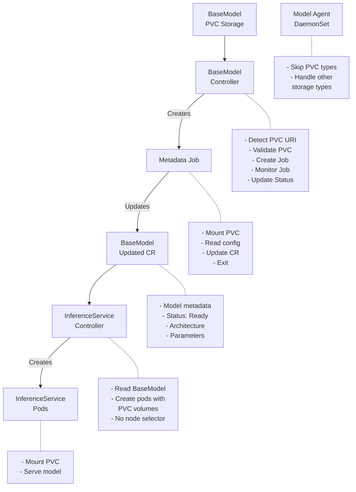

# OEP-0004: PVC Storage Support for BaseModel and ClusterBaseModel

<!-- toc -->
- [Summary](#summary)
- [Motivation](#motivation)
  - [Goals](#goals)
  - [Non-Goals](#non-goals)
- [Proposal](#proposal)
  - [User Stories](#user-stories)
    - [Story 1: Using Models from Existing PVCs](#story-1-using-models-from-existing-pvcs)
    - [Story 2: Shared Model Repository via NFS](#story-2-shared-model-repository-via-nfs)
    - [Story 3: Block Storage Models](#story-3-block-storage-models)
  - [Notes/Constraints/Caveats](#notesconstraintscaveats)
  - [Risks and Mitigations](#risks-and-mitigations)
- [Design Details](#design-details)
  - [Architecture Overview](#architecture-overview)
  - [Component Changes](#component-changes)
    - [Model Agent Changes](#model-agent-changes)
    - [BaseModel Controller Changes](#basemodel-controller-changes)
    - [Metadata Extraction Job](#metadata-extraction-job)
    - [InferenceService Controller Changes](#inferenceservice-controller-changes)
  - [API Changes](#api-changes)
  - [Test Plan](#test-plan)
    - [Unit Tests](#unit-tests)
    - [Integration Tests](#integration-tests)
  - [Graduation Criteria](#graduation-criteria)
- [Implementation History](#implementation-history)
- [Drawbacks](#drawbacks)
- [Alternatives](#alternatives)
<!-- /toc -->

## Summary

This OEP proposes adding PVC (Persistent Volume Claim) storage support to the OME model management system, allowing BaseModel and ClusterBaseModel resources to reference models stored in Kubernetes PVCs. The implementation uses a controller-based approach where the BaseModel controller validates PVC existence and creates Jobs for metadata extraction, while the model agent completely skips PVC storage types. This design enables users to leverage existing models in PVCs without requiring download to host paths, supporting both ReadWriteMany (RWX) and ReadWriteOnce (RWO) access modes.

## Motivation

Currently, OME supports multiple storage backends (OCI Object Storage, HuggingFace, S3, etc.) but requires models to be downloaded to host paths before use. Many organizations already have models stored in PVCs backed by various storage systems (NFS, block storage, CSI drivers). Requiring these models to be re-uploaded to object storage or downloaded to every node creates unnecessary data duplication and operational overhead.

### Goals

1. Enable BaseModel/ClusterBaseModel to reference models stored in PVCs using URI format:
   - BaseModel: `pvc://{pvc-name}/{sub-path}` (PVC in same namespace)
   - ClusterBaseModel: `pvc://{namespace}/{pvc-name}/{sub-path}` (PVC in specified namespace)
2. Support both ReadWriteMany (RWX) and ReadWriteOnce (RWO) access modes appropriately
3. Automatically extract and populate model metadata (architecture, parameters, capabilities) from PVC-stored models
4. Maintain compatibility with existing InferenceService scheduling and deployment mechanisms
5. Provide clear error messages for PVC-related issues (not found, not bound, access conflicts)

### Non-Goals

1. Creating or managing PVCs - users must pre-create PVCs with models
2. Model upload/download to PVCs - this OEP only covers reading existing models
3. PVC provisioning or storage class configuration
4. Cross-namespace PVC access for BaseModel - BaseModel can only access PVCs in its own namespace
5. Supporting PVC storage for model downloads/caching by model agent

## Proposal

Add PVC as a supported storage type with a streamlined approach:

1. **Model Agent**: Skip PVC storage types entirely - no processing required
2. **BaseModel Controller**: Validate PVC existence, create metadata extraction jobs, manage status
3. **Metadata Extraction Job**: Mount PVC, extract metadata, update BaseModel CR
4. **InferenceService Controller**: Mount PVC volumes directly without node selection requirements

### User Stories

#### Story 1: Using Models from Existing PVCs

As a platform engineer, I have large language models already stored in PVCs backed by high-performance storage. I want to create BaseModel resources that reference these PVCs directly without copying the models to object storage, reducing storage costs and eliminating redundant data transfer.

#### Story 2: Shared Model Repository via NFS

As an ML team lead, we maintain a shared model repository on an NFS server exposed as ReadWriteMany PVCs. I want multiple InferenceService pods across different nodes to access the same model simultaneously, enabling efficient resource utilization without model duplication.

#### Story 3: Block Storage Models

As a data scientist, I have models stored on high-performance block storage exposed as ReadWriteOnce PVCs. I want to deploy single-replica inference services that can exclusively mount and use these models with optimal I/O performance.

### Notes/Constraints/Caveats

1. **Model Agent Bypass**: 
   - Model agent ignores PVC storage types completely
   - No node labeling by model agent for PVC storage
   - Scheduling handled by Kubernetes based on PVC accessibility

2. **Controller Responsibilities**:
   - PVC validation happens in BaseModel controller
   - Job creation and monitoring by controller
   - Status updates based on job completion

3. **PVC Access Modes**: 
   - RWX PVCs can be mounted by multiple pods simultaneously
   - RWO PVCs can only be mounted by one pod at a time
   - Kubernetes scheduler handles placement constraints automatically

4. **Metadata Extraction**:
   - Requires creating temporary Jobs to mount PVCs and read config.json
   - Jobs run in the same namespace as the BaseModel
   - Metadata extraction happens once per model

5. **Namespace Handling**:
   - **BaseModel**: PVC must be in the same namespace, URI format: `pvc://{pvc-name}/{sub-path}`
   - **ClusterBaseModel**: PVC namespace must be specified in URI: `pvc://{namespace}/{pvc-name}/{sub-path}`
   - For ClusterBaseModel, metadata extraction jobs are created in the PVC's namespace
   - InferenceService pods will be scheduled in the PVC's namespace for ClusterBaseModel

### Risks and Mitigations

| Risk | Mitigation |
|------|------------|
| **Security**: Jobs mounting PVCs could access sensitive data | Jobs run with minimal RBAC permissions, only read access to specific PVC |
| **Performance**: Metadata extraction jobs add latency | Jobs are created only once per model, results are cached in BaseModel CR |
| **Resource Usage**: Additional jobs consume cluster resources | Jobs are ephemeral with resource limits, cleaned up after completion |
| **PVC Availability**: PVC might be deleted while BaseModel exists | Controller continuously verifies PVC existence, updates status accordingly |
| **Access Conflicts**: RWO PVCs could cause pod scheduling failures | Clear documentation on access modes, appropriate error messages |
| **Model Agent Confusion**: Users expect model agent to handle all storage types | Clear documentation that PVC is handled differently |

## Design Details

### Architecture Overview

The architecture is designed to minimize complexity by having the model agent skip PVC storage entirely, while the BaseModel controller handles all PVC-related operations:



**Key Design Decisions:**

1. **Model Agent Skips PVC**: The model agent (DaemonSet) doesn't process PVC storage because:
   - DaemonSet pods cannot effectively mount PVCs (especially RWO)
   - PVC models don't need to be downloaded or verified on nodes
   - Node labeling is irrelevant for PVC storage

2. **Controller Owns Flow**: The BaseModel controller handles everything:
   - Validates PVC exists and is bound
   - Creates metadata extraction jobs
   - Monitors job completion
   - Updates BaseModel status directly

3. **No Node Labeling**: Unlike downloaded models, PVC models don't need node labels because:
   - Kubernetes scheduler already understands PVC constraints
   - PVCs aren't tied to specific nodes
   - InferenceService pods can run wherever the PVC is accessible

### Component Changes

#### Model Agent Changes

In `pkg/modelagent/gopher.go`, simply skip PVC storage:

```go
func (s *Gopher) downloadModel(ctx context.Context, task *GopherTask, modelInfo *ModelInfo) error {
    // ... existing code ...
    
    storageType, err := storage.GetStorageType(*baseModelSpec.Storage.StorageUri)
    if err != nil {
        return fmt.Errorf("failed to determine storage type: %w", err)
    }
    
    switch storageType {
    case storage.StorageTypePVC:
        // Skip PVC storage - handled by controller
        s.logger.Infof("Skipping PVC storage type for model %s (handled by BaseModel controller)", modelInfo)
        return nil
        
    case storage.StorageTypeOCI:
        // ... existing OCI handling ...
    
    // ... other storage types ...
    }
}
```

#### BaseModel Controller Changes

In `pkg/controller/v1beta1/basemodel/controller.go`, add complete PVC handling:

```go
func (r *BaseModelReconciler) Reconcile(ctx context.Context, req ctrl.Request) (ctrl.Result, error) {
    // ... existing code ...
    
    // Check if this is a PVC storage model
    if r.isPVCStorage(baseModel) {
        return r.reconcilePVCStorage(ctx, baseModel, log)
    }
    
    // For non-PVC storage, use existing ConfigMap-based logic
    if err := r.updateModelStatus(ctx, baseModel); err != nil {
        log.Error(err, "Failed to update BaseModel status")
        return ctrl.Result{RequeueAfter: time.Minute}, err
    }
    
    return ctrl.Result{}, nil
}

func (r *BaseModelReconciler) reconcilePVCStorage(ctx context.Context, baseModel *v1beta1.BaseModel, log logr.Logger) (ctrl.Result, error) {
    // Parse PVC URI
    pvcComponents, err := storage.ParsePVCStorageURI(*baseModel.Spec.Storage.StorageUri)
    if err != nil {
        return r.updateFailedStatus(ctx, baseModel, fmt.Sprintf("Invalid PVC URI: %v", err))
    }
    
    // Determine namespace for PVC
    pvcNamespace := baseModel.Namespace
    if isClusterScoped(baseModel) && pvcComponents.Namespace != "" {
        pvcNamespace = pvcComponents.Namespace
    }
    
    // Validate PVC exists and is bound
    pvc := &corev1.PersistentVolumeClaim{}
    err = r.Get(ctx, types.NamespacedName{
        Namespace: pvcNamespace,
        Name:     pvcComponents.PVCName,
    }, pvc)
    
    if err != nil {
        if errors.IsNotFound(err) {
            return r.updateFailedStatus(ctx, baseModel, fmt.Sprintf("PVC %s not found", pvcComponents.PVCName))
        }
        return ctrl.Result{}, err
    }
    
    if pvc.Status.Phase != corev1.ClaimBound {
        return r.updateFailedStatus(ctx, baseModel, fmt.Sprintf("PVC %s not bound (phase: %s)", pvcComponents.PVCName, pvc.Status.Phase))
    }
    
    // Check if metadata already extracted
    if r.isMetadataComplete(baseModel) {
        return r.updateReadyStatus(ctx, baseModel)
    }
    
    // Create metadata extraction job if needed
    return r.ensureMetadataJob(ctx, baseModel, pvcComponents, pvc, log)
}
```

#### Metadata Extraction Job

Create `cmd/ome-agent/model_metadata_agent.go`:

```go
type ModelMetadataAgent struct {
    k8sClient client.Client
    logger    *zap.Logger
}

func (m *ModelMetadataAgent) Start() error {
    modelPath := m.viper.GetString("model-path")
    baseModelName := m.viper.GetString("basemodel-name")
    baseModelNamespace := m.viper.GetString("basemodel-namespace")
    
    // Extract model configuration
    config, err := m.extractModelConfig(modelPath)
    if err != nil {
        return fmt.Errorf("failed to extract model config: %w", err)
    }
    
    // Update BaseModel CR with metadata
    ctx := context.Background()
    return m.updateBaseModel(ctx, baseModelNamespace, baseModelName, config)
}
```

#### InferenceService Controller Changes

In `pkg/controller/v1beta1/inferenceservice/components/base.go`:

```go
// UpdatePodSpecVolumes - handle PVC storage type
func UpdatePodSpecVolumes(b *BaseComponentFields, isvc *v1beta1.InferenceService, podSpec *corev1.PodSpec, objectMeta *metav1.ObjectMeta) {
    if b.BaseModel != nil && b.BaseModel.Storage != nil {
        storageType, _ := storage.GetStorageType(*b.BaseModel.Storage.StorageUri)
        
        if storageType == storage.StorageTypePVC {
            pvcComponents, _ := storage.ParsePVCStorageURI(*b.BaseModel.Storage.StorageUri)
            
            modelVolume := corev1.Volume{
                Name: b.BaseModelMeta.Name,
                VolumeSource: corev1.VolumeSource{
                    PersistentVolumeClaim: &corev1.PersistentVolumeClaimVolumeSource{
                        ClaimName: pvcComponents.PVCName,
                        ReadOnly:  true,
                    },
                },
            }
            podSpec.Volumes = append(podSpec.Volumes, modelVolume)
            
            // Set model path for volume mounts
            modelPath := constants.ModelDefaultMountPath
            b.BaseModel.Storage.Path = &modelPath
        } else if b.BaseModel.Storage.Path != nil {
            // Existing host path logic for downloaded models
            // ...
        }
    }
}

// UpdatePodSpecNodeSelector - skip node selector for PVC storage
func UpdatePodSpecNodeSelector(b *BaseComponentFields, isvc *v1beta1.InferenceService, podSpec *corev1.PodSpec) {
    if b.BaseModel == nil || b.BaseModelMeta == nil {
        return
    }
    
    // Check storage type
    if b.BaseModel.Storage != nil && b.BaseModel.Storage.StorageUri != nil {
        storageType, _ := storage.GetStorageType(*b.BaseModel.Storage.StorageUri)
        
        if storageType == storage.StorageTypePVC {
            // Skip node selector for PVC storage
            b.Log.Info("Using PVC storage, skipping node selector",
                "inferenceService", isvc.Name, 
                "storageUri", *b.BaseModel.Storage.StorageUri)
            return
        }
    }
    
    // Existing node selector logic for downloaded models
    // ...
}
```

### API Changes

No changes to the BaseModel/ClusterBaseModel API. The existing `storage.storageUri` field supports the new PVC URI formats:

**BaseModel Example (PVC in same namespace):**
```yaml
apiVersion: ome.io/v1beta1
kind: BaseModel
metadata:
  name: llama2-7b-pvc
  namespace: models
spec:
  storage:
    storageUri: "pvc://model-storage-pvc/models/llama2-7b"
  modelFormat:
    name: llama
```

**ClusterBaseModel Example (PVC in specified namespace):**
```yaml
apiVersion: ome.io/v1beta1
kind: ClusterBaseModel
metadata:
  name: llama2-7b-shared
spec:
  storage:
    storageUri: "pvc://model-storage/model-storage-pvc/models/llama2-7b"
    # Format: pvc://{namespace}/{pvc-name}/{sub-path}
  modelFormat:
    name: llama
```

### Test Plan

#### Unit Tests

- `pkg/utils/storage/storage_test.go`: Test PVC URI parsing and validation
- `pkg/modelagent/gopher_test.go`: Test PVC storage type skipping
- `pkg/controller/v1beta1/basemodel/controller_test.go`: Test PVC validation and job creation
- `cmd/ome-agent/model_metadata_agent_test.go`: Test metadata extraction logic

#### Integration Tests

1. **PVC Storage Flow**: Create BaseModel with PVC storage, verify controller creates job and updates status
2. **Metadata Extraction**: Verify job creation and successful metadata population
3. **InferenceService Deployment**: Deploy inference service with PVC model, verify pod scheduling
4. **Access Mode Handling**: Test both RWX and RWO PVC scenarios
5. **Error Cases**: Test with non-existent PVC, unbound PVC, invalid paths

### Graduation Criteria

**Alpha**:
- Basic PVC storage support implemented
- Controller validates PVC and creates jobs
- Manual metadata specification supported

**Beta**:
- Automatic metadata extraction via jobs
- Comprehensive error handling
- Documentation and examples

**Stable**:
- Production usage validation
- Performance optimization
- Multi-namespace support consideration

## Implementation History

- 2024-12-XX: Initial OEP proposal
- TBD: Implementation started
- TBD: Alpha release
- TBD: Beta release
- TBD: GA release

## Drawbacks

1. **Different Flow**: PVC storage has a completely different flow than other storage types
2. **Controller Complexity**: More logic in the BaseModel controller
3. **Job Management**: Need to handle job lifecycle and cleanup
4. **Debugging Complexity**: More components involved in the model lifecycle

## Alternatives

1. **Model Agent Handles Everything**: 
   - Rejected: DaemonSet can't effectively mount PVCs, especially RWO
   - Would require complex coordination between model agents

2. **Init Container Approach**: Use init containers in InferenceService pods to extract metadata
   - Rejected: Would run for every pod, not just once per model

3. **Require Pre-populated Metadata**: Make users specify all metadata manually
   - Rejected: Poor user experience, error-prone

4. **Separate Metadata Service**: Dedicated service for metadata extraction
   - Rejected: Over-engineered for this use case

5. **Webhook-based Validation**: Validate PVC in admission webhook
   - Rejected: Doesn't solve metadata extraction problem