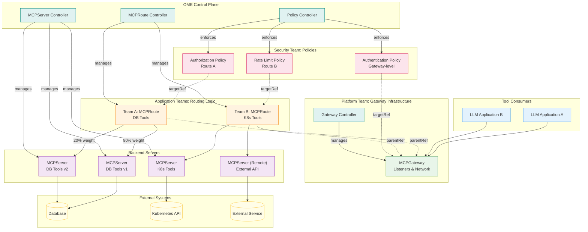

# OEP-0005: Model Context Protocol (MCP) Support with Gateway API Pattern

<!--
This OEP introduces comprehensive support for the Model Context Protocol (MCP) in OME,
following the Kubernetes Gateway API pattern with separate resources for gateway infrastructure
(MCPGateway), routing logic (MCPRoute), and policies (MCPAuthenticationPolicy, etc.).
This design enables Large Language Models to integrate with external tools and services
through a secure, scalable, and multi-tenant gateway infrastructure that follows industry
standards and best practices.
-->

<!-- toc -->
- [Summary](#summary)
- [Motivation](#motivation)
  - [Goals](#goals)
  - [Non-Goals](#non-goals)
- [Proposal](#proposal)
  - [User Stories](#user-stories)
    - [Story 1: Platform Team Deploying Shared Gateway Infrastructure](#story-1-platform-team-deploying-shared-gateway-infrastructure)
    - [Story 2: Application Team Creating Routes to Backend Servers](#story-2-application-team-creating-routes-to-backend-servers)
    - [Story 3: Security Team Attaching Policies for Authentication and Rate Limiting](#story-3-security-team-attaching-policies-for-authentication-and-rate-limiting)
  - [Notes/Constraints/Caveats](#notesconstraintscaveats)
  - [Risks and Mitigations](#risks-and-mitigations)
- [Design Details](#design-details)
  - [API Specifications](#api-specifications)
    - [MCPServer Resource](#mcpserver-resource)
    - [MCPGateway Resource](#mcpgateway-resource)
    - [MCPRoute Resource](#mcproute-resource)
    - [Policy Resources](#policy-resources)
  - [Architecture Overview](#architecture-overview)
    - [Component Interaction](#component-interaction)
    - [Request Flow](#request-flow)
  - [Security Model](#security-model)
  - [Deployment Patterns](#deployment-patterns)
    - [Pattern 1: Shared Gateway with Multi-Tenant Routes](#pattern-1-shared-gateway-with-multi-tenant-routes)
    - [Pattern 2: Cross-Namespace Routing with ReferenceGrant](#pattern-2-cross-namespace-routing-with-referencegrant)
    - [Pattern 3: Canary Deployment with Traffic Splitting](#pattern-3-canary-deployment-with-traffic-splitting)
    - [Pattern 4: Tool-Based Routing with Advanced Matching](#pattern-4-tool-based-routing-with-advanced-matching)
    - [Pattern 5: Remote Server Integration with Policies](#pattern-5-remote-server-integration-with-policies)
  - [Test Plan](#test-plan)
    - [Unit Tests](#unit-tests)
    - [Integration Tests](#integration-tests)
- [Drawbacks](#drawbacks)
<!-- /toc -->

## Summary

This OEP introduces native support for the Model Context Protocol (MCP) in OME following the **Kubernetes Gateway API pattern** with three architectural layers:

1. **`MCPServer`**: Defines and manages the lifecycle of individual MCP tool servers, whether hosted within the cluster or external remote services.

2. **`MCPGateway`**: Defines gateway infrastructure and listener configuration. Acts as the entry point for MCP traffic, similar to gateway.networking.k8s.io/v1 Gateway. Typically managed by platform teams.

3. **`MCPRoute`**: Defines routing rules for MCP traffic, including server selection, traffic splitting, and request matching. Attaches to MCPGateway via parentRefs, similar to HTTPRoute in Gateway API. Managed by application teams.

4. **Policy CRDs**: Separate policy resources (`MCPAuthenticationPolicy`, `MCPAuthorizationPolicy`, `MCPRateLimitPolicy`, `MCPSecurityPolicy`) that attach to Gateway or Route resources via targetRef pattern, following GEP-713 Policy Attachment.

This separation provides:
- **Clear Ownership**: Platform teams manage gateway infrastructure, application teams manage routing, security teams manage policies
- **Multi-tenancy**: Multiple teams share one gateway with isolated routes and policies
- **Industry Standard**: Follows Kubernetes Gateway API patterns used by Kong, Istio, and Envoy Gateway
- **Flexible RBAC**: Different permission levels for gateway, route, and policy management

## Motivation

Modern AI applications increasingly require LLMs to interact with external systems beyond simple text generation. Use cases include:

-   **Data Analysis**: LLMs querying databases, accessing APIs, and processing files to provide insights.
-   **Infrastructure Management**: AI agents managing cloud resources, deployments, and monitoring systems.
-   **Business Process Automation**: Models performing complex workflows involving multiple systems.
-   **Research and Development**: AI assistants with access to specialized tools and datasets.

Currently, integrating LLMs with external tools requires custom implementations for each service, leading to fragmentation, security complexities, and high operational overhead. The Model Context Protocol (MCP) provides a standard interface, but enterprises need a robust framework for managing and consuming these tool servers securely and at scale. This OEP addresses that need.

### Goals

1.  **Multi-Layer Architecture**: Provide separate CRDs for server definition (`MCPServer`), gateway infrastructure (`MCPGateway`), routing logic (`MCPRoute`), and policies.
2.  **Flexible Server Definition**: Support both in-cluster `Hosted` servers using a native `PodTemplateSpec` and `Remote` external servers.
3.  **Gateway-Centric Consumption**: Establish the `MCPGateway` as the primary, secure entry point for all MCP tool traffic.
4.  **Dynamic Server Discovery**: Enable routes to dynamically discover and select `MCPServer`s using label selectors.
5.  **Advanced Security Model**: Implement a granular permission model for `MCPServer`s, including access to Kubernetes resources, with policy attachment for authentication/authorization.
6.  **Rich Network Configuration**: Offer comprehensive options for service exposure, transport protocols, and ingress.
7.  **Developer Experience**: Provide intuitive and idiomatic Kubernetes APIs with strong validation and sensible defaults.
8.  **Gateway/Route Separation**: Clearly separate gateway infrastructure (MCPGateway) from routing logic (MCPRoute) following Gateway API patterns
9.  **Policy Attachment Pattern**: Implement GEP-713 Policy Attachment with separate policy CRDs using targetRef
10. **Multi-tenancy by Design**: Enable multiple teams to share gateway infrastructure with namespace-level isolation
11. **Industry Alignment**: Follow patterns established by Kong Gateway, Istio Gateway, and Envoy Gateway

### Non-Goals

1.  **MCP Protocol Implementation**: This OEP focuses on deployment and orchestration, not on building an MCP protocol library.
2.  **Custom Tool Development**: Building domain-specific MCP tools is outside the scope.
3.  **Legacy Protocol Support**: The focus is on the standardized MCP interface, not proprietary protocols.

## Proposal

We will introduce four primary CRD types following the Kubernetes Gateway API pattern: `MCPServer`, `MCPGateway`, `MCPRoute`, and policy resources.

### `MCPServer`: The Tool Provider

This CRD defines a single MCP tool server. The `spec` clearly distinguishes between two types of servers:

-   **`hosted`**: For servers running inside the cluster. It contains a `podSpec` of type `corev1.PodTemplateSpec`, allowing users to define the server's workload using the full power of Kubernetes pod specifications.
-   **`remote`**: For servers running outside the cluster, specified by a simple `url`.

The `MCPServer` spec also defines the server's capabilities, transport protocol, and a powerful `permissionProfile` for controlling access to Kubernetes resources and outbound network traffic.

### `MCPGateway`: The Gateway Infrastructure

This CRD defines gateway infrastructure and listener configuration, similar to `gateway.networking.k8s.io/v1` Gateway. Its core responsibilities are:

-   **Listener Definition**: Defines listeners with protocol (HTTP/gRPC/WebSocket), port, and TLS configuration
-   **Network Exposure**: Controls how the gateway is exposed via Service and addresses
-   **Gateway Class**: References a GatewayClass that determines the controller implementation
-   **Route Attachment**: Allows MCPRoute resources to attach via parentRefs

Typically managed by platform teams who control infrastructure.

### `MCPRoute`: The Routing Logic

This CRD defines routing rules for MCP traffic, similar to HTTPRoute in Gateway API. Its core responsibilities are:

-   **Gateway Attachment**: Attaches to one or more MCPGateways via parentRefs, enabling cross-namespace routing with ReferenceGrant
-   **Server Selection**: Selects backend MCPServers via backendRefs with optional namespace and weight for traffic splitting
-   **Traffic Matching**: Matches requests based on MCP tool names, methods, and headers
-   **Request Processing**: Applies filters for header manipulation, request transformation, etc.

Typically managed by application teams who control routing logic.

### Policy Resources: Separate Security and Traffic Management

Following GEP-713 Policy Attachment, security and traffic policies are separate CRDs that attach to Gateway or Route resources:

-   **`MCPAuthenticationPolicy`**: OIDC, JWT, API key authentication
-   **`MCPAuthorizationPolicy`**: Role-based and attribute-based authorization
-   **`MCPRateLimitPolicy`**: Request rate limiting and throttling
-   **`MCPSecurityPolicy`**: TLS, CORS, security headers

Typically managed by security teams with dedicated RBAC permissions.

This separation ensures tool consumers interact with a stable gateway endpoint, application teams control routing independently, and security policies are managed centrally by security teams.

### User Stories

#### Story 1: Platform Team Deploying Shared Gateway Infrastructure

Alice is a platform engineer responsible for setting up shared infrastructure. She creates an MCPGateway with listeners and grants access to application teams via ReferenceGrant.

```yaml
# 1. Platform team creates a shared gateway with listeners
apiVersion: ome.io/v1alpha1
kind: MCPGateway
metadata:
  name: shared-mcp-gateway
  namespace: platform-infra
spec:
  gatewayClassName: ome-gateway
  listeners:
  - name: http
    protocol: HTTP
    port: 8080
  - name: grpc
    protocol: GRPC
    port: 9090
    tls:
      mode: Terminate
      certificateRefs:
      - name: gateway-tls-cert
  addresses:
  - type: IPAddress
    value: "10.0.0.100"

---
# 2. Grant permission for application namespaces to attach routes
apiVersion: gateway.networking.k8s.io/v1beta1
kind: ReferenceGrant
metadata:
  name: allow-app-routes
  namespace: platform-infra
spec:
  from:
  - group: ome.io
    kind: MCPRoute
    namespace: team-data-science
  - group: ome.io
    kind: MCPRoute
    namespace: team-ml-ops
  to:
  - group: ome.io
    kind: MCPGateway
    name: shared-mcp-gateway
```

Now multiple application teams can create MCPRoutes that reference this gateway, enabling multi-tenant usage with centralized infrastructure management.

#### Story 2: Application Team Creating Routes to Backend Servers

Bob is a data scientist on the data-science team. He deploys his database tool servers and creates an MCPRoute that attaches to the platform team's shared gateway.

```yaml
# 1. Deploy MCPServers for database tools
apiVersion: ome.io/v1alpha1
kind: MCPServer
metadata:
  name: postgres-tool-v1
  namespace: team-data-science
  labels:
    app: db-tools
    version: v1
spec:
  transport: streamable-http
  hosted:
    replicas: 2
    podSpec:
      spec:
        containers:
        - name: mcp-server
          image: my-registry/postgres-mcp:1.0.0
          env:
          - name: DATABASE_URI
            valueFrom:
              secretKeyRef:
                name: db-credentials
                key: uri
  permissionProfile:
    inline:
      allow:
      - network:
          allowHost:
          - "postgres.team-data-science.svc.cluster.local"

---
apiVersion: ome.io/v1alpha1
kind: MCPServer
metadata:
  name: postgres-tool-v2
  namespace: team-data-science
  labels:
    app: db-tools
    version: v2
spec:
  transport: streamable-http
  hosted:
    replicas: 1
    podSpec:
      spec:
        containers:
        - name: mcp-server
          image: my-registry/postgres-mcp:2.0.0
          env:
          - name: DATABASE_URI
            valueFrom:
              secretKeyRef:
                name: db-credentials
                key: uri
  permissionProfile:
    inline:
      allow:
      - network:
          allowHost:
          - "postgres.team-data-science.svc.cluster.local"

---
# 2. Create MCPRoute that attaches to platform gateway (cross-namespace)
apiVersion: ome.io/v1alpha1
kind: MCPRoute
metadata:
  name: db-tools-route
  namespace: team-data-science
spec:
  # Attach to platform team's gateway in different namespace
  parentRefs:
  - name: shared-mcp-gateway
    namespace: platform-infra
    sectionName: http  # Attach to specific listener
  # Route rules for traffic management
  rules:
  - matches:
    - tools: ["db_query", "db_execute", "db_*"]  # Wildcard matching
      method: "tools/call"
    # Canary deployment: 80% v1, 20% v2
    backendRefs:
    - name: postgres-tool-v1
      weight: 80
    - name: postgres-tool-v2
      weight: 20
    timeouts:
      request: 30s
```

Bob's team now has full control over their routing logic (server selection, traffic splits, matching rules) while using the platform team's shared gateway infrastructure. They can perform canary deployments without platform team involvement.

#### Story 3: Security Team Attaching Policies for Authentication and Rate Limiting

Carol is a security engineer responsible for enforcing authentication and rate limiting across all MCP traffic. She creates policies that attach to the gateway (global enforcement) and specific routes (per-team customization).

```yaml
# 1. Global authentication policy attached to gateway
apiVersion: ome.io/v1alpha1
kind: MCPAuthenticationPolicy
metadata:
  name: gateway-auth
  namespace: platform-infra
spec:
  targetRef:
    group: ome.io
    kind: MCPGateway
    name: shared-mcp-gateway
  oidc:
    issuer: "https://auth.company.com"
    clientID: "mcp-gateway-client"
    clientSecretRef:
      name: oidc-client-secret
      key: client-secret
    scopes: ["openid", "profile", "mcp:tools"]
  jwt:
    audiences: ["mcp-api"]
    jwksURI: "https://auth.company.com/.well-known/jwks.json"

---
# 2. Authorization policy for data-science team route
apiVersion: ome.io/v1alpha1
kind: MCPAuthorizationPolicy
metadata:
  name: db-tools-authz
  namespace: team-data-science
spec:
  targetRef:
    group: ome.io
    kind: MCPRoute
    name: db-tools-route
  rules:
  - principals:
    - "group:data-scientists"
    - "group:ml-engineers"
    permissions:
    - tools: ["db_query"]
      actions: ["read"]
  - principals:
    - "group:db-admins"
    permissions:
    - tools: ["db_*"]
      actions: ["read", "write"]

---
# 3. Rate limit policy per team
apiVersion: ome.io/v1alpha1
kind: MCPRateLimitPolicy
metadata:
  name: data-science-rate-limit
  namespace: team-data-science
spec:
  targetRef:
    group: ome.io
    kind: MCPRoute
    name: db-tools-route
  limits:
  - dimension: user
    requests: 1000
    unit: hour
  - dimension: ip
    requests: 100
    unit: minute
  - dimension: tool
    tools: ["db_execute"]
    requests: 10
    unit: minute

---
# 4. Security headers policy at gateway level
apiVersion: ome.io/v1alpha1
kind: MCPSecurityPolicy
metadata:
  name: gateway-security
  namespace: platform-infra
spec:
  targetRef:
    group: ome.io
    kind: MCPGateway
    name: shared-mcp-gateway
  cors:
    allowOrigins:
    - "https://*.company.com"
    allowMethods:
    - "POST"
    - "OPTIONS"
    allowHeaders:
    - "Authorization"
    - "Content-Type"
    maxAge: 3600
  headers:
    set:
      "X-Frame-Options": "DENY"
      "X-Content-Type-Options": "nosniff"
      "Strict-Transport-Security": "max-age=31536000"
```

Carol can now enforce authentication globally at the gateway level, while individual teams can customize authorization and rate limiting for their specific routes. The security team maintains control through dedicated policy resources with separate RBAC permissions.

### Notes/Constraints/Caveats

1.  **Hosted Server Container Name**: When using a `hosted` `MCPServer`, the container running the MCP server process within the `podSpec` must be named `mcp-server` for the controller to correctly inject configurations.
2.  **Permissions**: The `permissionProfile` with `kubeResources` is very powerful. Misconfiguration can create security risks. The controller creates `Roles`/`RoleBindings`, so RBAC must be enabled in the cluster.
3.  **Gateway API Pattern**: This design follows Kubernetes Gateway API patterns with clear separation between Gateway (infrastructure), Route (routing logic), and Policy (security/traffic management). Platform teams manage gateways, application teams manage routes, and security teams manage policies.
4.  **Cross-Namespace Access**: MCPRoutes can reference MCPGateways in different namespaces via ReferenceGrant, enabling centralized gateway management with distributed route ownership.
5.  **Policy Precedence**: When multiple policies target the same resource, route-level policies override gateway-level policies. Among policies of the same type targeting the same resource, the oldest policy takes precedence.
6.  **Transport Limitations**: `stdio` transport is only suitable for simple, single-shot tools and does not support scaling beyond one replica. `streamable-http` or `sse` are recommended for production.
7.  **Observability**: The gateway follows Kubernetes-native observability patterns:
  - Health checks via standard K8s probes
  - Metrics via Prometheus annotations
  - Tracing via service mesh/OpenTelemetry
  - Logging via stdout/stderr

### Risks and Mitigations

-   **Risk 1: Over-privileged Tool Servers**: The `kubeResources` permission could grant excessive permissions.
    -   **Mitigation**: The API is declarative. All permissions are explicitly defined in the YAML and auditable. The controller generates narrowly scoped `Roles`. Documentation will strongly emphasize the principle of least privilege.
-   **Risk 2: Gateway as a Single Point of Failure**: If the gateway goes down, all tool access is lost.
    -   **Mitigation**: The `MCPGateway` spec supports `replicas`, allowing for highly available deployments. Standard Kubernetes practices for HA (e.g., Pod anti-affinity) can be applied via the `podSpec`.
-   **Risk 3: Complex Configuration**: The new specs, especially `MCPGateway`'s network config and `MCPServer`'s `podSpec`, add complexity.
    -   **Mitigation**: The API will have sensible defaults. We will provide comprehensive documentation, examples, and user guides for common patterns.

## Design Details

### API Specifications

#### MCPServer Resource

The `MCPServer` CRD defines a tool server. Its `spec` is the core of the definition.

**`MCPServerSpec`**

```go
// MCPServerSpec defines the desired state of an MCPServer.
// An MCPServer can either be 'Hosted' within the cluster or a 'Remote' external service.
// +kubebuilder:validation:XValidation:rule="has(self.hosted) || has(self.remote)", message="either hosted or remote must be specified"
// +kubebuilder:validation:XValidation:rule="!(has(self.hosted) && has(self.remote))", message="hosted and remote are mutually exclusive"
type MCPServerSpec struct {
	// Hosted defines a server that runs as pods within the cluster.
	// +optional
	Hosted *HostedMCPServer `json:"hosted,omitempty"`

	// Remote defines a server that is accessed via an external URL.
	// +optional
	Remote *RemoteMCPServer `json:"remote,omitempty"`

	// Transport specifies the transport protocol for MCP communication.
	// +kubebuilder:default=stdio
	// +optional
	Transport MCPTransportType `json:"transport,omitempty"`

	// Capabilities defines the features supported by this server.
	// +optional
	Capabilities *MCPCapabilities `json:"capabilities,omitempty"`

	// Version of the MCP server software.
	// +optional
	Version string `json:"version,omitempty"`

	// PermissionProfile defines the operational permissions for the server.
	// +optional
	PermissionProfile *PermissionProfileSource `json:"permissionProfile,omitempty"`

	// ToolsFilter restricts the tools exposed by this server.
	// +optional
	// +listType=set
	ToolsFilter []string `json:"toolsFilter,omitempty"`
}

// Note: Authentication and authorization are now handled via separate policy CRDs
// (MCPAuthenticationPolicy, MCPAuthorizationPolicy) that attach to MCPGateway or MCPRoute resources.
```

-   **`hosted` vs `remote`**: The spec enforces that exactly one of these is set.
-   **`HostedMCPServer`**:
    ```go
    type HostedMCPServer struct {
        // PodSpec defines the pod template to use for the MCP server.
        PodSpec corev1.PodTemplateSpec `json:"podSpec"`

        // Replicas is the number of desired replicas for the server.
        // +kubebuilder:validation:Minimum=0
        // +kubebuilder:default=1
        // +optional
        Replicas *int32 `json:"replicas,omitempty"`
    }
    ```
    This structure delegates all pod-level configuration to the standard `PodTemplateSpec`, making it incredibly flexible and familiar to Kubernetes users.
-   **`RemoteMCPServer`**:
    ```go
    type RemoteMCPServer struct {
        // URL is the external URL of the remote MCP server.
        // +kubebuilder:validation:Pattern=`^https?://.*`
        URL string `json:"url"`
    }
    ```
-   **`PermissionProfileSource`**: This defines the permissions for a `Hosted` server.
    ```go
    // +kubebuilder:validation:XValidation:rule="(has(self.builtin) + has(self.configMap) + has(self.inline)) <= 1",message="at most one of builtin, configMap, or inline can be set"
    type PermissionProfileSource struct {
        Builtin   *BuiltinPermissionProfile      `json:"builtin,omitempty"`
        ConfigMap *corev1.ConfigMapKeySelector   `json:"configMap,omitempty"`
        Inline    *PermissionProfileSpec         `json:"inline,omitempty"`
    }

    type PermissionProfileSpec struct {
        // Allow specifies the permissions granted to the server.
        // +listType=atomic
        Allow []PermissionRule `json:"allow"`
    }

    type PermissionRule struct {
        KubeResources *KubeResourcePermission `json:"kubeResources,omitempty"`
        Network       *NetworkPermission      `json:"network,omitempty"`
    }
    ```
    The most powerful feature here is `KubeResourcePermission`, which allows granting fine-grained RBAC permissions to the server's pod.
    ```go
    type KubeResourcePermission struct {
        APIGroups []string `json:"apiGroups"`
        Resources []string `json:"resources"`
        Verbs     []string `json:"verbs"`
    }
    ```

#### MCPGateway Resource

The `MCPGateway` CRD defines gateway infrastructure and listeners, following the Kubernetes Gateway API pattern.

**`MCPGatewaySpec`**

```go
// MCPGatewaySpec defines the desired state of MCPGateway.
// MCPGateway provides infrastructure for MCP traffic, defining listeners
// and network exposure. Routing logic is defined separately in MCPRoute resources.
type MCPGatewaySpec struct {
	// GatewayClassName references a GatewayClass resource that defines the
	// controller implementation.
	// +kubebuilder:validation:Required
	GatewayClassName string `json:"gatewayClassName"`

	// Listeners define the ports and protocols this gateway accepts.
	// +kubebuilder:validation:MinItems=1
	// +kubebuilder:validation:MaxItems=64
	Listeners []Listener `json:"listeners"`

	// Addresses requested for this Gateway (optional, auto-assigned if not specified).
	// +optional
	Addresses []GatewayAddress `json:"addresses,omitempty"`
}

type Listener struct {
	// Name is the unique name of this listener.
	// +kubebuilder:validation:Required
	// +kubebuilder:validation:MinLength=1
	// +kubebuilder:validation:MaxLength=253
	Name string `json:"name"`

	// Protocol is the MCP transport protocol for this listener.
	// +kubebuilder:validation:Enum=HTTP;GRPC;WebSocket
	// +kubebuilder:default=HTTP
	Protocol ProtocolType `json:"protocol"`

	// Port is the network port.
	// +kubebuilder:validation:Minimum=1
	// +kubebuilder:validation:Maximum=65535
	Port int32 `json:"port"`

	// TLS defines TLS configuration for this listener.
	// +optional
	TLS *GatewayTLSConfig `json:"tls,omitempty"`

	// AllowedRoutes defines which Routes may attach to this listener.
	// +optional
	AllowedRoutes *AllowedRoutes `json:"allowedRoutes,omitempty"`
}

type GatewayAddress struct {
	// Type of the address.
	// +kubebuilder:validation:Enum=IPAddress;Hostname
	Type string `json:"type"`

	// Value of the address (IP or hostname).
	// +kubebuilder:validation:Required
	Value string `json:"value"`
}

type GatewayTLSConfig struct {
	// Mode defines the TLS behavior for the listener.
	// +kubebuilder:validation:Enum=Terminate;Passthrough
	// +kubebuilder:default=Terminate
	Mode string `json:"mode"`

	// CertificateRefs references Secrets containing TLS certificates.
	// +optional
	// +kubebuilder:validation:MaxItems=64
	CertificateRefs []SecretObjectReference `json:"certificateRefs,omitempty"`
}

type AllowedRoutes struct {
	// Namespaces indicates namespaces from which Routes may attach.
	// +optional
	Namespaces *RouteNamespaces `json:"namespaces,omitempty"`

	// Kinds specifies the kinds of Routes that may attach.
	// +optional
	// +kubebuilder:validation:MaxItems=8
	Kinds []RouteGroupKind `json:"kinds,omitempty"`
}

type RouteNamespaces struct {
	// From indicates where Routes should be selected from.
	// +kubebuilder:validation:Enum=All;Same;Selector
	// +kubebuilder:default=Same
	From string `json:"from"`

	// Selector matches namespaces using label selector.
	// +optional
	Selector *metav1.LabelSelector `json:"selector,omitempty"`
}
```

#### MCPRoute Resource

The `MCPRoute` CRD defines routing rules for MCP traffic, similar to HTTPRoute in Gateway API.

**`MCPRouteSpec`**

```go
// MCPRouteSpec defines routing rules for MCP traffic.
// MCPRoute attaches to MCPGateway(s) and selects backend MCPServer(s).
type MCPRouteSpec struct {
	// ParentRefs references the Gateway(s) this Route attaches to.
	// +kubebuilder:validation:MinItems=1
	// +kubebuilder:validation:MaxItems=32
	ParentRefs []ParentReference `json:"parentRefs"`

	// Hostnames defines hostname matching for this route (optional for MCP).
	// +optional
	// +kubebuilder:validation:MaxItems=16
	Hostnames []string `json:"hostnames,omitempty"`

	// Rules defines routing rules for this route.
	// +optional
	// +kubebuilder:validation:MaxItems=16
	Rules []MCPRouteRule `json:"rules,omitempty"`
}

type ParentReference struct {
	// Group is the group of the parent resource.
	// +kubebuilder:default="ome.io"
	// +optional
	Group *string `json:"group,omitempty"`

	// Kind is the kind of the parent resource.
	// +kubebuilder:default="MCPGateway"
	// +optional
	Kind *string `json:"kind,omitempty"`

	// Name is the name of the parent resource.
	// +kubebuilder:validation:Required
	Name string `json:"name"`

	// Namespace is the namespace of the parent resource.
	// +optional
	Namespace *string `json:"namespace,omitempty"`

	// SectionName is the listener name to attach to (optional).
	// +optional
	SectionName *string `json:"sectionName,omitempty"`
}

type MCPRouteRule struct {
	// Matches define conditions for this rule.
	// +optional
	// +kubebuilder:validation:MaxItems=8
	Matches []MCPRouteMatch `json:"matches,omitempty"`

	// Filters define processing steps for matched requests.
	// +optional
	// +kubebuilder:validation:MaxItems=16
	Filters []MCPRouteFilter `json:"filters,omitempty"`

	// BackendRefs defines the backend MCPServers.
	// +kubebuilder:validation:MinItems=1
	// +kubebuilder:validation:MaxItems=16
	BackendRefs []MCPBackendRef `json:"backendRefs"`

	// Timeouts defines request timeout configuration.
	// +optional
	Timeouts *MCPRouteTimeouts `json:"timeouts,omitempty"`
}

type MCPRouteMatch struct {
	// Tools matches based on MCP tool names.
	// Supports wildcards: ["*"] matches all, ["db_*"] matches db_query, db_exec, etc.
	// +optional
	Tools []string `json:"tools,omitempty"`

	// Method matches based on MCP protocol method.
	// +optional
	// +kubebuilder:validation:Enum=tools/call;tools/list;resources/read;resources/list;prompts/get;prompts/list
	Method *string `json:"method,omitempty"`

	// Headers matches based on request headers.
	// +optional
	// +kubebuilder:validation:MaxItems=16
	Headers []HeaderMatch `json:"headers,omitempty"`
}

type HeaderMatch struct {
	// Type specifies how to match the header value.
	// +kubebuilder:validation:Enum=Exact;RegularExpression
	// +kubebuilder:default=Exact
	Type string `json:"type"`

	// Name is the header name.
	// +kubebuilder:validation:Required
	Name string `json:"name"`

	// Value is the header value to match.
	// +kubebuilder:validation:Required
	Value string `json:"value"`
}

type MCPRouteFilter struct {
	// Type identifies the filter type.
	// +kubebuilder:validation:Enum=RequestHeaderModifier;ResponseHeaderModifier;RequestMirror
	Type string `json:"type"`

	// RequestHeaderModifier modifies request headers.
	// +optional
	RequestHeaderModifier *HeaderModifier `json:"requestHeaderModifier,omitempty"`

	// ResponseHeaderModifier modifies response headers.
	// +optional
	ResponseHeaderModifier *HeaderModifier `json:"responseHeaderModifier,omitempty"`
}

type HeaderModifier struct {
	// Set overwrites request headers.
	// +optional
	// +kubebuilder:validation:MaxItems=16
	Set []Header `json:"set,omitempty"`

	// Add adds request headers.
	// +optional
	// +kubebuilder:validation:MaxItems=16
	Add []Header `json:"add,omitempty"`

	// Remove removes request headers.
	// +optional
	// +kubebuilder:validation:MaxItems=16
	Remove []string `json:"remove,omitempty"`
}

type MCPBackendRef struct {
	// Name is the name of the MCPServer resource.
	// +kubebuilder:validation:Required
	Name string `json:"name"`

	// Namespace is the namespace of the MCPServer (optional, defaults to route namespace).
	// +optional
	Namespace *string `json:"namespace,omitempty"`

	// Weight defines traffic split weight (default: 1).
	// +kubebuilder:validation:Minimum=0
	// +kubebuilder:default=1
	// +optional
	Weight *int32 `json:"weight,omitempty"`
}

type MCPRouteTimeouts struct {
	// Request timeout for this route.
	// +optional
	Request *metav1.Duration `json:"request,omitempty"`

	// BackendRequest timeout for backend requests.
	// +optional
	BackendRequest *metav1.Duration `json:"backendRequest,omitempty"`
}
```

#### Policy Resources

Following GEP-713 Policy Attachment, policies are separate CRDs that attach to Gateway or Route resources via `targetRef`.

**`MCPAuthenticationPolicy`**

```go
// MCPAuthenticationPolicy defines authentication requirements for MCP traffic.
type MCPAuthenticationPolicySpec struct {
	// TargetRef identifies the Gateway or Route to which this policy applies.
	// +kubebuilder:validation:Required
	TargetRef PolicyTargetReference `json:"targetRef"`

	// OIDC defines OpenID Connect authentication.
	// +optional
	OIDC *OIDCAuthentication `json:"oidc,omitempty"`

	// JWT defines JWT token authentication.
	// +optional
	JWT *JWTAuthentication `json:"jwt,omitempty"`

	// APIKey defines API key authentication.
	// +optional
	APIKey *APIKeyAuthentication `json:"apiKey,omitempty"`
}

type PolicyTargetReference struct {
	// Group is the group of the target resource.
	// +kubebuilder:validation:Required
	Group string `json:"group"`

	// Kind is the kind of the target resource.
	// +kubebuilder:validation:Enum=MCPGateway;MCPRoute
	// +kubebuilder:validation:Required
	Kind string `json:"kind"`

	// Name is the name of the target resource.
	// +kubebuilder:validation:Required
	Name string `json:"name"`
}

type OIDCAuthentication struct {
	// Issuer is the OIDC issuer URL.
	// +kubebuilder:validation:Required
	Issuer string `json:"issuer"`

	// ClientID is the OAuth2 client ID.
	// +kubebuilder:validation:Required
	ClientID string `json:"clientID"`

	// ClientSecretRef references a Secret containing the client secret.
	// +kubebuilder:validation:Required
	ClientSecretRef corev1.SecretKeySelector `json:"clientSecretRef"`

	// Scopes defines the OAuth2 scopes to request.
	// +optional
	Scopes []string `json:"scopes,omitempty"`
}

type JWTAuthentication struct {
	// Audiences defines valid JWT audiences.
	// +kubebuilder:validation:MinItems=1
	Audiences []string `json:"audiences"`

	// JWKSURI is the URI for the JSON Web Key Set.
	// +kubebuilder:validation:Required
	JWKSURI string `json:"jwksURI"`

	// Issuer defines the expected JWT issuer.
	// +optional
	Issuer *string `json:"issuer,omitempty"`
}

type APIKeyAuthentication struct {
	// Header is the name of the header containing the API key.
	// +kubebuilder:default="X-API-Key"
	Header string `json:"header"`

	// SecretRefs references Secrets containing valid API keys.
	// +kubebuilder:validation:MinItems=1
	SecretRefs []corev1.SecretKeySelector `json:"secretRefs"`
}
```

**`MCPAuthorizationPolicy`**

```go
// MCPAuthorizationPolicy defines authorization rules for MCP traffic.
type MCPAuthorizationPolicySpec struct {
	// TargetRef identifies the Gateway or Route to which this policy applies.
	// +kubebuilder:validation:Required
	TargetRef PolicyTargetReference `json:"targetRef"`

	// Rules defines authorization rules.
	// +kubebuilder:validation:MinItems=1
	Rules []AuthorizationRule `json:"rules"`
}

type AuthorizationRule struct {
	// Principals defines who this rule applies to.
	// +kubebuilder:validation:MinItems=1
	Principals []string `json:"principals"`

	// Permissions defines what actions are allowed.
	// +kubebuilder:validation:MinItems=1
	Permissions []Permission `json:"permissions"`

	// Conditions defines additional conditions for this rule.
	// +optional
	Conditions []Condition `json:"conditions,omitempty"`
}

type Permission struct {
	// Tools defines which MCP tools this permission applies to.
	// Supports wildcards: ["*"] matches all, ["db_*"] matches db_query, db_exec, etc.
	// +kubebuilder:validation:MinItems=1
	Tools []string `json:"tools"`

	// Actions defines allowed actions.
	// +kubebuilder:validation:MinItems=1
	// +kubebuilder:validation:Enum=read;write;execute
	Actions []string `json:"actions"`
}
```

**`MCPRateLimitPolicy`**

```go
// MCPRateLimitPolicy defines rate limiting for MCP traffic.
type MCPRateLimitPolicySpec struct {
	// TargetRef identifies the Gateway or Route to which this policy applies.
	// +kubebuilder:validation:Required
	TargetRef PolicyTargetReference `json:"targetRef"`

	// Limits defines rate limiting rules.
	// +kubebuilder:validation:MinItems=1
	Limits []RateLimit `json:"limits"`
}

type RateLimit struct {
	// Dimension defines what to rate limit by (user, ip, tool, etc.).
	// +kubebuilder:validation:Enum=user;ip;tool;principal
	// +kubebuilder:validation:Required
	Dimension string `json:"dimension"`

	// Tools restricts this limit to specific tools (optional).
	// +optional
	Tools []string `json:"tools,omitempty"`

	// Requests is the maximum number of requests allowed.
	// +kubebuilder:validation:Minimum=1
	// +kubebuilder:validation:Required
	Requests int32 `json:"requests"`

	// Unit is the time unit for the limit.
	// +kubebuilder:validation:Enum=second;minute;hour;day
	// +kubebuilder:validation:Required
	Unit string `json:"unit"`
}
```

**`MCPSecurityPolicy`**

```go
// MCPSecurityPolicy defines security headers and CORS for MCP traffic.
type MCPSecurityPolicySpec struct {
	// TargetRef identifies the Gateway or Route to which this policy applies.
	// +kubebuilder:validation:Required
	TargetRef PolicyTargetReference `json:"targetRef"`

	// CORS defines CORS configuration.
	// +optional
	CORS *CORSPolicy `json:"cors,omitempty"`

	// Headers defines security headers to set.
	// +optional
	Headers *SecurityHeaders `json:"headers,omitempty"`
}

type CORSPolicy struct {
	// AllowOrigins defines allowed origins.
	// +kubebuilder:validation:MinItems=1
	AllowOrigins []string `json:"allowOrigins"`

	// AllowMethods defines allowed HTTP methods.
	// +optional
	AllowMethods []string `json:"allowMethods,omitempty"`

	// AllowHeaders defines allowed headers.
	// +optional
	AllowHeaders []string `json:"allowHeaders,omitempty"`

	// MaxAge defines preflight cache duration in seconds.
	// +optional
	MaxAge *int32 `json:"maxAge,omitempty"`
}

type SecurityHeaders struct {
	// Set defines headers to set on responses.
	// +optional
	Set map[string]string `json:"set,omitempty"`
}
```

Notes:

##### MCPServer.transport vs MCPGateway.network.transport:
  1. Definition
    - MCPServer.transport → Backend protocol (how the server communicates)
    - MCPGateway.network.transport → Frontend protocol (how clients connect to gateway)
  2. Gateway Should Support Multiple Protocols Simultaneously:
    - Clients should be able to connect via HTTP, gRPC, or WebSocket
    - Gateway translates between client protocol and backend MCPServer protocols
    - Different MCPServers can use different transports
  3. Follows Industry Best Practices:
    - Aligns with Envoy, Kong, Istio Gateway patterns
    - Enables protocol translation (a key gateway feature)
    - Provides value beyond simple pass-through
    
### Architecture Overview

The architecture follows the Kubernetes Gateway API pattern with clear separation between Gateway (infrastructure), Route (routing logic), and Policy (security/traffic management).



#### Component Interaction

1.  **`MCPServer` Controller**: Watches `MCPServer` resources. For `hosted` servers, it creates `Deployments`, `Services`, and any necessary RBAC resources (`Role`, `RoleBinding`) based on the `permissionProfile`.

2.  **`MCPGateway` Controller**: Watches `MCPGateway` resources. It creates a `Deployment` and `Service` for the gateway infrastructure, configures listeners based on the gateway spec, and manages network exposure.

3.  **`MCPRoute` Controller**: Watches `MCPRoute` resources. It validates that parentRefs point to valid MCPGateways (checking ReferenceGrants for cross-namespace access), discovers backend MCPServers referenced in backendRefs, and configures routing rules in the gateway data plane.

4.  **Policy Controllers**: Watch policy resources (`MCPAuthenticationPolicy`, `MCPAuthorizationPolicy`, etc.). They validate targetRefs, attach policies to the appropriate Gateway or Route, and configure policy enforcement in the gateway data plane.

5.  **Gateway Data Plane**: The running gateway pods receive requests from consumers. They:
   - Match requests against attached MCPRoute rules
   - Apply gateway-level and route-level policies in order
   - Route requests to backend MCPServers based on weights and health
   - Apply filters and transformations as configured

6.  **MCPServer Data Plane**: The running tool server pods execute the tool logic, potentially interacting with other systems like databases or the Kubernetes API.

#### Request Flow

1.  A **Tool Consumer** (e.g., an LLM application) sends an MCP request to the `MCPGateway`'s service endpoint.

2.  The **Gateway Data Plane** receives the request at a specific listener (HTTP/gRPC/WebSocket).

3.  The gateway applies **gateway-level policies** (e.g., global authentication from `MCPAuthenticationPolicy` targeting the gateway).

4.  The gateway matches the request against **MCPRoute rules** based on tool names, methods, and headers.

5.  The gateway applies **route-level policies** (e.g., authorization and rate limiting from policies targeting the matched route).

6.  The gateway selects a backend **MCPServer** from the route's backendRefs based on weights and health status.

7.  The gateway applies any **route filters** (e.g., header modifications).

8.  The gateway forwards the MCP request to the selected `MCPServer`.

9.  The `MCPServer` processes the request, performs the tool action, and sends the response back to the gateway.

10. The gateway applies response filters and streams the response back to the original consumer.

### Security Model

The security model is multi-layered following the separation of concerns:

1.  **Policy-Based Security (Gateway & Route Level)**:
    - **Authentication**: `MCPAuthenticationPolicy` resources attach to MCPGateway (global) or MCPRoute (per-route) to enforce OIDC, JWT, or API key authentication
    - **Authorization**: `MCPAuthorizationPolicy` resources define fine-grained RBAC rules for tool access based on principals and permissions
    - **Rate Limiting**: `MCPRateLimitPolicy` resources prevent abuse with per-user, per-IP, or per-tool limits
    - **Security Headers**: `MCPSecurityPolicy` resources configure CORS and security headers

2.  **Workload Permissions (`permissionProfile`)**: `MCPServer`s run with the minimum necessary permissions. The `permissionProfile` allows operators to define granular access to:
    -   **Kubernetes API**: Through `kubeResources`, the controller generates least-privilege `Roles`
    -   **Network**: Through `network`, outbound traffic from the tool server can be restricted to a specific list of hosts

3.  **Cross-Namespace Access Control**: `ReferenceGrant` resources (from Gateway API) enable controlled cross-namespace access between MCPRoute and MCPGateway, allowing centralized gateway management with secure delegation

4.  **RBAC Separation**: Different RBAC permissions for different personas:
    - **Platform teams**: Can create/modify MCPGateway and ReferenceGrant
    - **Application teams**: Can create/modify MCPRoute and MCPServer in their namespace
    - **Security teams**: Can create/modify policy resources across namespaces

5.  **Kubernetes Security Primitives**: By leveraging `PodTemplateSpec`, users can apply standard Kubernetes security mechanisms like `SecurityContext`, `NetworkPolicy`, and `ServiceAccount` configuration.

### Deployment Patterns

#### Pattern 1: Shared Gateway with Multi-Tenant Routes

**Scenario**: Platform team manages gateway infrastructure, multiple application teams create routes.

```yaml
# Platform team creates shared gateway (platform-infra namespace)
apiVersion: ome.io/v1alpha1
kind: MCPGateway
metadata:
  name: shared-gateway
  namespace: platform-infra
spec:
  gatewayClassName: ome-gateway
  listeners:
  - name: http
    protocol: HTTP
    port: 8080
    allowedRoutes:
      namespaces:
        from: All  # Allow routes from any namespace

---
# Team A creates route in their namespace
apiVersion: ome.io/v1alpha1
kind: MCPRoute
metadata:
  name: team-a-route
  namespace: team-a
spec:
  parentRefs:
  - name: shared-gateway
    namespace: platform-infra
  rules:
  - backendRefs:
    - name: team-a-server
      weight: 100

---
# Team B creates route in their namespace
apiVersion: ome.io/v1alpha1
kind: MCPRoute
metadata:
  name: team-b-route
  namespace: team-b
spec:
  parentRefs:
  - name: shared-gateway
    namespace: platform-infra
  rules:
  - backendRefs:
    - name: team-b-server
      weight: 100
```

**Benefits**: Single gateway instance, multiple teams with isolated routes, efficient resource usage.

#### Pattern 2: Cross-Namespace Routing with ReferenceGrant

**Scenario**: Gateway in one namespace, routes in another, explicit permission via ReferenceGrant.

```yaml
# Platform team creates gateway (platform-infra namespace)
apiVersion: ome.io/v1alpha1
kind: MCPGateway
metadata:
  name: production-gateway
  namespace: platform-infra
spec:
  gatewayClassName: ome-gateway
  listeners:
  - name: http
    protocol: HTTP
    port: 8080

---
# Platform team grants access to specific namespaces
apiVersion: gateway.networking.k8s.io/v1beta1
kind: ReferenceGrant
metadata:
  name: allow-app-namespaces
  namespace: platform-infra
spec:
  from:
  - group: ome.io
    kind: MCPRoute
    namespace: app-prod
  - group: ome.io
    kind: MCPRoute
    namespace: app-staging
  to:
  - group: ome.io
    kind: MCPGateway
    name: production-gateway

---
# Application team creates route (app-prod namespace)
apiVersion: ome.io/v1alpha1
kind: MCPRoute
metadata:
  name: app-route
  namespace: app-prod
spec:
  parentRefs:
  - name: production-gateway
    namespace: platform-infra  # Cross-namespace reference
  rules:
  - backendRefs:
    - name: app-server
      weight: 100
```

**Benefits**: Explicit security control, centralized gateway management, namespace isolation.

#### Pattern 3: Canary Deployment with Traffic Splitting

**Scenario**: Gradual rollout of new tool versions using weighted traffic splitting.

```yaml
# Deploy two versions of MCPServer
apiVersion: ome.io/v1alpha1
kind: MCPServer
metadata:
  name: analytics-tool-v1
  namespace: data-team
  labels:
    app: analytics
    version: v1
spec:
  transport: streamable-http
  hosted:
    replicas: 3
    podSpec:
      spec:
        containers:
        - name: mcp-server
          image: analytics-tool:1.0.0

---
apiVersion: ome.io/v1alpha1
kind: MCPServer
metadata:
  name: analytics-tool-v2
  namespace: data-team
  labels:
    app: analytics
    version: v2
spec:
  transport: streamable-http
  hosted:
    replicas: 1
    podSpec:
      spec:
        containers:
        - name: mcp-server
          image: analytics-tool:2.0.0

---
# Create route with traffic splitting
apiVersion: ome.io/v1alpha1
kind: MCPRoute
metadata:
  name: analytics-route
  namespace: data-team
spec:
  parentRefs:
  - name: shared-gateway
    namespace: platform-infra
  rules:
  - matches:
    - tools: ["analyze_*"]
    backendRefs:
    - name: analytics-tool-v1
      weight: 90  # 90% traffic to v1
    - name: analytics-tool-v2
      weight: 10  # 10% traffic to v2 (canary)
```

**Benefits**: Safe rollout, easy rollback, gradual validation of new versions.

#### Pattern 4: Tool-Based Routing with Advanced Matching

**Scenario**: Route different tools to different backend servers based on tool names and methods.

```yaml
apiVersion: ome.io/v1alpha1
kind: MCPRoute
metadata:
  name: multi-tool-route
  namespace: tools
spec:
  parentRefs:
  - name: shared-gateway
    namespace: platform-infra
  rules:
  # Route all database tools to db-server
  - matches:
    - tools: ["db_*"]
      method: "tools/call"
    backendRefs:
    - name: database-server

  # Route all kubernetes tools to k8s-server
  - matches:
    - tools: ["k8s_*", "kubectl_*"]
      method: "tools/call"
    backendRefs:
    - name: kubernetes-server

  # Route everything else to general-server
  - matches:
    - tools: ["*"]
    backendRefs:
    - name: general-server
```

**Benefits**: Intelligent routing, server specialization, efficient resource usage.

#### Pattern 5: Remote Server Integration with Policies

**Scenario**: Integrate external MCP servers with authentication and rate limiting.

```yaml
# Define remote server
apiVersion: ome.io/v1alpha1
kind: MCPServer
metadata:
  name: external-crm-api
  namespace: integrations
  labels:
    type: external
spec:
  remote:
    url: "https://api.crm-provider.com/mcp"
  transport: streamable-http

---
# Create route to external server
apiVersion: ome.io/v1alpha1
kind: MCPRoute
metadata:
  name: crm-route
  namespace: integrations
spec:
  parentRefs:
  - name: shared-gateway
    namespace: platform-infra
  rules:
  - matches:
    - tools: ["crm_*"]
    backendRefs:
    - name: external-crm-api

---
# Attach authentication policy to route
apiVersion: ome.io/v1alpha1
kind: MCPAuthenticationPolicy
metadata:
  name: crm-auth
  namespace: integrations
spec:
  targetRef:
    group: ome.io
    kind: MCPRoute
    name: crm-route
  jwt:
    audiences: ["crm-api"]
    jwksURI: "https://auth.company.com/.well-known/jwks.json"

---
# Attach rate limiting policy
apiVersion: ome.io/v1alpha1
kind: MCPRateLimitPolicy
metadata:
  name: crm-rate-limit
  namespace: integrations
spec:
  targetRef:
    group: ome.io
    kind: MCPRoute
    name: crm-route
  limits:
  - dimension: user
    requests: 100
    unit: hour
```

**Benefits**: Unified access to internal and external tools, consistent security policies, rate limiting protection.

### Test Plan

#### Unit Tests

-   **`MCPServer` Controller**:
    -   Test reconciliation logic for `hosted` and `remote` servers
    -   Test correct generation of `Deployment`, `Service`, `Role`, and `RoleBinding` from a `hosted` spec
    -   Test validation of `permissionProfile` rules

-   **`MCPGateway` Controller**:
    -   Test reconciliation logic for the gateway deployment
    -   Test listener configuration and validation
    -   Test correct generation of gateway Service and network exposure

-   **`MCPRoute` Controller**:
    -   Test parentRef validation and attachment to MCPGateway
    -   Test cross-namespace reference validation with ReferenceGrant
    -   Test backend MCPServer discovery and configuration
    -   Test traffic splitting logic with weighted backendRefs
    -   Test route matching rules (tools, methods, headers)

-   **Policy Controllers**:
    -   Test targetRef validation for Gateway and Route resources
    -   Test policy attachment and precedence rules (route-level overrides gateway-level)
    -   Test authentication policy enforcement (OIDC, JWT, API key)
    -   Test authorization policy evaluation
    -   Test rate limiting logic with different dimensions

-   **API Webhooks**:
    -   Test validation rules for `MCPServerSpec`, `MCPGatewaySpec`, `MCPRouteSpec`, and policy specs
    -   Test mutual exclusion rules (e.g., hosted vs remote)
    -   Test cross-namespace reference validation

#### Integration Tests

-   **Basic Flow**:
    -   Deploy a `hosted` `MCPServer` and verify all child resources are created correctly
    -   Deploy an `MCPGateway` with listeners
    -   Create an `MCPRoute` that attaches to the gateway
    -   Send an MCP request to the gateway and verify it is correctly routed to the server

-   **Cross-Namespace Routing**:
    -   Deploy `MCPGateway` in one namespace
    -   Create `ReferenceGrant` to allow access from another namespace
    -   Create `MCPRoute` in different namespace with parentRef to gateway
    -   Verify requests are correctly routed

-   **Traffic Splitting**:
    -   Deploy two versions of `MCPServer`
    -   Create `MCPRoute` with weighted backendRefs (e.g., 80/20 split)
    -   Send multiple requests and verify traffic is split according to weights

-   **Policy Enforcement**:
    -   Create `MCPAuthenticationPolicy` targeting gateway
    -   Verify unauthenticated requests are rejected
    -   Create `MCPAuthorizationPolicy` targeting route
    -   Verify unauthorized tool access is denied
    -   Create `MCPRateLimitPolicy` and verify rate limiting works

-   **Advanced Routing**:
    -   Create `MCPRoute` with tool-based matching (e.g., "db_*")
    -   Verify requests are routed to correct backend based on tool names
    -   Test header-based routing and filters

-   **Permissions**:
    -   Test the `kubeResources` permission by deploying a tool that tries to access allowed and denied Kubernetes resources
    -   Test the `network` permission by deploying a tool that tries to connect to allowed and denied hosts

-   **High Availability**:
    -   Test gateway scaling and rolling updates
    -   Test backend server failover when one server becomes unhealthy

## Drawbacks

1.  **Increased Complexity**: The multi-layer architecture (Gateway, Route, Policies) is more powerful but also more complex to understand and manage than a simple two-CRD model. Users must understand the Gateway API pattern and how resources interact.

2.  **Resource Overhead**: Running gateway pods in addition to server pods consumes more cluster resources. Multiple policy controllers add to the control plane overhead.

3.  **Latency**: The gateway introduces an extra network hop, which may add a small amount of latency to tool calls. Policy evaluation (authentication, authorization, rate limiting) adds processing time.

4.  **Learning Curve**: Users must learn:
    - The Gateway API pattern with parentRefs and targetRefs
    - When to use Gateway vs Route vs Policy resources
    - How to use ReferenceGrant for cross-namespace access
    - Policy attachment and precedence rules

5.  **RBAC Management**: The multi-persona model (platform teams, application teams, security teams) requires careful RBAC configuration to ensure proper separation of concerns.

6.  **Migration Complexity**: Teams familiar with simpler gateway models may need significant effort to migrate to this pattern, though it provides long-term benefits.

## Future Work

### Cluster-Scoped Resources

While this OEP focuses on namespace-scoped resources, there is potential value in introducing cluster-scoped variants (`ClusterMCPServer`, `ClusterMCPGateway`) in a future iteration.

Cluster-scoped resources would provide:
-   **Simplified Management**: Platform administrators could define shared MCP servers once at the cluster level, reducing duplication across namespaces
-   **Centralized Governance**: Cluster-wide policies and access controls for MCP tool infrastructure
-   **Resource Efficiency**: Single deployment of common tools accessible across all namespaces

The namespace-scoped approach in this OEP provides sufficient flexibility through cross-namespace routing (via `ReferenceGrant`), making cluster-scoped resources a potential optimization rather than a requirement.

### Advanced Features

Future enhancements to consider:

1.  **Service Mesh Integration**: Native integration with Istio/Linkerd for advanced traffic management, mTLS, and observability

2.  **Advanced Route Matching**: Additional matching criteria such as:
    - Request body inspection
    - Client IP/CIDR matching
    - Time-based routing (business hours vs off-hours)
    - Custom header-based routing

3.  **Circuit Breaking and Retry**: Implement circuit breaker patterns and automatic retry logic at the gateway level

4.  **Request Transformation**: Support for request/response body transformation, not just header manipulation

5.  **Tool Aggregation**: Gateway-level tool composition where multiple backend tools are combined into a single logical tool

6.  **Caching Layer**: Gateway-level caching for frequently accessed tools with configurable TTL

7.  **GraphQL-style Tool Queries**: Allow clients to request multiple tools in a single request with intelligent batching

8.  **Progressive Delivery**: Integration with tools like Flagger for automated canary analysis and promotion

9.  **Cost Management**: Track and limit tool usage based on cost/quota policies

10. **Multi-Cluster Support**: Federation of MCPGateways across multiple Kubernetes clusters