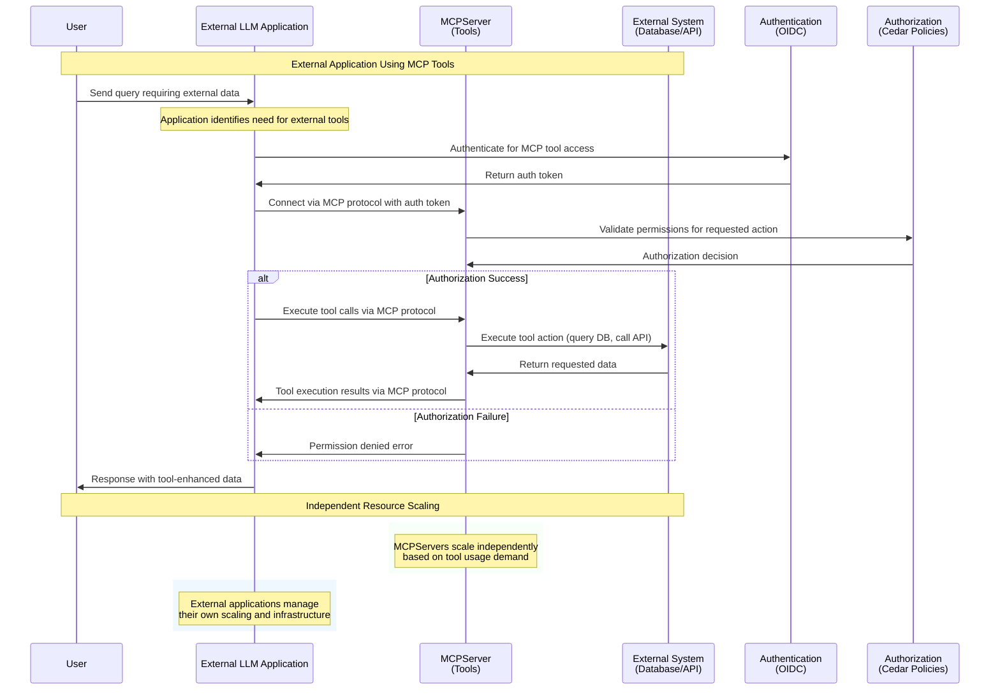

# OEP-0005: Model Context Protocol (MCP) Support for LLM Tool Integration

<!--
This OEP introduces comprehensive support for the Model Context Protocol (MCP) in OME,
enabling Large Language Models to integrate with external tools and services through
standardized server deployments. This enhancement allows LLMs to interact with
databases, APIs, file systems, and other external resources in a secure and controlled manner.
-->

<!-- toc -->
- [Summary](#summary)
- [Motivation](#motivation)
  - [Goals](#goals)
  - [Non-Goals](#non-goals)
- [Proposal](#proposal)
  - [User Stories](#user-stories)
    - [Story 1: Data Scientist with Database Access](#story-1-data-scientist-with-database-access)
    - [Story 2: DevOps Engineer with Infrastructure Tools](#story-2-devops-engineer-with-infrastructure-tools)
  - [Notes/Constraints/Caveats](#notesconstraintscaveats)
  - [Risks and Mitigations](#risks-and-mitigations)
- [Design Details](#design-details)
  - [API Specifications](#api-specifications)
    - [MCPServer Resource](#mcpserver-resource)
    - [ClusterMCPServer Resource](#clustermcpserver-resource)
    - [Transport Types](#transport-types)
    - [Authentication and Authorization](#authentication-and-authorization)
    - [Permission Profiles](#permission-profiles)
  - [Architecture Overview](#architecture-overview)
  - [Security Model](#security-model)
  - [Deployment Patterns](#deployment-patterns)
  - [Test Plan](#test-plan)
    - [Unit Tests](#unit-tests)
    - [Integration Tests](#integration-tests)
- [Drawbacks](#drawbacks)
<!-- /toc -->

## Summary

This OEP introduces native support for the Model Context Protocol (MCP) in OME through **MCPServer and ClusterMCPServer CRDs** that enable Large Language Models to integrate with external tools and services. MCP is an open protocol developed by Anthropic that standardizes the interface between LLMs and external systems, allowing models to perform actions like database queries, file operations, API calls, and infrastructure management in a secure and controlled manner.

The implementation provides **MCPServer and ClusterMCPServer CRDs** for deploying and managing tool capabilities as standalone resources within the OME ecosystem. MCPServers exist independently of InferenceServices, providing tool capabilities that can be consumed by external LLM applications through the standardized MCP protocol.

Key capabilities include support for multiple transport protocols (stdio, HTTP streaming, Server-Sent Events), OIDC-based authentication with Kubernetes service account integration, Cedar policy-based authorization, and configurable network and file system permissions. The architecture prioritizes **security, scalability, and operational simplicity** while providing a robust foundation for tool integration in enterprise environments.

## Motivation

Modern AI applications increasingly require LLMs to interact with external systems beyond simple text generation. Use cases include:

- **Data Analysis**: LLMs querying databases, accessing APIs, and processing files to provide insights
- **Infrastructure Management**: AI agents managing cloud resources, deployments, and monitoring systems  
- **Business Process Automation**: Models performing complex workflows involving multiple systems
- **Research and Development**: AI assistants with access to specialized tools and datasets

Currently, integrating LLMs with external tools requires custom implementations for each service, leading to:

1. **Fragmented Integration**: Each tool requires unique integration code and configuration
2. **Security Complexity**: Managing access controls and permissions across diverse systems
3. **Operational Overhead**: Deploying and maintaining multiple custom integration services
4. **Limited Reusability**: Tool integrations cannot be easily shared across different models or deployments

The Model Context Protocol addresses these challenges by providing a standardized interface for LLM-tool integration. However, deploying and managing MCP servers in production environments requires:

- Secure deployment and configuration management
- Authentication and authorization mechanisms
- Network and file system access controls
- Integration with existing Kubernetes infrastructure
- Observability and monitoring capabilities

### Goals

1. **Standardized MCP Integration**: Provide native support for deploying and managing MCP servers within OME
2. **Security-First Design**: Implement comprehensive authentication, authorization, and sandboxing mechanisms
3. **Flexible Deployment Options**: Support both hosted (in-cluster) and remote MCP server configurations
4. **Operational Excellence**: Enable easy deployment, scaling, and monitoring of MCP services
5. **Developer Experience**: Provide intuitive APIs and configuration patterns for common use cases
6. **Integration Consistency**: Seamlessly integrate MCP servers with existing InferenceService workflows
7. **Multi-Transport Support**: Support stdio, HTTP streaming, and Server-Sent Events protocols
8. **Permission Management**: Provide fine-grained control over file system, network, and API access

### Non-Goals

1. **MCP Protocol Implementation**: This OEP focuses on deployment and management, not implementing the MCP protocol itself
2. **Custom Tool Development**: Building domain-specific MCP tools is outside the scope of this OEP
3. **Legacy Protocol Support**: Only support for MCP v1.0+ protocols, not custom or proprietary tool interfaces
4. **Runtime Performance Optimization**: Focus is on deployment and security, not protocol performance tuning
5. **Multi-Cluster MCP**: Initial implementation will not support cross-cluster MCP server federation

## Proposal

Introduce new Kubernetes Custom Resource Definitions (CRDs) for managing MCP servers within OME:

1. **MCPServer** (Namespaced): Deploy and manage MCP servers within specific namespaces
2. **ClusterMCPServer** (Cluster-scoped): Deploy shared MCP servers accessible across namespaces

These resources provide comprehensive configuration options for:
- **Transport Configuration**: Support for stdio, streamable-http, and SSE protocols
- **Authentication**: OIDC integration with Kubernetes service accounts and external providers
- **Authorization**: Cedar policy-based access control with configurable permission profiles
- **Deployment**: Container specifications, resource limits, and scaling options
- **Security**: Network policies, file system access controls, and secrets management

The design follows a **standalone service principle** where MCPServers provide tool capabilities that can be consumed by any external LLM application through the standardized MCP protocol. This approach enables independent resource lifecycle management, better reusability, and cleaner operational boundaries.

### User Stories

#### Story 1: Data Scientist with Database Access

Alice is a data scientist who wants to deploy an MCP server that provides database query tools and separately deploy an InferenceService for LLM capabilities.

```yaml
# Step 1: Deploy MCP server with database access
apiVersion: ome.io/v1beta1
kind: MCPServer
metadata:
  name: postgres-mcp
  namespace: data-science
spec:
  type: Hosted
  image: mcp/postgres-server:latest
  transport: streamable-http
  
  # Database connection configuration  
  secrets:
    - name: postgres-credentials
      key: url
      targetEnvName: DATABASE_URL
  
  # Security: Only allow database connections
  permissionProfile:
    type: builtin
    name: network
  
  # OIDC authentication
  oidcConfig:
    type: kubernetes
    kubernetes:
      audience: data-tools
      namespace: data-science

---
# Step 2: Deploy InferenceService for the LLM
apiVersion: ome.io/v1beta1
kind: InferenceService
metadata:
  name: llama-3-3-70b-instruct
  namespace: moirai
spec:
  model:
    name: llama-3-3-70b-instruct
  runtime:
    name: srt-llama-3-3-70b-instruct

# The MCPServer is now available for consumption by external LLM applications
# via the standardized MCP protocol at the service endpoint
```

#### Story 2: DevOps Engineer with Infrastructure Tools

Bob manages cloud infrastructure and wants to deploy an MCP server that provides infrastructure management tools and separately deploy an InferenceService for LLM capabilities.

```yaml
# Step 1: Deploy MCP server with oci and Kubernetes tools
apiVersion: ome.io/v1beta1
kind: MCPServer
metadata:
  name: infra-tools-mcp
  namespace: devops
spec:
  type: Hosted
  image: mcp/infra-tools:latest
  transport: streamable-http
  
  capabilities:
    tools: true    # Enable tool execution
    resources: true # Enable resource access
  
  # oci credentials and Kubernetes access
  secrets:
    - name: oci-credentials
      key: credentials
      targetEnvName: OCI_SHARED_CREDENTIALS_FILE
    - name: kubeconfig
      key: config
      targetEnvName: KUBECONFIG
  
  # Custom permission profile for infrastructure access
  permissionProfile:
    type: configMap
    configMap:
      name: infra-permissions
      key: policy.json
  
  # Resource limits for safety
  resources:
    requests:
      cpu: 100m
      memory: 256Mi
    limits:
      cpu: 500m
      memory: 1Gi

---
# Step 2: Deploy InferenceService for the LLM
apiVersion: ome.io/v1beta1
kind: InferenceService
metadata:
  name: llama-4-scout-17b-16e-instruct
  namespace: moirai
spec:
  model:
    name: llama-4-scout-17b-16e-instruct
  runtime:
    name: srt-llama-4-scout-17b-16e-instruct

---
# Step 3: Permission profile with specific oci and K8s permissions
apiVersion: v1
kind: ConfigMap
metadata:
  name: infra-permissions
  namespace: devops
data:
  policy.json: |
    {
      "read": ["/etc/ssl/certs", "/tmp"],
      "write": ["/tmp"],
      "network": {
        "outbound": {
          "allowHost": [
            "*.ocicloud.com",
            "kubernetes.default.svc"
          ],
          "allowPort": [443, 6443]
        }
      }
    }

# The MCPServer is now available for consumption by external infrastructure management applications
```

#### Story 3: Platform Team with Centralized MCP Services

Carol's platform team wants to provide shared MCP services that can be used by multiple teams across different namespaces.

```yaml
# Step 1: Cluster-wide MCP server for common tools
apiVersion: ome.io/v1beta1
kind: ClusterMCPServer
metadata:
  name: shared-tools-mcp
spec:
  type: Hosted
  image: mcp/enterprise-tools:v2.1.0
  transport: streamable-http
  
  # High availability deployment
  replicas: 3
  
  # Shared authentication configuration
  oidcConfig:
    type: kubernetes
    kubernetes:
      audience: enterprise-tools
      issuer: https://kubernetes.default.svc
  
  # Authorization policies for multi-tenant access
  authzConfig:
    type: inline
    inline:
      policies:
        - |
          permit(
            principal in Group::"developers",
            action in [Action::"read", Action::"query"],
            resource in ResourceType::"database"
          ) when {
            principal.department == resource.department
          };
        - |
          permit(
            principal in Group::"admins",
            action,
            resource
          );
      entitiesJSON: |
        [
          {
            "uid": {"type": "Group", "id": "developers"},
            "attrs": {},
            "parents": []
          },
          {
            "uid": {"type": "Group", "id": "admins"},
            "attrs": {},
            "parents": []
          }
        ]

---
# Step 2: Teams deploy their own InferenceServices as needed
apiVersion: ome.io/v1beta1
kind: InferenceService
metadata:
  name: team-llm
  namespace: engineering
spec:
  model:
    name: llama-4
  runtime:
    name: srt-llama-4

# The shared ClusterMCPServer is now available cluster-wide for consumption
# by any external LLM applications that can access the cluster
```


### Notes/Constraints/Caveats

1. **MCP Protocol Compliance**: All deployed MCP servers must comply with the MCP v1.0+ specification. The platform validates protocol compatibility during deployment.

2. **Transport Protocol Limitations**: 
   - `stdio` transport is only suitable for single-request scenarios
   - `streamable-http` and `sse` are recommended for production deployments
   - Transport protocol affects scaling capabilities and load balancing options

3. **Authentication Integration**:
   - Kubernetes service account tokens are the preferred authentication method
   - External OIDC providers are supported but require additional configuration
   - Authentication tokens must be properly rotated and managed

4. **Permission Profile Inheritance**:
   - Custom permission profiles override built-in profiles completely
   - No merging of permission sets occurs
   - More restrictive policies cannot be overridden by less restrictive ones

5. **Resource Isolation**:
   - Each MCP server runs in its own container with dedicated resources
   - File system isolation is enforced through security contexts
   - Network policies can be applied for additional isolation

6. **Scalability Considerations**:
   - `stdio` transport cannot be scaled beyond 1 replica
   - HTTP-based transports support horizontal scaling
   - Load balancing and session affinity must be configured appropriately

7. **External Integration**:
   - External applications can consume MCPServers through the standardized MCP protocol
   - Resource discovery is based on service endpoints and RBAC permissions
   - Cross-namespace and cluster-scoped resource access is supported through proper authentication

### Risks and Mitigations

**Risk 1: Security vulnerabilities in MCP servers**
- *Mitigation:* Implement comprehensive permission profiles and security contexts. Require security scanning of MCP server images. Provide built-in security profiles for common use cases.

**Risk 2: Resource exhaustion from poorly behaved MCP servers**
- *Mitigation:* Enforce resource limits and quotas. Implement monitoring and alerting for resource usage. Provide safe defaults and guidelines for resource allocation.

**Risk 3: Network security breaches through MCP servers**
- *Mitigation:* Default to restrictive network policies. Provide network permission profiles with explicit allow-lists. Support network policy integration and monitoring.

**Risk 4: Authentication and authorization bypass**
- *Mitigation:* Use strong default authentication mechanisms. Integrate with Kubernetes RBAC. Provide comprehensive audit logging and monitoring.

**Risk 5: Protocol incompatibility and integration issues**
- *Mitigation:* Validate MCP protocol compliance during deployment. Provide comprehensive testing and compatibility matrices. Support multiple protocol versions.


## Design Details

### API Specifications

#### MCPServer Resource

The `MCPServer` is a namespaced resource that manages MCP server deployments within a specific namespace. The implementation includes comprehensive validation annotations and structural schemas for robust API enforcement:

```go
// MCPServerSpec defines the desired state of MCPServer with validation rules
// +kubebuilder:validation:XValidation:rule="self.type == 'Hosted' ? has(self.image) && self.image != '' : true",message="image is required for Hosted MCP servers"
// +kubebuilder:validation:XValidation:rule="self.type == 'Remote' ? has(self.url) && self.url != '' : true",message="url is required for Remote MCP servers"
type MCPServerSpec struct {
    // Type specifies whether this is a hosted or remote MCP server
    // Hosted servers run as containers in the cluster, Remote servers are accessed via URL
    // +kubebuilder:validation:Enum=Hosted;Remote
    // +kubebuilder:default=Hosted
    // +optional
    Type MCPServerType `json:"type,omitempty"`

    // Image is the container image for the MCP server
    // Required for Hosted servers, ignored for Remote servers.
    // Must be a valid container image reference (e.g., "registry/image:tag")
    // +optional
    Image string `json:"image,omitempty"`

    // URL is the external URL for remote MCP servers
    // Required for Remote servers, ignored for Hosted servers
    // +kubebuilder:validation:Pattern=`^https?://.*`
    // +optional
    URL string `json:"url,omitempty"`

    // Transport specifies the transport method for MCP communication
    // +kubebuilder:default=stdio
    // +optional
    Transport MCPTransportType `json:"transport,omitempty"`

    // Protocol defines the MCP protocol specification
    // +optional
    Protocol *MCPProtocolSpec `json:"protocol,omitempty"`

    // Capabilities defines the MCP capabilities supported by this server
    // +optional
    Capabilities *MCPCapabilities `json:"capabilities,omitempty"`

    // Version is the version of the MCP server software
    // +optional
    Version string `json:"version,omitempty"`

    // Replicas is the number of desired replicas for hosted MCP servers
    // Only applicable for Hosted servers with HTTP transport
    // +kubebuilder:validation:Minimum=0
    // +kubebuilder:validation:Maximum=100
    // +kubebuilder:default=1
    // +optional
    Replicas *int32 `json:"replicas,omitempty"`

    // Port is the port to expose the MCP server on
    // +kubebuilder:validation:Minimum=1
    // +kubebuilder:validation:Maximum=65535
    // +kubebuilder:default=8080
    // +optional
    Port int32 `json:"port,omitempty"`

    // TargetPort is the port that MCP server listens to
    // If not specified, defaults to the same value as Port (8080)
    // +kubebuilder:validation:Minimum=1
    // +kubebuilder:validation:Maximum=65535
    // +kubebuilder:default=8080
    // +optional
    TargetPort int32 `json:"targetPort,omitempty"`
    
    // Args are additional arguments to pass to the MCP server
    // +optional
    // +listType=atomic
    Args []string `json:"args,omitempty"`

    // Env are environment variables to set in the MCP server container
    // +optional
    // +listType=map
    // +listMapKey=name
    Env []corev1.EnvVar `json:"env,omitempty"`

    // Pod volumes to mount into the MCP server filesystem.
    // +listType=map
    // +listMapKey=name
    // +optional
    VolumeMounts []corev1.VolumeMount `json:"volumeMounts,omitempty"`

    // Secrets are references to secrets to mount in the MCP server container
    // +optional
    // +listType=atomic
    Secrets []SecretRef `json:"secrets,omitempty"`

    // ServiceAccount is the name of an already existing service account to use by the MCP server.
    // If not specified, a ServiceAccount will be created automatically and used by the MCP server.
    // +optional
    ServiceAccount *string `json:"serviceAccount,omitempty"`

    // PermissionProfile defines the permission profile to use
    // +optional
    PermissionProfile *PermissionProfileRef `json:"permissionProfile,omitempty"`

    // PodTemplateSpec defines the pod template to use for the MCP server
    // This allows for customizing the pod configuration beyond what is provided by the other fields.
    // Note that to modify the specific container the MCP server runs in, you must specify
    // the `mcp` container name in the PodTemplateSpec.
    // +optional
    PodTemplateSpec *corev1.PodTemplateSpec `json:"podTemplateSpec,omitempty"`

    // OIDCConfig defines OIDC authentication configuration for the MCP server
    // +optional
    OIDCConfig *OIDCConfigRef `json:"oidcConfig,omitempty"`

    // AuthzConfig defines authorization policy configuration for the MCP server
    // +optional
    AuthzConfig *AuthzConfigRef `json:"authzConfig,omitempty"`

    // ToolsFilter is the filter on tools applied to the MCP server
    // +optional
    // +listType=set
    ToolsFilter []string `json:"toolsFilter,omitempty"`

    // Compute Resources required by this MCP server.
    // Cannot be updated.
    // More info: https://kubernetes.io/docs/concepts/configuration/manage-resources-containers/
    // +optional
    Resources *corev1.ResourceRequirements `json:"resources,omitempty"`

    // If specified, the pod's tolerations.
    // +optional
    // +listType=atomic
    Tolerations []corev1.Toleration `json:"tolerations,omitempty"`

    // NodeSelector is a selector which must be true for the pod to fit on a node.
    // Selector which must match a node's labels for the pod to be scheduled on that node.
    // More info: https://kubernetes.io/docs/concepts/configuration/assign-pod-node/
    // +optional
    // +mapType=atomic
    NodeSelector map[string]string `json:"nodeSelector,omitempty"`

    // If specified, the pod's scheduling constraints
    // +optional
    Affinity *corev1.Affinity `json:"affinity,omitempty"`

    // List of volumes that can be mounted by containers belonging to the pod.
    // More info: https://kubernetes.io/docs/concepts/storage/volumes
    // +optional
    // +patchMergeKey=name
    // +patchStrategy=merge,retainKeys
    // +listType=atomic
    Volumes []corev1.Volume `json:"volumes,omitempty"`
}
```

**Enhanced Validation Rules**

The implementation includes comprehensive validation using XValidation rules:

1. **Conditional Requirements**: 
   - `image` field is required when `type == 'Hosted'`
   - `url` field is required when `type == 'Remote'`

2. **Resource Constraints**:
   - Replicas: 0-100 range with default of 1
   - Ports: 1-65535 range with default of 8080
   - List types properly annotated (atomic, map, set)

3. **Pattern Validation**:
   - URL fields must match `^https?://.*` pattern
   - Enum validations for transport types, server types, and phases

```yaml
# Example validation annotations from the implementation:
+kubebuilder:validation:XValidation:rule="self.type == 'Hosted' ? has(self.image) && self.image != '' : true",message="image is required for Hosted MCP servers"
+kubebuilder:validation:XValidation:rule="self.type == 'Remote' ? has(self.url) && self.url != '' : true",message="url is required for Remote MCP servers"
+kubebuilder:validation:Minimum=0
+kubebuilder:validation:Maximum=100
+kubebuilder:validation:Pattern=`^https?://.*`
```

**Transport Types and Protocol Specification**

The implementation defines three transport types with proper enum validation:

```go
// MCPTransportType defines the transport method for MCP communication
// +kubebuilder:validation:Enum=stdio;streamable-http;sse
type MCPTransportType string

const (
    // MCPTransportStdio uses standard input/output for communication
    MCPTransportStdio MCPTransportType = "stdio"

    // MCPTransportStreamableHTTP uses HTTP with streaming support
    MCPTransportStreamableHTTP MCPTransportType = "streamable-http"

    // MCPTransportSSE uses Server-Sent Events for communication
    MCPTransportSSE MCPTransportType = "sse"
)

// MCPProtocolSpec defines the MCP protocol specification
type MCPProtocolSpec struct {
    // Name of the protocol (always "JSON-RPC" for MCP)
    // +kubebuilder:validation:Enum=JSON-RPC
    // +kubebuilder:default="JSON-RPC"
    // +optional
    Name string `json:"name,omitempty"`

    // Version of the JSON-RPC protocol (always "2.0" for MCP)
    // +kubebuilder:validation:Enum="2.0"
    // +kubebuilder:default="2.0"
    // +optional
    Version string `json:"version,omitempty"`
}

// MCPCapabilities defines the capabilities supported by the MCP server
type MCPCapabilities struct {
    // Tools indicates whether the server supports MCP tools
    // +kubebuilder:default=true
    // +optional
    Tools *bool `json:"tools,omitempty"`

    // Resources indicates whether the server supports MCP resources
    // +kubebuilder:default=false
    // +optional
    Resources *bool `json:"resources,omitempty"`

    // Prompts indicates whether the server supports MCP prompts
    // +kubebuilder:default=false
    // +optional
    Prompts *bool `json:"prompts,omitempty"`
}
```

#### ClusterMCPServer Resource

The `ClusterMCPServer` is a cluster-scoped resource for shared MCP servers with identical validation rules:

```go
// ClusterMCPServer provides cluster-wide MCP server deployment
// It shares the same spec as MCPServer but has cluster scope
// +kubebuilder:validation:XValidation:rule="has(self.spec.type) && (self.spec.type == 'Hosted' ? has(self.spec.image) && self.spec.image != '' : true)",message="image is required for Hosted MCP servers"
// +kubebuilder:validation:XValidation:rule="has(self.spec.type) && (self.spec.type == 'Remote' ? has(self.spec.url) && self.spec.url != '' : true)",message="url is required for Remote MCP servers"
type ClusterMCPServer struct {
    metav1.TypeMeta   `json:",inline"`
    metav1.ObjectMeta `json:"metadata,omitempty"`
    
    // +kubebuilder:validation:Required
    Spec   MCPServerSpec   `json:"spec,omitempty"`
    // +optional
    Status MCPServerStatus `json:"status,omitempty"`
}
```

#### Transport Types Implementation

**stdio Transport**
```yaml
spec:
  transport: stdio
  # stdin/stdout communication
  # Single replica only (cannot be scaled beyond 1)
  # Best for simple tools and debugging
  # Default transport type
```

**streamable-http Transport**
```yaml
spec:
  transport: streamable-http
  port: 8080        # Default port with validation (1-65535)
  targetPort: 8080  # Default targetPort with validation (1-65535)
  replicas: 3       # Supports horizontal scaling (0-100)
  # HTTP with streaming support
  # Production-ready with load balancing
```

**sse Transport**
```yaml
spec:
  transport: sse
  port: 8080        # Default port with validation (1-65535)
  targetPort: 8080  # Default targetPort with validation (1-65535)
  replicas: 2       # Supports horizontal scaling (0-100)
  # Server-Sent Events
  # Real-time bidirectional communication
  # Web-friendly protocol
```

#### Authentication and Authorization Implementation

**OIDC Configuration Reference**

The implementation supports three types of OIDC configuration with validation:

```go
// OIDCConfigRef defines a reference to OIDC configuration
// +kubebuilder:validation:XValidation:rule="self.type == 'configMap' ? has(self.configMap) : true",message="configMap is required for configMap OIDC configuration"
// +kubebuilder:validation:XValidation:rule="self.type == 'inline' ? has(self.inline) : true",message="inline is required for inline OIDC configuration"
type OIDCConfigRef struct {
    // Type is the type of OIDC configuration
    // +kubebuilder:validation:Enum=kubernetes;configMap;inline
    // +kubebuilder:default=kubernetes
    Type string `json:"type"`

    // ResourceURL is the explicit resource URL for OAuth discovery endpoint (RFC 9728)
    // If not specified, defaults to the in-cluster Kubernetes service URL
    // +kubebuilder:validation:Pattern=`^https?://.*`
    // +optional
    ResourceURL string `json:"resourceURL,omitempty"`

    // Kubernetes configures OIDC for Kubernetes service account token validation
    // Only used when Type is "kubernetes"
    // +optional
    Kubernetes *KubernetesOIDCConfig `json:"kubernetes,omitempty"`

    // ConfigMap references a ConfigMap containing OIDC configuration
    // Only used when Type is "configMap"
    // +optional
    ConfigMap *ConfigMapOIDCRef `json:"configMap,omitempty"`

    // Inline contains direct OIDC configuration
    // Only used when Type is "inline"
    // +optional
    Inline *InlineOIDCConfig `json:"inline,omitempty"`
}
```

**Kubernetes Service Account Authentication**
```yaml
spec:
  oidcConfig:
    type: kubernetes
    kubernetes:
      namespace: default      # optional, defaults to MCPServer namespace
      audience: toolhive      # default audience
      issuer: "https://kubernetes.default.svc"  # default issuer
      useClusterAuth: true    # Use cluster CA and service account token
      jwksURL: ""            # Optional, auto-discovered if empty
      introspectionURL: ""   # Optional, auto-discovered if empty
```

**ConfigMap OIDC Configuration**
```yaml
spec:
  oidcConfig:
    type: configMap
    configMap:
      name: my-oidc-config
      key: oidc.json  # Default key if not specified

---
apiVersion: v1
kind: ConfigMap
metadata:
  name: my-oidc-config
data:
  oidc.json: |
    {
      "issuer": "https://auth.company.com",
      "audience": "mcp-services",
      "jwksURL": "https://auth.company.com/.well-known/jwks.json"
    }
```

**Inline OIDC Configuration**
```yaml
spec:
  oidcConfig:
    type: inline
    inline:
      issuer: "https://auth.company.com"  # Required field
      audience: "mcp-services"             # Optional
      jwksURL: "https://auth.company.com/.well-known/jwks.json"  # Optional
      introspectionURL: "https://auth.company.com/oauth/introspect"  # Optional
      # Optional mutual TLS support
      thvCABundlePath: "/etc/ssl/certs/ca.pem"
      jwksAuthTokenPath: "/var/secrets/auth/token"
      jwksAllowPrivateIP: false  # Default false for security
```

**Authorization Configuration**

The implementation supports Cedar policy-based authorization:

```go
// AuthzConfigRef defines a reference to authorization configuration
// +kubebuilder:validation:XValidation:rule="self.type == 'configMap' ? has(self.configMap) : true",message="configMap is required for configMap authorization configuration"
// +kubebuilder:validation:XValidation:rule="self.type == 'inline' ? has(self.inline) : true",message="inline is required for inline authorization configuration"
type AuthzConfigRef struct {
    // Type is the type of authorization configuration
    // +kubebuilder:validation:Enum=configMap;inline
    // +kubebuilder:default=configMap
    Type string `json:"type"`

    // ConfigMap references a ConfigMap containing authorization configuration
    ConfigMap *ConfigMapAuthzRef `json:"configMap,omitempty"`

    // Inline contains direct authorization configuration
    Inline *InlineAuthzConfig `json:"inline,omitempty"`
}
```

**Cedar Authorization Policies**
```yaml
spec:
  authzConfig:
    type: inline
    inline:
      policies:  # Required, minimum 1 policy
        - |
          permit(
            principal in Group::"developers",
            action in [Action::"query", Action::"read"],
            resource in ResourceType::"database"
          ) when {
            principal.team == resource.team
          };
        - |
          permit(
            principal in Group::"admins",
            action,
            resource
          );
      entitiesJSON: "[]"  # Default empty entities array
```

#### Permission Profiles

**Built-in Permission Profiles**

`none` - No external access:
```yaml
spec:
  permissionProfile:
    type: builtin
    name: none
  # Allows no file system or network access
  # Suitable for pure computational tools
```

`network` - Network access only:
```yaml
spec:
  permissionProfile:
    type: builtin
    name: network
  # Allows outbound network connections
  # No file system write access
  # Suitable for API and database tools
```

The implementation supports three types of permission profiles with comprehensive validation:

```go
// PermissionProfileRef defines a reference to a permission profile
// +kubebuilder:validation:XValidation:rule="self.type == 'builtin' ? has(self.name) && self.name != '' : true",message="name is required for builtin permission profiles"
// +kubebuilder:validation:XValidation:rule="self.type == 'configMap' ? has(self.configMap) : true",message="configMap is required for configMap permission profiles"
// +kubebuilder:validation:XValidation:rule="self.type == 'inline' ? has(self.inline) : true",message="inline is required for inline permission profiles"
type PermissionProfileRef struct {
    // Type is the type of permission profile reference
    // +kubebuilder:validation:Enum=builtin;configMap;inline
    // +kubebuilder:default=builtin
    Type string `json:"type"`

    // Name is the name of the built-in permission profile
    // If Type is "builtin", Name must be one of: "none", "network"
    // Only used when Type is "builtin"
    // +kubebuilder:validation:Enum=none;network
    // +optional
    Name string `json:"name,omitempty"`

    // ConfigMap references a ConfigMap containing permission profile configuration
    // Only used when Type is "configMap"
    // +optional
    ConfigMap *ConfigMapPermissionRef `json:"configMap,omitempty"`

    // Inline contains direct permission profile configuration
    // Only used when Type is "inline"
    // +optional
    Inline *PermissionProfileSpec `json:"inline,omitempty"`
}
```

**ConfigMap Permission Profiles**
```yaml
spec:
  permissionProfile:
    type: configMap
    configMap:
      name: custom-permissions
      key: permissions.json  # Default key if not specified

---
apiVersion: v1
kind: ConfigMap
metadata:
  name: custom-permissions
data:
  permissions.json: |
    {
      "read": [
        "/app/config",
        "/etc/ssl/certs",
        "/var/data"
      ],
      "write": [
        "/tmp",
        "/var/output"
      ],
      "network": {
        "outbound": {
          "insecureAllowAll": false,
          "allowHost": [
            "api.service.com",
            "database.internal",
            "*.trusted-domain.com"
          ],
          "allowPort": [443, 5432, 6379]
        }
      }
    }
```

**Inline Permission Profiles**
```yaml
spec:
  permissionProfile:
    type: inline
    inline:
      read:
        - "/app/config"
        - "/etc/ssl/certs"
      write:
        - "/tmp"
      network:
        outbound:
          insecureAllowAll: false
          allowHost:
            - "trusted-api.company.com"
          allowPort:
            - 443
            - 6379
```

**Permission Profile Schema**

The `PermissionProfileSpec` defines the comprehensive permission structure:

```go
// PermissionProfileSpec defines the permissions for an MCP server
type PermissionProfileSpec struct {
    // Read is a list of paths that the MCP server can read from
    // +optional
    // +listType=set
    Read []string `json:"read,omitempty"`

    // Write is a list of paths that the MCP server can write to
    // +optional
    // +listType=set
    Write []string `json:"write,omitempty"`

    // Network defines the network permissions for the MCP server
    // +optional
    Network *NetworkPermissions `json:"network,omitempty"`
}

// NetworkPermissions defines the network permissions for an MCP server
type NetworkPermissions struct {
    // Outbound defines the outbound network permissions
    // +optional
    Outbound *OutboundNetworkPermissions `json:"outbound,omitempty"`
}

// OutboundNetworkPermissions defines the outbound network permissions
type OutboundNetworkPermissions struct {
    // InsecureAllowAll allows all outbound network connections (not recommended)
    // +kubebuilder:default=false
    // +optional
    InsecureAllowAll bool `json:"insecureAllowAll,omitempty"`

    // AllowHost is a list of hosts to allow connections to
    // +optional
    // +listType=set
    AllowHost []string `json:"allowHost,omitempty"`

    // AllowPort is a list of ports to allow connections to
    // +optional
    // +listType=set
    AllowPort []int32 `json:"allowPort,omitempty"`
}
```

**SecretRef Structure**

Secrets are referenced with comprehensive validation:

```go
// SecretRef is a reference to a secret
type SecretRef struct {
    // Name is the name of the secret
    // +kubebuilder:validation:Required
    // +kubebuilder:validation:MinLength=1
    Name string `json:"name"`

    // Key is the key in the secret itself
    // +kubebuilder:validation:Required
    // +kubebuilder:validation:MinLength=1
    Key string `json:"key"`

    // TargetEnvName is the environment variable to be used when setting up the secret in the MCP server
    // If left unspecified, it defaults to the key
    // +kubebuilder:validation:MinLength=1
    // +optional
    TargetEnvName string `json:"targetEnvName,omitempty"`
}
```

#### MCPServer Status and Phases

The implementation includes comprehensive status reporting with structured phases:

```go
// MCPServerStatus defines the observed state of MCPServer
type MCPServerStatus struct {
    // Conditions represent the latest available observations of the MCPServer's state
    // Standard condition types: Ready, Available, Progressing
    // +optional
    // +listType=map
    // +listMapKey=type
    Conditions []metav1.Condition `json:"conditions,omitempty"`

    // URL is the URL where the MCP server can be accessed
    // For Hosted servers, this is the cluster-internal or external service URL
    // For Remote servers, this reflects the configured external URL
    // +optional
    URL string `json:"url,omitempty"`

    // Phase is the current phase of the MCPServer lifecycle
    // +optional
    Phase MCPServerPhase `json:"phase,omitempty"`

    // Message provides additional information about the current phase
    // +optional
    Message string `json:"message,omitempty"`

    // ObservedGeneration reflects the generation most recently observed by the controller
    // +optional
    ObservedGeneration int64 `json:"observedGeneration,omitempty"`

    // Replicas is the most recently observed number of replicas for hosted servers
    // +optional
    Replicas int32 `json:"replicas,omitempty"`

    // ReadyReplicas is the number of ready replicas for hosted servers
    // +optional
    ReadyReplicas int32 `json:"readyReplicas,omitempty"`

    // LastUpdateTime is the last time the status was updated
    // +optional
    LastUpdateTime *metav1.Time `json:"lastUpdateTime,omitempty"`
}

// MCPServerPhase is the phase of the MCPServer
// +kubebuilder:validation:Enum=Pending;Starting;Running;Updating;Failed;Terminating
type MCPServerPhase string

const (
    // MCPServerPhasePending means the MCPServer is being created
    MCPServerPhasePending MCPServerPhase = "Pending"

    // MCPServerPhaseStarting means the MCPServer is starting up
    MCPServerPhaseStarting MCPServerPhase = "Starting"

    // MCPServerPhaseRunning means the MCPServer is running and ready
    MCPServerPhaseRunning MCPServerPhase = "Running"

    // MCPServerPhaseUpdating means the MCPServer is being updated
    MCPServerPhaseUpdating MCPServerPhase = "Updating"

    // MCPServerPhaseFailed means the MCPServer failed to start or run
    MCPServerPhaseFailed MCPServerPhase = "Failed"

    // MCPServerPhaseTerminating means the MCPServer is being deleted
    MCPServerPhaseTerminating MCPServerPhase = "Terminating"
)
```

**Kubebuilder Print Columns**

Both MCPServer and ClusterMCPServer resources include print columns for better kubectl experience:

```yaml
# +kubebuilder:printcolumn:name="Status",type="string",JSONPath=".status.phase"
# +kubebuilder:printcolumn:name="URL",type="string",JSONPath=".status.url" 
# +kubebuilder:printcolumn:name="Age",type="date",JSONPath=".metadata.creationTimestamp"
```

### Architecture Overview

The MCP support implementation in OME follows a **standalone service architecture** where tool capabilities are provided through dedicated MCP servers that exist independently within the OME ecosystem:

- **InferenceService**: Handles pure LLM serving and inference (existing capability)
- **MCPServer**: Provides tools and external system access capabilities through standardized MCP protocol
- **ClusterMCPServer**: Provides cluster-wide tool capabilities accessible across namespaces

This approach enables:
- **Modularity**: MCP servers can be developed, deployed, and scaled independently of any LLM serving infrastructure
- **Reusability**: MCP servers can be consumed by multiple external applications through the standard MCP protocol
- **Security**: Fine-grained access control and permission profiles for tool access
- **Flexibility**: Tool capabilities exist as first-class resources within the Kubernetes cluster

#### High-Level Architecture

The following diagram illustrates the standalone MCP server architecture within the OME ecosystem:

```mermaid
graph TB
    subgraph "External Applications"
        direction TB
        ExtApp1["🌐 External LLM Application<br/>(Data Analysis)"]
        ExtApp2["🌐 External LLM Application<br/>(DevOps Automation)"]
        ExtApp3["🌐 External LLM Application<br/>(Sales Assistant)"]
    end
    
    subgraph "OME LLM Serving Layer"
        direction LR
        ISVC1["🧠 InferenceService<br/>llama-3-3-70b-instruct<br/>(Data Science)"]
        ISVC2["🧠 InferenceService<br/>llama-4<br/>(DevOps)"]
        ISVC3["🧠 InferenceService<br/>sales-llm<br/>(Sales)"]
    end
    
    subgraph "OME MCP Tools Layer"
        direction LR
        MCP1["🔧 MCPServer<br/>postgres-mcp<br/>(Database Tools)"]
        MCP2["🔧 MCPServer<br/>infra-tools<br/>(Infrastructure Tools)"]
        MCP3["🔧 ClusterMCPServer<br/>shared-tools<br/>(Enterprise APIs)"]
        MCP4["🔧 MCPServer<br/>crm-tools<br/>(External CRM)"]
    end
    
    subgraph "OME Control Plane"
        direction LR
        Controller["📋 MCP Controller"]
        ISVCController["📋 InferenceService Controller"]
    end
    
    subgraph "Security & Infrastructure"
        direction LR
        OIDC["🔐 OIDC Provider"]
        RBAC["🛡️ Kubernetes RBAC"]
        NetworkPol["🌐 Network Policies"]
        PermProfiles["📜 Permission Profiles"]
    end
    
    subgraph "External Systems"
        direction LR
        Database[("🗄️ PostgreSQL")]
        CloudAPIs["☁️ Cloud APIs"]
        K8sAPI["⚙️ Kubernetes API"]
        CRMAPI["📊 CRM System"]
    end
    
    %% External application consumption (dashed lines = consumes via MCP protocol)
    ExtApp1 -.->|MCP Protocol| MCP1
    ExtApp1 -.->|HTTP/gRPC| ISVC1
    
    ExtApp2 -.->|MCP Protocol| MCP2  
    ExtApp2 -.->|MCP Protocol| MCP3
    ExtApp2 -.->|HTTP/gRPC| ISVC2
    
    ExtApp3 -.->|MCP Protocol| MCP4
    ExtApp3 -.->|MCP Protocol| MCP3
    ExtApp3 -.->|HTTP/gRPC| ISVC3
    
    %% Control plane management (solid lines = manages)
    Controller -->|manages| MCP1
    Controller -->|manages| MCP2
    Controller -->|manages| MCP3
    Controller -->|manages| MCP4
    
    ISVCController -->|manages| ISVC1
    ISVCController -->|manages| ISVC2
    ISVCController -->|manages| ISVC3
    
    %% External system connections
    MCP1 -->|connects to| Database
    MCP2 -->|connects to| CloudAPIs
    MCP2 -->|connects to| K8sAPI
    MCP4 -->|connects to| CRMAPI
    
    %% Security enforcement
    OIDC -->|authenticates| MCP1
    OIDC -->|authenticates| MCP2
    OIDC -->|authenticates| MCP3
    OIDC -->|authenticates| MCP4
    
    RBAC -->|authorizes| Controller
    RBAC -->|authorizes| ISVCController
    
    NetworkPol -->|restricts| MCP1
    NetworkPol -->|restricts| MCP2
    NetworkPol -->|restricts| MCP3
    NetworkPol -->|restricts| MCP4
    
    PermProfiles -->|governs| MCP1
    PermProfiles -->|governs| MCP2
    PermProfiles -->|governs| MCP3
    PermProfiles -->|governs| MCP4
    
    %% Styling
    classDef extApp fill:#e1f5fe,stroke:#0277bd,stroke-width:2px
    classDef llmService fill:#f3e5f5,stroke:#7b1fa2,stroke-width:2px
    classDef mcpService fill:#e8f5e8,stroke:#2e7d32,stroke-width:2px
    classDef controller fill:#fff3e0,stroke:#ef6c00,stroke-width:2px
    classDef security fill:#fce4ec,stroke:#c2185b,stroke-width:2px
    classDef external fill:#f1f8e9,stroke:#558b2f,stroke-width:2px
    
    class ExtApp1,ExtApp2,ExtApp3 extApp
    class ISVC1,ISVC2,ISVC3 llmService
    class MCP1,MCP2,MCP3,MCP4 mcpService
    class Controller,ISVCController controller
    class OIDC,RBAC,NetworkPol,PermProfiles security
    class Database,CloudAPIs,K8sAPI,CRMAPI external
```



#### MCP Server Access Pattern

The following sequence diagram shows how external applications can consume MCP servers:



**Key Architectural Principles:**

1. **Standalone Services**: MCPServers exist as independent services within the Kubernetes cluster
2. **Protocol Standardization**: All tool access follows the standardized MCP protocol for interoperability
3. **Resource Independence**: MCPServers can be managed, scaled, and secured independently of any LLM infrastructure
4. **External Consumption**: MCPServers are designed to be consumed by external applications via standard network protocols

### Security Model

The MCP support implementation follows a defense-in-depth security model with multiple layers of protection:

**1. Authentication Layer**
- OIDC-based authentication with support for Kubernetes service accounts
- Token validation and refresh mechanisms
- Mutual TLS support for high-security environments

**2. Authorization Layer**
- Cedar policy-based authorization with fine-grained access controls
- Integration with Kubernetes RBAC for namespace and cluster-level permissions
- Dynamic policy evaluation based on user, resource, and context

**3. Network Security**
- Default-deny network policies with explicit allow-lists
- Support for private networks and VPN integration
- Traffic encryption and monitoring capabilities

**4. Container Security**
- Mandatory security contexts with non-root execution
- Read-only root filesystems where possible
- Resource limits and quotas enforcement
- seccomp and AppArmor profile support

**5. File System Security**
- Explicit read/write permission definitions
- chroot-style isolation for file access
- Temporary directory restrictions and cleanup

**6. Audit and Monitoring**
- Comprehensive audit logging for all MCP operations
- Metrics collection for security events and policy violations
- Integration with security information systems


### Deployment Patterns

**Pattern 1: Departmental MCP Services**
Each department deploys their own MCP servers with team-specific tools and access permissions. InferenceServices can be deployed separately as needed.

```yaml
# Data Science team MCP server
apiVersion: ome.io/v1beta1
kind: MCPServer
metadata:
  name: data-science-tools
  namespace: data-science
spec:
  image: mcp/data-tools:latest
  permissionProfile:
    type: builtin
    name: network
  env:
    - name: DEPARTMENT
      value: data-science

---
# Data Science team InferenceService (deployed separately)
apiVersion: ome.io/v1beta1
kind: InferenceService
metadata:
  name: data-science-llm
  namespace: data-science
spec:
  model:
    name: llama-3-3-70b-instruct
  runtime:
    name: srt-llama-3-3-70b-instruct

# Both resources are available independently for consumption by external applications
```

**Pattern 2: Shared Infrastructure Services**
Platform teams provide cluster-wide MCP servers for common infrastructure operations, while teams deploy their own InferenceServices independently.

```yaml
# Cluster-wide infrastructure tools
apiVersion: ome.io/v1beta1
kind: ClusterMCPServer
metadata:
  name: infrastructure-tools
spec:
  image: mcp/infra-tools:latest
  replicas: 3
  authzConfig:
    type: configMap
    configMap:
      name: infra-authz-policy

---
# Teams can deploy their own InferenceServices independently
apiVersion: ome.io/v1beta1
kind: InferenceService
metadata:
  name: devops-llm
  namespace: platform-team
spec:
  model:
    name: llama-4
  runtime:
    name: srt-llama-4

# The shared ClusterMCPServer is available cluster-wide for any applications to consume
```

**Pattern 3: External Service Integration**
Connect to external MCP services hosted outside the Kubernetes cluster, while deploying internal InferenceServices independently.

```yaml
# External service integration
apiVersion: ome.io/v1beta1
kind: MCPServer
metadata:
  name: external-crm-api
  namespace: sales
spec:
  type: Remote
  url: https://mcp.crm-system.company.com
  transport: streamable-http
  oidcConfig:
    type: inline
    inline:
      issuer: https://auth.company.com
      audience: crm-api-access

---
# Internal InferenceService for the LLM (deployed independently)
apiVersion: ome.io/v1beta1
kind: InferenceService
metadata:
  name: sales-assistant-llm
  namespace: sales
spec:
  model:
    name: llama-3-3-70b-instruct
  runtime:
    name: srt-llama-3-3-70b-instruct

# External MCP services can be accessed by applications alongside internal LLM services
```

**Pattern 4: Development and Testing**
Lightweight MCP servers and InferenceServices for development and testing environments, deployed independently.

```yaml
# Development MCP server
apiVersion: ome.io/v1beta1
kind: MCPServer
metadata:
  name: dev-tools
  namespace: development
spec:
  image: mcp/dev-tools:latest
  transport: streamable-http
  replicas: 1
  permissionProfile:
    type: builtin
    name: none
  resources:
    requests:
      cpu: 50m
      memory: 128Mi
    limits:
      cpu: 200m
      memory: 512Mi

---
# Development InferenceService (deployed independently)
apiVersion: ome.io/v1beta1
kind: InferenceService
metadata:
  name: dev-llm
  namespace: development
spec:
  model:
    name: llama-3.1-8b
  runtime:
    name: vllm-runtime
  # Lightweight configuration for development
  engine:
    resources:
      requests:
        cpu: 100m
        memory: 2Gi
      limits:
        cpu: 1000m
        memory: 8Gi

# Both resources available independently for development and testing applications
```

### Test Plan

#### Unit Tests

**Controller Package**: `pkg/controller/v1beta1/mcpserver`
- Test MCPServer CRUD operations and status updates
- Validate admission webhook logic for security policies
- Test permission profile resolution and validation
- Verify OIDC configuration validation and defaulting

**API Package**: `pkg/apis/ome/v1beta1`
- Test API field validation and defaulting
- Verify webhook validation logic
- Test conversion between API versions
- Validate security policy enforcement

**Integration Package**: `pkg/integration/mcp`
- Test MCP client library integration
- Verify protocol compatibility and communication
- Test authentication and authorization flows
- Validate error handling and recovery

#### Integration Tests

**Basic MCP Server Deployment**
1. Deploy MCPServer with default configuration
2. Verify pod creation and service exposure
3. Test basic MCP protocol communication
4. Validate status reporting and conditions

**Authentication and Authorization**
1. Deploy MCPServer with Kubernetes OIDC
2. Create service account and RBAC bindings
3. Test authentication success and failure cases
4. Verify authorization policy enforcement

**Multi-Transport Support**
1. Deploy MCPServers with different transport types
2. Test stdio, streamable-http, and SSE protocols
3. Verify scaling behavior for HTTP transports
4. Test protocol-specific features and limitations

**Security and Permissions**
1. Deploy MCPServer with custom permission profile
2. Test file system access restrictions
3. Verify network access controls
4. Test container security context enforcement


**High Availability and Scaling**
1. Deploy MCPServer with multiple replicas
2. Test load balancing and failover
3. Verify persistent connections during scaling
4. Test rolling updates and zero-downtime deployment


## Drawbacks

1. **Increased Complexity**: Adds significant complexity to OME with new APIs, authentication mechanisms, and security models

2. **Security Attack Surface**: MCP servers potentially increase the attack surface by providing external access points to cluster resources

3. **Operational Overhead**: Requires understanding and management of additional components, protocols, and security configurations

4. **Resource Consumption**: MCP servers consume additional cluster resources and may require dedicated infrastructure

5. **Protocol Dependencies**: Introduces dependency on MCP protocol evolution and compatibility

6. **Learning Curve**: Users need to understand MCP concepts, security models, and configuration patterns
