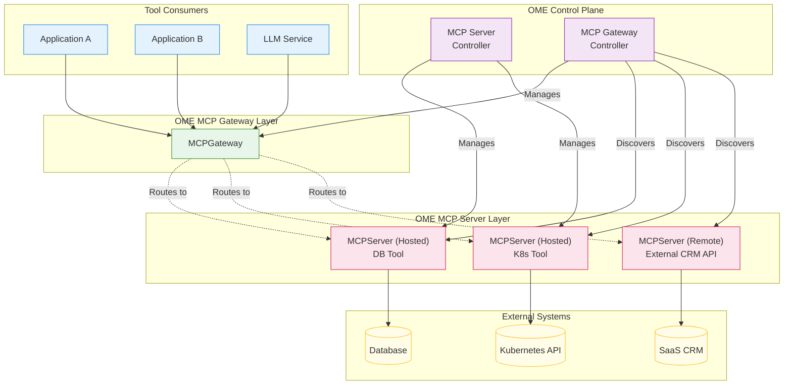

# OEP-0005: Model Context Protocol (MCP) Support with Gateway Architecture

<!--
This OEP introduces comprehensive support for the Model Context Protocol (MCP) in OME,
featuring a dual-CRD architecture with MCPServer for individual server deployment and
MCPGateway for intelligent routing and orchestration. This design enables Large Language
Models to integrate with external tools and services through a secure, scalable, and
AI-aware gateway infrastructure.
-->

<!-- toc -->
- [Summary](#summary)
- [Motivation](#motivation)
  - [Goals](#goals)
  - [Non-Goals](#non-goals)
- [Proposal](#proposal)
  - [User Stories](#user-stories)
    - [Story 1: Data Scientist Exposing a Database Tool](#story-1-data-scientist-exposing-a-database-tool)
    - [Story 2: DevOps Engineer Providing Secure Kubernetes Tools](#story-2-devops-engineer-providing-secure-kubernetes-tools)
    - [Story 3: Platform Team Aggregating Shared Tools](#story-3-platform-team-aggregating-shared-tools)
  - [Notes/Constraints/Caveats](#notesconstraintscaveats)
  - [Risks and Mitigations](#risks-and-mitigations)
- [Design Details](#design-details)
  - [API Specifications](#api-specifications)
    - [MCPServer Resource](#mcpserver-resource)
    - [MCPGateway Resource](#mcpgateway-resource)
  - [Architecture Overview](#architecture-overview)
    - [Component Interaction](#component-interaction)
    - [Request Flow](#request-flow)
  - [Security Model](#security-model)
  - [Deployment Patterns](#deployment-patterns)
    - [Pattern 1: Simple Tool Server with Gateway](#pattern-1-simple-tool-server-with-gateway)
    - [Pattern 2: Cluster-Wide Shared Tools](#pattern-2-cluster-wide-shared-tools)
    - [Pattern 3: Remote Server Integration](#pattern-3-remote-server-integration)
  - [Test Plan](#test-plan)
    - [Unit Tests](#unit-tests)
    - [Integration Tests](#integration-tests)
- [Drawbacks](#drawbacks)
<!-- /toc -->

## Summary

This OEP introduces native support for the Model Context Protocol (MCP) in OME through a **gateway-based architecture** featuring two complementary sets of CRDs:

1.  **`MCPServer` / `ClusterMCPServer`**: Defines and manages the lifecycle of individual MCP tool servers, whether they are hosted within the cluster or are external remote services.
2.  **`MCPGateway` / `ClusterMCPGateway`**: Acts as an intelligent and secure entry point for consuming MCP tools. It discovers `MCPServer`s, routes requests, enforces policies, and exposes a unified tool endpoint.

This refactored design significantly enhances the previous proposal by abstracting server definitions and introducing a powerful gateway layer. `MCPServer` now clearly separates `Hosted` servers (defined via a `PodTemplateSpec`) from `Remote` servers. The `MCPGateway` is the central piece of the architecture, providing:

-   **Dynamic Discovery**: Discovers `MCPServer`s using label selectors or static references.
-   **Intelligent Routing**: Routes requests based on priority, health, and other parameters defined in server references.
-   **Unified Policy Enforcement**: Centralizes authentication, authorization, rate limiting, and other policies (Note: `Policy` and `Observability` specs are still under development and will subject to change).
-   **Flexible Network Exposure**: Provides extensive options for exposing the gateway via Kubernetes Services and Ingress.

This separation of concerns—`MCPServer` for tool implementation and `MCPGateway` for tool consumption—creates a scalable, secure, and manageable ecosystem for integrating LLMs with external tools and services.

## Motivation

Modern AI applications increasingly require LLMs to interact with external systems beyond simple text generation. Use cases include:

-   **Data Analysis**: LLMs querying databases, accessing APIs, and processing files to provide insights.
-   **Infrastructure Management**: AI agents managing cloud resources, deployments, and monitoring systems.
-   **Business Process Automation**: Models performing complex workflows involving multiple systems.
-   **Research and Development**: AI assistants with access to specialized tools and datasets.

Currently, integrating LLMs with external tools requires custom implementations for each service, leading to fragmentation, security complexities, and high operational overhead. The Model Context Protocol (MCP) provides a standard interface, but enterprises need a robust framework for managing and consuming these tool servers securely and at scale. This OEP addresses that need.

### Goals

1.  **Dual-CRD Architecture**: Provide separate CRDs for server definition (`MCPServer`) and gateway-based consumption (`MCPGateway`).
2.  **Flexible Server Definition**: Support both in-cluster `Hosted` servers using a native `PodTemplateSpec` and `Remote` external servers.
3.  **Gateway-Centric Consumption**: Establish the `MCPGateway` as the primary, secure entry point for all MCP tool traffic.
4.  **Dynamic Server Discovery**: Enable gateways to dynamically discover and route to `MCPServer`s using label selectors.
5.  **Advanced Security Model**: Implement a granular permission model for `MCPServer`s, including access to Kubernetes resources, and centralize authentication/authorization at the gateway.
6.  **Rich Network Configuration**: Offer comprehensive options for service exposure, transport protocols, and ingress.
7.  **Developer Experience**: Provide intuitive and idiomatic Kubernetes APIs with strong validation and sensible defaults.

### Non-Goals

1.  **MCP Protocol Implementation**: This OEP focuses on deployment and orchestration, not on building an MCP protocol library.
2.  **Custom Tool Development**: Building domain-specific MCP tools is outside the scope.
3.  **Legacy Protocol Support**: The focus is on the standardized MCP interface, not proprietary protocols.

## Proposal

We will introduce two primary CRDs, `MCPServer` and `MCPGateway`, along with their cluster-scoped counterparts (`ClusterMCPServer`, `ClusterMCPGateway`).

### `MCPServer`: The Tool Provider

This CRD defines a single MCP tool server. The key change is the `spec` now clearly distinguishes between two types of servers:

-   **`hosted`**: For servers running inside the cluster. It contains a `podSpec` of type `corev1.PodTemplateSpec`, allowing users to define the server's workload using the full power of Kubernetes pod specifications. This is a major improvement in flexibility over the previous design.
-   **`remote`**: For servers running outside the cluster, specified by a simple `url`.

The `MCPServer` spec also defines the server's capabilities, transport protocol, and security policies, including a powerful new `permissionProfile` for controlling access to Kubernetes resources and outbound network traffic.

### `MCPGateway`: The Tool Consumer Gateway

This CRD deploys and manages a gateway that acts as the single entry point for accessing one or more `MCPServer`s. Its core responsibilities are:

-   **Server Discovery**: The `mcpServers` field allows the gateway to find its upstream `MCPServer`s either through a `static` list of references or dynamically via a `selector`.
-   **Routing and Load Balancing**: The gateway routes incoming requests to healthy upstream servers. `MCPServerRef` allows for configuring priority and other routing parameters.
-   **Network Exposure**: The `network` spec provides detailed control over how the gateway is exposed, including `Service` configuration, multiple `Transport` protocols (HTTP, gRPC, WebSocket), and `Ingress` management.
-   **Policy Enforcement**: The gateway is the central point for enforcing security, traffic, and observability policies.

This architecture ensures that tool consumers interact with a stable, secure gateway endpoint, while platform operators can dynamically manage the backend tool servers.

### User Stories

#### Story 1: Data Scientist Exposing a Database Tool

Alice, a data scientist, has a containerized Python script that uses MCP to expose a SQL database tool. She wants to deploy it securely and make it available to her team's applications.

```yaml
# 1. Deploy the MCPServer for the database tool
apiVersion: ome.io/v1beta1
kind: MCPServer
metadata:
  name: sql-tool-server
  namespace: data-science
  labels:
    team: data-science
    tool-type: database
spec:
  transport: streamable-http
  hosted:
    replicas: 1
    podSpec:
      spec:
        containers:
        - name: mcp-server # The container must be named mcp-server
          image: my-registry/sql-tool-mcp:1.2.0
          env:
          - name: DATABASE_URI
            valueFrom:
              secretKeyRef:
                name: db-credentials
                key: uri
  # Grant network access to the database host
  permissionProfile:
    inline:
      allow:
      - network:
          allowHost:
          - "postgres.data-science.svc.cluster.local"

---
# 2. Deploy an MCPGateway to expose the tool securely
apiVersion: ome.io/v1beta1
kind: MCPGateway
metadata:
  name: data-science-gateway
  namespace: data-science
spec:
  replicas: 1
  # Discover all servers with the 'database' tool-type label
  mcpServers:
    selector:
      matchLabels:
        tool-type: database
    namespaceSelector:
      matchLabels:
        kubernetes.io/metadata.name: data-science
  # Expose the gateway within the cluster
  network:
    service:
      type: ClusterIP
      ports:
      - name: mcp
        port: 8080
```
Now, applications in the `data-science` namespace can connect to `data-science-gateway.data-science.svc.cluster.local:8080` to use the SQL tool, without needing to know the specific details of the `sql-tool-server`.

#### Story 2: DevOps Engineer Providing Secure Kubernetes Tools

Bob, a DevOps engineer, wants to provide an MCP tool that can read `Pod` and `Deployment` resources in specific namespaces. He needs to grant it precise, read-only Kubernetes API access.

```yaml
apiVersion: ome.io/v1beta1
kind: MCPServer
metadata:
  name: k8s-reader-tool
  namespace: devops-tools
  labels:
    app: mcp-tools
spec:
  transport: streamable-http
  hosted:
    podSpec:
      spec:
        serviceAccountName: mcp-k8s-reader-sa
        containers:
        - name: mcp-server
          image: my-registry/k8s-reader-mcp:1.0.0
  # Define a permission profile granting specific, read-only K8s access
  permissionProfile:
    inline:
      allow:
      - kubeResources:
          apiGroups: [""] # Core API group
          resources: ["pods"]
          verbs: ["get", "list", "watch"]
      - kubeResources:
          apiGroups: ["apps"]
          resources: ["deployments"]
          verbs: ["get", "list", "watch"]
```
The controller will create a `Role` and `RoleBinding` for the `mcp-k8s-reader-sa` service account with exactly these permissions, ensuring the tool operates under the principle of least privilege.

#### Story 3: Platform Team Aggregating Shared Tools

Carol's platform team manages several shared tools (e.g., a code search tool, a ticket management tool) deployed as `MCPServer`s across different namespaces. She wants to provide a single, cluster-wide gateway for all teams to use.

```yaml
# A shared tool server
apiVersion: ome.io/v1beta1
kind: MCPServer
metadata:
  name: code-search-tool
  namespace: shared-tools
  labels:
    gateway: "cluster-default"
spec:
  # ... server spec ...

---
# Another shared tool server
apiVersion: ome.io/v1beta1
kind: MCPServer
metadata:
  name: ticketing-tool
  namespace: enterprise-tools
  labels:
    gateway: "cluster-default"
spec:
  # ... server spec ...

---
# The cluster-wide gateway that discovers all servers with the right label
apiVersion: ome.io/v1beta1
kind: ClusterMCPGateway
metadata:
  name: default-gateway
spec:
  replicas: 3
  # Discover all MCPServers across the cluster with the label 'gateway: cluster-default'
  mcpServers:
    selector:
      matchLabels:
        gateway: "cluster-default"
  # Expose the gateway via a LoadBalancer with an Ingress
  network:
    service:
      type: LoadBalancer
    ingress:
      enabled: true
      className: "nginx"
      hosts:
      - host: "mcp-tools.my-company.com"
        paths:
        - path: /
          pathType: Prefix
          serviceName: default-gateway # This needs to be known/stable
          servicePort: 80
```
This setup provides a highly available, unified entry point for all shared tools, simplifying access for consumer applications.

### Notes/Constraints/Caveats

1.  **Hosted Server Container Name**: When using a `hosted` `MCPServer`, the container running the MCP server process within the `podSpec` must be named `mcp-server` for the controller to correctly inject configurations.
2.  **Permissions**: The new `permissionProfile` with `kubeResources` is very powerful. Misconfiguration can create security risks. The controller creates `Roles`/`RoleBindings`, so RBAC must be enabled in the cluster.
3.  **Gateway as Entry Point**: While direct access to `MCPServer` services is possible, the intended architecture is for all traffic to flow through an `MCPGateway`. The gateway provides crucial features like policy enforcement, routing, and a stable endpoint.
4.  **Transport Limitations**: `stdio` transport is only suitable for simple, single-shot tools and does not support scaling beyond one replica. `streamable-http` or `sse` are recommended for production.
5.  **Incomplete Gateway Features**: The provided API spec for `MCPGateway` includes fields for `policy` and `observability`, but their detailed schemas are not yet fully determined. 

### Risks and Mitigations

-   **Risk 1: Over-privileged Tool Servers**: The `kubeResources` permission could grant excessive permissions.
    -   **Mitigation**: The API is declarative. All permissions are explicitly defined in the YAML and auditable. The controller generates narrowly scoped `Roles`. Documentation will strongly emphasize the principle of least privilege.
-   **Risk 2: Gateway as a Single Point of Failure**: If the gateway goes down, all tool access is lost.
    -   **Mitigation**: The `MCPGateway` spec supports `replicas`, allowing for highly available deployments. Standard Kubernetes practices for HA (e.g., Pod anti-affinity) can be applied via the `podSpec`.
-   **Risk 3: Complex Configuration**: The new specs, especially `MCPGateway`'s network config and `MCPServer`'s `podSpec`, add complexity.
    -   **Mitigation**: The API will have sensible defaults. We will provide comprehensive documentation, examples, and user guides for common patterns.

## Design Details

### API Specifications

#### MCPServer Resource

The `MCPServer` CRD defines a tool server. Its `spec` is the core of the definition.

**`MCPServerSpec`**

```go
// MCPServerSpec defines the desired state of an MCPServer.
// An MCPServer can either be 'Hosted' within the cluster or a 'Remote' external service.
// +kubebuilder:validation:XValidation:rule="has(self.hosted) || has(self.remote)", message="either hosted or remote must be specified"
// +kubebuilder:validation:XValidation:rule="!(has(self.hosted) && has(self.remote))", message="hosted and remote are mutually exclusive"
type MCPServerSpec struct {
	// Hosted defines a server that runs as pods within the cluster.
	// +optional
	Hosted *HostedMCPServer `json:"hosted,omitempty"`

	// Remote defines a server that is accessed via an external URL.
	// +optional
	Remote *RemoteMCPServer `json:"remote,omitempty"`

	// Transport specifies the transport protocol for MCP communication.
	// +kubebuilder:default=stdio
	// +optional
	Transport MCPTransportType `json:"transport,omitempty"`

	// Capabilities defines the features supported by this server.
	// +optional
	Capabilities *MCPCapabilities `json:"capabilities,omitempty"`

	// Version of the MCP server software.
	// +optional
	Version string `json:"version,omitempty"`

	// PermissionProfile defines the operational permissions for the server.
	// +optional
	PermissionProfile *PermissionProfileSource `json:"permissionProfile,omitempty"`

	// OIDCConfig defines OIDC authentication for authenticating clients.
	// +optional
	OIDCConfig *OIDCConfigSource `json:"oidcConfig,omitempty"`

	// AuthzConfig defines authorization policies for the server.
	// +optional
	AuthzConfig *AuthzConfigSource `json:"authzConfig,omitempty"`

	// ToolsFilter restricts the tools exposed by this server.
	// +optional
	// +listType=set
	ToolsFilter []string `json:"toolsFilter,omitempty"`
}
```

-   **`hosted` vs `remote`**: The spec enforces that exactly one of these is set.
-   **`HostedMCPServer`**:
    ```go
    type HostedMCPServer struct {
        // PodSpec defines the pod template to use for the MCP server.
        PodSpec corev1.PodTemplateSpec `json:"podSpec"`

        // Replicas is the number of desired replicas for the server.
        // +kubebuilder:validation:Minimum=0
        // +kubebuilder:default=1
        // +optional
        Replicas *int32 `json:"replicas,omitempty"`
    }
    ```
    This structure delegates all pod-level configuration to the standard `PodTemplateSpec`, making it incredibly flexible and familiar to Kubernetes users.
-   **`RemoteMCPServer`**:
    ```go
    type RemoteMCPServer struct {
        // URL is the external URL of the remote MCP server.
        // +kubebuilder:validation:Pattern=`^https?://.*`
        URL string `json:"url"`
    }
    ```
-   **`PermissionProfileSource`**: This defines the permissions for a `Hosted` server.
    ```go
    // +kubebuilder:validation:XValidation:rule="(has(self.builtin) + has(self.configMap) + has(self.inline)) <= 1",message="at most one of builtin, configMap, or inline can be set"
    type PermissionProfileSource struct {
        Builtin   *BuiltinPermissionProfile      `json:"builtin,omitempty"`
        ConfigMap *corev1.ConfigMapKeySelector   `json:"configMap,omitempty"`
        Inline    *PermissionProfileSpec         `json:"inline,omitempty"`
    }

    type PermissionProfileSpec struct {
        // Allow specifies the permissions granted to the server.
        // +listType=atomic
        Allow []PermissionRule `json:"allow"`
    }

    type PermissionRule struct {
        KubeResources *KubeResourcePermission `json:"kubeResources,omitempty"`
        Network       *NetworkPermission      `json:"network,omitempty"`
    }
    ```
    The most powerful feature here is `KubeResourcePermission`, which allows granting fine-grained RBAC permissions to the server's pod.
    ```go
    type KubeResourcePermission struct {
        APIGroups []string `json:"apiGroups"`
        Resources []string `json:"resources"`
        Verbs     []string `json:"verbs"`
    }
    ```

#### MCPGateway Resource

The `MCPGateway` CRD defines the consumer-facing entry point for tools.

**`MCPGatewaySpec`**

```go
// MCPGatewaySpec defines the desired state of MCPGateway.
// +kubebuilder:validation:XValidation:rule="has(self.mcpServers.static) || has(self.mcpServers.selector)", message="either static MCP server references or dynamic selector must be specified"
type MCPGatewaySpec struct {
	// Replicas is the number of desired replicas for the gateway.
	// +kubebuilder:validation:Minimum=1
	// +kubebuilder:default=1
	// +optional
	Replicas *int32 `json:"replicas,omitempty"`

	// PodSpec defines the pod template for the gateway deployment.
	// +optional
	PodSpec *corev1.PodTemplateSpec `json:"podSpec,omitempty"`

	// MCPServers defines how the gateway discovers and connects to MCP servers.
	// +kubebuilder:validation:Required
	MCPServers MCPServerDiscoveryConfig `json:"mcpServers"`

	// Transport defines the supported transport protocols for MCP communication.
	// +optional
	Transport *MCPTransportType `json:"transport,omitempty"`

	// Policy defines unified security, authentication, authorization, and traffic policies.
	// (Note: Schema for this field is not yet fully defined)
	// +optional
	Policy *MCPGatewayPolicyConfig `json:"policy,omitempty"`

	// Observability defines monitoring, metrics, and tracing configuration.
	// (Note: Schema for this field is not yet fully defined)
	// +optional
	Observability *MCPGatewayObservabilityConfig `json:"observability,omitempty"`

	// Network defines service exposure and ingress settings.
	// +optional
	Network *MCPGatewayNetworkConfig `json:"network,omitempty"`

	// ProtocolVersion defines MCP protocol version constraints and negotiation settings.
	// +optional
	ProtocolVersion *MCPProtocolVersionConfig `json:"protocolVersion,omitempty"`
}
```

-   **`MCPServerDiscoveryConfig`**: This is how the gateway finds its backends.
    ```go
    type MCPServerDiscoveryConfig struct {
        // Static provides a fixed list of MCP server references.
        // +optional
        Static []MCPServerRef `json:"static,omitempty"`

        // Selector allows dynamic discovery of MCPServer resources using a label selector.
        // +optional
        Selector *metav1.LabelSelector `json:"selector,omitempty"`

        // NamespaceSelector restricts server discovery to specific namespaces.
        // +optional
        NamespaceSelector *metav1.LabelSelector `json:"namespaceSelector,omitempty"`
        
        // ... health checks and other fields
    }
    ```
-   **`MCPServerRef`**: When using a static list, this defines routing parameters for each backend.
    ```go
    type MCPServerRef struct {
        Name      string `json:"name"`
        Namespace string `json:"namespace,omitempty"`
        // Priority for server selection (lower value is higher priority).
        // +kubebuilder:default=0
        Priority *int32 `json:"priority,omitempty"`
        // ... other override fields
    }
    ```
-   **`MCPGatewayNetworkConfig`**: This provides a rich set of options for exposing the gateway.
    ```go
    type MCPGatewayNetworkConfig struct {
        // Service defines the service configuration for the gateway.
        Service *GatewayServiceConfig `json:"service,omitempty"`

        // Transport defines the transport protocol configuration.
        Transport *GatewayTransportConfig `json:"transport,omitempty"`

        // Ingress defines ingress configuration for external access.
        Ingress *GatewayIngressConfig `json:"ingress,omitempty"`
    }
    ```
    This allows fine-grained control over the `Service` type, ports, transport-level settings (HTTP, gRPC, WebSocket), and `Ingress` creation.

### Architecture Overview

The architecture is centered around the `MCPGateway` as the demarcation point between tool consumers and tool providers.



#### Component Interaction

1.  **`MCPServer` Controller**: Watches `MCPServer` resources. For `hosted` servers, it creates `Deployments`, `Services`, and any necessary RBAC resources (`Role`, `RoleBinding`) based on the `permissionProfile`.
2.  **`MCPGateway` Controller**: Watches `MCPGateway` resources. It creates a `Deployment` and `Service` for the gateway itself. Its main task is to configure the gateway pods with the list of upstream `MCPServer`s, which it discovers based on the `mcpServers` spec.
3.  **`MCPGateway` (Data Plane)**: The running gateway pods receive requests from consumers. They route these requests to the appropriate backend `MCPServer` based on their internal configuration.
4.  **`MCPServer` (Data Plane)**: The running tool server pods execute the tool logic, potentially interacting with other systems like databases or the Kubernetes API.

#### Request Flow

1.  A **Tool Consumer** (e.g., an LLM application) sends an MCP request to the `MCPGateway`'s service endpoint.
2.  The `MCPGateway` receives the request. It applies any configured policies (auth, rate limiting).
3.  The gateway's routing logic selects a healthy backend `MCPServer` from its discovered list.
4.  The gateway forwards the MCP request to the selected `MCPServer`.
5.  The `MCPServer` processes the request, performs the tool action, and sends the response back to the `MCPGateway`.
6.  The `MCPGateway` streams the response back to the original consumer.

### Security Model

The security model is multi-layered:

1.  **Gateway Authentication/Authorization**: The `MCPGateway` is the primary point for client authentication (e.g., OIDC) and authorization. This centralizes client-facing security. (Note: This relies on the `policy` spec).
2.  **Server-to-Server Authentication**: The gateway can be configured to authenticate to backend `MCPServer`s (e.g., using mTLS or service account tokens).
3.  **Workload Permissions (`permissionProfile`)**: `MCPServer`s run with the minimum necessary permissions. The `permissionProfile` allows operators to define granular access to:
    -   **Kubernetes API**: Through `kubeResources`, the controller generates least-privilege `Roles`.
    -   **Network**: Through `network`, outbound traffic from the tool server can be restricted to a specific list of hosts.
4.  **Kubernetes Security Primitives**: By leveraging `PodTemplateSpec`, users can apply standard Kubernetes security mechanisms like `SecurityContext`, `NetworkPolicy`, and `ServiceAccount` configuration.

### Deployment Patterns

#### Pattern 1: Simple Tool Server with Gateway

A single `MCPServer` fronted by a dedicated `MCPGateway` in the same namespace. This is the pattern from User Story 1. It provides a clear boundary and dedicated endpoint for a specific tool or set of tools.

#### Pattern 2: Cluster-Wide Shared Tools

Multiple `MCPServer`s are deployed across various namespaces, all labeled for discovery by a single `ClusterMCPGateway`. This is the pattern from User Story 3. It's ideal for platform teams providing a common set of tools to an entire organization.

#### Pattern 3: Remote Server Integration

An `MCPServer` of type `remote` is created to represent a tool hosted outside the cluster (e.g., a SaaS API). An `MCPGateway` then discovers this `remote` server and routes to its URL, treating it just like a hosted server. This allows the gateway to act as a unified access point for both internal and external tools.

```yaml
# Represents an external tool
apiVersion: ome.io/v1beta1
kind: MCPServer
metadata:
  name: external-weather-service
  namespace: api-integrations
  labels:
    gateway: "default"
spec:
  remote:
    url: "https://api.weather-provider.com/mcp"
  transport: streamable-http

# A gateway that routes to it
apiVersion: ome.io/v1beta1
kind: MCPGateway
metadata:
  name: default-gateway
  namespace: api-integrations
spec:
  mcpServers:
    selector:
      matchLabels:
        gateway: "default"
  # ...
```

### Test Plan

#### Unit Tests

-   **`MCPServer` Controller**:
    -   Test reconciliation logic for `hosted` and `remote` servers.
    -   Test correct generation of `Deployment`, `Service`, `Role`, and `RoleBinding` from a `hosted` spec.
    -   Test validation of `permissionProfile` rules.
-   **`MCPGateway` Controller**:
    -   Test reconciliation logic for the gateway deployment.
    -   Test `MCPServer` discovery logic for both `static` and `selector` modes.
    -   Test correct configuration of the gateway pods with upstream server lists.
-   **API Webhooks**:
    -   Test validation rules for both `MCPServerSpec` and `MCPGatewaySpec` (e.g., mutual exclusion, required fields).

#### Integration Tests

-   Deploy a `hosted` `MCPServer` and verify all child resources are created correctly.
-   Deploy an `MCPGateway` with a `selector` and verify it discovers the `MCPServer`.
-   Send an MCP request to the gateway and verify it is correctly routed to the server and a response is received.
-   Test the `kubeResources` permission by deploying a tool that tries to access allowed and denied Kubernetes resources.
-   Test the `network` permission by deploying a tool that tries to connect to allowed and denied hosts.
-   Test gateway scaling and rolling updates.

## Drawbacks

1.  **Increased Complexity**: The dual-CRD system with a gateway is more powerful but also more complex to understand and manage than a simple server deployment model.
2.  **Resource Overhead**: Running gateway pods in addition to server pods consumes more cluster resources.
3.  **Latency**: The gateway introduces an extra network hop, which may add a small amount of latency to tool calls.
4.  **Learning Curve**: Users must learn the concepts of both CRDs and how they interact. The use of `PodTemplateSpec` and advanced networking options requires a good understanding of Kubernetes.