# OEP-0005: Model Context Protocol (MCP) Support for LLM Tool Integration

<!--
This OEP introduces comprehensive support for the Model Context Protocol (MCP) in OME,
enabling Large Language Models to integrate with external tools and services through
standardized server deployments. This enhancement allows LLMs to interact with
databases, APIs, file systems, and other external resources in a secure and controlled manner.
-->

<!-- toc -->
- [Summary](#summary)
- [Motivation](#motivation)
  - [Goals](#goals)
  - [Non-Goals](#non-goals)
- [Proposal](#proposal)
  - [User Stories](#user-stories)
    - [Story 1: Data Scientist with Database Access](#story-1-data-scientist-with-database-access)
    - [Story 2: DevOps Engineer with Infrastructure Tools](#story-2-devops-engineer-with-infrastructure-tools)
    - [Story 3: Platform Team with Centralized MCP Services](#story-3-platform-team-with-centralized-mcp-services)
    - [Story 4: Security-Conscious Organization](#story-4-security-conscious-organization)
    - [Story 5: Multi-Tenant SaaS Provider](#story-5-multi-tenant-saas-provider)
  - [Notes/Constraints/Caveats](#notesconstraintscaveats)
  - [Risks and Mitigations](#risks-and-mitigations)
- [Design Details](#design-details)
  - [API Specifications](#api-specifications)
    - [MCPServer Resource](#mcpserver-resource)
    - [ClusterMCPServer Resource](#clustermcpserver-resource)
    - [Transport Types](#transport-types)
    - [Authentication and Authorization](#authentication-and-authorization)
    - [Permission Profiles](#permission-profiles)
  - [Architecture Overview](#architecture-overview)
  - [Security Model](#security-model)
  - [Deployment Patterns](#deployment-patterns)
  - [Test Plan](#test-plan)
    - [Unit Tests](#unit-tests)
    - [Integration Tests](#integration-tests)
  - [Graduation Criteria](#graduation-criteria)
- [Implementation History](#implementation-history)
- [Drawbacks](#drawbacks)
- [Alternatives](#alternatives)
<!-- /toc -->

## Summary

This OEP introduces native support for the Model Context Protocol (MCP) in OME through **MCPServer and ClusterMCPServer CRDs** that enable Large Language Models to integrate with external tools and services. MCP is an open protocol developed by Anthropic that standardizes the interface between LLMs and external systems, allowing models to perform actions like database queries, file operations, API calls, and infrastructure management in a secure and controlled manner.

The implementation provides **MCPServer and ClusterMCPServer CRDs** for deploying and managing tool capabilities as standalone resources within the OME ecosystem. MCPServers exist independently of InferenceServices, providing tool capabilities that can be consumed by external LLM applications through the standardized MCP protocol.

Key capabilities include support for multiple transport protocols (stdio, HTTP streaming, Server-Sent Events), OIDC-based authentication with Kubernetes service account integration, Cedar policy-based authorization, and configurable network and file system permissions. The architecture prioritizes **security, scalability, and operational simplicity** while providing a robust foundation for tool integration in enterprise environments.

## Motivation

Modern AI applications increasingly require LLMs to interact with external systems beyond simple text generation. Use cases include:

- **Data Analysis**: LLMs querying databases, accessing APIs, and processing files to provide insights
- **Infrastructure Management**: AI agents managing cloud resources, deployments, and monitoring systems  
- **Business Process Automation**: Models performing complex workflows involving multiple systems
- **Research and Development**: AI assistants with access to specialized tools and datasets

Currently, integrating LLMs with external tools requires custom implementations for each service, leading to:

1. **Fragmented Integration**: Each tool requires unique integration code and configuration
2. **Security Complexity**: Managing access controls and permissions across diverse systems
3. **Operational Overhead**: Deploying and maintaining multiple custom integration services
4. **Limited Reusability**: Tool integrations cannot be easily shared across different models or deployments

The Model Context Protocol addresses these challenges by providing a standardized interface for LLM-tool integration. However, deploying and managing MCP servers in production environments requires:

- Secure deployment and configuration management
- Authentication and authorization mechanisms
- Network and file system access controls
- Integration with existing Kubernetes infrastructure
- Observability and monitoring capabilities

### Goals

1. **Standardized MCP Integration**: Provide native support for deploying and managing MCP servers within OME
2. **Security-First Design**: Implement comprehensive authentication, authorization, and sandboxing mechanisms
3. **Flexible Deployment Options**: Support both hosted (in-cluster) and remote MCP server configurations
4. **Operational Excellence**: Enable easy deployment, scaling, and monitoring of MCP services
5. **Developer Experience**: Provide intuitive APIs and configuration patterns for common use cases
6. **Integration Consistency**: Seamlessly integrate MCP servers with existing InferenceService workflows
7. **Multi-Transport Support**: Support stdio, HTTP streaming, and Server-Sent Events protocols
8. **Permission Management**: Provide fine-grained control over file system, network, and API access

### Non-Goals

1. **MCP Protocol Implementation**: This OEP focuses on deployment and management, not implementing the MCP protocol itself
2. **Custom Tool Development**: Building domain-specific MCP tools is outside the scope of this OEP
3. **Legacy Protocol Support**: Only support for MCP v1.0+ protocols, not custom or proprietary tool interfaces
4. **Runtime Performance Optimization**: Focus is on deployment and security, not protocol performance tuning
5. **Multi-Cluster MCP**: Initial implementation will not support cross-cluster MCP server federation

## Proposal

Introduce new Kubernetes Custom Resource Definitions (CRDs) for managing MCP servers within OME:

1. **MCPServer** (Namespaced): Deploy and manage MCP servers within specific namespaces
2. **ClusterMCPServer** (Cluster-scoped): Deploy shared MCP servers accessible across namespaces

These resources provide comprehensive configuration options for:
- **Transport Configuration**: Support for stdio, streamable-http, and SSE protocols
- **Authentication**: OIDC integration with Kubernetes service accounts and external providers
- **Authorization**: Cedar policy-based access control with configurable permission profiles
- **Deployment**: Container specifications, resource limits, and scaling options
- **Security**: Network policies, file system access controls, and secrets management

The design follows a **standalone service principle** where MCPServers provide tool capabilities that can be consumed by any external LLM application through the standardized MCP protocol. This approach enables independent resource lifecycle management, better reusability, and cleaner operational boundaries.

### User Stories

#### Story 1: Data Scientist with Database Access

Alice is a data scientist who wants to deploy an MCP server that provides database query tools and separately deploy an InferenceService for LLM capabilities.

**Current Experience:**
```bash
# Alice has to manually set up database connections and write custom code
# No standardized way to provide database access to LLMs
# Security configuration is complex and error-prone
```

**New Experience:**
```yaml
# Step 1: Deploy MCP server with database access
apiVersion: ome.io/v1beta1
kind: MCPServer
metadata:
  name: postgres-mcp
  namespace: data-science
spec:
  type: Hosted
  image: mcp/postgres-server:latest
  transport: streamable-http
  
  # Database connection configuration
  env:
    - name: DATABASE_URL
      valueFrom:
        secretKeyRef:
          name: postgres-credentials
          key: url
  
  # Security: Only allow database connections
  permissionProfile:
    type: builtin
    name: network
  
  # OIDC authentication
  oidcConfig:
    type: kubernetes
    kubernetes:
      audience: data-tools
      namespace: data-science

---
# Step 2: Deploy InferenceService for the LLM
apiVersion: ome.io/v1beta1
kind: InferenceService
metadata:
  name: llama-3-3-70b-instruct
  namespace: moirai
spec:
  model:
    name: llama-3-3-70b-instruct
  runtime:
    name: srt-llama-3-3-70b-instruct

# The MCPServer is now available for consumption by external LLM applications
# via the standardized MCP protocol at the service endpoint
```

#### Story 2: DevOps Engineer with Infrastructure Tools

Bob manages cloud infrastructure and wants to deploy an MCP server that provides infrastructure management tools and separately deploy an InferenceService for LLM capabilities.

**New Experience:**
```yaml
# Step 1: Deploy MCP server with oci and Kubernetes tools
apiVersion: ome.io/v1beta1
kind: MCPServer
metadata:
  name: infra-tools-mcp
  namespace: devops
spec:
  type: Hosted
  image: mcp/infra-tools:latest
  transport: streamable-http
  
  capabilities:
    tools: true    # Enable tool execution
    resources: true # Enable resource access
  
  # oci credentials and Kubernetes access
  secrets:
    - name: oci-credentials
      key: credentials
      targetEnvName: OCI_SHARED_CREDENTIALS_FILE
    - name: kubeconfig
      key: config
      targetEnvName: KUBECONFIG
  
  # Custom permission profile for infrastructure access
  permissionProfile:
    type: configmap
    name: infra-permissions
    key: policy.json
  
  # Resource limits for safety
  resources:
    requests:
      cpu: 100m
      memory: 256Mi
    limits:
      cpu: 500m
      memory: 1Gi

---
# Step 2: Deploy InferenceService for the LLM
apiVersion: ome.io/v1beta1
kind: InferenceService
metadata:
  name: llama-4-scout-17b-16e-instruct
  namespace: moirai
spec:
  model:
    name: llama-4-scout-17b-16e-instruct
  runtime:
    name: srt-llama-4-scout-17b-16e-instruct

---
# Step 3: Permission profile with specific oci and K8s permissions
apiVersion: v1
kind: ConfigMap
metadata:
  name: infra-permissions
  namespace: devops
data:
  policy.json: |
    {
      "read": ["/etc/ssl/certs", "/tmp"],
      "write": ["/tmp"],
      "network": {
        "outbound": {
          "allowHost": [
            "*.ocicloud.com",
            "kubernetes.default.svc"
          ],
          "allowPort": [443, 6443]
        }
      }
    }

# The MCPServer is now available for consumption by external infrastructure management applications
```

#### Story 3: Platform Team with Centralized MCP Services

Carol's platform team wants to provide shared MCP services that can be used by multiple teams across different namespaces.

**New Experience:**
```yaml
# Step 1: Cluster-wide MCP server for common tools
apiVersion: ome.io/v1beta1
kind: ClusterMCPServer
metadata:
  name: shared-tools-mcp
spec:
  type: Hosted
  image: mcp/enterprise-tools:v2.1.0
  transport: streamable-http
  
  # High availability deployment
  replicas: 3
  
  # Shared authentication configuration
  oidcConfig:
    type: kubernetes
    kubernetes:
      audience: enterprise-tools
      issuer: https://kubernetes.default.svc
  
  # Authorization policies for multi-tenant access
  authzConfig:
    type: inline
    inline:
      policies:
        - |
          permit(
            principal in Group::"developers",
            action in [Action::"read", Action::"query"],
            resource in ResourceType::"database"
          ) when {
            principal.department == resource.department
          };
        - |
          permit(
            principal in Group::"admins",
            action,
            resource
          );
      entitiesJSON: |
        [
          {
            "uid": {"type": "Group", "id": "developers"},
            "attrs": {},
            "parents": []
          },
          {
            "uid": {"type": "Group", "id": "admins"}, 
            "attrs": {},
            "parents": []
          }
        ]

---
# Step 2: Teams deploy their own InferenceServices as needed
apiVersion: ome.io/v1beta1
kind: InferenceService
metadata:
  name: team-llm
  namespace: engineering
spec:
  model:
    name: llama-4
  runtime:
    name: srt-llama-4

# The shared ClusterMCPServer is now available cluster-wide for consumption
# by any external LLM applications that can access the cluster
```

#### Story 4: Security-Conscious Organization

Dave's organization has strict security requirements and needs fine-grained control over what MCP servers can access.

**New Experience:**
```yaml
# Step 1: Highly restricted MCP server
apiVersion: ome.io/v1beta1
kind: MCPServer
metadata:
  name: restricted-mcp
  namespace: secure-workloads
spec:
  type: Hosted
  image: mcp/secure-tools:latest
  transport: streamable-http
  
  # Strict resource limits
  resources:
    requests:
      cpu: 50m
      memory: 128Mi
    limits:
      cpu: 200m
      memory: 512Mi
  
  # Custom security profile
  permissionProfile:
    type: configmap
    name: secure-permissions
    key: policy.json
  
  # Mutual TLS authentication
  oidcConfig:
    type: inline
    inline:
      issuer: https://auth.company.com
      audience: secure-mcp-tools
      jwksURL: https://auth.company.com/.well-known/jwks.json
      thvCABundlePath: /etc/ssl/certs/company-ca.pem
      jwksAuthTokenPath: /var/secrets/mcp-auth/token
  
  # Mount company CA and auth tokens
  volumeMounts:
    - name: company-ca
      mountPath: /etc/ssl/certs/company-ca.pem
      subPath: ca.pem
      readOnly: true
    - name: auth-token
      mountPath: /var/secrets/mcp-auth
      readOnly: true
  
  volumes:
    - name: company-ca
      configMap:
        name: company-ca-bundle
    - name: auth-token
      secret:
        secretName: mcp-auth-token

  # Network policies
  podTemplateSpec:
    spec:
      securityContext:
        runAsNonRoot: true
        runAsUser: 10001
        fsGroup: 10001
        seccompProfile:
          type: RuntimeDefault
      containers:
        - name: mcp
          securityContext:
            allowPrivilegeEscalation: false
            capabilities:
              drop: ["ALL"]
            readOnlyRootFilesystem: true

---
# Step 2: Security permission profile
apiVersion: v1
kind: ConfigMap
metadata:
  name: secure-permissions
  namespace: secure-workloads
data:
  policy.json: |
    {
      "read": ["/app/config", "/etc/ssl/certs"],
      "write": ["/tmp/scratch"],
      "network": {
        "outbound": {
          "insecureAllowAll": false,
          "allowHost": [
            "approved-api.company.com",
            "audit-service.company.internal"
          ],
          "allowPort": [443]
        }
      }
    }

---
# Step 3: Deploy secure InferenceService separately  
apiVersion: ome.io/v1beta1
kind: InferenceService
metadata:
  name: llama-4-maverick-17b-128e-instruct-fp8
  namespace: moirai
spec:
  model:
    name: llama-4-maverick-17b-128e-instruct-fp8
  runtime:
    name: srt-llama-4-maverick-17b-128e-instruct-fp8

# The secure MCPServer is now available for consumption by external applications
# with strict security controls and fine-grained access policies
```

#### Story 5: Multi-Tenant SaaS Provider

Emma runs a SaaS platform and needs to provide isolated MCP services for different customer organizations.

**New Experience:**
```yaml
# Step 1: Customer-specific MCP server
apiVersion: ome.io/v1beta1
kind: MCPServer
metadata:
  name: customer-tools-mcp
  namespace: customer-acme
  labels:
    customer: acme-corp
    tier: premium
spec:
  type: Hosted
  image: mcp/saas-tools:v1.5.0
  transport: streamable-http
  
  # Customer-specific configuration
  env:
    - name: CUSTOMER_ID
      value: "acme-corp"
    - name: TENANT_DATABASE_URL
      valueFrom:
        secretKeyRef:
          name: acme-corp-db
          key: url
    - name: API_RATE_LIMIT
      value: "1000" # Premium tier limits
  
  # Customer-specific authentication
  oidcConfig:
    type: configMap
    configMap:
      name: acme-corp-oidc-config
      key: oidc.json
  
  # Tenant-specific authorization
  authzConfig:
    type: configMap
    configMap:
      name: acme-corp-authz-policy
      key: policy.cedar
  
  # Resource allocation based on customer tier
  resources:
    requests:
      cpu: 200m
      memory: 512Mi
    limits:
      cpu: 1000m
      memory: 2Gi
  
  # High availability for premium customers
  replicas: 2
  
  # Dedicated node scheduling
  nodeSelector:
    customer-tier: premium
    
  tolerations:
    - key: premium-workload
      operator: Equal
      value: "true"
      effect: NoSchedule

---
# Step 2: Customer-specific InferenceService (deployed separately)
apiVersion: ome.io/v1beta1
kind: InferenceService
metadata:
  name: acme-corp-llm
  namespace: customer-acme
  labels:
    customer: acme-corp
    tier: premium
spec:
  model:
    name: llama-4
  runtime:
    name: srt-llama-4
  # Customer-tier specific resource allocation
  engine:
    resources:
      requests:
        cpu: 500m
        memory: 1Gi
      limits:
        cpu: 2000m
        memory: 4Gi

# The customer-specific MCPServer is now available for consumption
# by the customer's applications with tenant isolation and premium tier resources
```

### Notes/Constraints/Caveats

1. **MCP Protocol Compliance**: All deployed MCP servers must comply with the MCP v1.0+ specification. The platform validates protocol compatibility during deployment.

2. **Transport Protocol Limitations**: 
   - `stdio` transport is only suitable for single-request scenarios
   - `streamable-http` and `sse` are recommended for production deployments
   - Transport protocol affects scaling capabilities and load balancing options

3. **Authentication Integration**:
   - Kubernetes service account tokens are the preferred authentication method
   - External OIDC providers are supported but require additional configuration
   - Authentication tokens must be properly rotated and managed

4. **Permission Profile Inheritance**:
   - Custom permission profiles override built-in profiles completely
   - No merging of permission sets occurs
   - More restrictive policies cannot be overridden by less restrictive ones

5. **Resource Isolation**:
   - Each MCP server runs in its own container with dedicated resources
   - File system isolation is enforced through security contexts
   - Network policies can be applied for additional isolation

6. **Scalability Considerations**:
   - `stdio` transport cannot be scaled beyond 1 replica
   - HTTP-based transports support horizontal scaling
   - Load balancing and session affinity must be configured appropriately

7. **External Integration**:
   - External applications can consume MCPServers through the standardized MCP protocol
   - Resource discovery is based on service endpoints and RBAC permissions
   - Cross-namespace and cluster-scoped resource access is supported through proper authentication

### Risks and Mitigations

**Risk 1: Security vulnerabilities in MCP servers**
- *Mitigation:* Implement comprehensive permission profiles and security contexts. Require security scanning of MCP server images. Provide built-in security profiles for common use cases.

**Risk 2: Resource exhaustion from poorly behaved MCP servers**
- *Mitigation:* Enforce resource limits and quotas. Implement monitoring and alerting for resource usage. Provide safe defaults and guidelines for resource allocation.

**Risk 3: Network security breaches through MCP servers**
- *Mitigation:* Default to restrictive network policies. Provide network permission profiles with explicit allow-lists. Support network policy integration and monitoring.

**Risk 4: Authentication and authorization bypass**
- *Mitigation:* Use strong default authentication mechanisms. Integrate with Kubernetes RBAC. Provide comprehensive audit logging and monitoring.

**Risk 5: Protocol incompatibility and integration issues**
- *Mitigation:* Validate MCP protocol compliance during deployment. Provide comprehensive testing and compatibility matrices. Support multiple protocol versions.


## Design Details

### API Specifications

#### MCPServer Resource

The `MCPServer` is a namespaced resource that manages MCP server deployments within a specific namespace:

```go
// MCPServerSpec defines the desired state of MCPServer
type MCPServerSpec struct {
    // Type specifies whether this is a hosted or remote MCP server
    // +kubebuilder:validation:Enum=Hosted;Remote
    // +kubebuilder:default=Hosted
    Type MCPServerType `json:"type,omitempty"`

    // Image is the container image for the MCP server (Hosted only)
    Image string `json:"image,omitempty"`

    // URL is the external URL for remote MCP servers (Remote only)
    // +kubebuilder:validation:Pattern=`^https?://.*`
    URL string `json:"url,omitempty"`

    // Transport specifies the communication protocol
    // +kubebuilder:validation:Enum=stdio;streamable-http;sse
    // +kubebuilder:default=stdio
    Transport MCPTransportType `json:"transport,omitempty"`

    // Protocol defines the MCP protocol specification
    Protocol *MCPProtocolSpec `json:"protocol,omitempty"`

    // Capabilities defines supported MCP capabilities
    Capabilities *MCPCapabilities `json:"capabilities,omitempty"`

    // Authentication and authorization configuration
    OIDCConfig *OIDCConfigRef `json:"oidcConfig,omitempty"`
    AuthzConfig *AuthzConfigRef `json:"authzConfig,omitempty"`
    PermissionProfile *PermissionProfileRef `json:"permissionProfile,omitempty"`

    // Deployment configuration
    Replicas *int32 `json:"replicas,omitempty"`
    Port int32 `json:"port,omitempty"`
    TargetPort int32 `json:"targetPort,omitempty"`
    
    // Container configuration
    Args []string `json:"args,omitempty"`
    Env []corev1.EnvVar `json:"env,omitempty"`
    Resources *corev1.ResourceRequirements `json:"resources,omitempty"`
    
    // Security and access control
    Secrets []SecretRef `json:"secrets,omitempty"`
    ServiceAccount *string `json:"serviceAccount,omitempty"`
    ToolsFilter []string `json:"toolsFilter,omitempty"`
    
    // Kubernetes scheduling
    NodeSelector map[string]string `json:"nodeSelector,omitempty"`
    Tolerations []corev1.Toleration `json:"tolerations,omitempty"`
    Affinity *corev1.Affinity `json:"affinity,omitempty"`
    
    // Advanced configuration
    PodTemplateSpec *corev1.PodTemplateSpec `json:"podTemplateSpec,omitempty"`
    VolumeMounts []corev1.VolumeMount `json:"volumeMounts,omitempty"`
    Volumes []corev1.Volume `json:"volumes,omitempty"`
}
```

#### ClusterMCPServer Resource

The `ClusterMCPServer` is a cluster-scoped resource for shared MCP servers:

```go
// ClusterMCPServer provides cluster-wide MCP server deployment
// It shares the same spec as MCPServer but has cluster scope
type ClusterMCPServer struct {
    metav1.TypeMeta   `json:",inline"`
    metav1.ObjectMeta `json:"metadata,omitempty"`
    
    Spec   MCPServerSpec   `json:"spec,omitempty"`
    Status MCPServerStatus `json:"status,omitempty"`
}
```

#### Transport Types

**stdio Transport**
```yaml
spec:
  transport: stdio
  # stdin/stdout communication
  # Single replica only
  # Best for simple tools and debugging
```

**streamable-http Transport**
```yaml
spec:
  transport: streamable-http
  port: 8080
  targetPort: 8080
  # HTTP with streaming support
  # Supports horizontal scaling
  # Production-ready
```

**sse Transport**
```yaml
spec:
  transport: sse
  port: 8080
  targetPort: 8080
  # Server-Sent Events
  # Real-time bidirectional communication
  # Web-friendly protocol
```

#### Authentication and Authorization

**Kubernetes Service Account Authentication**
```yaml
spec:
  oidcConfig:
    type: kubernetes
    kubernetes:
      namespace: default  # optional, defaults to MCPServer namespace
      audience: mcp-tools
      issuer: https://kubernetes.default.svc
      useClusterAuth: true  # Use cluster CA and service account token
```

**External OIDC Provider**
```yaml
spec:
  oidcConfig:
    type: inline
    inline:
      issuer: https://auth.company.com
      audience: mcp-services
      jwksURL: https://auth.company.com/.well-known/jwks.json
      # Optional mutual TLS
      thvCABundlePath: /etc/ssl/certs/ca.pem
      jwksAuthTokenPath: /var/secrets/auth/token
```

**Cedar Authorization Policies**
```yaml
spec:
  authzConfig:
    type: inline
    inline:
      policies:
        - |
          permit(
            principal in Group::"developers",
            action in [Action::"query", Action::"read"],
            resource in ResourceType::"database"
          ) when {
            principal.team == resource.team
          };
        - |
          permit(
            principal in Group::"admins",
            action,
            resource
          );
      entitiesJSON: |
        [
          {"uid": {"type": "Group", "id": "developers"}, "attrs": {}, "parents": []},
          {"uid": {"type": "Group", "id": "admins"}, "attrs": {}, "parents": []}
        ]
```

#### Permission Profiles

**Built-in Permission Profiles**

`none` - No external access:
```yaml
spec:
  permissionProfile:
    type: builtin
    name: none
  # Allows no file system or network access
  # Suitable for pure computational tools
```

`network` - Network access only:
```yaml
spec:
  permissionProfile:
    type: builtin
    name: network
  # Allows outbound network connections
  # No file system write access
  # Suitable for API and database tools
```

**Custom Permission Profiles**
```yaml
spec:
  permissionProfile:
    type: configmap
    name: custom-permissions
    key: permissions.json

---
apiVersion: v1
kind: ConfigMap
metadata:
  name: custom-permissions
data:
  permissions.json: |
    {
      "read": [
        "/app/config",
        "/etc/ssl/certs",
        "/var/data"
      ],
      "write": [
        "/tmp",
        "/var/output"
      ],
      "network": {
        "outbound": {
          "insecureAllowAll": false,
          "allowHost": [
            "api.service.com",
            "database.internal",
            "*.trusted-domain.com"
          ],
          "allowPort": [443, 5432, 6379]
        }
      }
    }
```

### Architecture Overview

The MCP support implementation in OME follows a **standalone service architecture** where tool capabilities are provided through dedicated MCP servers that exist independently within the OME ecosystem:

- **InferenceService**: Handles pure LLM serving and inference (existing capability)
- **MCPServer**: Provides tools and external system access capabilities through standardized MCP protocol
- **ClusterMCPServer**: Provides cluster-wide tool capabilities accessible across namespaces

This approach enables:
- **Modularity**: MCP servers can be developed, deployed, and scaled independently of any LLM serving infrastructure
- **Reusability**: MCP servers can be consumed by multiple external applications through the standard MCP protocol
- **Security**: Fine-grained access control and permission profiles for tool access
- **Flexibility**: Tool capabilities exist as first-class resources within the Kubernetes cluster

#### High-Level Architecture

The following diagram illustrates the standalone MCP server architecture within the OME ecosystem:

```mermaid
graph TB
    subgraph "External Applications"
        direction TB
        ExtApp1["🌐 External LLM Application<br/>(Data Analysis)"]
        ExtApp2["🌐 External LLM Application<br/>(DevOps Automation)"]
        ExtApp3["🌐 External LLM Application<br/>(Sales Assistant)"]
    end
    
    subgraph "OME LLM Serving Layer"
        direction LR
        ISVC1["🧠 InferenceService<br/>llama-3-3-70b-instruct<br/>(Data Science)"]
        ISVC2["🧠 InferenceService<br/>llama-4<br/>(DevOps)"]
        ISVC3["🧠 InferenceService<br/>sales-llm<br/>(Sales)"]
    end
    
    subgraph "OME MCP Tools Layer"
        direction LR
        MCP1["🔧 MCPServer<br/>postgres-mcp<br/>(Database Tools)"]
        MCP2["🔧 MCPServer<br/>infra-tools<br/>(Infrastructure Tools)"]
        MCP3["🔧 ClusterMCPServer<br/>shared-tools<br/>(Enterprise APIs)"]
        MCP4["🔧 MCPServer<br/>crm-tools<br/>(External CRM)"]
    end
    
    subgraph "OME Control Plane"
        direction LR
        Controller["📋 MCP Controller"]
        ISVCController["📋 InferenceService Controller"]
    end
    
    subgraph "Security & Infrastructure"
        direction LR
        OIDC["🔐 OIDC Provider"]
        RBAC["🛡️ Kubernetes RBAC"]
        NetworkPol["🌐 Network Policies"]
        PermProfiles["📜 Permission Profiles"]
    end
    
    subgraph "External Systems"
        direction LR
        Database[("🗄️ PostgreSQL")]
        CloudAPIs["☁️ Cloud APIs"]
        K8sAPI["⚙️ Kubernetes API"]
        CRMAPI["📊 CRM System"]
    end
    
    %% External application consumption (dashed lines = consumes via MCP protocol)
    ExtApp1 -.->|MCP Protocol| MCP1
    ExtApp1 -.->|HTTP/gRPC| ISVC1
    
    ExtApp2 -.->|MCP Protocol| MCP2  
    ExtApp2 -.->|MCP Protocol| MCP3
    ExtApp2 -.->|HTTP/gRPC| ISVC2
    
    ExtApp3 -.->|MCP Protocol| MCP4
    ExtApp3 -.->|MCP Protocol| MCP3
    ExtApp3 -.->|HTTP/gRPC| ISVC3
    
    %% Control plane management (solid lines = manages)
    Controller -->|manages| MCP1
    Controller -->|manages| MCP2
    Controller -->|manages| MCP3
    Controller -->|manages| MCP4
    
    ISVCController -->|manages| ISVC1
    ISVCController -->|manages| ISVC2
    ISVCController -->|manages| ISVC3
    
    %% External system connections
    MCP1 -->|connects to| Database
    MCP2 -->|connects to| CloudAPIs
    MCP2 -->|connects to| K8sAPI
    MCP4 -->|connects to| CRMAPI
    
    %% Security enforcement
    OIDC -->|authenticates| MCP1
    OIDC -->|authenticates| MCP2
    OIDC -->|authenticates| MCP3
    OIDC -->|authenticates| MCP4
    
    RBAC -->|authorizes| Controller
    RBAC -->|authorizes| ISVCController
    
    NetworkPol -->|restricts| MCP1
    NetworkPol -->|restricts| MCP2
    NetworkPol -->|restricts| MCP3
    NetworkPol -->|restricts| MCP4
    
    PermProfiles -->|governs| MCP1
    PermProfiles -->|governs| MCP2
    PermProfiles -->|governs| MCP3
    PermProfiles -->|governs| MCP4
    
    %% Styling
    classDef extApp fill:#e1f5fe,stroke:#0277bd,stroke-width:2px
    classDef llmService fill:#f3e5f5,stroke:#7b1fa2,stroke-width:2px
    classDef mcpService fill:#e8f5e8,stroke:#2e7d32,stroke-width:2px
    classDef controller fill:#fff3e0,stroke:#ef6c00,stroke-width:2px
    classDef security fill:#fce4ec,stroke:#c2185b,stroke-width:2px
    classDef external fill:#f1f8e9,stroke:#558b2f,stroke-width:2px
    
    class ExtApp1,ExtApp2,ExtApp3 extApp
    class ISVC1,ISVC2,ISVC3 llmService
    class MCP1,MCP2,MCP3,MCP4 mcpService
    class Controller,ISVCController controller
    class OIDC,RBAC,NetworkPol,PermProfiles security
    class Database,CloudAPIs,K8sAPI,CRMAPI external
```



#### MCP Server Access Pattern

The following sequence diagram shows how external applications can consume MCP servers:


**Key Architectural Principles:**

1. **Standalone Services**: MCPServers exist as independent services within the Kubernetes cluster
2. **Protocol Standardization**: All tool access follows the standardized MCP protocol for interoperability
3. **Resource Independence**: MCPServers can be managed, scaled, and secured independently of any LLM infrastructure
4. **External Consumption**: MCPServers are designed to be consumed by external applications via standard network protocols

### Security Model

The MCP support implementation follows a defense-in-depth security model with multiple layers of protection:

**1. Authentication Layer**
- OIDC-based authentication with support for Kubernetes service accounts
- Token validation and refresh mechanisms
- Mutual TLS support for high-security environments

**2. Authorization Layer**
- Cedar policy-based authorization with fine-grained access controls
- Integration with Kubernetes RBAC for namespace and cluster-level permissions
- Dynamic policy evaluation based on user, resource, and context

**3. Network Security**
- Default-deny network policies with explicit allow-lists
- Support for private networks and VPN integration
- Traffic encryption and monitoring capabilities

**4. Container Security**
- Mandatory security contexts with non-root execution
- Read-only root filesystems where possible
- Resource limits and quotas enforcement
- seccomp and AppArmor profile support

**5. File System Security**
- Explicit read/write permission definitions
- chroot-style isolation for file access
- Temporary directory restrictions and cleanup

**6. Audit and Monitoring**
- Comprehensive audit logging for all MCP operations
- Metrics collection for security events and policy violations
- Integration with security information systems


### Deployment Patterns

**Pattern 1: Departmental MCP Services**
Each department deploys their own MCP servers with team-specific tools and access permissions. InferenceServices can be deployed separately as needed.

```yaml
# Data Science team MCP server
apiVersion: ome.io/v1beta1
kind: MCPServer
metadata:
  name: data-science-tools
  namespace: data-science
spec:
  image: mcp/data-tools:latest
  permissionProfile:
    type: builtin
    name: network
  env:
    - name: DEPARTMENT
      value: data-science

---
# Data Science team InferenceService (deployed separately)
apiVersion: ome.io/v1beta1
kind: InferenceService
metadata:
  name: data-science-llm
  namespace: data-science
spec:
  model:
    name: llama-3-3-70b-instruct
  runtime:
    name: srt-llama-3-3-70b-instruct

# Both resources are available independently for consumption by external applications
```

**Pattern 2: Shared Infrastructure Services**
Platform teams provide cluster-wide MCP servers for common infrastructure operations, while teams deploy their own InferenceServices independently.

```yaml
# Cluster-wide infrastructure tools
apiVersion: ome.io/v1beta1
kind: ClusterMCPServer
metadata:
  name: infrastructure-tools
spec:
  image: mcp/infra-tools:latest
  replicas: 3
  authzConfig:
    type: configMap
    configMap:
      name: infra-authz-policy

---
# Teams can deploy their own InferenceServices independently
apiVersion: ome.io/v1beta1
kind: InferenceService
metadata:
  name: devops-llm
  namespace: platform-team
spec:
  model:
    name: llama-4
  runtime:
    name: srt-llama-4

# The shared ClusterMCPServer is available cluster-wide for any applications to consume
```

**Pattern 3: External Service Integration**
Connect to external MCP services hosted outside the Kubernetes cluster, while deploying internal InferenceServices independently.

```yaml
# External service integration
apiVersion: ome.io/v1beta1
kind: MCPServer
metadata:
  name: external-crm-api
  namespace: sales
spec:
  type: Remote
  url: https://mcp.crm-system.company.com
  transport: streamable-http
  oidcConfig:
    type: inline
    inline:
      issuer: https://auth.company.com
      audience: crm-api-access

---
# Internal InferenceService for the LLM (deployed independently)
apiVersion: ome.io/v1beta1
kind: InferenceService
metadata:
  name: sales-assistant-llm
  namespace: sales
spec:
  model:
    name: llama-3-3-70b-instruct
  runtime:
    name: srt-llama-3-3-70b-instruct

# External MCP services can be accessed by applications alongside internal LLM services
```

**Pattern 4: Development and Testing**
Lightweight MCP servers and InferenceServices for development and testing environments, deployed independently.

```yaml
# Development MCP server
apiVersion: ome.io/v1beta1
kind: MCPServer
metadata:
  name: dev-tools
  namespace: development
spec:
  image: mcp/dev-tools:latest
  transport: streamable-http
  replicas: 1
  permissionProfile:
    type: builtin
    name: none
  resources:
    requests:
      cpu: 50m
      memory: 128Mi
    limits:
      cpu: 200m
      memory: 512Mi

---
# Development InferenceService (deployed independently)
apiVersion: ome.io/v1beta1
kind: InferenceService
metadata:
  name: dev-llm
  namespace: development
spec:
  model:
    name: llama-3.1-8b
  runtime:
    name: vllm-runtime
  # Lightweight configuration for development
  engine:
    resources:
      requests:
        cpu: 100m
        memory: 2Gi
      limits:
        cpu: 1000m
        memory: 8Gi

# Both resources available independently for development and testing applications
```

### Test Plan

#### Unit Tests

**Controller Package**: `pkg/controller/v1beta1/mcpserver`
- Test MCPServer CRUD operations and status updates
- Validate admission webhook logic for security policies
- Test permission profile resolution and validation
- Verify OIDC configuration validation and defaulting

**API Package**: `pkg/apis/ome/v1beta1`
- Test API field validation and defaulting
- Verify webhook validation logic
- Test conversion between API versions
- Validate security policy enforcement

**Integration Package**: `pkg/integration/mcp`
- Test MCP client library integration
- Verify protocol compatibility and communication
- Test authentication and authorization flows
- Validate error handling and recovery

#### Integration Tests

**Basic MCP Server Deployment**
1. Deploy MCPServer with default configuration
2. Verify pod creation and service exposure
3. Test basic MCP protocol communication
4. Validate status reporting and conditions

**Authentication and Authorization**
1. Deploy MCPServer with Kubernetes OIDC
2. Create service account and RBAC bindings
3. Test authentication success and failure cases
4. Verify authorization policy enforcement

**Multi-Transport Support**
1. Deploy MCPServers with different transport types
2. Test stdio, streamable-http, and SSE protocols
3. Verify scaling behavior for HTTP transports
4. Test protocol-specific features and limitations

**Security and Permissions**
1. Deploy MCPServer with custom permission profile
2. Test file system access restrictions
3. Verify network access controls
4. Test container security context enforcement


**High Availability and Scaling**
1. Deploy MCPServer with multiple replicas
2. Test load balancing and failover
3. Verify persistent connections during scaling
4. Test rolling updates and zero-downtime deployment

### Graduation Criteria

**Alpha (v0.3):**
- Basic MCPServer and ClusterMCPServer CRDs implemented
- Support for hosted MCP servers with stdio transport
- Basic OIDC authentication with Kubernetes service accounts
- Built-in permission profiles (none, network)
- Feature gate: MCPServerSupport (disabled by default)
- Basic metrics and observability

**Beta (v0.4):**
- Support for all transport types (stdio, streamable-http, sse)
- Remote MCP server support
- Advanced authentication options (external OIDC, mutual TLS)
- Cedar-based authorization policies
- Custom permission profiles via ConfigMaps
- Comprehensive monitoring and alerting
- Performance optimization and caching
- Feature gate enabled by default

**Stable (v0.5):**
- Production usage in 3+ organizations
- No API changes for 2 releases
- Comprehensive security review completed
- Performance benchmarks and optimization complete
- Migration guide from alpha/beta versions
- Feature gate removed
- Full documentation and examples

## Implementation History

- 2025-08-22: OEP proposed with comprehensive MCP support design
- 2025-09-XX: Alpha implementation started with basic MCPServer CRD
- 2025-10-XX: Transport protocol support and authentication mechanisms
- 2025-11-XX: Authorization policies and permission profiles
- 2025-12-XX: Advanced security features and performance optimizations
- 2026-01-XX: Beta release with full feature set
- 2026-03-XX: GA release with production hardening

## Drawbacks

1. **Increased Complexity**: Adds significant complexity to OME with new APIs, authentication mechanisms, and security models

2. **Security Attack Surface**: MCP servers potentially increase the attack surface by providing external access points to cluster resources

3. **Operational Overhead**: Requires understanding and management of additional components, protocols, and security configurations

4. **Resource Consumption**: MCP servers consume additional cluster resources and may require dedicated infrastructure

5. **Protocol Dependencies**: Introduces dependency on MCP protocol evolution and compatibility

6. **Learning Curve**: Users need to understand MCP concepts, security models, and configuration patterns

## Alternatives

### Alternative 1: Function-as-a-Service Integration

Instead of MCP protocol, integrate with existing FaaS platforms (OpenFaaS, Knative Functions) for tool execution.

**Pros:**
- Leverage existing infrastructure and tooling
- Better resource isolation and security
- Established patterns for function deployment

**Cons:**
- Not standardized for LLM integration
- Requires custom integration for each FaaS platform
- Limited support for stateful tools and long-running operations

**Rejected because:** MCP provides a standardized protocol specifically designed for LLM-tool integration with better support for context, resources, and bidirectional communication.

### Alternative 2: Sidecar Pattern with Custom Protocols

Deploy tools as sidecars to InferenceService pods with custom communication protocols.

**Pros:**
- Strong isolation and security boundaries
- Simple networking and service discovery
- Direct integration with pod lifecycle

**Cons:**
- No protocol standardization
- Difficult to share tools across deployments
- Complex configuration and management
- Poor resource utilization

**Rejected because:** Lacks standardization and reusability. MCP provides better patterns for tool sharing and protocol compatibility.

### Alternative 3: External Service Mesh Integration

Use service mesh (Istio, Linkerd) for tool integration with standard HTTP/gRPC protocols.

**Pros:**
- Leverage existing service mesh capabilities
- Strong security and observability
- Protocol flexibility

**Cons:**
- Requires service mesh deployment and management
- Not optimized for LLM-tool interaction patterns
- Complex configuration for dynamic tool discovery
- No standardized tool interface definitions

**Rejected because:** While service mesh provides excellent infrastructure capabilities, MCP offers better abstraction for LLM-specific tool integration patterns.

### Alternative 4: WebAssembly (WASM) Plugin System

Deploy tools as WASM modules that can be loaded dynamically into LLM runtime environments.

**Pros:**
- Excellent security and isolation
- High performance and low overhead
- Dynamic loading and unloading

**Cons:**
- Limited ecosystem and tooling
- Constraints on tool implementation languages
- Complex integration with external systems
- Not suitable for all types of tools

**Rejected because:** While WASM provides excellent isolation, it's not suitable for tools that need extensive external system access (databases, APIs, file systems). MCP provides better flexibility for diverse tool types.

The chosen MCP approach provides the best balance of standardization, security, flexibility, and ecosystem compatibility for LLM tool integration in enterprise environments.