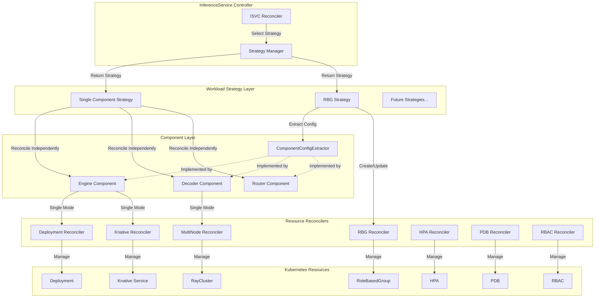
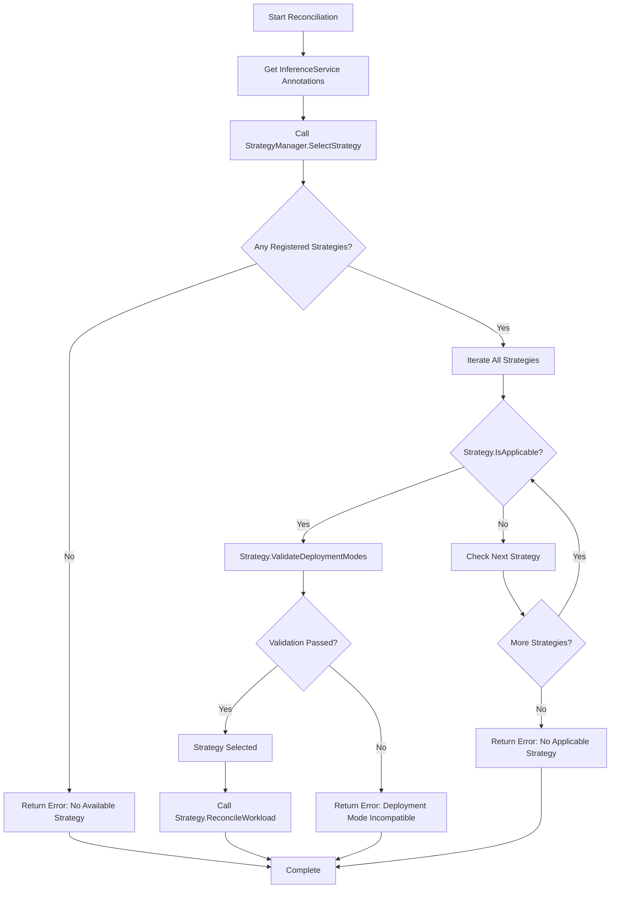
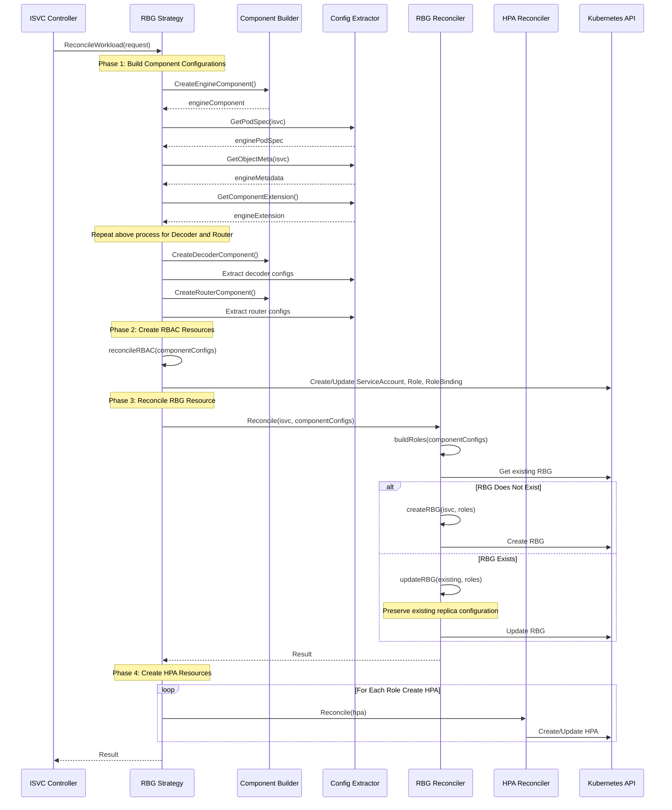

# OEP-0006: Workload Policy Layer and Unified Workload Management

<!-- toc -->
- [Summary](#summary)
- [Motivation](#motivation)
  - [Goals](#goals)
  - [Non-Goals](#non-goals)
- [Proposal](#proposal)
  - [User Stories](#user-stories)
  - [Notes/Constraints/Caveats](#notesconstraintscaveats)
  - [Risks and Mitigations](#risks-and-mitigations)
- [Design Details](#design-details)
  - [Architecture Overview](#architecture-overview)
  - [Core Interface Design](#core-interface-design)
  - [Strategy Selection Mechanism](#strategy-selection-mechanism)
  - [RBG Strategy Implementation](#rbg-strategy-implementation)
  - [Component Configuration Extraction](#component-configuration-extraction)
  - [Test Plan](#test-plan)
  - [Graduation Criteria](#graduation-criteria)
    - [Alpha](#alpha)
    - [Beta](#beta)
    - [GA](#ga)
- [Implementation History](#implementation-history)
- [Drawbacks](#drawbacks)
- [Alternatives](#alternatives)
<!-- /toc -->

## Summary

This proposal introduces a Workload Policy Layer for OME, providing unified workload management abstraction. The architecture decouples workload management logic from role reconciliation logic through the strategy pattern, supporting both Single Component deployment (independent deployment per role) and All-in-One workload deployment modes (such as RoleBasedGroup). While preserving the existing independent reconciliation capabilities of role workloads, it adds support for the RBG (RoleBasedGroup) workload type, enabling unified orchestration of multiple components.

## Motivation

Before introducing the workload policy layer, OME's workload deployment logic was tightly coupled within each role's Reconciler, with each component independently creating Deployment, Service, Knative Service, and other resources. This architecture has the following issues:

1. **Insufficient Operability**: Does not support in-place image upgrades: existing workloads must rebuild Pods when images are updated and lacks specified warm-up control capabilities, causing service interruption or delays and slowing overall release efficiency.

2. **Weak Multi-Role Coordination**: Lacks unified cross-role orchestration: each role reconciles independently, unable to perceive each other's versions, states, or dependencies. During scaling or upgrades, version consistency or proportional coordination between roles cannot be guaranteed (such as "upgrade A then B", "A:B = 2:1" strategies), easily causing compatibility issues or service anomalies.

As distributed high-performance inference increases demands for coordination between different inference roles, we need to introduce All-in-One workload (RoleBasedGroup) support in OME to fine-tune all roles from a global perspective.

### Goals

- Establish a clear workload policy layer abstraction, decoupling workload management from role logic
- Support dynamic selection and switching of multiple workload strategies
- Implement Alpha version support for RBG All-in-One workload type
- Maintain full backward compatibility with existing single component independent deployment mode
- Provide an extensible framework for easily adding new workload strategies in the future (such as Grove)
- Keep existing component reconciliation logic unchanged, only abstracting at the workload orchestration layer

### Non-Goals

- Complete implementation of all RBG features (currently Alpha version)
- Support fine-tuned model deployment in RBG mode
- Implement external service exposure logic in RBG mode
- Modify or refactor existing component core reconciliation logic
- Implement workload cross-strategy migration tools
- Provide workload strategy performance optimization and resource scheduling optimization

## Proposal

We propose introducing a workload policy layer architecture, implementing unified workload management through the following key components:

1. **Unified Strategy Interface (WorkloadStrategy)**: Defines the standard interface all workload strategies must implement
2. **Strategy Manager (WorkloadStrategyManager)**: Responsible for strategy registration, selection, and management
3. **Component Config Extractor (ComponentConfigExtractor)**: Standardized component configuration extraction mechanism
4. **Single Component Strategy (SingleComponentStrategy)**: Maintains existing single component independent deployment behavior as the default strategy
5. **RBG Strategy (RBGStrategy)**: Implements RoleBasedGroup All-in-One workload support

### User Stories

**Story 1: As a platform operator**, I want to deploy and manage multiple inference components (Engine, Decoder, Router) as a whole, simplifying operational complexity and leveraging unified scheduling and resource management capabilities provided by RBG.

**Story 2: As a service release personnel**, I want to complete service releases as quickly as possible, reducing operational time caused by instance environment preparation actions such as disk preparation and IP allocation.

**Story 3: As a developer**, I want to switch between different workload deployment modes through annotation configuration without modifying existing code, testing the effects of different strategies.

**Story 4: As a system architect**, I want to easily extend new workload types (such as Grove) without modifying core component code.

**Story 5: As an existing user**, I want my existing InferenceServices to continue working seamlessly after upgrading to the new version, unaffected by the new architecture.

### Notes/Constraints/Caveats

1. **Alpha Version Limitations**: Current RBG strategy implementation only supports basic features, does not support fine-tuned model updates and Ingress service exposure
2. **Deployment Mode Compatibility**: RBG strategy only supports RawDeployment and MultiNode deployment modes, does not support Serverless mode
3. **Component Dependencies**: All components must implement the ComponentConfigExtractor interface to be used by RBG strategy
4. **Annotation-Driven**: Strategy selection is implemented through InferenceService annotations, requiring correct configuration of the `ome.io/deploymentMode` annotation

### Risks and Mitigations

**Risk**: Breaking existing user deployments
**Mitigation**: SingleComponentStrategy as the default strategy ensures InferenceServices without special annotations behave unchanged; add sufficient unit tests and integration tests to verify backward compatibility.

**Risk**: Incorrect workload strategy selection causing deployment failure
**Mitigation**: Perform strict deployment mode validation during strategy selection; provide clear error messages and event recording; implement strategy applicability check mechanism.

**Risk**: Incomplete RBG Alpha version features affecting user experience
**Mitigation**: Clearly document Alpha version limitations; provide clear feature support matrix; supplement complete features in Beta phase.

**Risk**: Component configuration extraction failure causing incorrect RBG creation
**Mitigation**: Implement robust error handling and logging; provide configuration validation mechanism; clearly define configuration extraction contract in component interfaces.

## Design Details

### Architecture Overview

The workload policy layer sits between the InferenceService Controller and specific resource creation, serving as an intermediary abstraction layer to coordinate workload deployment strategies.



**Core Design Principles**:

1. **Strategy and Component Separation**: Workload strategies focus on how to organize and orchestrate components, components focus on their own configuration and resource definitions
2. **Interface-Driven**: Define contracts between strategies and components through clear interfaces
3. **Pluggable Architecture**: New strategies can be easily added by implementing standard interfaces and registering with the manager
4. **Backward Compatible**: SingleComponentStrategy fully preserves original behavior as the default strategy

### Core Interface Design

#### WorkloadStrategy Interface

Defines the unified interface all workload strategies must implement:

```go
type WorkloadStrategy interface {
    // GetStrategyName returns the strategy name
    GetStrategyName() string

    // IsApplicable determines if this strategy is applicable to the current InferenceService
    // Decides by checking annotations and other conditions
    IsApplicable(isvc *v1beta1.InferenceService, annotations map[string]string) bool

    // ValidateDeploymentModes validates if deployment modes are supported by this strategy
    // Different strategies may support different deployment modes
    ValidateDeploymentModes(modes *ComponentDeploymentModes) error

    // ReconcileWorkload executes workload reconciliation
    // This is the core method of the strategy, responsible for creating and updating workload resources
    ReconcileWorkload(ctx context.Context, request *WorkloadReconcileRequest) (ctrl.Result, error)
}
```

| Method | Description | Responsibility |
|--------|-------------|----------------|
| GetStrategyName | Returns strategy name | Used for logging and identification |
| IsApplicable | Determines if strategy is applicable | Decides whether to select this strategy based on InferenceService annotations and state |
| ValidateDeploymentModes | Validates deployment mode compatibility | Checks if component deployment modes are supported by this strategy |
| ReconcileWorkload | Executes workload reconciliation | Core method, responsible for creating and updating workload resources |

#### ComponentConfigExtractor Interface

Defines the standard interface for component configuration extraction, used by workload strategies to obtain necessary configuration from role components:

```go
type ComponentConfigExtractor interface {
    // GetPodSpec returns the main PodSpec
    GetPodSpec(isvc *v1beta1.InferenceService) (*corev1.PodSpec, error)

    // GetWorkerPodSpec returns Worker PodSpec (MultiNode deployment)
    // Returns nil if component does not support worker pods
    GetWorkerPodSpec(isvc *v1beta1.InferenceService) (*corev1.PodSpec, error)

    // GetObjectMeta returns component ObjectMeta (name, labels, annotations)
    GetObjectMeta(isvc *v1beta1.InferenceService) (metav1.ObjectMeta, error)

    // GetComponentExtension returns component extension configuration
    GetComponentExtension() *v1beta1.ComponentExtensionSpec

    // GetWorkerSize returns worker count (MultiNode deployment)
    // Returns 0 if component does not support workers
    GetWorkerSize() int
}
```

| Method | Description | Return Value |
|--------|-------------|--------------|
| GetPodSpec | Gets main PodSpec | Used for RawDeployment mode or Leader node |
| GetWorkerPodSpec | Gets Worker PodSpec | Used for Worker nodes in MultiNode mode |
| GetObjectMeta | Gets metadata | Includes name, labels, annotations, etc. |
| GetComponentExtension | Gets component extension configuration | Includes replica count, HPA, PDB, etc. |
| GetWorkerSize | Gets Worker count | Used for MultiNode mode |

#### WorkloadReconcileRequest Structure

Encapsulates the complete context information needed for workload reconciliation:

```go
type WorkloadReconcileRequest struct {
    // InferenceService instance
    InferenceService *v1beta1.InferenceService

    // Base model information
    BaseModel     *v1beta1.BaseModelSpec
    BaseModelMeta *metav1.ObjectMeta

    // Runtime information
    Runtime     *v1beta1.ServingRuntimeSpec
    RuntimeName string

    // Merged role specifications
    MergedEngine  *v1beta1.EngineSpec
    MergedDecoder *v1beta1.DecoderSpec
    MergedRouter  *v1beta1.RouterSpec

    // Deployment mode configuration
    DeploymentModes *ComponentDeploymentModes

    // Component builder factory
    ComponentBuilderFactory *components.ComponentBuilderFactory

    // Other context information...
}
```

| Field | Type | Description |
|-------|------|-------------|
| InferenceService | *v1beta1.InferenceService | InferenceService instance |
| BaseModel | *v1beta1.BaseModelSpec | Base model specification |
| Runtime | *v1beta1.ServingRuntimeSpec | Runtime specification |
| MergedEngine | *v1beta1.EngineSpec | Merged Engine configuration |
| MergedDecoder | *v1beta1.DecoderSpec | Merged Decoder configuration |
| MergedRouter | *v1beta1.RouterSpec | Merged Router configuration |
| DeploymentModes | *ComponentDeploymentModes | Deployment mode for each component |
| ComponentBuilderFactory | *components.ComponentBuilderFactory | Component builder factory |

### Strategy Selection Mechanism

The strategy selection process executes in the InferenceService Controller's Reconcile method:



**Strategy Registration Order**:

Strategy registration order determines selection priority. Current registration order is:

1. RBGStrategy (higher priority)
2. SingleComponentStrategy (default strategy, lower priority)

**Applicability Determination Rules**:

| Strategy | Applicability Condition | Annotation Requirement |
|----------|------------------------|------------------------|
| RBGStrategy | `ome.io/deploymentMode: RoleBasedGroup` | Must be explicitly specified |
| SingleComponentStrategy | No special deployment mode specified | No annotation required, serves as default strategy |

### RBG Strategy Implementation

RBG strategy packages multiple components into a single RoleBasedGroup resource for unified management.

#### RBG Resource Structure Mapping

Mapping relationship from InferenceService components to RBG Roles:

| InferenceService Component | RBG Role Name | Deployment Mode | Notes |
|---------------------------|---------------|-----------------|-------|
| Engine | engine | RawDeployment or MultiNode | Required component |
| Decoder | decoder | RawDeployment or MultiNode | Optional component, used for PD separation |
| Router | router | RawDeployment | Optional component, routing layer |

#### RBG Reconciliation Flow



#### ComponentConfig Data Structure

Used to pass component configuration between RBG strategy and RBG Reconciler:

```go
type ComponentConfig struct {
    // ComponentType specifies component type (Engine/Decoder/Router)
    ComponentType v1beta1.ComponentType
    
    // DeploymentMode specifies deployment mode for this component (RawDeployment or MultiNode)
    DeploymentMode constants.DeploymentModeType
    
    // PodSpec used for RawDeployment mode or as base template for MultiNode mode
    PodSpec *corev1.PodSpec
    
    // LeaderPodSpec used for leader node in MultiNode mode
    LeaderPodSpec *corev1.PodSpec
    
    // WorkerPodSpec used for worker nodes in MultiNode mode
    WorkerPodSpec *corev1.PodSpec
    
    // WorkerSize specifies worker node count (MultiNode mode)
    WorkerSize int
    
    // ComponentExtensionSpec contains replica count, scaling configuration, etc.
    ComponentExtensionSpec *v1beta1.ComponentExtensionSpec
    
    // ObjectMeta contains name, labels, annotations, and other metadata
    ObjectMeta metav1.ObjectMeta
}
```

| Field | Type | Description |
|-------|------|-------------|
| ComponentType | v1beta1.ComponentType | Component type (Engine/Decoder/Router) |
| DeploymentMode | constants.DeploymentModeType | Deployment mode (RawDeployment/MultiNode) |
| PodSpec | *corev1.PodSpec | Main PodSpec, used for RawDeployment or Leader |
| LeaderPodSpec | *corev1.PodSpec | Leader node PodSpec, used for MultiNode |
| WorkerPodSpec | *corev1.PodSpec | Worker node PodSpec, used for MultiNode |
| WorkerSize | int | Worker node count |
| ComponentExtensionSpec | *v1beta1.ComponentExtensionSpec | Replica count, HPA, PDB, and other extension configurations |
| ObjectMeta | metav1.ObjectMeta | Name, labels, annotations, and other metadata |

#### Role Building Logic

RBG Reconciler builds RoleSpec based on ComponentConfig:

**RawDeployment Mode**:
- Create single Template
- Convert PodSpec to PodTemplateSpec
- Configure replica count and labels

**MultiNode Mode**:
- Create LeaderWorkerSet configuration
- Set Size = 1 Leader + N Workers
- Build Leader and Worker PodTemplateSpec separately

**Replica Count Management**:
- Use ComponentExtensionSpec.MinReplicas during initial creation
- Preserve existing replica count during updates (may be modified by HPA)
- HPA independently manages replica count for each Role

### Component Configuration Extraction

All roles that need to support RBG deployment must implement the ComponentConfigExtractor interface.

#### Configuration Extraction Example

Using Engine component as an example, configuration extraction includes:

**PodSpec Extraction**:
- Container definitions (image, commands, arguments)
- Resource requests and limits
- Environment variables
- Volume mounts
- Node selectors and tolerations
- Affinity rules

**ObjectMeta Extraction**:
- Name: generated based on InferenceService name
- Labels: includes component type, model name, runtime, etc.
- Annotations: pass necessary configuration information

**ComponentExtension Extraction**:
- MinReplicas: minimum replica count
- MaxReplicas: maximum replica count (used for HPA)
- HPA configuration: metric type, target value, etc.
- PDB configuration: minimum available count, maximum unavailable count
- Resource policies

### Test Plan

**Workload Strategy Layer**:
- `pkg/controller/v1beta1/inferenceservice/workload/manager_test.go`: Strategy manager tests
  - Test strategy registration
  - Test strategy selection logic
  - Test error handling
- `pkg/controller/v1beta1/inferenceservice/workload/single_component_strategy_test.go`: Single component strategy tests
  - Test applicability determination
  - Test deployment mode validation
  - Test backward compatibility
- `pkg/controller/v1beta1/inferenceservice/workload/rbg_strategy_test.go`: RBG strategy tests
  - Test applicability determination
  - Test deployment mode validation
  - Test component configuration extraction
  - Test RBG resource creation and update

**RBG Reconciler**:
- `pkg/controller/v1beta1/inferenceservice/reconcilers/rbg/rbg_reconciler_test.go`: RBG reconciliation logic tests
  - Test RBG creation
  - Test RBG update (preserve replica count)
  - Test error handling
- `pkg/controller/v1beta1/inferenceservice/reconcilers/rbg/role_builder_test.go`: Role building logic tests
  - Test RawDeployment mode Role building
  - Test MultiNode mode Role building
  - Test label and annotation passing

**Component Configuration Extraction**:
- Verify each component correctly implements ComponentConfigExtractor interface
- Test configuration extraction completeness and correctness
- Test error scenario handling

**Test Coverage Target**: >80%

### Graduation Criteria

#### Alpha

- ✅ Workload policy layer core interface definition
- ✅ SingleComponentStrategy implementation (maintain existing behavior)
- ✅ RBGStrategy basic implementation
- ✅ Support RBG deployment for Engine, Decoder, Router components
- ✅ Support RawDeployment and MultiNode deployment modes
- ✅ ComponentConfigExtractor interface implementation
- ✅ RBG Reconciler implementation
- ✅ HPA resource management (independent HPA per Role)
- ✅ RBAC resource management

#### Beta

**Feature Enhancements**:

- Support fine-tuned model deployment in RBG mode
- Implement Ingress service exposure
- Optimize strategy selection logic

#### GA

- All planned features fully implemented
- Complete error handling and recovery mechanisms
- Complete observability support (metrics, logs, events)

## Implementation History

- 2025-01-15: Initial proposal draft created

## Drawbacks

1. **Increased Architecture Complexity**: Introducing a new abstraction layer increases overall system complexity, developers need to understand the concept of the policy layer
2. **Learning Curve**: Component developers need to learn and implement the ComponentConfigExtractor interface
3. **Alpha Version Feature Limitations**: Current RBG implementation does not support fine-tuned models and Ingress, limiting use cases
4. **Potential Performance Overhead**: Additional abstraction layer may introduce slight performance overhead

## Alternatives

### Alternative 1: Continue Single Component Independent Deployment Mode

**Description**: Do not introduce workload policy layer, continue to manage deployment logic independently in each component.

**Advantages**:

- Simple architecture, easy to understand
- No need for additional abstraction layer
- No need to modify existing code

**Disadvantages**:

- Cannot support All-in-One workload types (such as RBG)
- Extending new workload strategies requires modifying core code
- Resource management lacks global view

**Rejection Reason**: Cannot meet demands for RBG and other unified workload management, limits system extensibility.

### Alternative 2: Hard-Code RBG Logic Directly in Controller

**Description**: Directly determine whether to use RBG deployment through if-else branches in InferenceService Controller.

**Advantages**:

- Simple and direct implementation
- No need to design complex interfaces and abstractions
- Quick feature delivery

**Disadvantages**:

- Violates open-closed principle, adding each new workload type requires modifying Controller code
- Poor code maintainability, easily produces technical debt
- Difficult to test and verify
- Very poor extensibility

**Rejection Reason**: Although implementation is fast, it leads to serious technical debt, not conducive to long-term maintenance and extension.

### Alternative 3: Complete Component Architecture Refactoring

**Description**: Thoroughly refactor component design, completely separate all workload logic to policy layer, components only provide configuration.

**Advantages**:

- Clearest architecture
- Components and workloads completely decoupled
- Maximum flexibility

**Disadvantages**:

- Extremely high refactoring cost, requires significant time
- High risk, may introduce regression issues
- Large impact on existing users, may break compatibility
- Requires long migration process

**Rejection Reason**: Refactoring cost and risk too high, and impact on existing system too large, not suitable for current stage.

---

**Final Choice**: This proposal adopts the workload policy layer architecture, which, while maintaining existing system stability, implements support for RBG and other new workload types through clear abstraction and interface design, and provides a good foundation for future extensions.
