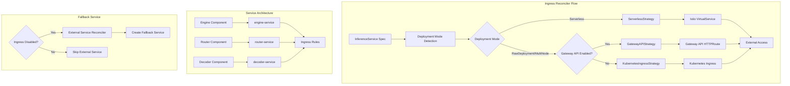
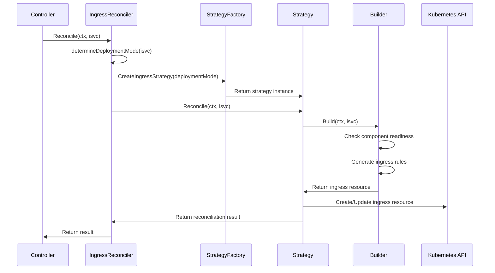

# SGL-OME Ingress Reconciler Documentation

## Recent Updates (2024)

### Architecture Improvements
- **Component Architecture Migration**: Fully migrated from legacy predictor-based logic to modern Engine/Router/Decoder architecture
- **Enhanced Error Handling**: Added comprehensive status conditions and logging when ingress builders return nil
- **MultiNode Support**: Fixed and verified ingress creation for distributed MultiNode deployments
- **Service Naming Consistency**: Aligned all builders to use `EngineServiceName()`, `RouterServiceName()`, and decoder services

### Bug Fixes Applied
- **VirtualService Builder**: Fixed decoder readiness logic to check engine readiness (correct routing target)
- **Scope Variables**: Fixed undefined `ingressDeploymentMode` variable in reconciler
- **Import Errors**: Added missing klog imports across strategies
- **Label Consistency**: Unified cluster-local detection using `constants.VisibilityLabel`

### Testing & Verification
- **100% Test Coverage**: All builder, strategy, factory, and reconciler tests now pass
- **Component Readiness**: Verified proper handling of all component readiness states
- **Integration Testing**: Confirmed ingress creation works across all deployment modes

---

## Table of Contents

1. [Architecture Overview](#architecture-overview)
2. [Deployment Modes and Strategies](#deployment-modes-and-strategies)
3. [Ingress Resource Types](#ingress-resource-types)
4. [Routing Rules by Deployment Mode](#routing-rules-by-deployment-mode)
5. [Component Service Architecture](#component-service-architecture)
6. [Reconciliation Flow](#reconciliation-flow)
7. [Code Walkthrough](#code-walkthrough)
8. [Configuration Flags](#configuration-flags)

## Architecture Overview

The ingress reconciler uses a **strategy pattern** to handle different deployment modes and ingress technologies. The system supports three main ingress resource types:

- **Istio VirtualService** (for Serverless/Knative deployments)
- **Kubernetes Ingress** (for RawDeployment/MultiNode with standard ingress controllers)
- **Gateway API HTTPRoute** (for RawDeployment/MultiNode with Gateway API enabled)



## Deployment Modes and Strategies

### Deployment Mode Detection

The ingress reconciler determines the deployment mode based on the **entrypoint component** and individual component deployment modes:

```go
// From reconciler.go
func (r *IngressReconciler) determineDeploymentMode(isvc *v1beta1.InferenceService) string {
    entrypointComponent := controllerconfig.GetEntrypointComponent(isvc.Spec)
    
    switch entrypointComponent {
    case constants.Engine:
        if isvc.Spec.Engine != nil && isvc.Spec.Engine.DeploymentMode != nil {
            return string(*isvc.Spec.Engine.DeploymentMode)
        }
    case constants.Router:
        if isvc.Spec.Router != nil && isvc.Spec.Router.DeploymentMode != nil {
            return string(*isvc.Spec.Router.DeploymentMode)
        }
    case constants.Decoder:
        if isvc.Spec.Decoder != nil && isvc.Spec.Decoder.DeploymentMode != nil {
            return string(*isvc.Spec.Decoder.DeploymentMode)
        }
    }
    
    return string(constants.Serverless) // Default fallback
}
```

### Strategy Selection

The factory pattern selects the appropriate strategy:

```go
// From factory/reconciler_factory.go
func (f *Factory) CreateIngressStrategy(deploymentMode string) (interfaces.IngressStrategy, error) {
    switch deploymentMode {
    case string(constants.Serverless):
        return f.serverlessStrategy, nil
    case string(constants.RawDeployment), string(constants.MultiNode):
        if f.ingressConfig.EnableGatewayAPI {
            return f.gatewayAPIStrategy, nil
        }
        return f.kubernetesIngressStrategy, nil
    default:
        return nil, fmt.Errorf("unsupported deployment mode: %s", deploymentMode)
    }
}
```

## Ingress Resource Types

### 1. Serverless Strategy - Istio VirtualService

**Used for:** `Serverless` deployment mode  
**Resource Type:** `istio.io/api/networking/v1beta1.VirtualService`

**Key Features:**
- Integrates with Knative networking
- Uses Istio service mesh for traffic routing
- Supports both internal (cluster-local) and external traffic
- Routes to predictor service (legacy) or router service (new architecture)

**Service Targeting:**
```go
// From virtualservice_builder.go
backend := constants.PredictorServiceName(isvc.Name)  // Default: service-name

if isvc.Spec.Router != nil {
    backend = constants.RouterServiceName(isvc.Name)  // Router: service-name
}
```

### 2. Kubernetes Ingress Strategy

**Used for:** `RawDeployment` and `MultiNode` deployment modes (when Gateway API disabled)  
**Resource Type:** `networking.k8s.io/v1.Ingress`

**Key Features:**
- Standard Kubernetes ingress controller support
- Configurable ingress class (default: istio)
- Multi-component routing with different hosts
- Path-based routing to backend services

### 3. Gateway API Strategy

**Used for:** `RawDeployment` and `MultiNode` deployment modes (when Gateway API enabled)  
**Resource Type:** `gateway.networking.k8s.io/v1.HTTPRoute`

**Key Features:**
- Modern Gateway API standard
- Multiple HTTPRoute resources per component
- Advanced traffic management capabilities
- Enhanced security and observability

## Routing Rules by Deployment Mode

### Serverless (Istio VirtualService)

**Routing Logic:**
- **With Router:** External traffic → Router service → Engine service
- **Engine Only:** External traffic → Engine/Predictor service

**Service Names:**
- Router: `{inference-service-name}` (router service)
- Engine/Predictor: `{inference-service-name}` (predictor service - legacy)

### RawDeployment/MultiNode (Kubernetes Ingress)

**Component Priority and Routing:**

#### 1. Router + Engine + Decoder Configuration:
```yaml
# Generated ingress rules:
rules:
- host: "{decoder-component}.{domain}"    # decoder.example.com
  http:
    paths:
    - path: "/"
      backend:
        service:
          name: "{service-name}"            # decoder service
          port: 80

- host: "{service-name}.{domain}"          # service-name.example.com (top-level)
  http:
    paths:
    - path: "/"
      backend:
        service:
          name: "{service-name}"            # router service
          port: 80

- host: "{router-component}.{domain}"      # router.example.com  
  http:
    paths:
    - path: "/"
      backend:
        service:
          name: "{service-name}-engine"     # engine service
          port: 80
```

#### 2. Engine + Decoder Configuration (No Router):
```yaml
rules:
- host: "{service-name}.{domain}"          # service-name.example.com (top-level)
  http:
    paths:
    - path: "/"
      backend:
        service:
          name: "{service-name}-engine"     # engine service  
          port: 80

- host: "{decoder-component}.{domain}"     # decoder.example.com
  http:
    paths:
    - path: "/"
      backend:
        service:
          name: "{service-name}"            # decoder service
          port: 80
```

#### 3. Engine Only Configuration:
```yaml
rules:
- host: "{service-name}.{domain}"          # service-name.example.com
  http:
    paths:
    - path: "/"
      backend:
        service:
          name: "{service-name}-engine"     # engine service
          port: 80
```

### RawDeployment/MultiNode (Gateway API HTTPRoute)

**Component-specific HTTPRoutes:**

#### Engine HTTPRoute:
```yaml
metadata:
  name: "{service-name}-engine"
spec:
  rules:
  - matches:
    - path:
        type: PathPrefix
        value: "/"
    backendRefs:
    - name: "{service-name}-engine"
      port: 8080
```

#### Router HTTPRoute (if present):
```yaml
metadata:
  name: "{service-name}-router"  
spec:
  rules:
  - matches:
    - path:
        type: PathPrefix
        value: "/"
    backendRefs:
    - name: "{service-name}"           # router service
      port: 8080
```

#### Decoder HTTPRoute (if present):
```yaml
metadata:
  name: "{service-name}-decoder"
spec:
  rules:
  - matches:
    - path:
        type: PathPrefix
        value: "/"
    backendRefs:
    - name: "{service-name}"           # decoder service  
      port: 8080
```

## Component Service Architecture

### Service Naming Convention

The ingress reconciler targets services created by component reconcilers:

```go
// Service name helpers from constants.go
func EngineServiceName(name string) string {
    return name + "-engine"                    // e.g., "deepseek-v3-engine"
}

func RouterServiceName(name string) string {
    return name                                // e.g., "deepseek-v3"
}

func DecoderServiceName(name string) string {
    return name                                // e.g., "deepseek-v3"
}
```

### Component Readiness Checks

Before creating ingress resources, the system verifies components are ready:

```go
// From ingress_builder.go - readiness checks per component
switch {
case isvc.Spec.Router != nil:
    if !isvc.Status.IsConditionReady(v1beta1.RoutesReady) {
        // Skip ingress creation
        return nil, nil
    }
    
case isvc.Spec.Decoder != nil:
    if !isvc.Status.IsConditionReady(v1beta1.DecoderReady) {
        // Skip ingress creation
        return nil, nil
    }
    
default: // Engine only
    if !isvc.Status.IsConditionReady(v1beta1.EngineReady) {
        // Skip ingress creation  
        return nil, nil
    }
}
```

## Reconciliation Flow

### Main Controller Integration

The ingress reconciler is integrated into the main controller flow:

```go
// From controller.go - reconciliation order
func (r *InferenceServiceReconciler) Reconcile(ctx context.Context, req ctrl.Request) (ctrl.Result, error) {
    // 1. Reconcile components first (creates services)
    if err := r.reconcileComponents(ctx, isvc); err != nil {
        return ctrl.Result{}, err
    }
    
    // 2. Reconcile ingress (targets existing services)
    if err := r.reconcileIngress(ctx, isvc); err != nil {
        return ctrl.Result{}, err
    }
    
    // 3. Reconcile external service (fallback when ingress disabled)
    if err := r.reconcileExternalService(ctx, isvc); err != nil {
        return ctrl.Result{}, err
    }
    
    return ctrl.Result{}, nil
}
```

### Ingress Reconciliation Steps



### External Service Fallback

When ingress is disabled, the external service reconciler creates a fallback service:

```go
// From external_service_reconciler.go
func (r *ExternalServiceReconciler) shouldCreateExternalService(isvc *v1beta1.InferenceService) bool {
    // Only create when ingress is disabled
    if !r.ingressConfig.DisableIngressCreation {
        return false
    }
    
    // Skip for cluster-local services
    if utils.IsClusterLocal(isvc) {
        return false
    }
    
    return true
}
```

## Code Walkthrough

### 1. Main Reconciler (`reconciler.go`)

**Key Methods:**

#### `Reconcile()`
- Entry point for ingress reconciliation
- Delegates to `ReconcileWithDeploymentMode()`

#### `ReconcileWithDeploymentMode()`
```go
func (r *IngressReconciler) ReconcileWithDeploymentMode(ctx context.Context, isvc *v1beta1.InferenceService, deploymentMode string) error {
    // Get strategy for deployment mode
    strategy, err := r.strategyFactory.CreateIngressStrategy(deploymentMode)
    if err != nil {
        return fmt.Errorf("failed to create ingress strategy for deployment mode %s: %w", deploymentMode, err)
    }
    
    // Execute strategy reconciliation
    return strategy.Reconcile(ctx, isvc)
}
```

#### `determineDeploymentMode()`
- Analyzes InferenceService spec to determine deployment mode
- Checks entrypoint component and its deployment mode
- Falls back to Serverless if not specified

### 2. Strategy Factory (`factory/reconciler_factory.go`)

**Purpose:** Creates appropriate strategy instances based on deployment mode and configuration flags.

**Key Logic:**
```go
func (f *Factory) CreateIngressStrategy(deploymentMode string) (interfaces.IngressStrategy, error) {
    switch deploymentMode {
    case string(constants.Serverless):
        return f.serverlessStrategy, nil
    case string(constants.RawDeployment), string(constants.MultiNode):
        if f.ingressConfig.EnableGatewayAPI {
            return f.gatewayAPIStrategy, nil
        }
        return f.kubernetesIngressStrategy, nil
    default:
        return nil, fmt.Errorf("unsupported deployment mode: %s", deploymentMode)
    }
}
```

### 3. Serverless Strategy (`strategies/serverless_strategy.go`)

**Creates:** Istio VirtualService resources  
**Integration:** Knative networking and Istio service mesh

**Key Features:**
- Handles both internal (cluster-local) and external traffic
- Routes to router service if available, otherwise to predictor/engine
- Uses VirtualServiceBuilder for resource construction

### 4. Kubernetes Ingress Strategy (`strategies/raw_ingress_strategy.go`)

**Creates:** Standard Kubernetes Ingress resources  
**Target:** RawDeployment and MultiNode modes

**Key Logic:**
```go
func (s *KubernetesIngressStrategy) Reconcile(ctx context.Context, isvc *v1beta1.InferenceService) error {
    // Check if cluster-local (skip ingress creation)
    if utils.IsClusterLocal(isvc) {
        return nil
    }
    
    // Build ingress resource
    ingress, err := s.ingressBuilder.Build(ctx, isvc)
    if err != nil {
        return err
    }
    
    // Handle nil return (component not ready)
    if ingress == nil {
        return nil
    }
    
    // Create or update ingress
    return s.reconcileIngress(ctx, ingress, isvc)
}
```

### 5. Gateway API Strategy (`strategies/gateway_api_strategy.go`)

**Creates:** Gateway API HTTPRoute resources  
**Target:** RawDeployment and MultiNode modes (when Gateway API enabled)

**Multi-Component Approach:**
- Creates separate HTTPRoute for each component (engine, router, decoder)
- More granular traffic management than single ingress resource

### 6. Ingress Builder (`builders/ingress_builder.go`)

**Purpose:** Constructs Kubernetes Ingress specifications based on component architecture.

#### Component Priority Logic:
```go
func (b *IngressBuilder) BuildIngress(ctx context.Context, isvc *v1beta1.InferenceService) (client.Object, error) {
    var rules []netv1.IngressRule

    switch {
    case isvc.Spec.Router != nil:
        // Router present - create router rules
        if !isvc.Status.IsConditionReady(v1beta1.RoutesReady) {
            return nil, nil  // Skip if router not ready
        }
        routerRules, err := b.buildRouterRules(isvc)
        rules = append(rules, routerRules...)
        
    case isvc.Spec.Decoder != nil:
        // Decoder present (no router) - create decoder rules  
        if !isvc.Status.IsConditionReady(v1beta1.DecoderReady) {
            return nil, nil  // Skip if decoder not ready
        }
        decoderRules, err := b.buildDecoderRules(isvc)
        rules = append(rules, decoderRules...)
        
    default:
        // Engine only - create engine rules
        if !isvc.Status.IsConditionReady(v1beta1.EngineReady) {
            return nil, nil  // Skip if engine not ready
        }
        engineRules, err := b.buildEngineOnlyRules(isvc)
        rules = append(rules, engineRules...)
    }
    
    // Build final ingress resource
    return &netv1.Ingress{
        ObjectMeta: metav1.ObjectMeta{
            Name:        isvc.ObjectMeta.Name,
            Namespace:   isvc.ObjectMeta.Namespace,
            Annotations: isvc.Annotations,
        },
        Spec: netv1.IngressSpec{
            IngressClassName: b.ingressConfig.IngressClassName,
            Rules:            rules,
        },
    }, nil
}
```

#### Router Rules Generation:
```go
func (b *IngressBuilder) buildRouterRules(isvc *v1beta1.InferenceService) ([]netv1.IngressRule, error) {
    routerName := constants.RouterServiceName(isvc.Name)    // "service-name"
    engineName := constants.EngineServiceName(isvc.Name)    // "service-name-engine"
    
    // Top-level host routes to router
    host, _ := b.generateIngressHost(string(constants.Router), true, routerName, isvc)
    rules = append(rules, b.generateRule(host, routerName, "/", 80))
    
    // Component-specific host routes to engine
    routerHost, _ := b.generateIngressHost(string(constants.Router), false, routerName, isvc)
    rules = append(rules, b.generateRule(routerHost, engineName, "/", 80))
    
    // Decoder rules if present
    if isvc.Spec.Decoder != nil {
        decoderName := constants.DecoderServiceName(isvc.Name)  // "service-name"
        decoderHost, _ := b.generateIngressHost(string(constants.Decoder), false, routerName, isvc)
        rules = append(rules, b.generateRule(decoderHost, decoderName, "/", 80))
    }
    
    return rules, nil
}
```

## Configuration Flags

### Ingress Configuration

**DisableIngressCreation:**
- **Type:** `bool`
- **Purpose:** Disables ingress resource creation entirely
- **Effect:** Triggers external service reconciler to create fallback service

**EnableGatewayAPI:**
- **Type:** `bool`  
- **Purpose:** Switches between Kubernetes Ingress and Gateway API for non-serverless modes
- **Default:** `false` (uses Kubernetes Ingress)

**IngressClassName:**
- **Type:** `string`
- **Purpose:** Specifies ingress controller class
- **Default:** `"istio"`

### Example Configuration:
```yaml
apiVersion: v1
kind: ConfigMap
metadata:
  name: inferenceservice-config
data:
  ingress: |
    ingressClassName: "istio"
    disableIngressCreation: false
    enableGatewayAPI: false
```

## Summary

The SGL-OME ingress reconciler provides a flexible, strategy-based approach to handling external access across different deployment modes:

1. **Serverless deployments** use Istio VirtualService for seamless Knative integration
2. **RawDeployment/MultiNode deployments** use either Kubernetes Ingress or Gateway API HTTPRoute based on configuration
3. **Component-aware routing** adapts to the presence of router, decoder, and engine components
4. **Fallback external service** ensures accessibility when ingress is disabled
5. **Readiness-based reconciliation** prevents ingress creation before services are available

The system automatically detects deployment modes, selects appropriate ingress technologies, and creates the necessary routing rules to expose inference services externally while maintaining compatibility with various Kubernetes ingress solutions.
