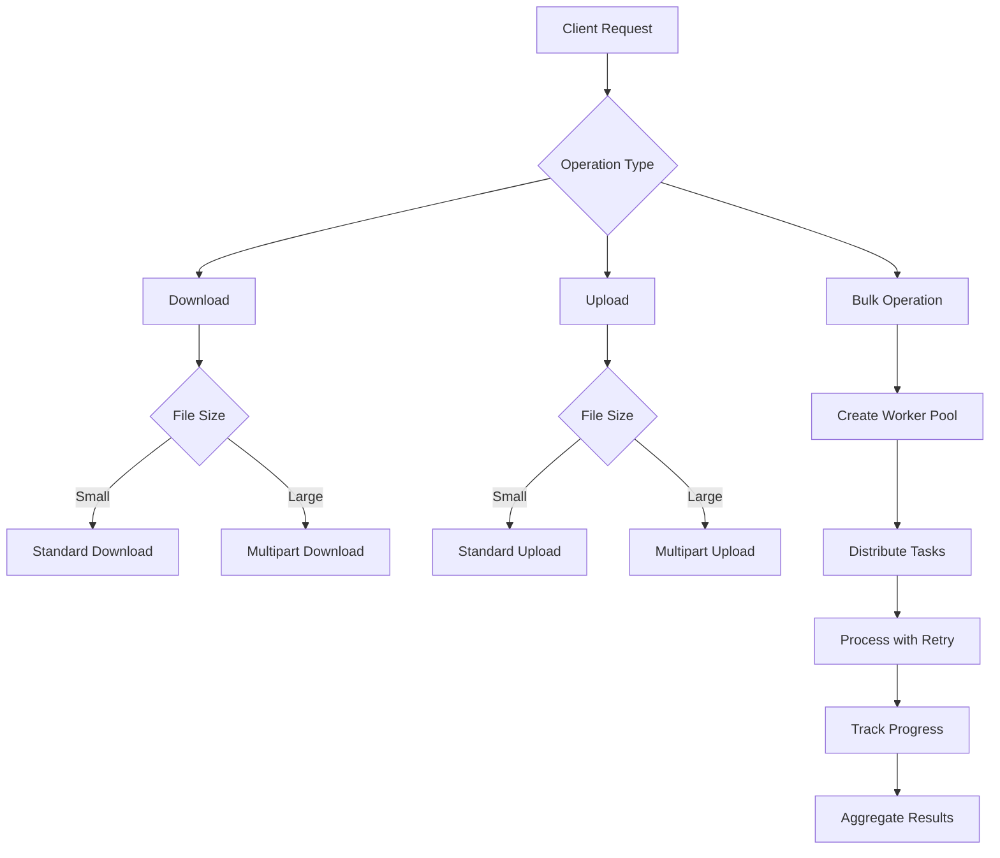

# Storage Package

The storage package provides a unified interface for interacting with multiple cloud storage providers including OCI Object Storage, AWS S3, Google Cloud Storage, Azure Blob Storage, and GitHub LFS.

## Table of Contents

- [Features](#features)
- [Architecture](#architecture)
- [Supported Providers](#supported-providers)
- [Installation](#installation)
- [Quick Start](#quick-start)
- [URI Formats](#uri-formats)
- [Storage Operations](#storage-operations)
- [Advanced Features](#advanced-features)
- [Authentication](#authentication)
- [Provider-Specific Details](#provider-specific-details)
- [Testing](#testing)
- [Migration Guide](#migration-guide)

## Features

- **Unified Interface**: Single API for all storage providers
- **High Performance**: Support for parallel uploads/downloads and multipart operations
- **Flexible Authentication**: Pluggable auth system with support for multiple credential types
- **URI Parsing**: Parse and validate storage URIs for all supported providers
- **Functional Options**: Configure operations with clean, composable options
- **Dependency Injection**: Built with dependency injection for testability
- **Retry Logic**: Exponential backoff with jitter for resilient operations
- **Bulk Operations**: Concurrent operations with worker pools
- **MD5 Validation**: Integrity checking with special multipart handling
- **Progress Tracking**: Real-time progress updates for long operations

## Architecture

### Core Interfaces

```go
// Storage defines the base interface for storage operations
type Storage interface {
    Provider() Provider
    Download(ctx context.Context, source ObjectURI, target string, opts ...DownloadOption) error
    Upload(ctx context.Context, source string, target ObjectURI, opts ...UploadOption) error
    Get(ctx context.Context, uri ObjectURI) (io.ReadCloser, error)
    Put(ctx context.Context, uri ObjectURI, reader io.Reader, size int64, opts ...UploadOption) error
    Delete(ctx context.Context, uri ObjectURI) error
    Exists(ctx context.Context, uri ObjectURI) (bool, error)
    List(ctx context.Context, uri ObjectURI, opts ListOptions) ([]ObjectInfo, error)
    GetObjectInfo(ctx context.Context, uri ObjectURI) (*ObjectInfo, error)
    Stat(ctx context.Context, uri ObjectURI) (*Metadata, error)
    Copy(ctx context.Context, source, target ObjectURI) error
}

// Extended interfaces for advanced features
type MultipartCapable interface { ... }
type BulkStorage interface { ... }
type ValidatingStorage interface { ... }
type ProgressStorage interface { ... }
```

### Storage Operation Flow



## Supported Providers

| Provider             | URI Scheme  | Status         | Features                              |
|----------------------|-------------|----------------|---------------------------------------|
| OCI Object Storage   | `oci://`    | ✅ Complete     | Multipart, Bulk, Validation, Progress |
| AWS S3               | `s3://`     | 🚧 In Progress | Multipart, Transfer Manager           |
| Google Cloud Storage | `gs://`     | 🚧 In Progress | Composite Objects, CMEK               |
| Azure Blob Storage   | `azure://`  | 🚧 In Progress | Block Blobs, Leasing                  |
| GitHub LFS           | `github://` | 🚧 In Progress | SHA256 Validation, Batch API          |

## Installation

```go
import "github.com/sgl-project/ome/pkg/storage"
```

## Quick Start

### Creating a Storage Instance

```go
// Create logger and factories
logger := logging.NewNopLogger()
authFactory := auth.NewDefaultFactory(logger)
storageFactory := storage.NewDefaultFactory(authFactory, logger)

// Register providers
authFactory.RegisterProvider(auth.ProviderOCI, authoci.NewFactory(logger))
storageFactory.RegisterProvider(storage.ProviderOCI, storageoci.NewFactory(logger))

// Configure storage
config := storage.StorageConfig{
    Provider: storage.ProviderOCI,
    Region:   "us-ashburn-1",
    AuthConfig: auth.Config{
        Provider: auth.ProviderOCI,
        AuthType: auth.OCIUserPrincipal,
    },
    Extra: map[string]interface{}{
        "compartment_id": "ocid1.compartment.oc1..example",
    },
}

// Create storage instance
ctx := context.Background()
store, err := storageFactory.Create(ctx, config.Provider, &config)
```

### Basic Operations

```go
// Parse URIs
sourceURI, _ := storage.ParseURI("oci://namespace@region/bucket/file.txt")
targetURI, _ := storage.ParseURI("s3://my-bucket/uploads/data.json")

// Download
err = store.Download(ctx, *sourceURI, "/local/file.txt",
    storage.WithChunkSize(50),        // 50MB chunks
    storage.WithThreads(10),          // 10 parallel threads
)

// Upload
err = store.Upload(ctx, "/local/data.json", *targetURI,
    storage.WithContentType("application/json"),
    storage.WithMetadata(map[string]string{
        "version": "1.0",
    }),
)

// Get (streaming)
reader, err := store.Get(ctx, *sourceURI)
defer reader.Close()

// List objects
objects, err := store.List(ctx, *sourceURI, storage.ListOptions{
    Prefix:  "data/",
    MaxKeys: 100,
})
```

## URI Formats

### OCI Object Storage
- `oci://namespace@region/bucket/prefix`
- `oci://n/namespace/b/bucket/o/prefix`

### AWS S3
- `s3://bucket/prefix/object.txt`

### Google Cloud Storage
- `gs://bucket/prefix/object.txt`

### Azure Blob Storage
- `azure://container@storageaccount/prefix/blob.txt`

### GitHub LFS
- `github://owner/repo@branch/path/to/file.txt`

## Storage Operations

### Download Options

```go
// Configure download behavior
opts := []storage.DownloadOption{
    storage.WithSizeThreshold(100),   // 100MB threshold for multipart
    storage.WithChunkSize(50),        // 50MB chunks
    storage.WithThreads(20),          // 20 parallel threads
    storage.WithForceMultipart(true), // Force multipart
    storage.WithSkipExisting(),       // Skip existing files
    storage.WithValidation(),         // Enable MD5 validation
}
```

### Upload Options

```go
// Configure upload behavior
opts := []storage.UploadOption{
    storage.WithUploadChunkSize(64),  // 64MB chunks
    storage.WithUploadThreads(10),    // 10 upload threads
    storage.WithContentType("application/json"),
    storage.WithStorageClass("STANDARD_IA"),
    storage.WithMetadata(map[string]string{
        "uploaded-by": "storage-service",
        "version":     "2.0",
    }),
}
```

## Advanced Features

### Multipart Operations

```go
// Check if storage supports multipart
if multipart, ok := store.(storage.MultipartCapable); ok {
    // Initiate multipart upload
    uploadID, err := multipart.InitiateMultipartUpload(ctx, uri)
    
    // Upload parts
    etag1, _ := multipart.UploadPart(ctx, uri, uploadID, 1, reader1, size1)
    etag2, _ := multipart.UploadPart(ctx, uri, uploadID, 2, reader2, size2)
    
    // Complete upload
    parts := []storage.CompletedPart{
        {PartNumber: 1, ETag: etag1},
        {PartNumber: 2, ETag: etag2},
    }
    err = multipart.CompleteMultipartUpload(ctx, uri, uploadID, parts)
}
```

### Bulk Operations

```go
// Bulk download with progress tracking
if bulk, ok := store.(storage.BulkStorage); ok {
    results, err := bulk.BulkDownload(ctx, objects, "/download/dir",
        storage.BulkDownloadOptions{
            Concurrency: 10,
            ProgressCallback: func(completed, total int, current *storage.BulkDownloadResult) {
                fmt.Printf("Progress: %d/%d files\n", completed, total)
            },
        },
    )
}
```

### Progress Tracking

```go
// Upload with progress
if progress, ok := store.(storage.ProgressStorage); ok {
    err = progress.UploadWithProgress(ctx, "/large/file.bin", uri,
        func(p storage.Progress) {
            fmt.Printf("Uploaded %.2f%% (%.2f MB/s)\n", 
                float64(p.ProcessedBytes)/float64(p.TotalBytes)*100,
                p.CurrentSpeed/1024/1024)
        },
    )
}
```

### MD5 Validation

```go
// Validate downloaded file
if validating, ok := store.(storage.ValidatingStorage); ok {
    valid, err := validating.ValidateLocalFile(ctx, "/downloaded/file.txt", uri)
    if !valid {
        log.Printf("File validation failed")
    }
}
```

## Authentication

Each provider supports multiple authentication methods:

### OCI
- **User Principal**: API Key with config file
- **Instance Principal**: Metadata service on OCI instances
- **Resource Principal**: For OCI Functions/Data Flow
- **OKE Workload Identity**: Kubernetes workload identity

### AWS
- **Access Key**: Traditional access key/secret
- **Instance Profile**: EC2 instance metadata
- **Assume Role**: STS role assumption
- **Web Identity**: OIDC token exchange

### GCP
- **Service Account**: JSON key file
- **Application Default**: Environment-based auth
- **Workload Identity**: GKE workload identity

### Azure
- **Service Principal**: Client ID/secret
- **Managed Identity**: Azure resource identity
- **Device Flow**: Interactive authentication

### GitHub
- **Personal Access Token**: User PAT
- **GitHub App**: App-based authentication

## Provider-Specific Details

### OCI Object Storage

#### Multipart MD5 Validation

OCI returns multipart ETags in format `<hash>-<parts>` which cannot be used for file validation. The solution:

1. **During Upload**: Calculate actual file MD5 and store in object metadata
2. **During Validation**: Check `OpcMeta["md5"]` for actual MD5

```go
// When uploading via multipart
fileMD5, _ := calculateFileMD5("/path/to/file")
uploadOpts := storage.UploadOptions{
    Metadata: map[string]string{
        "md5": fileMD5,
    },
}
```

#### Configuration

```go
type Config struct {
    CompartmentID  string `json:"compartment_id"`
    Region         string `json:"region"`
    EnableOboToken bool   `json:"enable_obo_token"`
    OboToken       string `json:"obo_token"`
}
```

### AWS S3

#### Features
- S3 Transfer Manager for optimized transfers
- Request presigning
- Server-side encryption
- Cross-region replication support

#### Configuration

```go
type Config struct {
    Region               string `json:"region"`
    Endpoint             string `json:"endpoint"`
    ForcePathStyle       bool   `json:"force_path_style"`
    DisableSSL           bool   `json:"disable_ssl"`
    MultipartThreshold   int64  `json:"multipart_threshold"`
}
```

### Google Cloud Storage

#### Features
- Customer-managed encryption keys (CMEK)
- Object lifecycle management
- Strong consistency
- Native MD5 support for composite objects

#### Configuration

```go
type Config struct {
    ProjectID          string `json:"project_id"`
    Endpoint           string `json:"endpoint"`
    DisableAuth        bool   `json:"disable_auth"`
    EncryptionKey      string `json:"encryption_key"`
}
```

### Azure Blob Storage

#### Features
- Block blob operations
- Blob leasing
- Snapshots and soft delete
- Access tier management

#### Configuration

```go
type Config struct {
    AccountName    string `json:"account_name"`
    ContainerName  string `json:"container_name"`
    Endpoint       string `json:"endpoint"`
    UseDevelopment bool   `json:"use_development"`
}
```

### GitHub LFS

#### Features
- Git LFS Batch API
- SHA256 validation (instead of MD5)
- Transfer adapter negotiation
- Sparse checkout support

#### Configuration

```go
type Config struct {
    Owner    string `json:"owner"`
    Repo     string `json:"repo"`
    Branch   string `json:"branch"`
    Endpoint string `json:"endpoint"`
}
```

## Testing

### Unit Tests

```bash
# Run all storage tests
go test ./pkg/storage/...

# Run with coverage
go test -cover ./pkg/storage/...

# Run specific provider tests
go test ./pkg/storage/oci/...
```

### Test Coverage

| Package | Coverage |
|---------|----------|
| storage/oci | 9.6% (limited by SDK) |
| storage/aws | 85.9% |
| storage/gcp | 71.4% |
| storage/azure | 25.3% |
| storage/github | 72.9% |

### Sample Code

See the `samples/` directory for complete examples:

```bash
cd pkg/storage/samples

# Build examples
go build simple_example.go
go build main.go

# Run examples
./simple_example
./main -list
./main -provider oci -auth user-principal -uri "oci://namespace@region/bucket/test" -file test.txt
```

## Migration Guide

### From ociobjectstore

The new storage package provides a more generic interface while maintaining compatibility:

```go
// Old (ociobjectstore)
client := ociobjectstore.NewClient(config)
err := client.DownloadFile(namespace, bucket, object, targetPath)

// New (storage package)
uri, _ := storage.ParseURI(fmt.Sprintf("oci://%s@%s/%s/%s", namespace, region, bucket, object))
err := store.Download(ctx, *uri, targetPath)
```

### Key Differences

1. **URI-based**: Uses URIs instead of separate namespace/bucket/object parameters
2. **Context-aware**: All operations accept context for cancellation
3. **Provider-agnostic**: Same interface for all providers
4. **Functional options**: Cleaner configuration with options pattern
5. **Enhanced features**: Built-in retry, bulk operations, progress tracking

## Best Practices

1. **Always use context**: Pass context for proper cancellation and timeout handling
2. **Handle multipart**: For large files, use multipart operations
3. **Enable validation**: Use MD5 validation for critical data
4. **Implement retry**: Use retry logic for network resilience
5. **Track progress**: Provide user feedback for long operations
6. **Close resources**: Always close readers/writers when done

## Future Enhancements

- [ ] Complete AWS S3, GCP, Azure, and GitHub provider implementations
- [ ] Add encryption support (client-side and server-side)
- [ ] Implement caching layer for frequently accessed objects
- [ ] Add metrics and tracing integration
- [ ] Support for object versioning operations
- [ ] Bandwidth throttling for uploads/downloads
- [ ] Event notification support
- [ ] Cross-provider object migration tools