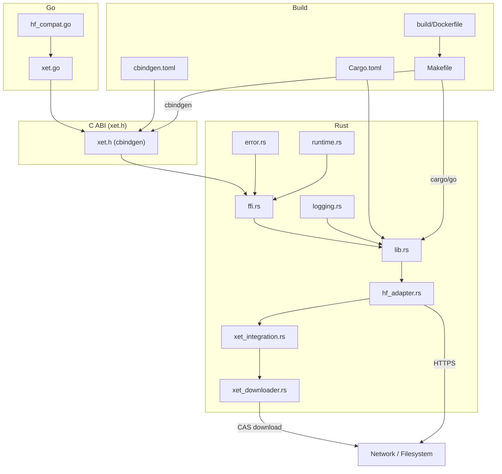
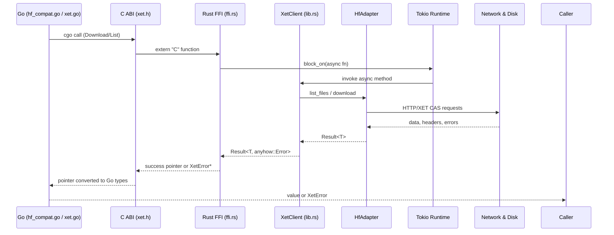

# OME Xet Binding (Rust ↔ Go)

## Architecture





### Runtime model
- `runtime.rs` creates a global multi-thread Tokio runtime (4 worker threads, enables I/O, time, and blocking APIs).
- FFI calls synchronously `block_on` async work; callers must treat them as blocking operations.
- `hf_adapter.rs` internally uses `futures::stream::buffer_unordered` to bound parallel downloads by `max_concurrent` while avoiding blocking the Tokio scheduler.
- Go bindings invoke FFI synchronously; using one `*Client` from multiple goroutines is safe for read-only operations, but do not free a client while other calls are in flight.

### Logging
- `logging.rs` installs a `tracing_subscriber` once per process. Set `XET_LOG_LEVEL` (or `RUST_LOG`) before the first client is created.
- Go’s `SetLogLevel` simply rewrites `RUST_LOG`; dedicated log forwarding is not implemented.

## How the binding works (FFI & headers)

### ABI design
- `XetClient` is an opaque heap-allocated handle. `xet_client_free` must be called exactly once per handle.
- All Rust → C strings are `CString::into_raw` results; consumers must call `xet_free_string` / `xet_free_file_list`.
- Error propagation uses heap-allocated `XetError { code, message, details }`. Known codes are defined in `XetErrorCode` (`error.rs:11`).
- Thread-safety: although the FFI takes `*mut XetClient`, functions borrow it immutably; you may reuse a client across threads, but avoid concurrent calls during `xet_client_free`.
- Cancellation: Rust supports optional cancellation hooks (`download_file_with_cancel`) but there is no FFI surface yet; Go’s `DownloadFileWithContext` is a stub.

### Header generation
- `cbindgen.toml` drives `cbindgen --crate ome-xet-binding --config cbindgen.toml --output xet.h`.
- Export set includes config/result structs and `XetError`; enums are emitted as `ScreamingSnakeCase`.
- `XetSnapshotRequest` is generated but unused by the current FFI (`ffi.rs` passes individual parameters). Keep header and Rust in sync when removing/adding fields.

### Build pipeline
- `Cargo.toml` builds a `staticlib` and `cdylib` named `libxet` with release profile `lto = true`, `strip = true`.
- `Makefile` targets:
    - `make build`: `cargo build --release [--target …]`, copies `libxet.{a,dylib}` next to Go sources, then `go build` with `-extldflags '-L./'`.
    - `make test`: builds plus `cargo test` and `go test ./...`.
    - `make header`: runs `cbindgen` to regenerate `xet.h`.
    - `make release-darwin-*` / `make release-linux-*`: produce platform archives (`build/Dockerfile` handles Linux cross-build via `docker build` + `docker run`).
- Docker build stage (`build/Dockerfile`) installs toolchains, compiles `libxet.a`, and packages artifacts in `/artifacts` for consumption by the final Alpine stage.

### Error mapping
- FFI maps invalid inputs to `XetErrorCode::InvalidConfig` (`ffi.rs:183`, `ffi.rs:260`).
- `HfAdapter` network/IO failures bubble up as `anyhow::Error`; `XetError::from_anyhow` converts them to `code=Unknown` with rich `details`.
- Go’s `convertError` wraps `*C.XetError` into `*xet.XetError` while preserving `code`, `message`, and optional `details`.
- See `ERROR_MAPPING.md` for the complete table and guidance on introducing new codes.

### Observability
- Trace format is human-readable text via `tracing_subscriber::fmt`. No metrics/structured log sink is set up.
- The Go layer does not capture logs; users rely on stdout/stderr from Rust logging macros (`xet_debug!`, `xet_info!`, etc.).

## Progress & Cancellation
- Opt into a ready-made console progress bar with `Client.EnableConsoleProgress(label, throttle)`; call `DisableProgress` to turn it off or register your own handler.
- For custom UIs, register a Go callback with `Client.SetProgressHandler` to receive throttled `ProgressUpdate` events (phase, totals, per-file progress).
- `DownloadFileWithContext` / `DownloadSnapshotWithContext` propagate `context.Context` cancellation down to Rust (`XetCancellationToken`).
- The sample `cmd/xet-poc` CLI now calls `EnableConsoleProgress`, so progress is visible out of the box.
- HTTP operations retry a few times with backoff before surfacing typed `XetError`s.
- Token refresh hooks are not yet implemented in the Go binding; see `xet_downloader.rs` for the intended integration points.

## How to extend

### Playbook
1. Implement or modify Rust behavior inside `hf_adapter.rs`, `xet_integration.rs`, or supporting modules. Maintain async boundaries and prefer returning `anyhow::Result`.
2. Expose new entry points in `ffi.rs` with `#[no_mangle] extern "C"`; allocate outputs with `CString::into_raw` and document ownership. Add corresponding structs/enums as needed.
3. Regenerate `xet.h` via `make header` (uses `cbindgen.toml`). Commit both Rust changes and the updated header.
4. Update Go (`xet.go`, `hf_compat.go`) to bind the new symbols. Keep `unsafe` blocks minimal, free any `C.CString` you allocate, and maintain context/cancellation semantics.
5. Extend tests: add Rust unit/integration coverage (Tokio-friendly) and Go tests in `pkg/xet` (use `go test ./... -count=1`).
6. Review ABI compatibility: if fields/order change in exported structs or function signatures change, bump the link-time guard (`xet_version_1_0_0` → `_1_1_0`, etc.) and document in release notes.

### Guardrails
- Do not return borrowed Rust memory across FFI; only heap-allocated buffers that the caller frees.
- Preserve `Vec::with_capacity` + `std::mem::forget` pattern when returning arrays to avoid double frees.
- Respect `max_concurrent_downloads` and avoid blocking the Tokio runtime with synchronous file I/O. Use async-aware APIs (`tokio::fs`).
- Maintain cancellation hooks (`download_file_with_cancel`) and surface them through FFI before expanding long-running operations.
- Dedup downloads only when `enable_dedup` is true; fall back gracefully when XET metadata is missing.

## Testing
- Run `cargo fmt && cargo build --release` followed by `GOCACHE=$(pwd)/.cache/go-build XET_DISABLE_GLOBAL_CLIENT=1 go test ./pkg/xet`.
- `XET_DISABLE_GLOBAL_CLIENT=1` skips the optional global compatibility client during tests.

### Checklists
- **API review:** verify naming consistency, UTF-8 assumptions on incoming C strings, error codes, thread-safety notes, and pointer ownership in docs/tests.
- **Header diff:** confirm no field removals without version bump, maintain alignment (pad with explicit fields if needed), validate that `size_t`/`uint64_t` meet cross-platform expectations.
- **CI expectations:** run `make test` locally; ensure Docker-based Linux builds succeed; lint via `cargo clippy` and (when configured) `golangci-lint run`.

## API reference (FFI and Go)

### Overview tables

| Function | Location | Purpose |
| --- | --- | --- |
| `xet_version_1_0_0` | `src/lib.rs:61` | Link-time ABI guard for Go `#cgo`.
| `xet_client_new` | `src/ffi.rs:56` | Create an `XetClient` from `XetConfig`.
| `xet_client_free` | `src/ffi.rs:94` | Destroy an `XetClient` handle.
| `xet_list_files` | `src/ffi.rs:111` | Fetch repository tree and return `XetFileList`.
| `xet_download_file` | `src/ffi.rs:178` | Download one file; returns local path.
| `xet_download_snapshot` | `src/ffi.rs:252` | Download entire repository (Tokio concurrency bounded by `max_concurrent`).
| `xet_free_file_list` | `src/ffi.rs:325` | Free list + nested strings.
| `xet_free_error` | `src/error.rs:55` | Free `XetError`.
| `xet_free_string` | `src/error.rs:77` | Free heap string allocated in Rust.

| Header symbol | Defined in | Notes |
| --- | --- | --- |
| `XetClient` | `xet.h` | Forward-declared opaque handle.
| `XetConfig` | `xet.h` | Mirrors `ffi::XetConfig`; nullable UTF-8 pointers.
| `XetDownloadRequest` | `xet.h` | Mirrors `ffi::XetDownloadRequest`.
| `XetSnapshotRequest` | `xet.h` | Not currently consumed by Rust.
| `XetFileInfo` / `XetFileList` | `xet.h` | Returned from `xet_list_files`.
| `XetError` | `xet.h` | Error payload returned from FFI.

| Payload | Direction | Ownership |
| --- | --- | --- |
| `XetConfig` | C → Rust | Caller allocates; Rust reads fields synchronously.
| `XetDownloadRequest` | C → Rust | Caller allocates; Rust copies as owned `String`s.
| `XetFileList` | Rust → C | Rust allocates array + strings; caller frees via `xet_free_file_list`.
| `char*` path results | Rust → C | Use `xet_free_string` after `GoString` conversion.
| `XetError*` | Rust → C | Free with `xet_free_error` after handling.

### Rust FFI functions

#### `xet_client_new(const XetConfig*) -> *mut XetClient` (`src/ffi.rs:56`)
- **Parameters:** nullable UTF-8 pointers for endpoint/token/cache; `max_concurrent_downloads` defaults to 4 when zero; `enable_dedup` toggles CAS integration.
- **Threading:** safe to call concurrently; each handle is independent. Returns `nullptr` on failure.
- **Errors:** returns `nullptr` if config is null or `XetClient::new` fails (see logs for details).
- **Returns:** ownership of the client passes to caller; must invoke `xet_client_free` once.

#### `xet_client_free(*mut XetClient)` (`src/ffi.rs:94`)
- **Parameters:** handle produced by `xet_client_new`.
- **Threading:** not thread-safe; ensure no other calls operate on the client during free.
- **Behavior:** drops Rust `XetClient` and associated async resources.

#### `xet_list_files(*mut XetClient, const char*, const char*, XetFileList**) -> *mut XetError` (`src/ffi.rs:111`)
- **Parameters:** non-null client + repo ID; optional revision; `out_files` pointer to receive list.
- **Threading:** call serially per client. Blocking: waits for async list via `block_on`.
- **Errors:** invalid pointers → `InvalidConfig`; HTTP errors bubble up as `Unknown` with context.
- **Returns:** `NULL` on success with `*out_files` set; error pointer otherwise. Caller frees result with `xet_free_file_list`.

#### `xet_download_file(*mut XetClient, const XetDownloadRequest*, char**) -> *mut XetError` (`src/ffi.rs:178`)
- **Parameters:** client, request (all strings optional except `repo_id`/`filename`), output path pointer.
- **Threading:** blocking; safe per-orchestrated concurrency via separate clients.
- **Errors:** invalid input → `InvalidConfig`; network/dedup issues → `Unknown` with details.
- **Returns:** heap string with filesystem path (UTF-8). Free via `xet_free_string`.

#### `xet_download_snapshot` (`src/ffi.rs:252`)
- **Parameters:** client, repo info, destination directory, output path pointer.
- **Threading:** blocking; underlying adapter fans out downloads with a semaphore limited by `max_concurrent`.
- **Errors:** invalid input → `InvalidConfig`; other failures propagate as `Unknown`.
- **Returns:** heap string containing the directory path.

#### Memory helpers
- `xet_free_file_list` (`src/ffi.rs:325`): frees array + nested strings; callable with `NULL`.
- `xet_free_error` (`src/error.rs:55`) and `xet_free_string` (`src/error.rs:77`): idempotent, safe on `NULL`.

#### Version guard
- `xet_version_1_0_0()` (`src/lib.rs:61`) is a no-op symbol referenced by Go `#cgo` to catch mismatched static libraries at link time.

### Go bindings (`pkg/xet/xet.go`, `hf_compat.go`)

#### Core client
- `SetLogLevel(level string)` (`xet.go:42`): adjusts `RUST_LOG` before client creation.
- `NewClient(*Config) (*Client, error)` (`xet.go:102`): wraps `xet_client_new`, accepts nil config, handles `C.CString` lifetimes.
- `(*Client) Close() error` (`xet.go:149`): calls `xet_client_free` once; safe on repeated calls.
- `(*Client) ListFiles(repoID, revision string) ([]FileInfo, error)` (`xet.go:161`): wraps `xet_list_files`, converts `XetFileList` to Go slice.
- `(*Client) DownloadFile(req *DownloadRequest) (string, error)` (`xet.go:200`): wraps `xet_download_file` and frees returned path.
- `(*Client) DownloadFileWithContext(ctx, req)` (`xet.go:218`): currently delegates to `DownloadFile`; cancellation TODO.
- `(*Client) DownloadSnapshot(req *SnapshotRequest) (string, error)` (`xet.go:225`): wraps `xet_download_snapshot`; ignores allow/ignore patterns because FFI does.
- `XetError` (`xet.go:87`): Go-side error type with `Error()` implementation.

#### HF Hub compatibility helpers
- Package-level `init()` (`hf_compat.go:37`) seeds a global client using `HF_TOKEN` / `HUGGING_FACE_HUB_TOKEN`, `HF_ENDPOINT`, `HF_HOME`, and `XET_LOG_LEVEL`.
- `HfHubDownload(ctx, *DownloadConfig) (string, error)` (`hf_compat.go:72`): validates inputs, optionally builds a per-request client, defaults repo type/revision, and delegates to client downloads. Context cancellation currently not honored.
- `SnapshotDownload(ctx, *DownloadConfig) (string, error)` (`hf_compat.go:138`): lists files then downloads them serially on the Go side; pattern filtering and concurrency are TODOs.
- `ListRepoFiles(ctx, *DownloadConfig) ([]FileInfo, error)` (`hf_compat.go:211`): simple wrapper over `Client.ListFiles`.

### Go usage example

```go
package main

import (
    "fmt"
    "os"

    xet "github.com/sgl-project/ome/pkg/xet"
)

func main() {
    client, err := xet.NewClient(&xet.Config{
        Token:       os.Getenv("HF_TOKEN"),
        CacheDir:    "/tmp/hf-cache",
        EnableDedup: true,
    })
    if err != nil {
        panic(err)
    }
    defer client.Close()

    path, err := client.DownloadFile(&xet.DownloadRequest{
        RepoID:   "openmodel/awesome-model",
        RepoType: "models",
        Revision: "main",
        Filename: "config.json",
        LocalDir: "/tmp/hf-cache/openmodel",
    })
    if err != nil {
        panic(err)
    }

    fmt.Println("File downloaded to", path)
}
```

### Cleanup candidates
- `XetSnapshotRequest` (`xet.h`) is unused by the Rust FFI and Go wrapper (allow/ignore patterns never cross FFI).
- `(*Client) DownloadFileWithContext` (`xet.go:218`) does not implement cancellation; consider plumbing through `download_file_with_cancel` in `hf_adapter.rs`.
- `SnapshotDownload` (`hf_compat.go:138`) ignores `AllowPatterns` / `IgnorePatterns` and fetches files sequentially on the Go side.

## Roadmap: Hugging Face Hub parity

| Capability | Status | Gap / Risk | Proposed additions | Tests & benchmarks |
| --- | --- | --- | --- | --- |
| Auth (token, env) | **Partial**: Bearer token via config/env (`hf_compat.go:37`). | No netrc/anonymous fallback; no token refresh beyond CAS flow. | Add netrc lookup and anonymous mode; expose token refresh callbacks over FFI. | Rust unit tests for token sourcing; Go tests covering env + netrc.
| Repo operations | **Partial**: `list_files` only. | No file metadata enrichment (LFS pointers, symlinks) or HEAD requests surfaced to Go. | Extend FFI with `xet_get_file_info` returning size/hash/XET metadata. | Integration test that compares against HF Hub API responses.
| Revision pinning | **Minimal**: string revision defaults to `main`. | No commit SHA/tag validation, no server-side resolution errors surfaced distinctly. | Expose revision type enum; add error code for missing revision. | Add tests for branch/tag/SHA combos; check error mapping.
| Transfers | **Partial**: full-file download, optional XET CAS dedup. | No ranged/streaming download, resume, checksum validation, or retry/backoff policy. | Implement streaming download API with progress callbacks; add retry policy config. | Benchmarks for large file resume; unit tests for retry logic.
| Caching | **Minimal**: size-based cache reuse in `hf_adapter.rs:94`. | No eviction/invalidation, no ETag comparison. | Surface cache configuration (max size, TTL); add validation using `If-None-Match`. | Tests covering cache hit/miss; benchmark many small files.
| Performance | **Partial**: bounded concurrency via semaphore. | Worker count static per client; no connection pooling tuning. | Expose concurrency tuning over FFI; add HTTP client reuse metrics. | Load test for many small files vs large blob; monitor CPU/I/O.
| Observability | **Limited**: text logs only. | No structured logs, metrics, or tracing spans exported to Go. | Add optional JSON log layer; expose callback hook for Go logging/metrics; integrate tracing exporter. | Unit test logging configuration; integration test for log forwarding.
| Edge cases | **Gaps**: best-effort errors. | No special handling for symlinks, rate limiting, large repos, cancellation. | Add allow/ignore pattern support over FFI, implement cancellation tokens, handle 429 retries. | Tests for cancellation, rate-limit retry, large tree snapshot.

Roadmap milestones:
1. **Cancellation & patterns**: extend FFI with cancellable snapshot/download requests (tie into Go contexts) and honor `AllowPatterns` / `IgnorePatterns` across layers.
2. **Robust transfer layer**: add streaming/ranged downloads with retry policy and checksums; expose metrics for throughput.
3. **Metadata parity**: surface richer repo metadata (LFS, symlinks) and revision pinning semantics.
4. **Observability & CI**: ship JSON logging + metrics hooks; expand CI to build/test across Darwin/Linux targets and validate header diffs automatically.

---

Additional reference material:
- [`API_FUNCTIONS.md`](./API_FUNCTIONS.md)
- [`ERROR_MAPPING.md`](./ERROR_MAPPING.md)
- [`BUILD_AND_RELEASE.md`](./BUILD_AND_RELEASE.md)
