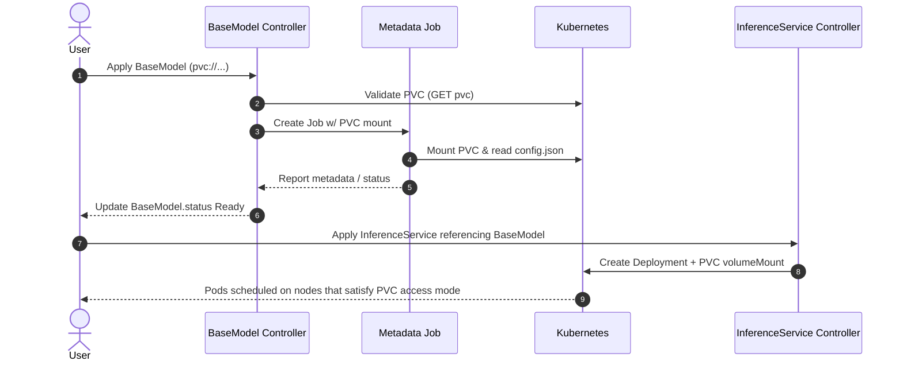

## Architecture Overview

PVC storage in OME uses a **controller-only architecture** that bypasses the model
agent entirely. This design leverages Kubernetes native volume mounting and eliminates
model duplication.

## Key Design Decision: Skip Model Agent

**Why?** DaemonSet pods cannot efficiently mount PVCs, especially ReadWriteOnce
volumes.

| Traditional storage                               | PVC storage                                                              |
| ------------------------------------------------- | ------------------------------------------------------------------------ |
| Model Agent downloads artifacts to local hostPath | BaseModel Controller validates the PVC reference                         |
| Files live on each node’s disk                    | Controller spawns a metadata Job to read `config.json` from the PVC      |
| Model Agent labels nodes so pods land correctly   | BaseModel status flips to `Ready` and the PVC path becomes immediately usable |
| Scheduler targets labeled nodes                   | Model Agent skips PVC-backed models entirely                             |

## Component Flow

1. **User submits BaseModel/ClusterBaseModel** referencing a `pvc://` URI.
2. **BaseModel Controller validates** that the PVC exists, is bound, and is accessible.
3. **If PVC ready**, the controller creates a short-lived metadata extraction Job that mounts the PVC, reads `config.json`, and reports metadata back. If the PVC is missing or pending, the controller records a failure condition instead.
4. **BaseModel status updates** to `Ready` once metadata is populated; otherwise it stays in `MetadataPending` or `Failed`.
5. **User deploys an InferenceService** pointing to the BaseModel. The InferenceService controller wires the PVC into serving pods.
6. **Kubernetes scheduler** places pods on nodes that satisfy the PVC’s topology/access-mode constraints—no model-agent coordination needed.



## Component Responsibilities

| Component                       | Role                           | PVC Handling                                       |
| ------------------------------- | ------------------------------ | -------------------------------------------------- |
| **Model Agent**                 | Downloads models, labels nodes | **Skips PVC** entirely                             |
| **BaseModel Controller**        | Manages BaseModel lifecycle    | **Primary owner** - validates, extracts metadata   |
| **Metadata Job**                | Extracts model config          | **Temporary** - mounts PVC, reads config.json      |
| **InferenceService Controller** | Manages serving pods           | **Volume mounter** - creates pods with PVC volumes |

## Core Design Decisions

### 1. Why Skip Model Agent?

**Problem**: DaemonSet + PVC incompatibility

- DaemonSets run on every node
- ReadWriteOnce PVCs can't be mounted by multiple pods
- Complex coordination needed for RWO volumes

**Solution**: Controller-only approach

```go
// Model agent explicitly skips PVC storage
switch storageType {
case storage.StorageTypePVC:
    s.logger.Infof("Skipping PVC storage for model %s", modelInfo)
    return nil
}
```

### 2. Why Use Jobs for Metadata?

**Problem**: Need to read model config from PVC
**Solution**: Ephemeral Jobs with PVC mount

```yaml
# Metadata extraction job template
apiVersion: batch/v1
kind: Job
metadata:
  name: metadata-{model}-{hash}
spec:
  template:
    spec:
      containers:
        - name: extractor
          image: ome/metadata-agent
          volumeMounts:
            - name: model-pvc
              mountPath: /models
              readOnly: true
      volumes:
        - name: model-pvc
          persistentVolumeClaim:
            claimName: { pvc-name }
```

### 3. Why No Node Labeling?

**Traditional**: Model agent labels nodes with available models
**PVC**: Kubernetes scheduler handles PVC placement constraints

**Traditional path**: the Model Agent labels nodes (e.g., `model-xyz=ready`), and InferenceService pods add node selectors so the scheduler picks one of those labeled nodes.

**PVC path**: the scheduler already understands PVC topology and access modes, so pods simply declare the PVC volume. Kubernetes ensures they land on nodes that can mount it, avoiding extra labels or coordination.

## Storage Type Comparison

| Aspect            | PVC Storage       | Object Storage   | HuggingFace      |
| ----------------- | ----------------- | ---------------- | ---------------- |
| **Model Agent**   | Skipped           | Downloads        | Downloads        |
| **Node Labels**   | None              | Creates labels   | Creates labels   |
| **Scheduling**    | PVC constraints   | Node selectors   | Node selectors   |
| **Data Transfer** | None              | Network download | Network download |
| **Availability**  | Storage dependent | Node replicated  | Node replicated  |

## Security Model

### RBAC Requirements

```yaml
# BaseModel Controller permissions
- apiGroups: [""]
  resources: ["persistentvolumeclaims"]
  verbs: ["get", "list", "watch"]
- apiGroups: ["batch"]
  resources: ["jobs"]
  verbs: ["create", "get", "list", "watch"]

# Metadata Job permissions
- apiGroups: [""]
  resources: ["persistentvolumeclaims"]
  verbs: ["get"]
- apiGroups: ["ome.io"]
  resources: ["basemodels"]
  verbs: ["update"]
```

### Security Boundaries

- **Namespace isolation**: BaseModel → same namespace PVC only
- **Read-only mounts**: All PVC mounts are read-only
- **Minimal permissions**: Jobs have least-privilege access

## Performance Profile

| Operation              | PVC Storage    | Object Storage      |
| ---------------------- | -------------- | ------------------- |
| **Model Loading**      | Immediate      | Minutes (download)  |
| **Scaling Up**         | Fast           | Slow (re-download)  |
| **Storage Efficiency** | No duplication | Replicated per node |

**Performance depends on storage backend:**

- **NFS**: Good for sharing, may bottleneck with many pods
- **Block storage**: Excellent single-pod, RWO limits concurrency
- **Distributed**: Scales well, varies by implementation

## Common Issues & Solutions

| Issue                  | Cause                | Solution                              |
| ---------------------- | -------------------- | ------------------------------------- |
| MetadataPending        | PVC not bound        | Check PVC status, storage provisioner |
| Pod scheduling failure | PVC node constraints | Verify PVC accessible from nodes      |
| Slow model loading     | Storage performance  | Use faster storage class              |

## Future Enhancements

**Planned:**

- Cross-namespace PVC access with RBAC
- Volume snapshot integration for versioning
- Multi-PVC model support
- Performance optimization hints

**Integration:**

- CSI driver advanced features
- Automatic storage class selection
- Volume expansion for growing repos

## Related Documentation

- [PVC Storage User Guide](/ome/docs/user-guide/storage/pvc-storage/) - How to use
- [Troubleshooting PVC Storage](/ome/docs/troubleshooting/pvc-storage/) - Common issues
- [Storage Types Reference](/ome/docs/reference/storage-types/) - Complete API spec
